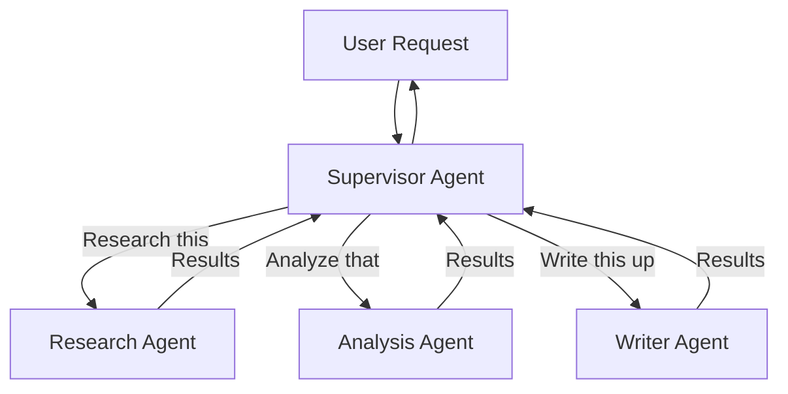
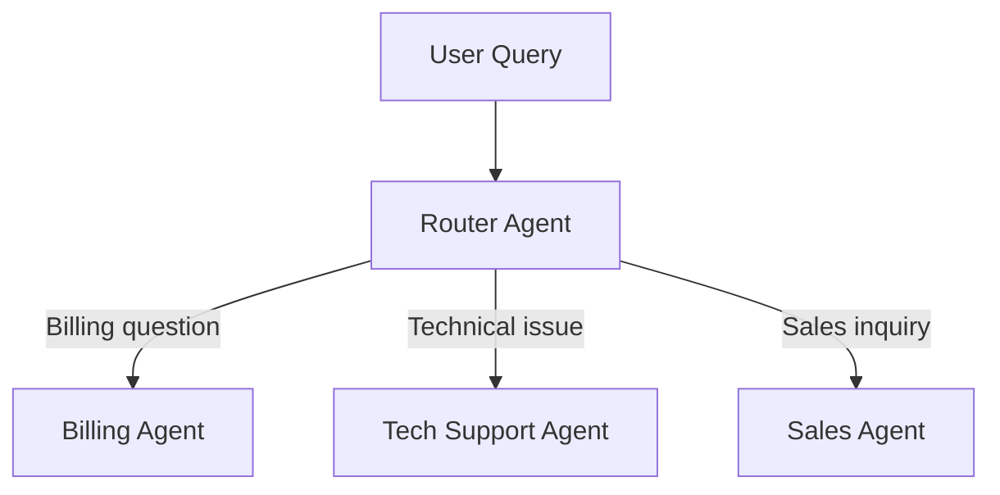
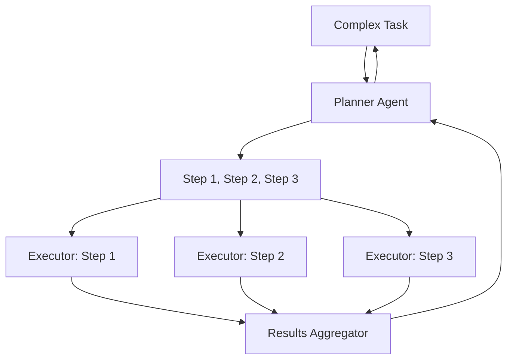
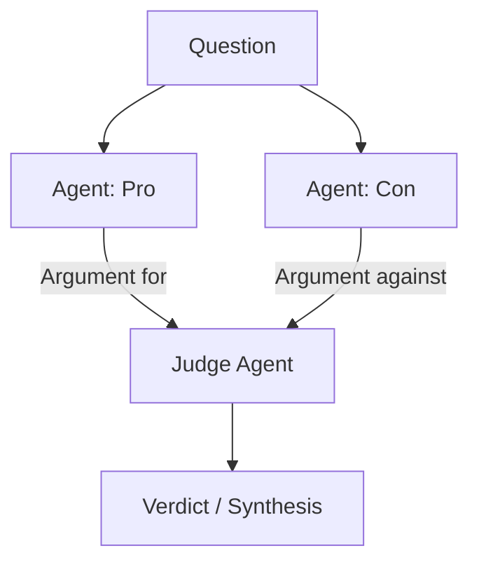
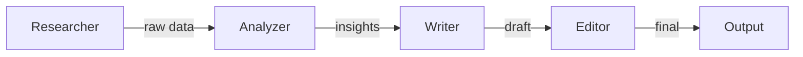
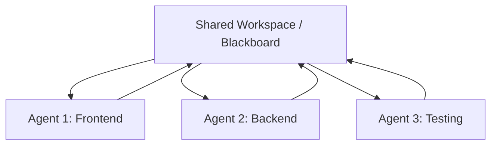
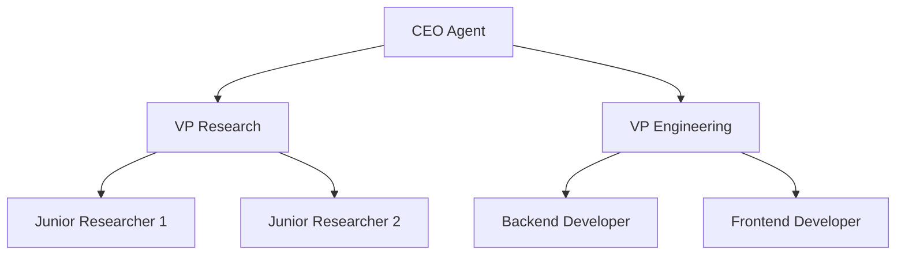

# Multi-Agent Systems

## The "Team of Specialists" Analogy

One person can't be an expert at everything. Companies hire specialists: a designer, a developer, a marketer, a lawyer. Each brings deep expertise in their domain.

Multi-agent systems work the same way. Instead of one monolithic agent trying to do everything, you create **specialized agents** that collaborate. Each agent has:
- A focused role
- Domain-specific tools
- Tailored instructions
- A narrower, more reliable scope

---

## Multi-Agent Patterns

### 1. Supervisor-Worker

One "boss" agent delegates tasks to specialist workers.



**When to use**: Clear task decomposition, specialist domains, need central coordination.

---

### 2. Router-Specialist

A lightweight router sends the request to the right expert. No orchestration — fire and forget.



**When to use**: Customer support, FAQ systems, when queries map cleanly to domains.

---

### 3. Planner-Executor

One agent plans, others execute individual steps.



**When to use**: Complex multi-step tasks where planning and execution benefit from separation.

---

### 4. Debate / Adversarial

Agents argue opposing positions to arrive at a better answer.



**When to use**: Decisions requiring balanced analysis, fact-checking, reducing bias.

---

### 5. Pipeline

Agents in sequence, each transforming output for the next.



**When to use**: Content creation, data processing, when each stage has clear input/output.

---

### 6. Collaborative

Multiple agents work on the same problem, sharing a workspace.



**When to use**: Software development, creative collaboration, iterative refinement.

---

### 7. Hierarchical

Tree structure with managers and workers at multiple levels.



**When to use**: Large-scale tasks needing management at multiple levels.

---

### 8. Swarm

Decentralized — agents act independently with simple local rules, producing emergent behavior.

**When to use**: Highly parallel tasks, when centralized coordination is a bottleneck.

---

## Communication Patterns

| Pattern | Description | Use Case |
|---------|-------------|----------|
| **Direct Message** | Agent A sends to Agent B | Supervisor → Worker |
| **Broadcast** | One agent sends to all | "New information available" |
| **Blackboard** | Shared state all agents read/write | Collaborative problem-solving |
| **Event Bus** | Pub/sub, agents subscribe to topics | Loosely coupled systems |
| **Handoff** | One agent transfers full control | Escalation patterns |

---

## State Sharing Between Agents

```python
# Approach 1: Shared context object
shared_state = {
    "task": "Market analysis for AI startups",
    "research_results": None,  # Written by Research Agent
    "analysis": None,          # Written by Analysis Agent
    "final_report": None       # Written by Writer Agent
}

# Approach 2: Message passing
supervisor.send(researcher, {"task": "find competitors"})
result = researcher.receive()
supervisor.send(analyzer, {"data": result, "task": "analyze"})
```

---

## Failure Handling

| Failure | Strategy |
|---------|----------|
| Worker agent fails | Supervisor retries or assigns to different worker |
| Worker loops | Timeout + kill + reassign |
| Conflicting results | Judge agent or majority vote |
| Partial completion | Use completed work, re-plan remaining |
| Total failure | Escalate to human with context |

---

## When NOT to Use Multi-Agent

Multi-agent adds complexity. Use a single agent when:

- The task is simple (one domain, few tools)
- Latency matters (each agent = more LLM calls)
- Cost is constrained (N agents = N× the tokens)
- The benefit of specialization doesn't outweigh coordination overhead

**Rule of thumb**: Start with one agent. Only split into multiple when you see concrete problems with the single-agent approach (confused tool selection, inconsistent persona, context overflow).

---

## Key Takeaways

- Multi-agent = specialized agents collaborating, each with focused expertise
- Choose the pattern based on your coordination needs (supervisor, pipeline, debate, etc.)
- Communication pattern matters: direct, broadcast, blackboard, or handoff
- Always handle agent failures — they WILL happen
- Start simple (single agent) and only go multi-agent when you have a clear reason
- The supervisor pattern is the most common starting point for production systems
