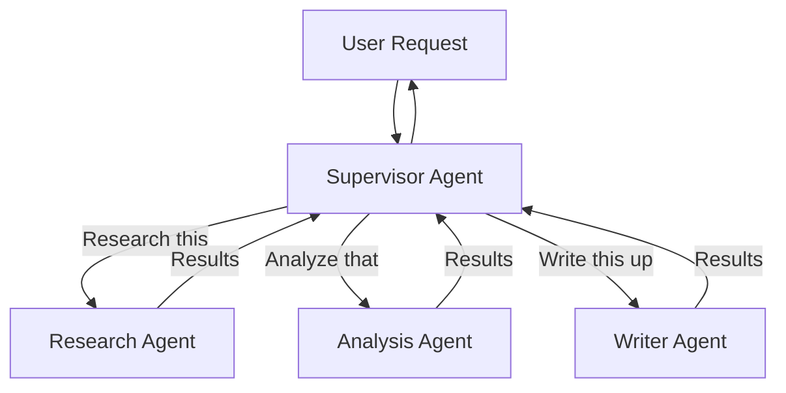
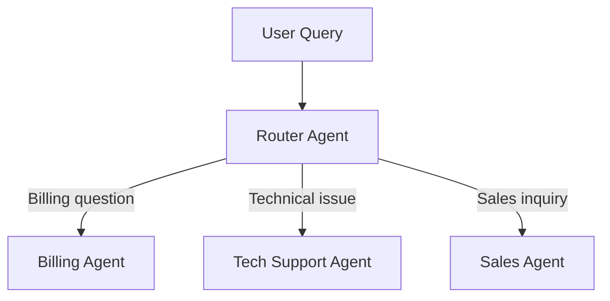
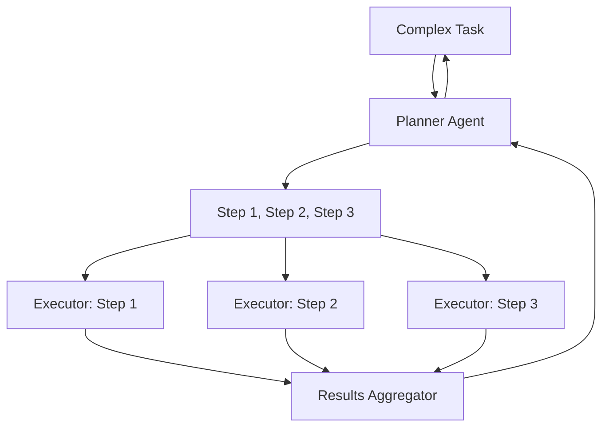
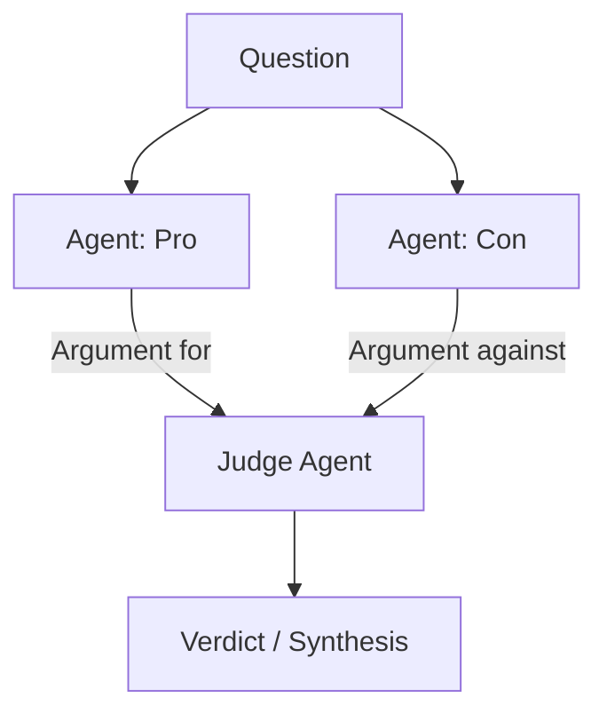
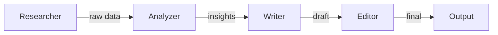
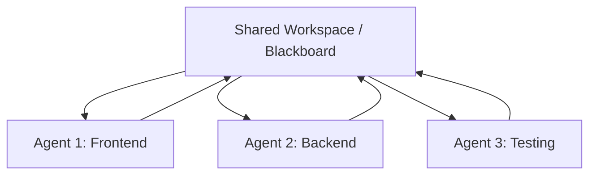
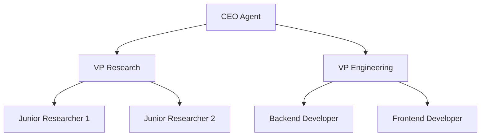

# Multi-Agent Systems

## The "Team of Specialists" Analogy

One person can't be an expert at everything. Companies hire specialists: a designer, a developer, a marketer, a lawyer. Each brings deep expertise in their domain.

Multi-agent systems work the same way. Instead of one monolithic agent trying to do everything, you create **specialized agents** that collaborate. Each agent has:
- A focused role
- Domain-specific tools
- Tailored instructions
- A narrower, more reliable scope

---

## Multi-Agent Patterns

### 1. Supervisor-Worker

One "boss" agent delegates tasks to specialist workers.



**When to use**: Clear task decomposition, specialist domains, need central coordination.

---

### 2. Router-Specialist

A lightweight router sends the request to the right expert. No orchestration — fire and forget.



**When to use**: Customer support, FAQ systems, when queries map cleanly to domains.

---

### 3. Planner-Executor

One agent plans, others execute individual steps.



**When to use**: Complex multi-step tasks where planning and execution benefit from separation.

---

### 4. Debate / Adversarial

Agents argue opposing positions to arrive at a better answer.



**When to use**: Decisions requiring balanced analysis, fact-checking, reducing bias.

---

### 5. Pipeline

Agents in sequence, each transforming output for the next.



**When to use**: Content creation, data processing, when each stage has clear input/output.

---

### 6. Collaborative

Multiple agents work on the same problem, sharing a workspace.



**When to use**: Software development, creative collaboration, iterative refinement.

---

### 7. Hierarchical

Tree structure with managers and workers at multiple levels.



**When to use**: Large-scale tasks needing management at multiple levels.

---

### 8. Swarm

Decentralized — agents act independently with simple local rules, producing emergent behavior.

**When to use**: Highly parallel tasks, when centralized coordination is a bottleneck.

---

## Communication Patterns

| Pattern | Description | Use Case |
|---------|-------------|----------|
| **Direct Message** | Agent A sends to Agent B | Supervisor → Worker |
| **Broadcast** | One agent sends to all | "New information available" |
| **Blackboard** | Shared state all agents read/write | Collaborative problem-solving |
| **Event Bus** | Pub/sub, agents subscribe to topics | Loosely coupled systems |
| **Handoff** | One agent transfers full control | Escalation patterns |

---

## State Sharing Between Agents

```python
# Approach 1: Shared context object
shared_state = {
    "task": "Market analysis for AI startups",
    "research_results": None,  # Written by Research Agent
    "analysis": None,          # Written by Analysis Agent
    "final_report": None       # Written by Writer Agent
}

# Approach 2: Message passing
supervisor.send(researcher, {"task": "find competitors"})
result = researcher.receive()
supervisor.send(analyzer, {"data": result, "task": "analyze"})
```

---

## Failure Handling

| Failure | Strategy |
|---------|----------|
| Worker agent fails | Supervisor retries or assigns to different worker |
| Worker loops | Timeout + kill + reassign |
| Conflicting results | Judge agent or majority vote |
| Partial completion | Use completed work, re-plan remaining |
| Total failure | Escalate to human with context |

---

## When NOT to Use Multi-Agent

Multi-agent adds complexity. Use a single agent when:

- The task is simple (one domain, few tools)
- Latency matters (each agent = more LLM calls)
- Cost is constrained (N agents = N× the tokens)
- The benefit of specialization doesn't outweigh coordination overhead

**Rule of thumb**: Start with one agent. Only split into multiple when you see concrete problems with the single-agent approach (confused tool selection, inconsistent persona, context overflow).

---

## Key Takeaways

- Multi-agent = specialized agents collaborating, each with focused expertise
- Choose the pattern based on your coordination needs (supervisor, pipeline, debate, etc.)
- Communication pattern matters: direct, broadcast, blackboard, or handoff
- Always handle agent failures — they WILL happen
- Start simple (single agent) and only go multi-agent when you have a clear reason
- The supervisor pattern is the most common starting point for production systems

---

## Staff-Level: Anti-Patterns

| Anti-Pattern | Why It Fails | Fix |
|-------------|-------------|-----|
| Multi-agent when single agent suffices (90% of cases) | 3x cost, 3x latency, coordination bugs, harder to debug — all for no benefit | Prove single-agent fails FIRST. Document the specific failure before reaching for multi-agent |
| No central coordinator | Agents work at cross-purposes, duplicate effort, or deadlock waiting for each other | Always have ONE entity (supervisor, orchestrator, or shared state machine) that owns task allocation |
| Agents with overlapping responsibilities | Two agents both try to "research" or "write" → conflicts, duplicated work, inconsistent outputs | Define clear boundaries: each agent owns exactly one capability; no overlap in tool access |
| No conflict resolution | Agent A says "yes", Agent B says "no" — system deadlocks or picks randomly | Explicit resolution: majority vote, supervisor decides, confidence-weighted, or escalate to human |
| Agents communicating via natural language only | Information loss, misinterpretation, hallucination amplification across hops | Use structured data (JSON) for inter-agent communication; reserve NL for human-facing output |
| No timeout on sub-agents | One stuck agent blocks the entire system indefinitely | Per-agent timeout + fallback: if agent doesn't respond in Xs, kill and use partial results or fallback |

---

## Staff-Level: Trade-offs

### Multi-Agent vs Single-Agent

| Multi-Agent | Single-Agent |
|------------|-------------|
| Specialized prompts per role (higher quality per task) | One prompt to maintain (simpler) |
| Parallel execution possible | Sequential by default |
| 2-5x more expensive (each agent = LLM calls) | Predictable cost |
| Debugging requires tracing across agents | One trace to follow |
| Inter-agent communication can lose information | All context in one window |
| Scales to complex tasks | Context window limits complexity |

**The math**: If a single agent handles a task in 4 LLM calls, a supervisor + 3 workers costs 4 + 3×2 = 10 LLM calls minimum (2.5x cost). Only worth it if single-agent quality is unacceptable.

---

## Staff-Level: The Decision Rule

> **"Default to single agent. Use multi-agent ONLY when you can prove single agent fails AND the tasks are truly parallelizable."**

**Proof of single-agent failure** (need at least one):
1. Context window overflow — task genuinely requires more context than fits
2. Conflicting personas — task needs both "creative writer" and "strict reviewer" that fight in one prompt
3. Parallelism need — subtasks are independent AND wall-clock time matters
4. Tool isolation — different subtasks need different permission levels (security boundary)

**If you can't point to one of these four** → use a single agent with a good prompt.

**Production reality**: Most "multi-agent" systems in production are actually single-agent with different system prompts selected via routing (pattern #2: Router-Specialist). True multi-agent orchestration (supervisor pattern) is rare because the coordination cost usually exceeds the benefit.

**Cost model for decision-making**:
```
Single agent cost:  N calls × avg_tokens × price_per_token
Multi-agent cost:   (N + coordination_overhead) × agents × avg_tokens × price_per_token
Break-even:         Only when quality improvement justifies 2-5x cost increase
```

---

## Coordination Patterns Comparison

| Pattern | Communication | Failure Handling | Best For |
|---------|--------------|-----------------|----------|
| Sequential pipeline | A → B → C (linear) | Fail-stop or retry stage | Document processing, ETL |
| Supervisor/worker | Central orchestrator dispatches | Supervisor retries/reassigns | Complex tasks with subtask decomposition |
| Peer-to-peer | Agents message each other | Each agent handles own failures | Debate/critique patterns |
| Blackboard | Shared state, agents read/write | Eventual consistency | Collaborative analysis |
| Router-specialist | Router selects one specialist | Fallback to general agent | Customer support, classification-first |

## Failure Propagation in Multi-Agent Systems

```
Failure modes unique to multi-agent:

1. Cascade failure:
   Agent A fails → passes garbage to Agent B → B produces nonsense → C acts on it
   Mitigation: Validate outputs at EACH handoff point (schema + semantic checks)

2. Deadlock:
   Agent A waits for B's output, B waits for A's input
   Mitigation: Timeouts on all inter-agent communication, unilateral fallback

3. Amplification:
   Supervisor retries failed worker → worker retries its tools → exponential calls
   Mitigation: Global budget tracking across all agents in a request

4. State corruption:
   Two agents write to shared state simultaneously
   Mitigation: Optimistic locking, or single-writer-per-field policy

5. Partial completion:
   3 of 5 subtasks complete, agent 4 fails. Do you retry? Roll back? Return partial?
   Decision: Define upfront — is partial result valuable? If yes, return with metadata.
```

## When NOT to Use Multi-Agent

**Don't use multi-agent when**:
- A single well-prompted agent with good tools solves the task (most cases)
- Latency matters — coordination adds 2-5x latency overhead minimum
- You can't afford the cost — multi-agent is 2-5x more expensive
- Debugging is critical — multi-agent traces are significantly harder to interpret
- Task is inherently sequential — multi-agent adds complexity without parallelism benefit

**The test**: Run your task with a single agent first. Measure quality. Only introduce multi-agent if single-agent quality is demonstrably insufficient AND you've exhausted prompt/tool improvements.

**Staff reality check**: In 2024-2025, most production "multi-agent" systems that ship successfully are actually just routing + specialized prompts (Level 2 in the taxonomy). True autonomous multi-agent coordination remains largely a research pursuit.
