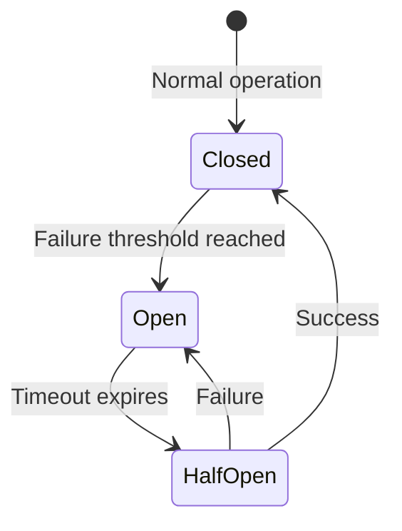

# Agent Failure Modes

## Why Agents Fail

Agents are autonomous — they make decisions without human oversight at each step. This means failures can compound, cascade, and cost money before anyone notices. Understanding failure modes is **essential** for building reliable agents.

---

## The 8 Critical Failure Modes

### 1. Infinite Loops

The agent keeps trying the same action, getting the same result, never progressing.

**Example**: Agent searches for "John Smith email" → gets no result → rephrases to "email for John Smith" → no result → "John Smith contact" → no result → ...forever.

**Prevention**:
- Max iteration limits (hard stop at N steps)
- Loop detection: track last N actions, detect repetition
- Escalation: after 3 failed attempts, ask human or try different strategy
- Inject "you've tried this before" into context

---

### 2. Tool Misuse

Agent calls the right tool with wrong arguments, or the wrong tool entirely.

**Example**: Calling `delete_user(id=123)` when it meant `get_user(id=123)`, or using `calculator("What is the weather?")`.

**Prevention**:
- Strict input validation on every tool
- Tool descriptions that clearly state when NOT to use
- Confirmation step for destructive actions
- Separate read-only and write tools into different permission levels

---

### 3. Hallucinated Tool Calls

Agent tries to call tools that don't exist, inventing function names or APIs.

**Example**: `send_slack_message()` when no Slack tool is available.

**Prevention**:
- Validate tool name against registered tools before execution
- Return clear error: "Tool X does not exist. Available tools: [list]"
- Use structured output / function calling API (constrains to defined tools)

---

### 4. Context Window Overflow

Agent accumulates so much history (tool results, thoughts) that it exceeds the context limit or loses early important information.

**Prevention**:
- Summarize older messages periodically
- Limit tool output size (truncate large responses)
- Use sliding window: keep first message + last N messages + summaries
- Token counting before each LLM call

---

### 5. Cost Runaway

Agent generates excessive LLM calls, each burning tokens, with no budget control.

**Example**: Agent in a loop makes 200 LLM calls × 4K tokens = 800K tokens = $$$

**Prevention**:
- Token budget per task (hard limit)
- Cost tracking per agent run
- Alert when approaching budget (80% warning)
- Kill switch: terminate agent run if budget exceeded

```python
class BudgetGuard:
    def __init__(self, max_tokens=100_000, max_calls=20):
        self.tokens_used = 0
        self.calls_made = 0
        
    def check(self, tokens):
        self.tokens_used += tokens
        self.calls_made += 1
        if self.tokens_used > self.max_tokens:
            raise BudgetExceeded(f"Token limit reached: {self.tokens_used}")
        if self.calls_made > self.max_calls:
            raise BudgetExceeded(f"Call limit reached: {self.calls_made}")
```

---

### 6. Cascading Failures

One agent's failure breaks downstream agents in a multi-agent system.

**Example**: Research agent returns garbage → Analysis agent analyzes garbage → Writer agent writes convincing-sounding nonsense.

**Prevention**:
- Validate outputs between agent stages
- Quality gates: check output before passing to next agent
- Circuit breakers: stop the pipeline if quality drops below threshold
- Independent fallbacks for each stage

---

### 7. Stale Information

Agent acts on outdated data from memory or cached tool results.

**Example**: Agent uses cached inventory data showing item in stock, but it sold out 2 hours ago.

**Prevention**:
- TTL (time-to-live) on cached data
- Always re-fetch for critical decisions (purchases, bookings)
- Timestamp all stored information
- Distinguish "known facts" from "last-checked facts"

---

### 8. Authorization Violations

Agent performs actions beyond its intended permissions.

**Example**: Support agent accesses admin tools, reads other users' data, or performs actions the user didn't authorize.

**Prevention**:
- Principle of least privilege: only expose needed tools
- Per-user permission scoping on tool execution
- Audit logging of all tool calls
- Separate tool sets for different agent roles
- Never trust the LLM to self-enforce permissions

---

## Circuit Breakers for Agents



| State | Behavior |
|-------|----------|
| **Closed** | Agent operates normally, failures counted |
| **Open** | Agent stopped, returns fallback/error immediately |
| **Half-Open** | Allow one attempt; if success → Closed, if fail → Open |

---

## Human-in-the-Loop Patterns

| Pattern | When to Use |
|---------|-------------|
| **Approval gate** | Before any irreversible action (delete, send, pay) |
| **Confidence threshold** | Agent unsure → ask human |
| **Periodic review** | Every N steps, show progress for validation |
| **Exception handling** | Agent stuck or errored → escalate |
| **Spot check** | Random sample of actions reviewed post-hoc |

---

## Agent Observability

What to log for every agent run:

```
┌─────────────────────────────────────────┐
│ Agent Run: run_abc123                    │
├─────────────────────────────────────────┤
│ Task: "Find cheapest flight to Tokyo"   │
│ Start: 2024-01-15 14:30:00             │
│ End:   2024-01-15 14:30:45             │
│ Status: SUCCESS                         │
│ LLM Calls: 4                           │
│ Tokens Used: 12,340                    │
│ Tools Called: [search_flights, filter]  │
│ Cost: $0.037                           │
├─────────────────────────────────────────┤
│ Steps:                                  │
│ 1. Thought: "Need to search flights"   │
│    Action: search_flights(...)          │
│    Result: 5 flights found             │
│    Tokens: 3,200 | Latency: 1.2s      │
│ 2. Thought: "Filter by price"          │
│    Action: filter_results(...)          │
│    Result: 2 options                   │
│    Tokens: 2,800 | Latency: 0.8s      │
│ ...                                     │
└─────────────────────────────────────────┘
```

---

## Prevention Summary

| Failure Mode | Key Prevention |
|-------------|----------------|
| Infinite loops | Max iterations + loop detection |
| Tool misuse | Validation + clear descriptions |
| Hallucinated tools | Structured output + validation |
| Context overflow | Summarization + token limits |
| Cost runaway | Token budget + call limits |
| Cascading failures | Quality gates + circuit breakers |
| Stale information | TTL + re-fetch for critical data |
| Authorization violations | Least privilege + audit logs |

---

## Key Takeaways

- Every failure mode needs both **detection** and **prevention**
- Budget limits are non-negotiable in production (tokens, time, cost)
- Human-in-the-loop is not a failure — it's a feature for high-risk actions
- Observability is not optional — you can't fix what you can't see
- Test failure modes deliberately (chaos engineering for agents)
- The most common production issue: cost runaway from loops
