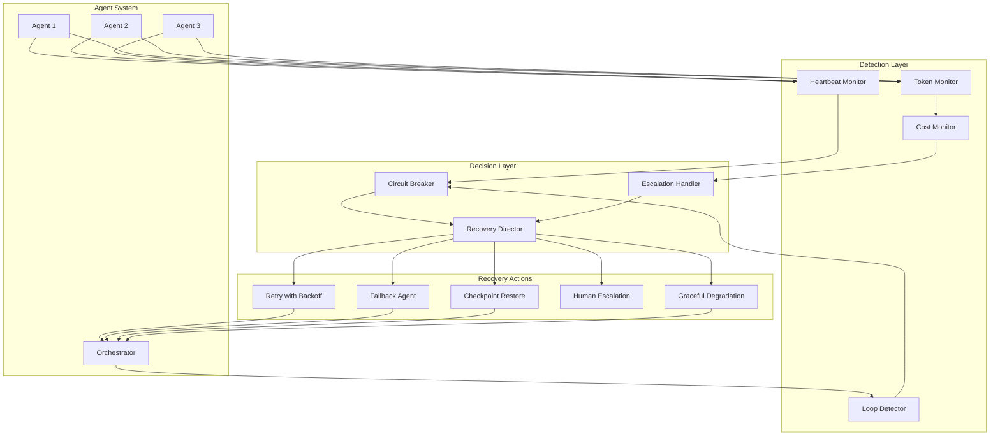

# Multi-Agent Failure Modes

## Staff Architect's Rule

> **Multi-agent should be your LAST choice, not your first.**

Before reaching for multi-agent architectures, exhaust these simpler alternatives:
1. Single LLM call with better prompting
2. Single agent with multiple tools
3. Sequential chain (pipeline) with no agent-to-agent communication
4. Single agent with planning/reflection loop

Multi-agent is justified only when: tasks require genuinely different capabilities, parallel execution is critical, or domain isolation is a hard requirement.

---

## Taxonomy of Multi-Agent Failures

### 1. Infinite Loops

```
Agent A: "I need Agent B to clarify this"
Agent B: "I need Agent A to provide more context"
Agent A: "I need Agent B to clarify this"
... (forever)
```

**Root cause**: No termination condition on inter-agent communication.

**Detection signals**:
- Message count between agents exceeding threshold
- Repeated identical or near-identical messages
- No progress on task metrics despite activity

### 2. Deadlocks

```
Agent A holds Resource X, waiting for Resource Y
Agent B holds Resource Y, waiting for Resource X
```

**Common in**: Agents that share state, file locks, database rows, or API rate limit quotas.

**Root cause**: No ordering protocol for resource acquisition.

### 3. Cascading Failures

```
Agent A fails → Agent B retries with bad input → Agent C gets garbage →
Orchestrator retries everything → Cost explosion
```

**Root cause**: No circuit breakers, no input validation between agents.

### 4. Conflicting Actions

```
Agent A: "Increase replica count to 5"
Agent B: "Decrease replica count to 2" (cost optimization)
Result: Flapping between states
```

**Root cause**: No coordination protocol, overlapping action spaces.

### 5. Hallucination Cascades

```
Agent A hallucinates a fact → passes it to Agent B as context →
Agent B builds on the hallucination → Agent C takes action based on fiction
```

**Root cause**: Agents trust each other's output without verification. Each hop amplifies confidence while reducing accuracy.

### 6. Authority Confusion

```
Agent A: "I'll handle the database migration"
Agent B: "I'll also handle the database migration"
Result: Duplicate migrations, corrupted state
```

**Root cause**: Unclear ownership boundaries, no task claiming protocol.

---

## Real Case Studies

### AutoGPT Runaway Costs (2023)

**What happened**: Users gave AutoGPT open-ended goals like "make money online." The agent:
- Spawned sub-tasks without limits
- Each sub-task made multiple API calls
- No budget ceiling existed
- Users reported $50-200 bills from single sessions

**Failure pattern**: Unbounded recursion + no cost caps + optimistic task decomposition.

**Lesson**: Every autonomous agent needs a hard budget ceiling that cannot be overridden by the agent itself.

### CrewAI Circular Delegation

**What happened**: In CrewAI's early versions, agents could delegate tasks to each other freely:
- Research Agent delegates "find pricing" to Analysis Agent
- Analysis Agent delegates "research competitor pricing" back to Research Agent
- Loop continues until token limits hit

**Failure pattern**: Bidirectional delegation without cycle detection.

**Fix implemented**: Maximum delegation depth, delegation graph tracking, no back-delegation to caller.

### Agent Hallucination Cascade in Code Review

**What happened**: A multi-agent code review system:
- Agent 1 (Scanner): "Found SQL injection in line 42" (hallucinated - line 42 was a comment)
- Agent 2 (Fixer): Generated a "fix" for non-existent vulnerability
- Agent 3 (Reviewer): Approved the fix because it "addressed the identified vulnerability"
- Result: Unnecessary code change merged, actually introduced a bug

**Failure pattern**: Trust chain without verification. Each agent assumed previous agent's output was correct.

**Lesson**: Critical decisions need ground-truth verification, not just agent consensus.

### Devin-style Agent Runaway (General Pattern)

**What happened**: Coding agents that can execute code and modify files:
- Agent decides to "fix" a test by modifying the test (not the code)
- Creates new files to work around issues instead of fixing root cause
- Installs packages without version pinning
- Accumulates technical debt faster than a human team

**Failure pattern**: Optimizing for task completion metric without quality constraints.

---

## Debugging Distributed Agents

### Tracing Architecture

Every agent interaction must be traceable:

```python
class AgentTrace:
    trace_id: str          # Unique per user request
    span_id: str           # Unique per agent action
    parent_span_id: str    # Which agent/action triggered this
    agent_id: str          # Which agent is acting
    action: str            # What action was taken
    input_hash: str        # Hash of input (for replay)
    output_hash: str       # Hash of output (for verification)
    tokens_used: int       # Cost tracking
    duration_ms: int       # Performance tracking
    decision_reasoning: str # WHY the agent chose this action
```

### Replay Testing

```python
class AgentReplayTest:
    """Record agent interactions, replay deterministically."""
    
    def record_session(self, session_id: str):
        """Record all LLM calls, tool results, agent messages."""
        self.recordings[session_id] = {
            "llm_calls": [],      # prompt + response pairs
            "tool_calls": [],     # tool name + args + results
            "agent_messages": [], # inter-agent communication
            "timestamps": []      # ordering
        }
    
    def replay_session(self, session_id: str, modified_agent: str = None):
        """Replay with optional agent replacement for testing."""
        recording = self.recordings[session_id]
        # Mock all external calls with recorded responses
        # Run agents with deterministic ordering
        # Compare outputs with recorded outputs
        # Flag any divergence
```

### Deterministic Testing Strategy

1. **Seed all randomness**: Fixed seeds for any sampling
2. **Mock LLM responses**: Use recorded responses for regression tests
3. **Fixed timestamps**: Deterministic time for timeout testing
4. **Controlled concurrency**: Sequential execution mode for debugging

```python
class DeterministicAgentTest:
    def __init__(self):
        self.llm_responses = Queue()  # Pre-loaded responses
        self.tool_results = Queue()    # Pre-loaded tool results
        self.time = FakeTime(start=0)  # Controlled clock
    
    def test_no_infinite_loop(self):
        """Verify agents terminate within bounded steps."""
        self.llm_responses.load(RECORDED_RESPONSES)
        result = self.run_agents(max_steps=50)
        assert result.terminated_normally
        assert result.step_count < 50
```

---

## Circuit Breakers for Agent-to-Agent Calls

```python
class AgentCircuitBreaker:
    """Prevents cascading failures between agents."""
    
    def __init__(self, failure_threshold: int = 3, 
                 reset_timeout_seconds: int = 60):
        self.failure_count = 0
        self.failure_threshold = failure_threshold
        self.reset_timeout = reset_timeout_seconds
        self.state = "CLOSED"  # CLOSED, OPEN, HALF_OPEN
        self.last_failure_time = None
    
    async def call_agent(self, target_agent: str, message: dict):
        if self.state == "OPEN":
            if time.time() - self.last_failure_time > self.reset_timeout:
                self.state = "HALF_OPEN"
            else:
                return self.fallback_response(target_agent, message)
        
        try:
            result = await self._invoke_agent(target_agent, message)
            if self.state == "HALF_OPEN":
                self.state = "CLOSED"
                self.failure_count = 0
            return result
        except (TimeoutError, AgentFailure) as e:
            self.failure_count += 1
            self.last_failure_time = time.time()
            if self.failure_count >= self.failure_threshold:
                self.state = "OPEN"
            return self.fallback_response(target_agent, message)
    
    def fallback_response(self, target_agent: str, message: dict):
        """Return degraded but safe response."""
        return {
            "status": "circuit_open",
            "agent": target_agent,
            "fallback": True,
            "message": f"Agent {target_agent} temporarily unavailable"
        }
```

---

## Budget Guards

### Token Limits

```python
class TokenBudget:
    def __init__(self, max_tokens_per_agent: int, 
                 max_tokens_per_request: int):
        self.per_agent = max_tokens_per_agent
        self.per_request = max_tokens_per_request
        self.usage = defaultdict(int)
        self.total_usage = 0
    
    def check_budget(self, agent_id: str, estimated_tokens: int) -> bool:
        if self.usage[agent_id] + estimated_tokens > self.per_agent:
            raise AgentBudgetExceeded(agent_id, self.usage[agent_id])
        if self.total_usage + estimated_tokens > self.per_request:
            raise RequestBudgetExceeded(self.total_usage)
        return True
    
    def record_usage(self, agent_id: str, actual_tokens: int):
        self.usage[agent_id] += actual_tokens
        self.total_usage += actual_tokens
```

### Time Limits

```python
class TimeGuard:
    def __init__(self, max_wall_time_seconds: int = 300,
                 max_per_agent_seconds: int = 60):
        self.max_wall_time = max_wall_time_seconds
        self.max_per_agent = max_per_agent_seconds
        self.start_time = time.time()
    
    async def run_with_timeout(self, agent_id: str, coroutine):
        elapsed = time.time() - self.start_time
        remaining_wall = self.max_wall_time - elapsed
        
        if remaining_wall <= 0:
            raise WallTimeExceeded()
        
        timeout = min(self.max_per_agent, remaining_wall)
        
        try:
            return await asyncio.wait_for(coroutine, timeout=timeout)
        except asyncio.TimeoutError:
            raise AgentTimeoutError(agent_id, timeout)
```

### Action Limits

```python
class ActionGuard:
    """Limit what and how much each agent can do."""
    
    LIMITS = {
        "researcher": {"web_search": 10, "file_read": 20, "file_write": 0},
        "coder": {"file_write": 15, "execute_code": 5, "web_search": 3},
        "reviewer": {"file_read": 50, "file_write": 0, "execute_code": 0},
    }
    
    def __init__(self):
        self.action_counts = defaultdict(lambda: defaultdict(int))
    
    def check_action(self, agent_id: str, action: str) -> bool:
        agent_role = self.get_role(agent_id)
        limit = self.LIMITS.get(agent_role, {}).get(action, 0)
        current = self.action_counts[agent_id][action]
        
        if current >= limit:
            raise ActionLimitExceeded(agent_id, action, limit)
        
        self.action_counts[agent_id][action] += 1
        return True
```

---

## Failure Detection and Recovery Architecture



---

## Graceful Degradation

### When One Agent Fails

| Failed Agent Role | Degradation Strategy |
|---|---|
| Research Agent | Use cached results, reduce scope, ask user |
| Code Writer | Fall back to simpler implementation, template-based |
| Reviewer | Skip review (with warning), or use rule-based checks |
| Planner | Use last known good plan, reduce parallelism |
| Executor | Queue actions for manual execution |

### Degradation Levels

```python
class DegradationLevel(Enum):
    FULL_CAPABILITY = 0      # All agents healthy
    REDUCED_QUALITY = 1      # Some agents failed, using fallbacks
    REDUCED_SCOPE = 2        # Limiting task scope to available agents
    MANUAL_ASSIST = 3        # Requesting human help for failed parts
    SAFE_STOP = 4            # Cannot continue safely, stopping
    
class GracefulDegradation:
    def handle_agent_failure(self, failed_agent: str, task: Task):
        level = self.assess_degradation_level(failed_agent, task)
        
        if level == DegradationLevel.REDUCED_QUALITY:
            return self.use_fallback_agent(failed_agent, task)
        elif level == DegradationLevel.REDUCED_SCOPE:
            return self.reduce_task_scope(task, exclude=[failed_agent])
        elif level == DegradationLevel.MANUAL_ASSIST:
            return self.escalate_to_human(task, failed_agent)
        elif level == DegradationLevel.SAFE_STOP:
            return self.safe_stop(task, reason=f"{failed_agent} critical failure")
```

---

## Anti-Patterns

### 1. No Timeout on Agent Chains

```python
# BAD: No timeout, agents can run forever
result = await agent_a.ask(agent_b.ask(agent_c.process(input)))

# GOOD: Timeout at every level
result = await asyncio.wait_for(
    agent_a.ask(
        await asyncio.wait_for(agent_b.ask(...), timeout=30)
    ), timeout=60
)
```

### 2. Unbounded Recursion

```python
# BAD: Agent can spawn unlimited sub-agents
class Agent:
    async def solve(self, task):
        subtasks = self.decompose(task)  # Could be 100 subtasks
        results = [Agent().solve(st) for st in subtasks]  # Recursive!

# GOOD: Bounded depth and breadth
class Agent:
    async def solve(self, task, depth=0, max_depth=3):
        if depth >= max_depth:
            return self.solve_directly(task)  # No more decomposition
        subtasks = self.decompose(task)[:5]  # Max 5 subtasks
        results = [self.solve(st, depth+1, max_depth) for st in subtasks]
```

### 3. No Cost Caps

```python
# BAD: No spending limit
while not task.complete:
    result = await llm.call(prompt)  # $$$

# GOOD: Hard budget enforcement
budget = Budget(max_dollars=5.00)
while not task.complete and budget.remaining > 0:
    estimated_cost = estimate_call_cost(prompt)
    if not budget.can_afford(estimated_cost):
        return PartialResult(task, reason="budget_exhausted")
    result = await llm.call(prompt)
    budget.deduct(result.actual_cost)
```

### 4. Trust Without Verification

```python
# BAD: Blindly trust other agent's output
code = await coder_agent.write_code(spec)
await deployer_agent.deploy(code)  # What if code is wrong?

# GOOD: Verify between agents
code = await coder_agent.write_code(spec)
review = await reviewer_agent.check(code, spec)
if review.issues:
    code = await coder_agent.fix(code, review.issues)
tests = await tester_agent.run_tests(code)
if tests.all_passed:
    await deployer_agent.deploy(code)
```

### 5. Shared Mutable State

```python
# BAD: Agents mutating shared state without coordination
shared_doc = Document()
agent_a.edit(shared_doc)  # Concurrent
agent_b.edit(shared_doc)  # Race condition!

# GOOD: Message passing or explicit locking
async with shared_doc.lock(agent_id="agent_a"):
    agent_a.edit(shared_doc)
# Or better: each agent works on own copy, merge with conflict resolution
```

---

## Recovery Patterns

### Checkpoint/Restore

```python
class CheckpointableAgent:
    def __init__(self):
        self.checkpoints = []
    
    def checkpoint(self):
        """Save current state for potential rollback."""
        self.checkpoints.append({
            "state": deepcopy(self.state),
            "messages": list(self.message_history),
            "actions_taken": list(self.actions),
            "timestamp": time.time()
        })
    
    def restore(self, checkpoint_idx: int = -1):
        """Rollback to a previous checkpoint."""
        cp = self.checkpoints[checkpoint_idx]
        self.state = cp["state"]
        self.message_history = cp["messages"]
        self.actions = cp["actions_taken"]
        # Log the rollback for debugging
        self.log(f"Restored to checkpoint {checkpoint_idx}")
```

### Compensating Actions

```python
class CompensatingAction:
    """Undo agent actions when task fails midway."""
    
    # Registry of undo operations
    COMPENSATIONS = {
        "create_file": "delete_file",
        "insert_record": "delete_record",
        "deploy_service": "rollback_service",
        "send_notification": "send_correction",
    }
    
    def __init__(self):
        self.action_log = []  # Stack of actions taken
    
    def record_action(self, action: str, params: dict):
        self.action_log.append({"action": action, "params": params})
    
    async def compensate_all(self):
        """Undo all actions in reverse order."""
        for entry in reversed(self.action_log):
            compensation = self.COMPENSATIONS.get(entry["action"])
            if compensation:
                await self.execute(compensation, entry["params"])
            else:
                self.log(f"No compensation for {entry['action']}, manual fix needed")
```

### Human Escalation

```python
class EscalationPolicy:
    """When and how to involve humans."""
    
    ESCALATION_TRIGGERS = {
        "cost_exceeded": {"threshold": 10.0, "urgency": "high"},
        "confidence_low": {"threshold": 0.3, "urgency": "medium"},
        "destructive_action": {"actions": ["delete", "deploy_prod"], "urgency": "high"},
        "loop_detected": {"max_iterations": 5, "urgency": "medium"},
        "conflicting_agents": {"urgency": "high"},
    }
    
    async def check_escalation(self, context: AgentContext):
        for trigger, config in self.ESCALATION_TRIGGERS.items():
            if self.should_escalate(trigger, config, context):
                await self.escalate(
                    trigger=trigger,
                    context=context,
                    urgency=config["urgency"],
                    options=self.generate_options(context)
                )
                return True
        return False
```

---

## Decision Framework: Multi-Agent vs Single Agent

### Use Single Agent + Tools When:

- Tasks are sequential (one thing after another)
- Shared context is critical (agent needs full picture)
- Latency matters (inter-agent communication adds delay)
- Cost matters (each agent = separate LLM calls)
- Debugging simplicity matters (single trace vs distributed)
- Task decomposition is straightforward

### Use Multi-Agent Only When:

- **Genuine parallelism**: Tasks can truly run concurrently (not just sequentially)
- **Domain isolation**: Agents need different system prompts, tools, or permissions
- **Scale**: Single context window cannot hold all required information
- **Adversarial validation**: You need agents to challenge each other (debate pattern)
- **Long-running workflows**: Tasks span hours/days, need independent progress

### Decision Matrix

| Factor | Single Agent Score | Multi-Agent Score |
|---|---|---|
| Task is sequential | +2 | -1 |
| Needs shared context | +2 | -1 |
| Parallelizable subtasks | -1 | +2 |
| Different tool sets needed | 0 | +1 |
| Latency-sensitive | +2 | -2 |
| Cost-sensitive | +1 | -1 |
| Needs adversarial review | -1 | +2 |
| Simple to debug | +2 | -2 |

**If single agent scores higher: use single agent. This is the common case.**

---

## Staff Architect Checklist for Multi-Agent Systems

Before deploying multi-agent in production:

- [ ] Every agent has a hard token budget
- [ ] Every agent has a wall-clock timeout
- [ ] Every agent-to-agent call has a timeout
- [ ] Circuit breakers exist on all inter-agent calls
- [ ] Loop detection is in place (message count + similarity)
- [ ] Cycle detection exists in delegation graphs
- [ ] Maximum recursion/delegation depth is enforced
- [ ] Cost monitoring with automatic cutoff exists
- [ ] Graceful degradation paths are defined for each agent failure
- [ ] Compensating actions are defined for reversible operations
- [ ] Human escalation triggers are configured
- [ ] Full distributed tracing is implemented
- [ ] Replay testing covers critical paths
- [ ] Action permissions are scoped per agent (principle of least privilege)
- [ ] Shared state has explicit coordination (locks or message passing)
- [ ] You have justified why single-agent-with-tools won't work

---

## Key Takeaways

1. **Most multi-agent failures come from missing bounds**: timeouts, budgets, depth limits
2. **Agents trust each other too much**: Always verify between agents for critical paths
3. **Debugging multi-agent is 10x harder**: Invest in tracing and replay infrastructure FIRST
4. **Start with single agent**: Only add agents when you hit a concrete wall
5. **Failure modes multiply**: N agents means N² potential interaction failures
6. **The orchestrator is the critical path**: If it fails, everything fails. Keep it simple.
