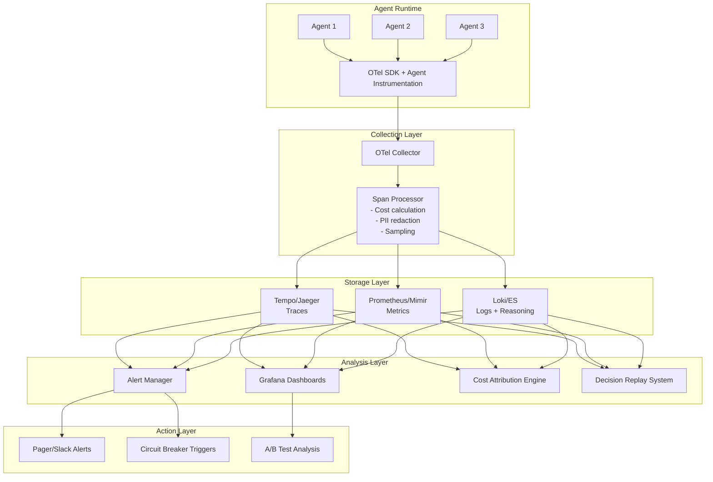

# Agent Observability at Scale

## Why Agent Observability Is Different

Traditional observability (metrics, logs, traces) assumes deterministic systems. Agents are:
- **Non-deterministic**: Same input can produce different outputs
- **Multi-step**: A single request becomes 5-50 LLM calls + tool invocations
- **Expensive**: Each "retry" costs real money
- **Opaque**: The reasoning between steps is invisible without explicit capture

You need to observe not just *what* happened, but *why* the agent decided to do it.

---

## Agent Telemetry: The Three Pillars Extended

### Traditional Three Pillars
1. **Metrics**: Counters, gauges, histograms
2. **Logs**: Structured event records
3. **Traces**: Distributed request flow

### Agent-Specific Extensions
4. **Reasoning traces**: WHY decisions were made (captured chain-of-thought)
5. **Decision points**: Where the agent chose between alternatives
6. **Tool interaction logs**: Full input/output of every tool call
7. **Cost attribution**: Token and dollar cost per step

---

## OpenTelemetry for Agents

### Custom Span Attributes

```python
from opentelemetry import trace
from opentelemetry.trace import StatusCode

tracer = trace.get_tracer("agent-system")

class InstrumentedAgent:
    async def execute_step(self, task: str, context: dict):
        with tracer.start_as_current_span("agent.step") as span:
            # Standard attributes
            span.set_attribute("agent.id", self.agent_id)
            span.set_attribute("agent.role", self.role)
            span.set_attribute("agent.step_number", self.step_count)
            
            # Decision attributes
            span.set_attribute("agent.task", task)
            span.set_attribute("agent.context_tokens", count_tokens(context))
            
            # LLM call
            with tracer.start_as_current_span("agent.llm_call") as llm_span:
                llm_span.set_attribute("llm.model", self.model)
                llm_span.set_attribute("llm.temperature", self.temperature)
                llm_span.set_attribute("llm.prompt_tokens", prompt_tokens)
                
                response = await self.llm.call(prompt)
                
                llm_span.set_attribute("llm.completion_tokens", response.usage.completion)
                llm_span.set_attribute("llm.total_tokens", response.usage.total)
                llm_span.set_attribute("llm.cost_usd", calculate_cost(response.usage))
            
            # Tool call (if agent decides to use a tool)
            if response.tool_call:
                with tracer.start_as_current_span("agent.tool_call") as tool_span:
                    tool_span.set_attribute("tool.name", response.tool_call.name)
                    tool_span.set_attribute("tool.args", json.dumps(response.tool_call.args))
                    
                    tool_result = await self.execute_tool(response.tool_call)
                    
                    tool_span.set_attribute("tool.success", tool_result.success)
                    tool_span.set_attribute("tool.result_size", len(str(tool_result)))
                    if not tool_result.success:
                        tool_span.set_status(StatusCode.ERROR, tool_result.error)
            
            # Decision reasoning
            span.set_attribute("agent.reasoning", response.reasoning[:500])
            span.set_attribute("agent.decision", response.action_chosen)
            span.set_attribute("agent.alternatives_considered", 
                             json.dumps(response.alternatives[:3]))
```

### Semantic Conventions for Agent Spans

```python
# Proposed semantic conventions (extend OTel)
AGENT_SPAN_ATTRIBUTES = {
    # Identity
    "agent.id": "Unique agent instance identifier",
    "agent.role": "Agent's role (planner, coder, reviewer, etc.)",
    "agent.version": "Agent prompt/config version",
    
    # Task context
    "agent.task.id": "Task being worked on",
    "agent.task.type": "Classification of task",
    "agent.step_number": "Which step in the agent loop",
    "agent.max_steps": "Maximum allowed steps",
    
    # LLM interaction
    "llm.model": "Model used for this call",
    "llm.prompt_tokens": "Input tokens",
    "llm.completion_tokens": "Output tokens",
    "llm.cost_usd": "Dollar cost of this call",
    "llm.latency_ms": "Time to first token / total",
    
    # Tool usage
    "tool.name": "Tool invoked",
    "tool.success": "Whether tool call succeeded",
    "tool.latency_ms": "Tool execution time",
    "tool.retries": "Number of retries needed",
    
    # Decision quality
    "agent.confidence": "Agent's stated confidence (if available)",
    "agent.reasoning_length": "Length of reasoning trace",
    "agent.backtrack_count": "Times agent revised its approach",
}
```

---

## Observability Stack Architecture



---

## Dashboard Design

### Primary Agent Operations Dashboard

**Row 1: Health at a Glance**
| Panel | Metric | Alert Threshold |
|---|---|---|
| Success Rate | `agent_task_success_total / agent_task_total` | < 90% |
| Avg Steps per Task | `histogram_quantile(0.5, agent_steps)` | > 15 |
| Cost per Task (p50/p95) | `agent_task_cost_usd` | p95 > $2.00 |
| Active Agents | `agent_instances_active` | - |
| Error Rate | `agent_errors_total / agent_tasks_total` | > 10% |

**Row 2: Performance**
| Panel | Metric |
|---|---|
| Task Duration (p50/p95/p99) | `agent_task_duration_seconds` |
| LLM Latency by Model | `llm_call_duration_seconds{model=...}` |
| Tool Success Rate by Tool | `tool_call_success{tool=...} / tool_call_total{tool=...}` |
| Queue Depth | `agent_task_queue_length` |

**Row 3: Cost**
| Panel | Metric |
|---|---|
| Hourly Spend | `sum(rate(agent_cost_usd_total[1h]))` |
| Cost by Agent Role | `sum by (role)(agent_cost_usd_total)` |
| Cost by Model | `sum by (model)(llm_cost_usd_total)` |
| Token Usage Trend | `rate(llm_tokens_total[5m])` |

**Row 4: Quality Signals**
| Panel | Metric |
|---|---|
| Backtrack Rate | Tasks where agent revised approach |
| Loop Detection Events | Times loop detector fired |
| Human Escalations | Tasks requiring human intervention |
| Confidence Distribution | Histogram of agent confidence scores |

### Key Prometheus Metrics

```python
from prometheus_client import Counter, Histogram, Gauge

# Task-level metrics
agent_tasks_total = Counter('agent_tasks_total', 'Total tasks', ['agent_role', 'status'])
agent_task_duration = Histogram('agent_task_duration_seconds', 'Task duration',
                                ['agent_role'], buckets=[1, 5, 10, 30, 60, 120, 300])
agent_task_cost = Histogram('agent_task_cost_usd', 'Task cost in USD',
                            ['agent_role'], buckets=[0.01, 0.05, 0.1, 0.5, 1, 5, 10])
agent_task_steps = Histogram('agent_task_steps', 'Steps per task',
                             ['agent_role'], buckets=[1, 3, 5, 10, 15, 25, 50])

# LLM metrics
llm_calls_total = Counter('llm_calls_total', 'LLM calls', ['model', 'agent_role'])
llm_tokens_total = Counter('llm_tokens_total', 'Tokens used', ['model', 'direction'])
llm_call_duration = Histogram('llm_call_duration_seconds', 'LLM latency', ['model'])

# Tool metrics
tool_calls_total = Counter('tool_calls_total', 'Tool calls', ['tool', 'status'])
tool_call_duration = Histogram('tool_call_duration_seconds', 'Tool latency', ['tool'])

# Failure metrics
agent_loops_detected = Counter('agent_loops_detected_total', 'Loop detections', ['agent_role'])
agent_budget_exceeded = Counter('agent_budget_exceeded_total', 'Budget exceeded', ['budget_type'])
agent_escalations = Counter('agent_escalations_total', 'Human escalations', ['reason'])
```

---

## Distributed Tracing Across Multi-Agent Systems

### Parent-Child Span Relationships

```
User Request (root span)
├── Orchestrator.plan (span)
│   ├── LLM call: decompose task
│   └── LLM call: assign agents
├── Agent-Research.execute (span, child of orchestrator)
│   ├── LLM call: plan research
│   ├── Tool: web_search("query 1")
│   ├── Tool: web_search("query 2")
│   └── LLM call: synthesize findings
├── Agent-Coder.execute (span, child of orchestrator)
│   ├── LLM call: plan implementation
│   ├── Tool: read_file("src/main.py")
│   ├── LLM call: generate code
│   ├── Tool: write_file("src/feature.py")
│   └── Tool: run_tests()
└── Agent-Reviewer.execute (span, child of orchestrator)
    ├── LLM call: review code
    └── LLM call: generate feedback
```

### Context Propagation

```python
class AgentContextPropagator:
    """Propagate trace context across agent boundaries."""
    
    def send_to_agent(self, target_agent: str, message: dict):
        # Inject current trace context into message
        ctx = trace.get_current_span().get_span_context()
        message["_trace_context"] = {
            "trace_id": format(ctx.trace_id, '032x'),
            "span_id": format(ctx.span_id, '016x'),
            "trace_flags": ctx.trace_flags,
        }
        return self.dispatch(target_agent, message)
    
    def receive_message(self, message: dict):
        # Extract trace context and create child span
        parent_ctx = message.pop("_trace_context", None)
        if parent_ctx:
            parent = create_span_context(
                trace_id=int(parent_ctx["trace_id"], 16),
                span_id=int(parent_ctx["span_id"], 16),
            )
            ctx = trace.set_span_in_context(NonRecordingSpan(parent))
            return tracer.start_span("agent.receive", context=ctx)
        return tracer.start_span("agent.receive")
```

---

## Log Correlation

### Connecting the Full Request Chain

```
User Request → Orchestrator → Worker Agents → Tool Calls
```

Every log line must include:
```json
{
  "timestamp": "2024-01-15T10:30:00Z",
  "trace_id": "abc123",
  "span_id": "def456",
  "parent_span_id": "ghi789",
  "agent_id": "coder-agent-01",
  "agent_role": "coder",
  "step": 3,
  "event": "tool_call",
  "tool": "write_file",
  "message": "Writing implementation to src/feature.py",
  "tokens_so_far": 4521,
  "cost_so_far_usd": 0.12
}
```

### Structured Logging for Agents

```python
import structlog

logger = structlog.get_logger()

class ObservableAgent:
    def __init__(self, agent_id: str, role: str):
        self.log = logger.bind(
            agent_id=agent_id,
            agent_role=role,
        )
    
    async def execute_step(self, step_num: int, task: str):
        step_log = self.log.bind(step=step_num, task_id=task.id)
        
        step_log.info("step.start", task_summary=task.summary[:100])
        
        # LLM call
        step_log.info("llm.call.start", model=self.model, prompt_tokens=pt)
        response = await self.llm.call(prompt)
        step_log.info("llm.call.complete", 
                     completion_tokens=response.usage.completion,
                     cost_usd=calculate_cost(response.usage),
                     decision=response.action_chosen)
        
        # Reasoning capture (expensive but invaluable for debugging)
        step_log.debug("reasoning.trace", 
                      reasoning=response.reasoning,
                      alternatives=response.alternatives)
        
        # Tool execution
        if response.tool_call:
            step_log.info("tool.call", 
                         tool=response.tool_call.name,
                         args_summary=summarize(response.tool_call.args))
```

---

## Alerting: What Anomalies Matter

### Critical Alerts (Page immediately)

| Alert | Condition | Why |
|---|---|---|
| Cost spike | Hourly spend > 3x normal | Runaway agent burning money |
| Loop detected | Same agent > 10 similar messages | Infinite loop |
| Success rate drop | < 70% over 5 minutes | Systemic failure |
| Budget exceeded | Any agent hits hard budget limit | Need human decision |

### Warning Alerts (Slack notification)

| Alert | Condition | Why |
|---|---|---|
| Unusual step count | p95 steps > 2x baseline | Agents struggling |
| Tool failure spike | Any tool > 30% failure rate | External dependency issue |
| Latency increase | p95 duration > 2x baseline | Performance degradation |
| Confidence drop | Average confidence < 0.5 | Model/prompt regression |

### Anomaly Detection Queries

```promql
# Cost spike detection (3x rolling average)
agent_cost_usd_total_rate_1h > 3 * avg_over_time(agent_cost_usd_total_rate_1h[24h])

# Unusual step counts
histogram_quantile(0.95, rate(agent_task_steps_bucket[5m])) 
  > 2 * histogram_quantile(0.95, rate(agent_task_steps_bucket[24h]))

# Loop detection (high message rate between same agents)
rate(agent_inter_message_total{source=~".+", target=~".+"}[1m]) > 10

# Reasoning regression (steps increasing without success improvement)
increase(agent_task_steps_sum[1h]) > 0 AND increase(agent_task_success_total[1h]) == 0
```

---

## Debugging in Production

### Decision Replay

```python
class DecisionReplaySystem:
    """Replay agent decisions for debugging without re-running."""
    
    def capture_decision_point(self, agent_id: str, step: int,
                                context: dict, prompt: str, 
                                response: str, alternatives: list):
        """Store everything needed to understand a decision."""
        self.store.save({
            "agent_id": agent_id,
            "step": step,
            "timestamp": time.time(),
            "context_snapshot": context,
            "prompt_used": prompt,
            "response_received": response,
            "alternatives_considered": alternatives,
            "model": self.model,
            "temperature": self.temperature,
        })
    
    def replay_decision(self, trace_id: str, step: int, 
                        new_model: str = None, new_prompt: str = None):
        """Re-run a specific decision with modified parameters."""
        original = self.store.get(trace_id, step)
        
        prompt = new_prompt or original["prompt_used"]
        model = new_model or original["model"]
        
        # Re-run with same context but potentially different model/prompt
        new_response = self.llm.call(prompt, model=model)
        
        return {
            "original_decision": original["response_received"],
            "new_decision": new_response,
            "context_was": original["context_snapshot"],
            "diff": compare_decisions(original["response_received"], new_response)
        }
```

### Shadow Mode for New Agent Versions

```python
class ShadowModeDeployment:
    """Run new agent version in shadow, compare with production."""
    
    def __init__(self, production_agent, shadow_agent):
        self.production = production_agent
        self.shadow = shadow_agent
        self.comparison_log = []
    
    async def execute(self, task):
        # Production agent handles the real task
        prod_result = await self.production.execute(task)
        
        # Shadow agent runs in parallel but results are discarded
        try:
            shadow_result = await asyncio.wait_for(
                self.shadow.execute(task.copy()), timeout=120
            )
            self.compare(task, prod_result, shadow_result)
        except Exception as e:
            self.log_shadow_failure(task, e)
        
        return prod_result  # Always return production result
    
    def compare(self, task, prod_result, shadow_result):
        comparison = {
            "task_id": task.id,
            "prod_steps": prod_result.steps,
            "shadow_steps": shadow_result.steps,
            "prod_cost": prod_result.cost,
            "shadow_cost": shadow_result.cost,
            "prod_success": prod_result.success,
            "shadow_success": shadow_result.success,
            "output_similarity": semantic_similarity(
                prod_result.output, shadow_result.output
            ),
        }
        self.comparison_log.append(comparison)
```

---

## A/B Testing Agents

### Canary Deployment for Agent Behavior Changes

```python
class AgentCanaryDeployment:
    """Gradually roll out agent changes with automatic rollback."""
    
    def __init__(self, stable_agent, canary_agent, canary_percentage: float = 5.0):
        self.stable = stable_agent
        self.canary = canary_agent
        self.canary_pct = canary_percentage
        self.metrics = CanaryMetrics()
    
    async def route_request(self, task):
        if random.random() * 100 < self.canary_pct:
            result = await self.canary.execute(task)
            self.metrics.record("canary", result)
            
            # Auto-rollback if canary is significantly worse
            if self.metrics.should_rollback():
                self.canary_pct = 0
                alert("Canary auto-rolled back", self.metrics.summary())
            
            return result
        else:
            result = await self.stable.execute(task)
            self.metrics.record("stable", result)
            return result
    
    def promote_canary(self):
        """Gradually increase canary traffic."""
        stages = [5, 10, 25, 50, 100]
        current_idx = stages.index(int(self.canary_pct))
        if current_idx < len(stages) - 1:
            self.canary_pct = stages[current_idx + 1]

class CanaryMetrics:
    def should_rollback(self) -> bool:
        """Rollback if canary is statistically worse."""
        if self.canary_count < 20:
            return False  # Not enough data
        
        canary_success = self.canary_successes / self.canary_count
        stable_success = self.stable_successes / self.stable_count
        
        # Rollback if success rate drops >10% or cost increases >50%
        if canary_success < stable_success - 0.10:
            return True
        if self.canary_avg_cost > self.stable_avg_cost * 1.5:
            return True
        return False
```

---

## Cost Attribution

### Which Agent/Tool Combination Costs the Most

```python
class CostAttribution:
    """Track and attribute costs across the agent system."""
    
    def __init__(self):
        self.costs = defaultdict(lambda: defaultdict(float))
    
    def record(self, agent_role: str, action: str, cost_usd: float):
        self.costs[agent_role][action] += cost_usd
        self.costs["_total"]["_total"] += cost_usd
    
    def report(self) -> dict:
        """Generate cost attribution report."""
        report = {}
        total = self.costs["_total"]["_total"]
        
        for role, actions in self.costs.items():
            if role.startswith("_"):
                continue
            role_total = sum(actions.values())
            report[role] = {
                "total_usd": role_total,
                "percentage": role_total / total * 100,
                "breakdown": {
                    action: {"usd": cost, "pct": cost/role_total*100}
                    for action, cost in sorted(actions.items(), 
                                               key=lambda x: -x[1])
                }
            }
        return report
```

### Example Cost Attribution Output

```
Cost Attribution Report (last 24h):
=====================================
Total: $142.50

By Agent Role:
  coder (45%):     $64.12
    - llm_calls:   $58.00 (90%)
    - tool_exec:   $6.12  (10%)
  
  researcher (30%): $42.75
    - llm_calls:   $30.00 (70%)
    - web_search:  $12.75 (30%)
  
  reviewer (15%):  $21.38
    - llm_calls:   $21.38 (100%)
  
  planner (10%):   $14.25
    - llm_calls:   $14.25 (100%)

Top 5 Expensive Operations:
  1. coder + generate_code: $35.00
  2. researcher + synthesize: $22.00
  3. coder + fix_bugs: $18.00
  4. researcher + web_search: $12.75
  5. reviewer + full_review: $12.00
```

---

## Anti-Patterns

### 1. No Tracing

**Problem**: Cannot debug why an agent made a wrong decision.
**Fix**: Instrument every LLM call and tool call with OpenTelemetry spans.

### 2. Logging Only Final Output

**Problem**: "The agent produced wrong code" tells you nothing about where it went wrong.
**Fix**: Log every intermediate step, reasoning trace, and decision point.

### 3. Ignoring Intermediate Reasoning

**Problem**: Agent takes 20 steps but you only check the final answer.
**Fix**: Monitor step-by-step quality. A correct final answer reached through bad reasoning will eventually fail.

### 4. No Cost Tracking

**Problem**: Month-end surprise bill because one agent type was 10x more expensive than expected.
**Fix**: Real-time cost dashboards with per-agent-role attribution.

### 5. Alert Fatigue

**Problem**: Too many alerts on non-actionable metrics.
**Fix**: Alert on business-impacting signals only. Use SLOs not raw metrics.

### 6. No Baseline

**Problem**: "Is 12 steps normal?" - cannot answer without historical data.
**Fix**: Establish baselines before deploying. Alert on deviations from baseline, not absolute thresholds.

### 7. Sampling Incorrectly

**Problem**: Sampling 1% of traces but missing all the expensive/failing ones.
**Fix**: Use tail-based sampling - keep all traces that are slow, expensive, or errored.

---

## Real-World Observability Practices

### How Production Agent Systems Are Instrumented

**Common patterns observed in public documentation and talks:**

1. **Every LLM call is a span** with token counts, latency, model version
2. **Tool calls are child spans** with success/failure and duration
3. **Agent "thinking" is captured** as span events or logs attached to spans
4. **Cost is calculated at ingestion time** and attached as a span attribute
5. **Trace IDs propagate** from user request through all agent hops
6. **Sensitive data is redacted** at the collector level before storage
7. **Tail-based sampling** keeps interesting traces (errors, high cost, many steps)
8. **Replay infrastructure** allows re-running decisions with different prompts/models

### Emerging Tools

| Tool | Focus |
|---|---|
| LangSmith | LangChain agent tracing and evaluation |
| Langfuse | Open-source LLM observability |
| Arize Phoenix | LLM trace visualization |
| Braintrust | Agent evaluation and logging |
| Helicone | LLM proxy with automatic logging |
| OpenLIT | OpenTelemetry-native LLM observability |

### Build vs Buy Decision

**Build your own when:**
- You need custom metrics specific to your agent architecture
- You have strict data residency requirements
- You're already invested in an observability stack (Grafana, Datadog)
- You need deep integration with your agent framework

**Buy/use existing when:**
- You're using a standard framework (LangChain, CrewAI)
- You need fast time-to-value
- You don't have observability engineering capacity
- You need built-in evaluation alongside observability

---

## Staff Architect Checklist for Agent Observability

- [ ] Every LLM call has a trace span with token counts and cost
- [ ] Every tool call has a trace span with success/failure
- [ ] Trace IDs propagate across all agent boundaries
- [ ] Reasoning/chain-of-thought is captured (at least for failed tasks)
- [ ] Cost attribution dashboard exists per agent role and tool
- [ ] Alerts exist for: cost spikes, success rate drops, unusual step counts
- [ ] Tail-based sampling retains all error/expensive/slow traces
- [ ] Decision replay capability exists for debugging
- [ ] Baselines are established and anomaly detection uses them
- [ ] PII is redacted before storage
- [ ] Shadow mode or canary deployment is possible for agent changes
- [ ] Historical cost trends are tracked for capacity planning

---

## Key Takeaways

1. **Observe decisions, not just outcomes**: The reasoning is as important as the result
2. **Cost is a first-class metric**: Unlike traditional services, agent costs scale with complexity
3. **Tail-based sampling is mandatory**: You cannot afford to miss expensive failures
4. **Baselines before alerts**: Absolute thresholds don't work for non-deterministic systems
5. **Replay > logs**: Being able to re-run a decision is more valuable than reading about it
6. **Shadow mode de-risks changes**: Never blind-deploy a new agent version to 100% traffic
