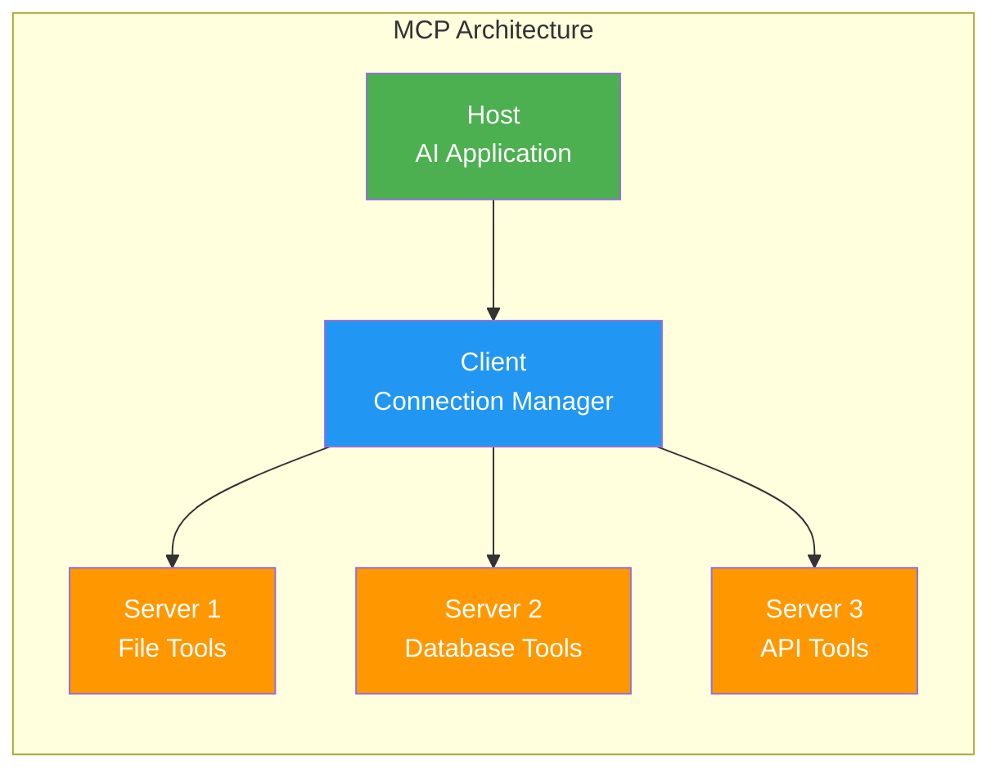
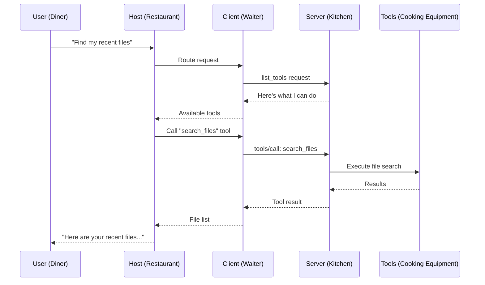
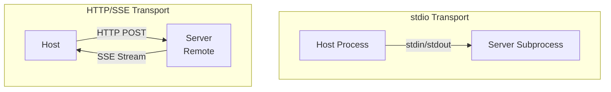

# What is Model Context Protocol (MCP)?

## The Problem: Integration Hell

Imagine you're building an AI application. You want it to:
- Read files from your computer
- Query your database
- Send emails
- Check the weather
- Search the web

Without a standard protocol, **every AI app builds custom integrations for every tool**. If there are 100 AI apps and 100 tools, that's potentially 10,000 custom integrations. This is the same problem we had before USB — every device had its own proprietary connector.

## The "USB-C for AI" Analogy

**MCP is the USB-C port for AI applications.**

Just as USB-C provides a universal connector between your laptop and any peripheral (monitor, keyboard, phone, storage), MCP provides a universal protocol between any AI application and any tool/data source.

| Before USB-C | Before MCP |
|---|---|
| Every device had its own cable | Every AI app had custom tool integrations |
| Buy a new phone = new charger | Add a new tool = write new integration code |
| Incompatible across brands | Incompatible across AI providers |

| After USB-C | After MCP |
|---|---|
| One cable fits all | One protocol connects all |
| Any device works with any port | Any AI app works with any MCP server |
| Standard data/power transfer | Standard tool/resource access |

## MCP Architecture: The Three Players

MCP has three core components arranged in a clear hierarchy:



### 1. Host (The Customer)

The **Host** is the AI application that the user interacts with.

**Examples:**
- Claude Desktop
- VS Code with Copilot
- A custom AI chatbot you build
- An AI-powered IDE

The Host is like a **customer at a restaurant** — they have needs (tools, data) but don't go into the kitchen themselves.

### 2. Client (The Waiter)

The **Client** lives inside the Host and manages connections to MCP servers.

**Responsibilities:**
- Maintains 1:1 connections with servers
- Handles protocol negotiation
- Routes requests between Host and Servers
- Manages server lifecycle

The Client is like a **waiter** — takes orders from the customer (Host), delivers them to the kitchen (Servers), and brings back results.

### 3. Server (The Kitchen)

The **Server** exposes capabilities (tools, resources, prompts) that the AI can use.

**Examples:**
- A file system server (read/write files)
- A GitHub server (create PRs, read issues)
- A database server (run queries)
- A Slack server (send messages)

The Server is like a **specialized kitchen** — it knows how to prepare specific dishes (execute specific tools) and tells the waiter what's on the menu.

## The Restaurant Analogy — Complete Picture



## MCP Capabilities: What Servers Can Expose

MCP servers can expose three types of capabilities:

### Tools — "Actions the AI can perform"
Functions the AI can call, like API endpoints. The AI decides when to call them.

```
Tool: search_files
Description: Search for files matching a pattern
Input: { pattern: "*.py", directory: "/src" }
Output: [list of matching files]
```

### Resources — "Data the AI can read"
Structured data the AI can access, like files or database records.

```
Resource: file:///config/settings.json
Description: Application settings
Content: { "theme": "dark", "language": "en" }
```

### Prompts — "Pre-built templates"
Reusable prompt templates that guide the AI's behavior.

```
Prompt: code_review
Arguments: { language: "python", style: "concise" }
Template: "Review this {language} code. Be {style}..."
```

## Transport Layer: How They Communicate

MCP supports two transport mechanisms:

### stdio (Standard Input/Output)
- Server runs as a **subprocess** of the client
- Communication via stdin/stdout pipes
- Best for **local** servers
- Simple, fast, no network overhead

### HTTP with SSE (Server-Sent Events)
- Server runs as a **web service**
- Client connects via HTTP
- Server pushes updates via SSE (Server-Sent Events)
- Best for **remote** servers
- Supports multiple clients



## Why MCP Matters for AI Architects

1. **Standardization** — Build once, work everywhere
2. **Ecosystem** — Growing library of pre-built servers
3. **Security** — Defined permission boundaries
4. **Composability** — Mix and match servers for any use case
5. **Separation of concerns** — AI logic stays separate from tool logic

## Key Takeaway

MCP turns the M×N integration problem into an M+N problem. Instead of every AI app building custom connections to every tool, each app just speaks MCP, and each tool just exposes an MCP server. The protocol handles everything in between.

```
Before MCP: 10 AI apps × 10 tools = 100 integrations
After MCP:  10 AI apps + 10 tools = 20 implementations
```
