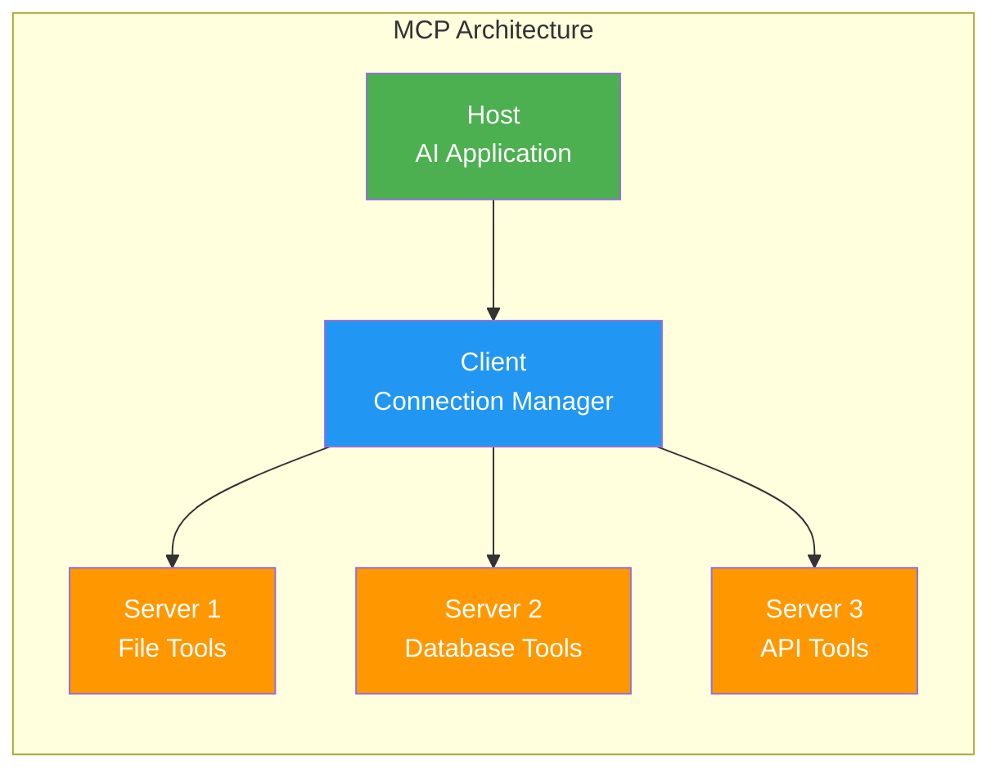
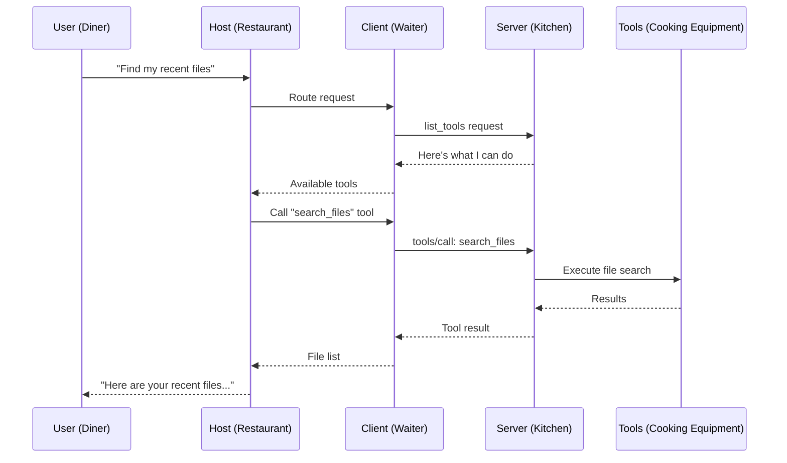
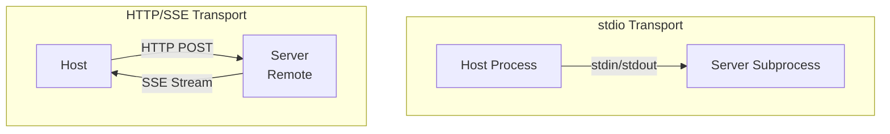

# What is Model Context Protocol (MCP)?

## The Problem: Integration Hell

Imagine you're building an AI application. You want it to:
- Read files from your computer
- Query your database
- Send emails
- Check the weather
- Search the web

Without a standard protocol, **every AI app builds custom integrations for every tool**. If there are 100 AI apps and 100 tools, that's potentially 10,000 custom integrations. This is the same problem we had before USB — every device had its own proprietary connector.

## The "USB-C for AI" Analogy

**MCP is the USB-C port for AI applications.**

Just as USB-C provides a universal connector between your laptop and any peripheral (monitor, keyboard, phone, storage), MCP provides a universal protocol between any AI application and any tool/data source.

| Before USB-C | Before MCP |
|---|---|
| Every device had its own cable | Every AI app had custom tool integrations |
| Buy a new phone = new charger | Add a new tool = write new integration code |
| Incompatible across brands | Incompatible across AI providers |

| After USB-C | After MCP |
|---|---|
| One cable fits all | One protocol connects all |
| Any device works with any port | Any AI app works with any MCP server |
| Standard data/power transfer | Standard tool/resource access |

## MCP Architecture: The Three Players

MCP has three core components arranged in a clear hierarchy:



### 1. Host (The Customer)

The **Host** is the AI application that the user interacts with.

**Examples:**
- Claude Desktop
- VS Code with Copilot
- A custom AI chatbot you build
- An AI-powered IDE

The Host is like a **customer at a restaurant** — they have needs (tools, data) but don't go into the kitchen themselves.

### 2. Client (The Waiter)

The **Client** lives inside the Host and manages connections to MCP servers.

**Responsibilities:**
- Maintains 1:1 connections with servers
- Handles protocol negotiation
- Routes requests between Host and Servers
- Manages server lifecycle

The Client is like a **waiter** — takes orders from the customer (Host), delivers them to the kitchen (Servers), and brings back results.

### 3. Server (The Kitchen)

The **Server** exposes capabilities (tools, resources, prompts) that the AI can use.

**Examples:**
- A file system server (read/write files)
- A GitHub server (create PRs, read issues)
- A database server (run queries)
- A Slack server (send messages)

The Server is like a **specialized kitchen** — it knows how to prepare specific dishes (execute specific tools) and tells the waiter what's on the menu.

## The Restaurant Analogy — Complete Picture



## MCP Capabilities: What Servers Can Expose

MCP servers can expose three types of capabilities:

### Tools — "Actions the AI can perform"
Functions the AI can call, like API endpoints. The AI decides when to call them.

```
Tool: search_files
Description: Search for files matching a pattern
Input: { pattern: "*.py", directory: "/src" }
Output: [list of matching files]
```

### Resources — "Data the AI can read"
Structured data the AI can access, like files or database records.

```
Resource: file:///config/settings.json
Description: Application settings
Content: { "theme": "dark", "language": "en" }
```

### Prompts — "Pre-built templates"
Reusable prompt templates that guide the AI's behavior.

```
Prompt: code_review
Arguments: { language: "python", style: "concise" }
Template: "Review this {language} code. Be {style}..."
```

## Transport Layer: How They Communicate

MCP supports two transport mechanisms:

### stdio (Standard Input/Output)
- Server runs as a **subprocess** of the client
- Communication via stdin/stdout pipes
- Best for **local** servers
- Simple, fast, no network overhead

### HTTP with SSE (Server-Sent Events)
- Server runs as a **web service**
- Client connects via HTTP
- Server pushes updates via SSE (Server-Sent Events)
- Best for **remote** servers
- Supports multiple clients



## Why MCP Matters for AI Architects

1. **Standardization** — Build once, work everywhere
2. **Ecosystem** — Growing library of pre-built servers
3. **Security** — Defined permission boundaries
4. **Composability** — Mix and match servers for any use case
5. **Separation of concerns** — AI logic stays separate from tool logic

## Key Takeaway

MCP turns the M×N integration problem into an M+N problem. Instead of every AI app building custom connections to every tool, each app just speaks MCP, and each tool just exposes an MCP server. The protocol handles everything in between.

```
Before MCP: 10 AI apps × 10 tools = 100 integrations
After MCP:  10 AI apps + 10 tools = 20 implementations
```

---

## Staff-Level Considerations

### Anti-Patterns

**1. MCP for Everything**
Not every tool needs protocol overhead. A simple utility function called once in a pipeline doesn't benefit from MCP's discovery, schema negotiation, and transport layers. MCP shines when tools are reused across multiple AI applications or teams — not for internal helper functions within a single agent.

**2. No Authentication on MCP Servers**
Running HTTP/SSE MCP servers without auth is equivalent to exposing an unauthenticated API to your network. Even "internal" servers get accessed by unintended clients. Always authenticate remote MCP servers — stdio gets a pass because it runs as a subprocess of the trusted host.

**3. Exposing Internal Tools Publicly**
An MCP server built for your team's internal use (e.g., database admin tools) should never be discoverable in a public registry. Internal tools often skip validation because they trust the caller — exposure turns convenience into a vulnerability.

**4. Treating MCP as RPC Instead of Context Protocol**
MCP is designed for providing *context* to language models — not as a general-purpose RPC framework. If you're using MCP to call microservices that have nothing to do with AI context, you're adding protocol overhead without benefit. Use gRPC/REST for service-to-service calls.

### Trade-offs

| Decision | MCP | Direct API Calls |
|----------|-----|-----------------|
| **Discovery** | Automatic via protocol | Manual documentation |
| **Schema** | Self-describing | OpenAPI/separate docs |
| **Multi-client** | Any MCP host works | Custom per client |
| **Overhead** | Protocol negotiation, JSON-RPC | Direct HTTP, lower latency |
| **Flexibility** | Constrained to MCP primitives | Any API design |
| **When to choose** | Tool reused by many AI apps | Single integration, performance-critical |

### Standardization vs Flexibility

MCP forces you into three primitives: tools, resources, prompts. This constraint is a feature — it makes servers interoperable. But it means you can't express capabilities that don't fit these abstractions (e.g., bidirectional streaming, pub/sub patterns). If your use case needs richer interaction patterns, MCP may be the wrong layer.

### Real-World Decision Framework

Choose MCP when:
- Multiple AI applications need the same tool
- You want tool portability across Claude, Copilot, Cursor, etc.
- You're building a platform team providing capabilities to AI app developers

Skip MCP when:
- Single-use integration within one application
- Sub-millisecond latency requirements
- The "tool" is really just a function call within your own codebase
- You need bidirectional streaming or complex interaction patterns

---

## MCP Ecosystem Overview (2025)

### Adoption Landscape

| Host/Client | MCP Support | Status |
|-------------|-------------|--------|
| Claude Desktop | Full (native) | Production |
| Cursor | Full | Production |
| VS Code (Copilot) | Tools, prompts | Production |
| Windsurf | Full | Production |
| Continue.dev | Full | Production |
| OpenAI ChatGPT | Not yet (as of mid-2025) | N/A |
| Custom apps | Via SDK | Varies |

### Server Ecosystem

```
Categories of available MCP servers (2025):

Developer tools:     GitHub, GitLab, Linear, Jira, Sentry
Databases:           PostgreSQL, SQLite, MongoDB, Supabase
Cloud:               AWS, GCP, Azure (community-maintained)
Communication:       Slack, Email, Discord
File systems:        Local FS, Google Drive, S3
Knowledge:           Notion, Confluence, web search
Specialized:         Playwright (browser), Docker, Kubernetes
```

### Transport Evolution

```
Original (2024):  stdio only (local process communication)
Current (2025):   stdio + Streamable HTTP (SSE for server→client)
Upcoming:         WebSocket transport for full-duplex scenarios

Streamable HTTP enables:
- Remote MCP servers (hosted as services)
- Multi-tenant server deployments  
- Load balancing and scaling
- Auth via standard HTTP headers (OAuth 2.1)
```

## Comparison with Alternatives

| Approach | Standardization | Portability | Complexity | Best For |
|----------|----------------|-------------|------------|----------|
| **MCP** | Protocol spec | Any MCP host | Medium | Multi-host tool sharing |
| **OpenAPI + function calling** | Per-provider | Vendor-specific | Low | Single-app integrations |
| **Native function calling** | None (custom) | None | Lowest | Internal tools, tight coupling |
| **A2A** | Protocol spec | Any A2A agent | High | Agent-to-agent delegation |

### MCP vs. Direct Function Calling

```
Choose MCP when:
  - Tool will be used by multiple AI applications
  - You want to swap AI providers without rewriting integrations
  - Tool discovery at runtime matters (dynamic capabilities)
  - You need resource exposure (not just actions)

Choose direct function calling when:
  - Single application, single model provider
  - Maximum performance (no protocol overhead)
  - Simple tools (< 5 tools, stable interface)
  - You control both the AI app and the tools
```

### MCP vs. OpenAPI

```
OpenAPI:
  - Designed for human developers consuming APIs
  - Client generation, documentation-first
  - No concept of "resources" or "prompts"
  - Well-understood, massive ecosystem

MCP:
  - Designed for AI models consuming capabilities
  - Includes resources (context), prompts (templates), tools (actions)
  - Stateful sessions with capability negotiation
  - Newer, growing ecosystem

Overlap: Both describe callable endpoints
Difference: MCP adds AI-specific primitives (sampling, resources, prompt templates)
```

## Adoption Timeline and Maturity

```
2024 Q1: MCP announced by Anthropic (stdio transport only)
2024 Q2-Q3: Early adopters, community servers proliferate
2024 Q4: Cursor, VS Code adopt; critical mass of developer tool servers
2025 Q1: Streamable HTTP transport; remote servers become viable
2025 Q2: Auth spec (OAuth 2.1); enterprise adoption begins
2025 H2: Expected — registry/discovery, server composition, versioning

Maturity assessment (mid-2025):
  Protocol stability:    High (core spec stable)
  Server ecosystem:      Medium-High (hundreds of servers, quality varies)
  Enterprise readiness:  Medium (auth landing, but governance tooling early)
  Production hardening:  Medium (error handling, reconnection improving)
```

**Staff insight**: MCP's value proposition is strongest when you have 3+ AI-powered applications that need the same integrations. Below that threshold, the protocol overhead may not justify itself over direct function calling. The bet is that multi-host AI becomes the norm — which seems increasingly likely given the IDE/assistant proliferation.
