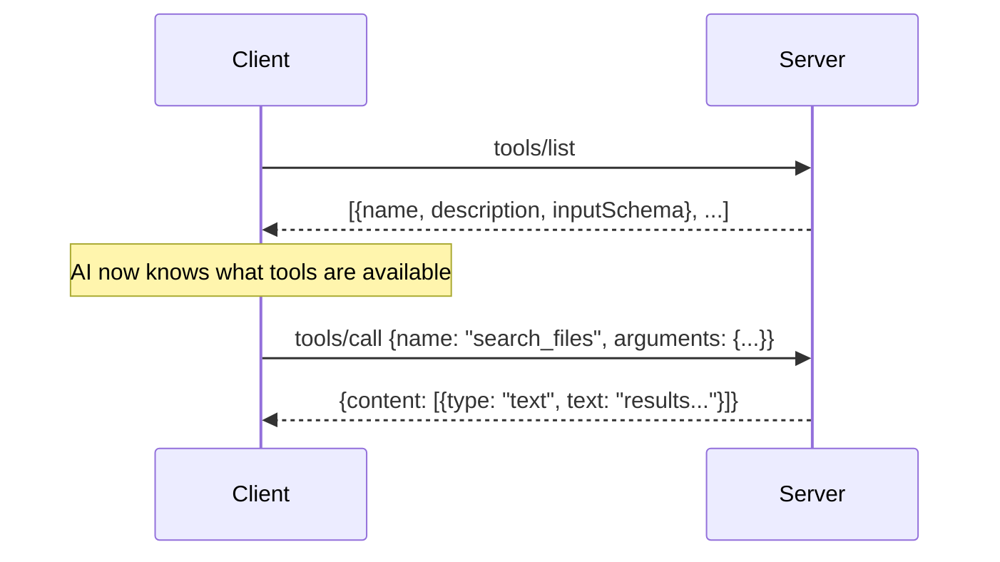
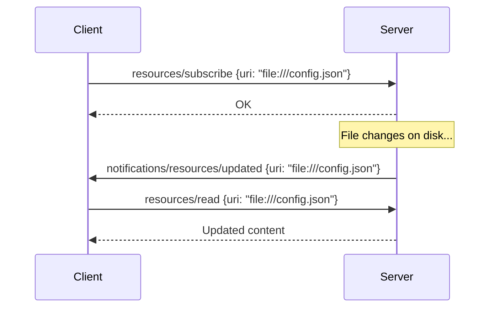
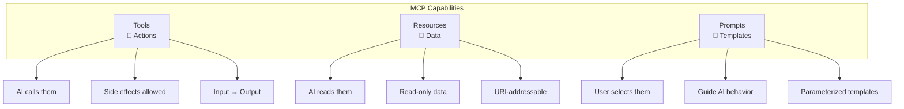
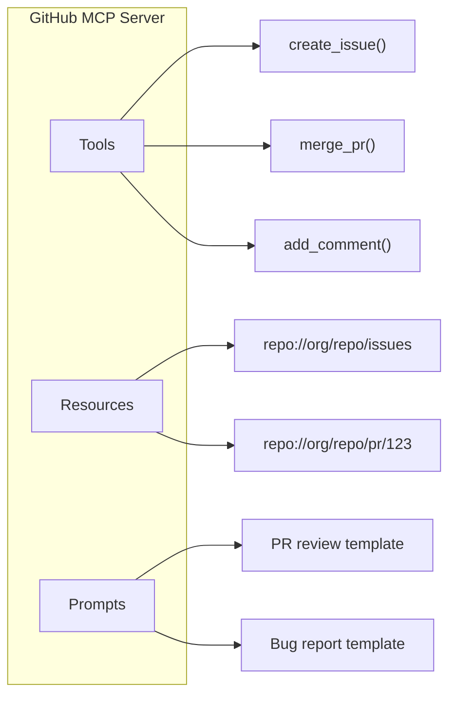

# MCP Tools, Resources, and Prompts

## The Three Capabilities — An Analogy

Think of an MCP server as a **library**:
- **Tools** = the librarian (you ask them to *do* things — find a book, reserve a room)
- **Resources** = the bookshelves (you *read* data from them)
- **Prompts** = the reading guides (pre-made templates that help you use the library effectively)

---

## 1. MCP Tools: Functions the AI Can Call

Tools are the most common MCP capability. They're **actions** — functions the AI model can invoke to interact with the outside world.

### Mental Model
Tools are like **API endpoints**. The server publishes a catalog of available functions, and the AI decides when to call them based on the user's request.

### Tool Schema Definition

Every tool has three parts:

```json
{
  "name": "search_files",
  "description": "Search for files matching a glob pattern in a directory",
  "inputSchema": {
    "type": "object",
    "properties": {
      "pattern": {
        "type": "string",
        "description": "Glob pattern to match (e.g., '*.py')"
      },
      "directory": {
        "type": "string",
        "description": "Directory to search in"
      }
    },
    "required": ["pattern"]
  }
}
```

**Key principle:** The `description` field is crucial — it's how the AI understands *when* and *how* to use the tool.

### Tool Discovery Flow



### Tool Invocation Flow

1. **Discovery** — Client asks server for available tools (`tools/list`)
2. **Selection** — AI model decides which tool to call based on user intent
3. **Invocation** — Client sends `tools/call` with tool name and arguments
4. **Execution** — Server validates inputs, runs the function, returns results
5. **Response** — Results returned to AI model for incorporation into response

### Tool Error Handling

Tools can fail. MCP handles this gracefully:

```json
{
  "content": [
    {
      "type": "text",
      "text": "Error: File not found at /path/to/file"
    }
  ],
  "isError": true
}
```

The `isError: true` flag tells the AI that the tool failed, so it can retry or inform the user.

---

## 2. MCP Resources: Data the AI Can Read

Resources are **data sources** — structured content that the AI can access on demand. Unlike tools (which *do* things), resources just *provide* information.

### Mental Model
Resources are like **files in a file system**. Each has a URI (address), and you can read its contents.

### Resource URIs

Every resource has a unique URI:

```
file:///home/user/config.json
postgres://localhost/mydb/users
custom://weather/current
```

The URI scheme tells you what kind of resource it is.

### Resource Templates

Servers can expose **dynamic resources** using URI templates:

```json
{
  "uriTemplate": "file:///{path}",
  "name": "Project Files",
  "description": "Read any file in the project",
  "mimeType": "text/plain"
}
```

The client fills in `{path}` to access specific resources.

### Static vs Dynamic Resources

| Static Resources | Dynamic Resources |
|---|---|
| Fixed URI, content may change | URI constructed from template |
| Listed explicitly by server | Generated on demand |
| Example: `config://app/settings` | Example: `file:///{path}` |
| Like a specific book | Like a search query |

### Resource Subscriptions

Clients can subscribe to resource changes:



---

## 3. MCP Prompts: Pre-built Templates

Prompts are **reusable prompt templates** that the server provides. They help standardize how the AI approaches specific tasks.

### Mental Model
Prompts are like **form letters** — pre-written templates with blanks to fill in. They encode best practices for using the server's capabilities.

### Prompt Structure

```json
{
  "name": "code_review",
  "description": "Review code for bugs, style, and performance",
  "arguments": [
    {
      "name": "language",
      "description": "Programming language",
      "required": true
    },
    {
      "name": "focus",
      "description": "What to focus on: bugs, style, performance, or all",
      "required": false
    }
  ]
}
```

### Prompt Invocation Result

When a prompt is invoked, it returns messages:

```json
{
  "messages": [
    {
      "role": "user",
      "content": {
        "type": "text",
        "text": "Review this Python code. Focus on bugs and security issues.\n\nCode:\n```python\n{code}\n```"
      }
    }
  ]
}
```

### Multi-step Prompts

Prompts can return multiple messages to set up a conversation:

```json
{
  "messages": [
    {
      "role": "system",
      "content": {"type": "text", "text": "You are a senior code reviewer..."}
    },
    {
      "role": "user", 
      "content": {"type": "text", "text": "Review this code: ..."}
    }
  ]
}
```

### When to Use Prompts vs Tools

| Use Prompts When... | Use Tools When... |
|---|---|
| You want to guide AI behavior | You want to perform an action |
| The task needs specific framing | The task needs external interaction |
| You're standardizing workflows | You're accessing external systems |
| Example: "Analyze this log file" template | Example: "Read this log file" action |

---

## Comparison Table: Tools vs Resources vs Prompts



| Aspect | Tools | Resources | Prompts |
|--------|-------|-----------|---------|
| **What** | Functions to call | Data to read | Templates to use |
| **Who triggers** | AI model decides | AI or user requests | User selects |
| **Side effects** | Yes (can modify state) | No (read-only) | No |
| **Analogy** | API endpoint | File/database | Form template |
| **Discovery** | `tools/list` | `resources/list` | `prompts/list` |
| **Invocation** | `tools/call` | `resources/read` | `prompts/get` |
| **Example** | Send email | Read inbox | "Draft reply" template |

---

## Putting It All Together

A well-designed MCP server combines all three capabilities:



**Design principle:** Use Resources for reading state, Tools for changing state, and Prompts for guiding complex workflows.
