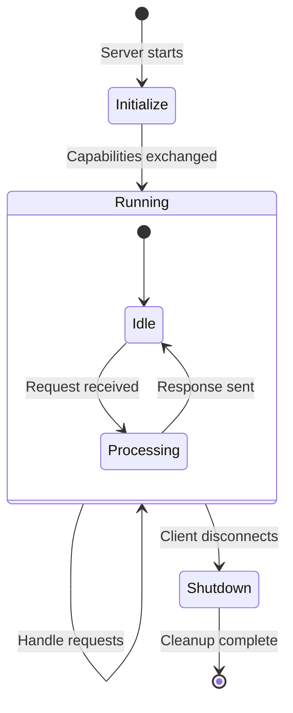
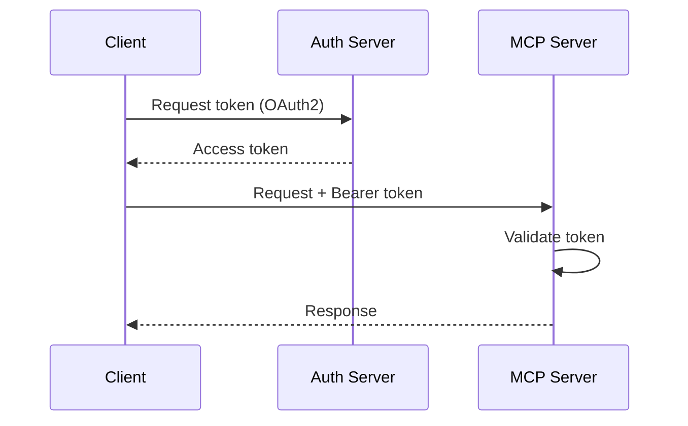

# Building MCP Servers

## Overview

Building an MCP server is like opening a restaurant: you decide what's on the menu (capabilities), set up the kitchen (implementation), and open the doors (transport). This guide walks through everything you need to know.

---

## MCP Server Lifecycle

Every MCP server goes through three phases:



### 1. Initialize
- Server starts and waits for client connection
- Client sends `initialize` with its capabilities
- Server responds with its capabilities
- Both sides know what the other supports

### 2. Running
- Server handles requests: `tools/list`, `tools/call`, `resources/read`, etc.
- Server can send notifications to client
- Multiple requests can be in flight (JSON-RPC)

### 3. Shutdown
- Client disconnects or sends shutdown signal
- Server cleans up resources (close DB connections, file handles)
- Server exits gracefully

---

## Python SDK: FastMCP (Recommended)

FastMCP is the high-level Python SDK that makes building MCP servers trivial. Think of it as **Flask for MCP** — minimal boilerplate, decorator-based, just works.

### Minimal Server

```python
from mcp.server.fastmcp import FastMCP

# Create server
mcp = FastMCP("my-server")

# Define a tool
@mcp.tool()
def add(a: int, b: int) -> int:
    """Add two numbers together."""
    return a + b

# Run the server
if __name__ == "__main__":
    mcp.run()
```

That's it. FastMCP handles:
- Schema generation from type hints
- JSON-RPC protocol
- Transport setup
- Error handling

---

## TypeScript SDK Overview

```typescript
import { McpServer } from "@modelcontextprotocol/sdk/server/mcp.js";
import { StdioServerTransport } from "@modelcontextprotocol/sdk/server/stdio.js";
import { z } from "zod";

const server = new McpServer({ name: "my-server", version: "1.0.0" });

server.tool("add", { a: z.number(), b: z.number() }, async ({ a, b }) => ({
  content: [{ type: "text", text: String(a + b) }]
}));

const transport = new StdioServerTransport();
await server.connect(transport);
```

---

## Server Structure Pattern

A well-organized MCP server follows this structure:

```
my-mcp-server/
├── main.py              # Entry point, server definition
├── tools/               # Tool implementations
│   ├── __init__.py
│   ├── file_tools.py
│   └── api_tools.py
├── resources/           # Resource handlers
│   └── __init__.py
├── prompts/             # Prompt templates
│   └── __init__.py
├── requirements.txt
├── .env.example
└── README.md
```

---

## Authentication in MCP

### For stdio Transport (Local)
No auth needed — the server runs as a subprocess of the trusted host.

### For HTTP/SSE Transport (Remote)
MCP supports OAuth 2.0:



### API Key Authentication

```python
from mcp.server.fastmcp import FastMCP
import os

mcp = FastMCP("secure-server")

def verify_api_key(key: str) -> bool:
    return key == os.getenv("MCP_API_KEY")

@mcp.tool()
def protected_action(api_key: str, data: str) -> str:
    """Perform a protected action."""
    if not verify_api_key(api_key):
        raise ValueError("Invalid API key")
    return f"Processed: {data}"
```

---

## Capabilities Declaration

When a server initializes, it declares what it supports:

```python
mcp = FastMCP(
    "my-server",
    capabilities={
        "tools": {},           # Server exposes tools
        "resources": {
            "subscribe": True  # Supports resource subscriptions
        },
        "prompts": {},         # Server exposes prompts
        "logging": {}          # Server can send log messages
    }
)
```

---

## Testing MCP Servers

### Using MCP Inspector
The official tool for testing MCP servers interactively:

```bash
npx @modelcontextprotocol/inspector python main.py
```

### Programmatic Testing

```python
import pytest
from mcp.server.fastmcp import FastMCP

mcp = FastMCP("test-server")

@mcp.tool()
def add(a: int, b: int) -> int:
    """Add two numbers."""
    return a + b

@pytest.mark.asyncio
async def test_add_tool():
    # Test tool directly
    result = add(2, 3)
    assert result == 5
```

---

## Error Handling Patterns

### Tool-Level Errors (Graceful)

```python
@mcp.tool()
def read_file(path: str) -> str:
    """Read a file's contents."""
    try:
        with open(path, 'r') as f:
            return f.read()
    except FileNotFoundError:
        raise ValueError(f"File not found: {path}")
    except PermissionError:
        raise ValueError(f"Permission denied: {path}")
```

FastMCP catches exceptions and returns them as error responses with `isError: true`.

### Validation Errors

```python
@mcp.tool()
def query_database(sql: str) -> str:
    """Run a read-only SQL query."""
    # Validate input
    if any(keyword in sql.upper() for keyword in ['DROP', 'DELETE', 'UPDATE', 'INSERT']):
        raise ValueError("Only SELECT queries are allowed")
    # Execute query...
```

---

## Logging and Debugging

### Server-Side Logging

```python
import logging

logging.basicConfig(level=logging.INFO)
logger = logging.getLogger(__name__)

@mcp.tool()
def process_data(input: str) -> str:
    """Process input data."""
    logger.info(f"Processing data: {input[:50]}...")
    result = do_processing(input)
    logger.info(f"Processing complete, result length: {len(result)}")
    return result
```

### MCP Protocol-Level Logging

```python
# Send log messages to the client
@mcp.tool()
async def complex_operation(data: str) -> str:
    """A complex operation with progress logging."""
    await mcp.server.request_context.session.send_log_message(
        level="info",
        data="Starting complex operation..."
    )
    # ... do work ...
    return result
```

---

## Production Considerations

### Rate Limiting

```python
from functools import wraps
import time

call_times = {}

def rate_limit(max_calls: int, period: int):
    def decorator(func):
        @wraps(func)
        def wrapper(*args, **kwargs):
            now = time.time()
            name = func.__name__
            times = call_times.get(name, [])
            times = [t for t in times if now - t < period]
            if len(times) >= max_calls:
                raise ValueError(f"Rate limit exceeded. Max {max_calls} calls per {period}s")
            times.append(now)
            call_times[name] = times
            return func(*args, **kwargs)
        return wrapper
    return decorator

@mcp.tool()
@rate_limit(max_calls=10, period=60)
def expensive_api_call(query: str) -> str:
    """Call an expensive external API."""
    ...
```

### Timeouts

```python
import asyncio

@mcp.tool()
async def fetch_data(url: str) -> str:
    """Fetch data from URL with timeout."""
    try:
        result = await asyncio.wait_for(
            do_fetch(url),
            timeout=30.0
        )
        return result
    except asyncio.TimeoutError:
        raise ValueError(f"Request timed out after 30s: {url}")
```

### Resource Cleanup

```python
# Use context managers or shutdown hooks
import atexit

db_connection = None

def cleanup():
    if db_connection:
        db_connection.close()

atexit.register(cleanup)
```

---

## Step-by-Step: Building Your First MCP Server

1. **Install the SDK:** `pip install mcp`
2. **Create `main.py`** with `FastMCP` instance
3. **Add tools** using `@mcp.tool()` decorator
4. **Add resources** using `@mcp.resource()` decorator
5. **Test** with MCP Inspector: `npx @modelcontextprotocol/inspector python main.py`
6. **Configure** in your AI app (Claude Desktop `claude_desktop_config.json`)

```json
{
  "mcpServers": {
    "my-server": {
      "command": "python",
      "args": ["/path/to/main.py"]
    }
  }
}
```

7. **Iterate** — add more tools, improve descriptions, handle edge cases
