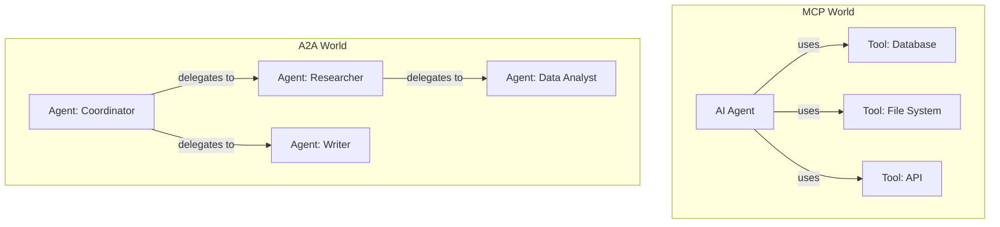
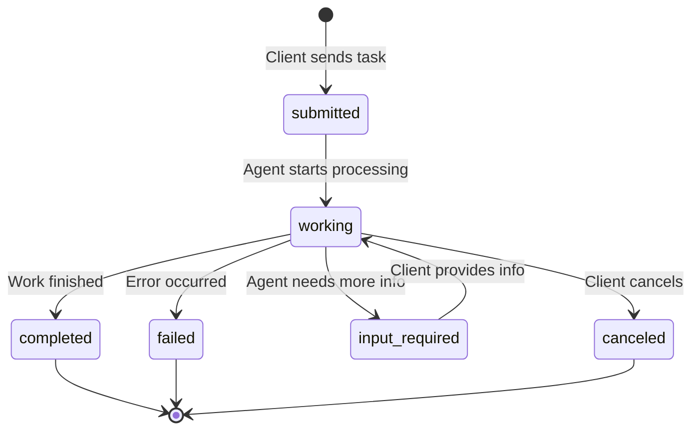
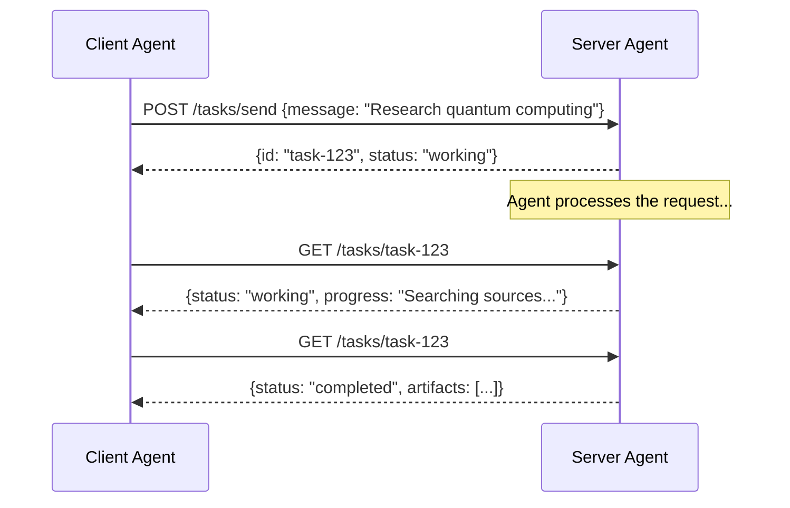
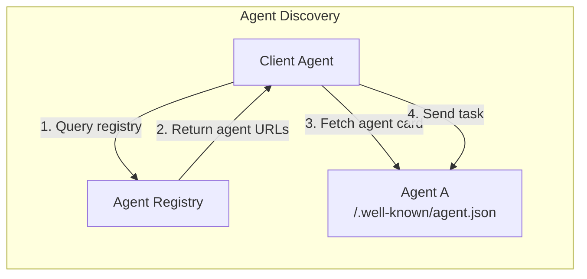
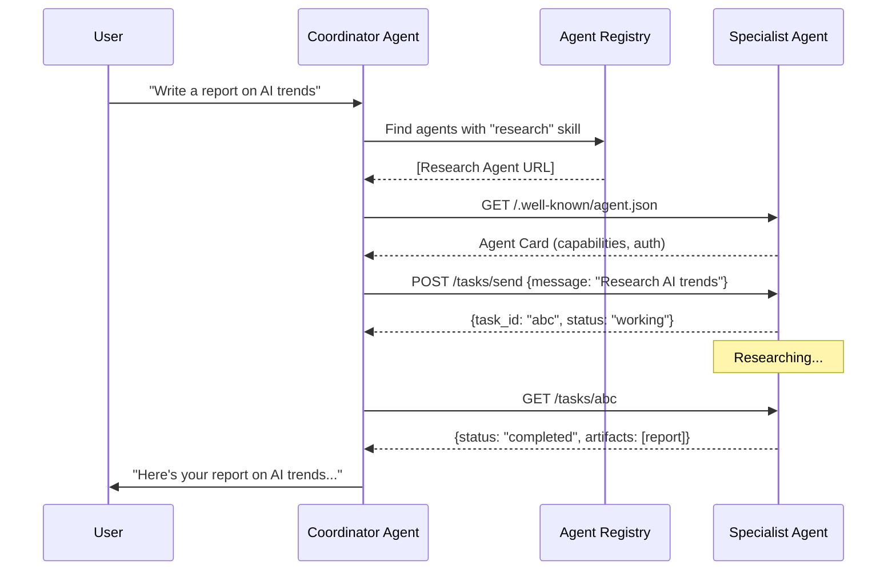

# What is Agent-to-Agent (A2A) Protocol?

## The Problem: Isolated AI Agents

Imagine a company with multiple AI agents:
- A **Research Agent** that searches databases and papers
- A **Writing Agent** that drafts documents
- A **Review Agent** that checks quality

Today, these agents are isolated islands. If you want the Research Agent to hand off findings to the Writing Agent, you write custom glue code. Every combination of agents needs custom integration. Sound familiar? It's the same M×N problem MCP solves for tools — but now for **agents talking to agents**.

## The "Business-to-Business API for AI Agents" Analogy

Think of A2A as the **standard business protocol between companies**.

When Company A needs a service from Company B:
1. Company A looks at Company B's **catalog** (Agent Card)
2. Company A sends a **purchase order** (Task)
3. Company B does the work, sending **status updates** (Task lifecycle)
4. Company B delivers the **finished product** (Artifact)

A2A standardizes this workflow for AI agents, regardless of who built them or what framework they use.

---

## MCP vs A2A: Different Problems, Complementary Solutions



| Aspect | MCP | A2A |
|--------|-----|-----|
| **Purpose** | AI ↔ Tools | Agent ↔ Agent |
| **Relationship** | Master-servant (AI controls tools) | Peer-to-peer (agents collaborate) |
| **Analogy** | Using a screwdriver | Hiring a contractor |
| **Who decides** | The AI decides what tools to use | Agents negotiate work |
| **State** | Stateless tool calls | Stateful task lifecycle |
| **Discovery** | Server declares capabilities | Agent Cards advertise skills |
| **Result** | Tool output | Task artifacts |

**Key insight:** MCP gives an agent *hands* (to use tools). A2A gives agents *colleagues* (to delegate work).

---

## A2A Core Concepts

### 1. Agent Card — The Agent's Business Card

Every A2A agent publishes an **Agent Card** — a JSON document describing who it is, what it can do, and how to reach it.

```json
{
  "name": "Research Agent",
  "description": "Finds and synthesizes information from multiple sources",
  "url": "https://research-agent.example.com",
  "capabilities": {
    "streaming": true,
    "pushNotifications": false
  },
  "skills": [
    {
      "id": "web-research",
      "name": "Web Research",
      "description": "Search and synthesize web content"
    }
  ],
  "authentication": {
    "schemes": ["bearer"]
  }
}
```

### 2. Task — The Unit of Work

A **Task** is a work request from one agent to another. It has a lifecycle:



### 3. Message & Part — Communication Format

Agents communicate through **Messages**, which contain **Parts**:

```json
{
  "role": "user",
  "parts": [
    {
      "type": "text",
      "text": "Research the latest trends in quantum computing"
    },
    {
      "type": "file",
      "file": {
        "mimeType": "application/pdf",
        "data": "base64-encoded-content"
      }
    }
  ]
}
```

Parts can be:
- **TextPart** — plain text
- **FilePart** — binary files (images, PDFs, etc.)
- **DataPart** — structured JSON data

### 4. Artifact — The Work Product

When an agent completes work, it produces **Artifacts** — the deliverables:

```json
{
  "name": "research-report",
  "parts": [
    {
      "type": "text",
      "text": "# Quantum Computing Trends 2025\n\n..."
    }
  ]
}
```

Artifacts are different from messages — they represent the **final output**, not the conversation.

---

## Task Lifecycle in Detail



### Task States Explained

| State | Meaning | What Happens Next |
|-------|---------|-------------------|
| `submitted` | Task received, queued | Agent picks it up |
| `working` | Agent is processing | Wait or poll for updates |
| `input-required` | Agent needs clarification | Client sends more info |
| `completed` | Work done successfully | Retrieve artifacts |
| `failed` | Something went wrong | Check error, maybe retry |
| `canceled` | Client or agent canceled | Cleanup |

---

## Agent Discovery: How Agents Find Each Other

A2A agents advertise themselves by hosting their Agent Card at a well-known URL:

```
https://agent.example.com/.well-known/agent.json
```

Discovery mechanisms:
1. **Direct URL** — you know where the agent is
2. **Registry** — a catalog of available agents (like a phone book)
3. **DNS-based** — agents advertise via DNS records



---

## Complete A2A Flow



---

## Key Takeaway

- **MCP** = how an agent uses tools (like a person using a hammer)
- **A2A** = how agents collaborate (like coworkers delegating tasks)
- Together, they form a complete ecosystem: agents use MCP to access tools, and A2A to work with other agents.
