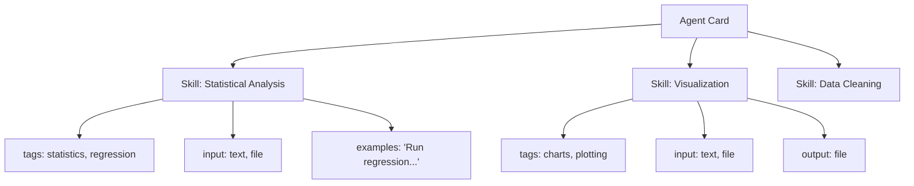
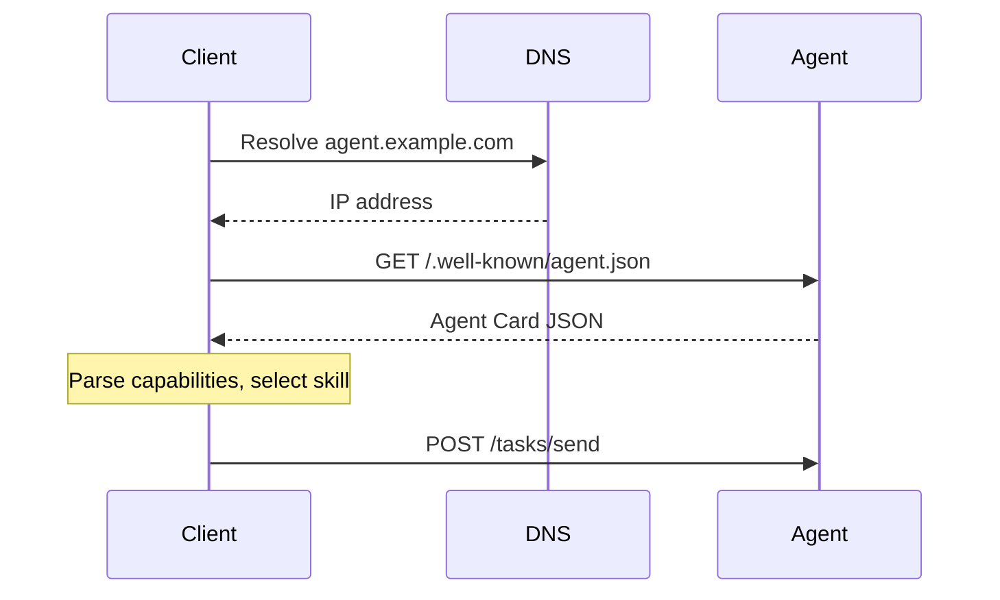
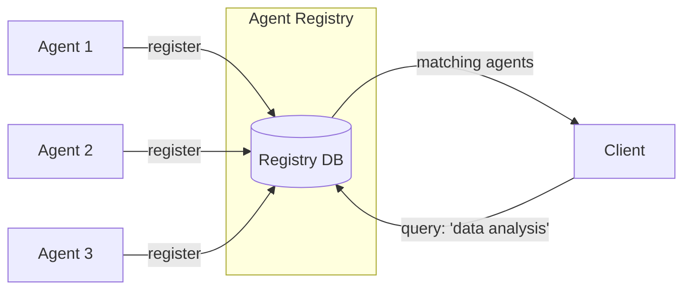
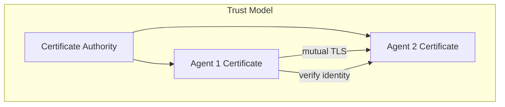

# A2A Agent Cards and Discovery

## What is an Agent Card?

An Agent Card is an agent's **public profile** — a machine-readable JSON document that tells other agents:
- Who am I?
- What can I do?
- How do you reach me?
- How do you authenticate?
- What formats do I accept/produce?

Think of it like a **LinkedIn profile for AI agents** — it advertises capabilities so others can decide whether to work with you.

---

## Agent Card Structure (Full Schema)

```json
{
  "name": "Data Analysis Agent",
  "description": "Analyzes datasets, generates insights, and creates visualizations",
  "url": "https://data-agent.example.com",
  "version": "1.2.0",
  "documentationUrl": "https://docs.example.com/data-agent",
  "provider": {
    "organization": "Acme Corp",
    "url": "https://acme.example.com"
  },
  "capabilities": {
    "streaming": true,
    "pushNotifications": true,
    "stateTransitionHistory": true
  },
  "authentication": {
    "schemes": ["bearer"],
    "credentials": "https://auth.example.com/oauth2/token"
  },
  "defaultInputModes": ["text", "file"],
  "defaultOutputModes": ["text", "file", "data"],
  "skills": [
    {
      "id": "statistical-analysis",
      "name": "Statistical Analysis",
      "description": "Perform statistical analysis on tabular data (CSV, Excel)",
      "tags": ["statistics", "data", "analysis"],
      "examples": [
        "Analyze the correlation between columns A and B",
        "Run a regression analysis on this dataset"
      ],
      "inputModes": ["text", "file"],
      "outputModes": ["text", "file"]
    },
    {
      "id": "visualization",
      "name": "Data Visualization",
      "description": "Create charts and graphs from data",
      "tags": ["charts", "visualization", "plotting"],
      "examples": [
        "Create a bar chart of sales by region",
        "Plot the trend over time"
      ],
      "inputModes": ["text", "file"],
      "outputModes": ["file"]
    }
  ]
}
```

---

## Field-by-Field Breakdown

### Identity Fields

| Field | Purpose | Example |
|-------|---------|---------|
| `name` | Human-readable name | "Data Analysis Agent" |
| `description` | What the agent does | "Analyzes datasets..." |
| `url` | Base URL for A2A endpoints | "https://agent.example.com" |
| `version` | Agent card version | "1.2.0" |
| `provider` | Who operates this agent | Organization info |

### Capabilities

```json
"capabilities": {
  "streaming": true,           // Can stream partial results
  "pushNotifications": true,   // Can push updates (vs polling)
  "stateTransitionHistory": true  // Tracks full task state history
}
```

- **streaming** — Agent can send results incrementally (useful for long tasks)
- **pushNotifications** — Agent can notify client when task state changes (no polling needed)
- **stateTransitionHistory** — Full audit trail of task state changes

### Skills — What the Agent Can Do

Skills are the most important part of an Agent Card. They tell clients **specifically** what tasks this agent handles.



**Design tip:** Write skill descriptions and examples as if explaining to a colleague. Other AI agents use these to decide whether to delegate work to you.

### Authentication

```json
"authentication": {
  "schemes": ["bearer", "apiKey"],
  "credentials": "https://auth.example.com/oauth2/token"
}
```

Supported schemes:
- `bearer` — OAuth2 bearer tokens
- `apiKey` — Simple API key in header
- `basic` — HTTP Basic Auth
- `oauth2` — Full OAuth2 flow with token endpoint

### Input/Output Modes

```json
"defaultInputModes": ["text", "file", "data"],
"defaultOutputModes": ["text", "file", "data"]
```

| Mode | Description | Example |
|------|-------------|---------|
| `text` | Plain text messages | "Analyze this data..." |
| `file` | Binary files | CSV uploads, PDF output |
| `data` | Structured JSON | `{"columns": [...], "rows": [...]}` |

---

## Agent Card Hosting

Agent Cards are hosted at the well-known URL:

```
https://<agent-domain>/.well-known/agent.json
```

This follows the [RFC 8615](https://tools.ietf.org/html/rfc8615) convention (same pattern as `/.well-known/openid-configuration`).



---

## Agent Discovery Mechanisms

### 1. Direct URL (Simplest)
You already know the agent's URL. Just fetch its Agent Card.

### 2. Agent Registry (Enterprise)
A central catalog where agents register themselves:



### 3. Skill-Based Discovery
Client queries registry by skill tags:

```
GET /agents?skill=statistical-analysis&input=file
```

Returns all agents that have a matching skill and accept file input.

---

## Skill-Based Routing: Picking the Right Agent

When a coordinator agent needs to delegate work, it:

1. **Identifies the task type** — What skill is needed?
2. **Queries available agents** — Who has that skill?
3. **Evaluates fit** — Match input/output modes, check examples
4. **Selects the best agent** — Based on description match, capability support
5. **Sends the task** — With appropriate input format

```python
# Pseudo-code for skill-based routing
def find_best_agent(task_description: str, required_skill: str):
    agents = registry.search(skill_tags=[required_skill])
    
    # Score each agent by relevance
    scored = []
    for agent in agents:
        skill = agent.get_skill(required_skill)
        score = similarity(task_description, skill.description)
        scored.append((agent, score))
    
    return max(scored, key=lambda x: x[1])[0]
```

---

## Trust and Authentication Between Agents

### Trust Chain



### Authentication Patterns

1. **Bearer Tokens** — Agent gets a token from an auth server, includes it in requests
2. **Mutual TLS** — Both agents present certificates, verify each other
3. **API Keys** — Simple shared secret (for internal/trusted networks)
4. **OAuth2 Client Credentials** — Machine-to-machine auth flow

---

## Version Management

Agent Cards should be versioned so clients can handle changes:

```json
{
  "name": "Research Agent",
  "version": "2.0.0",
  "minimumSupportedVersion": "1.5.0"
}
```

**Versioning strategy:**
- **Patch** (1.0.x): Bug fixes, no API changes
- **Minor** (1.x.0): New skills added, backward compatible
- **Major** (x.0.0): Breaking changes (removed skills, changed formats)

---

## Real Example Agent Cards

### Code Review Agent
```json
{
  "name": "Code Review Agent",
  "description": "Reviews code for bugs, security issues, and style violations",
  "url": "https://code-review.internal.company.com",
  "skills": [
    {"id": "security-review", "name": "Security Review", "tags": ["security", "vulnerabilities"]},
    {"id": "style-check", "name": "Style Check", "tags": ["linting", "formatting"]},
    {"id": "bug-detection", "name": "Bug Detection", "tags": ["bugs", "logic-errors"]}
  ],
  "defaultInputModes": ["text", "file"],
  "defaultOutputModes": ["text", "data"]
}
```

### Translation Agent
```json
{
  "name": "Translation Agent",
  "description": "Translates text between 50+ languages with context awareness",
  "url": "https://translate.ai-services.com",
  "skills": [
    {"id": "translate", "name": "Text Translation", "tags": ["translation", "language"]},
    {"id": "localize", "name": "Content Localization", "tags": ["localization", "cultural-adaptation"]}
  ],
  "defaultInputModes": ["text", "file"],
  "defaultOutputModes": ["text", "file"]
}
```

---

## Key Takeaways

1. Agent Cards are **self-describing** — no external documentation needed
2. **Skills** are the primary matching criteria for discovery
3. Host at `/.well-known/agent.json` for standard discovery
4. Include **examples** in skills — they help other agents understand when to use you
5. Version your Agent Cards to manage backward compatibility

---

## Staff-Level Considerations

### Anti-Patterns

**1. Stale Agent Cards**
An Agent Card that advertises skills the agent no longer supports, or omits new capabilities, causes task routing failures and wasted cycles. Treat Agent Cards as code — they should be generated from the agent's actual registered handlers and deployed atomically with the agent.

**2. Overpromising Capabilities**
An agent card claiming "I can analyze any data format" when the agent only handles CSV will fail on Excel, Parquet, or JSON inputs. Other agents route based on your claims — overpromising leads to cascading failures and eroded trust. Be precise about what you actually support.

**3. No Version in Agent Card**
Without versioning, clients can't detect breaking changes. If you remove a skill or change input format, existing clients break silently. Always include `version` and ideally `minimumSupportedVersion` so clients can gracefully handle incompatibility.

**4. No Skill Boundaries**
An agent card with a single skill "do everything" gives clients no way to assess fit. Skills should be granular enough for meaningful routing but not so granular that they fragment simple capabilities. One skill per distinct task type is the right granularity.

### Trade-offs

| Decision | Static Discovery | Dynamic Discovery |
|----------|-----------------|-------------------|
| **Reliability** | Always available | Depends on registry uptime |
| **Freshness** | May be stale | Always current |
| **Latency** | Direct fetch | Registry lookup + fetch |
| **Use case** | Known partners | Open ecosystems |
| **Failure mode** | Stale card used | Discovery fails entirely |

| Decision | Centralized Registry | Distributed (Well-Known URLs) |
|----------|---------------------|-------------------------------|
| **Control** | Single authority | Each agent self-publishes |
| **Discovery** | Query one place | Must know agent URLs |
| **Governance** | Easy to enforce standards | Hard to enforce consistency |
| **Scalability** | Registry is bottleneck | Scales with agents |
| **When to choose** | Enterprise, controlled environment | Open ecosystem, multi-org |

### Design Guidance for Staff Engineers

1. **Agent Cards are contracts** — treat changes with the same rigor as API versioning
2. **Skills should have non-overlapping descriptions** — ambiguity causes mis-routing
3. **Examples are not optional** — they're the primary signal for semantic matching
4. **Tags enable filtering, descriptions enable selection** — both are needed
5. **Authentication section must be accurate** — wrong auth info = hard-to-debug 401s
6. **Test your agent card** — write integration tests that fetch and validate it
7. **Monitor discovery** — track how often your agent is discovered vs actually used (conversion rate indicates card quality)
