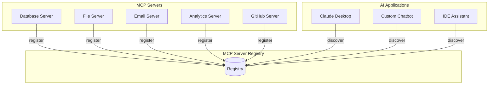
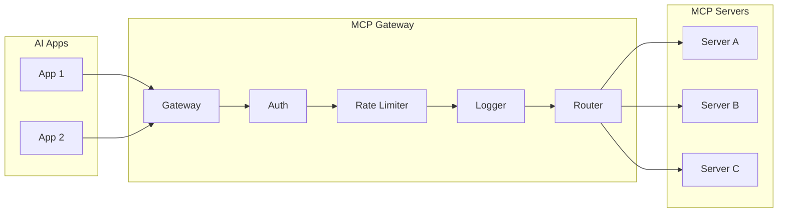
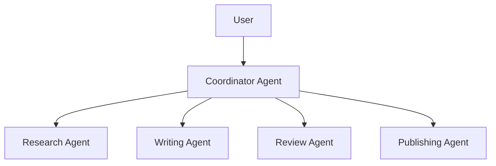
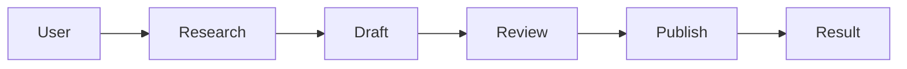
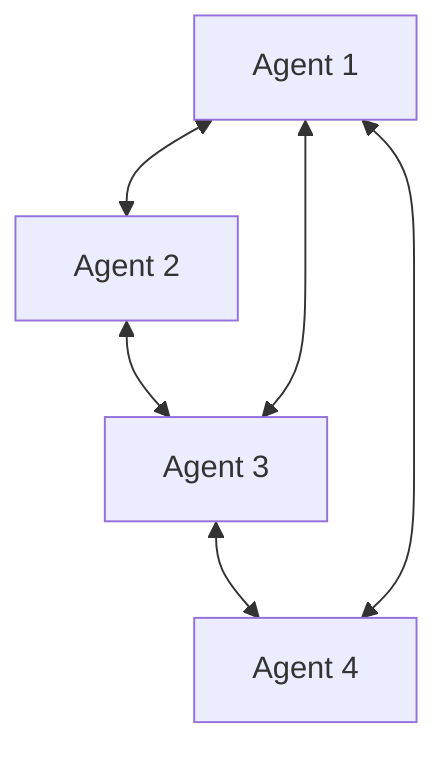
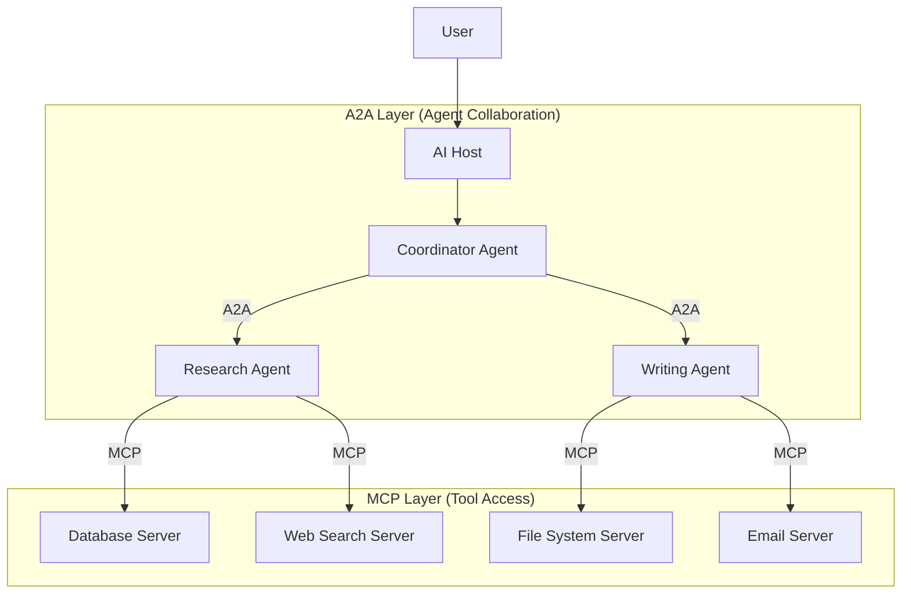
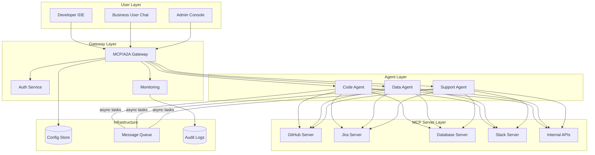

# Designing MCP & A2A Ecosystems

## From Single Server to Enterprise Ecosystem

A single MCP server is simple. But in an enterprise, you might have:
- 50 MCP servers exposing different tools
- 10 A2A agents handling different domains
- Hundreds of users with different access levels
- Compliance requirements for audit and governance

This chapter covers how to design, deploy, and govern these ecosystems at scale.

---

## Enterprise MCP Ecosystem Design

### The MCP Server Registry

Just as a company has a service catalog, your MCP ecosystem needs a **server registry** — a central place that knows which servers exist, what they do, and who can use them.



Registry stores for each server:
- Name, description, version
- Available tools, resources, prompts
- Access control (who can connect)
- Health status
- Usage metrics

### The MCP Gateway Pattern

A **gateway** sits between AI applications and MCP servers, providing centralized control:



**Gateway responsibilities:**
- **Authentication** — Verify client identity before routing
- **Authorization** — Check permissions for specific tools
- **Rate limiting** — Prevent abuse across all servers
- **Logging** — Centralized audit trail
- **Routing** — Direct requests to correct server
- **Caching** — Cache resource reads when appropriate

---

## A2A Orchestration Patterns

### Pattern 1: Hub and Spoke (Coordinator)

One coordinator agent manages all delegation:



**Pros:** Simple control flow, easy to monitor
**Cons:** Single point of failure, bottleneck

### Pattern 2: Pipeline (Sequential)

Agents pass work along a chain:



**Pros:** Clear workflow, each agent has one responsibility
**Cons:** Slow (sequential), failure blocks the chain

### Pattern 3: Mesh (Peer-to-Peer)

Agents communicate directly as needed:



**Pros:** Flexible, resilient, no bottleneck
**Cons:** Complex to monitor, harder to debug

---

## Combining MCP and A2A

The real power comes from combining both protocols:



**Design principle:** 
- Use **A2A** for high-level task delegation between autonomous agents
- Use **MCP** for low-level tool access within each agent

---

## Enterprise Deployment Topology



---

## Monitoring and Observability

### What to Monitor

| Metric | Why | Alert Threshold |
|--------|-----|-----------------|
| Tool call latency | Performance degradation | p99 > 5s |
| Tool error rate | Server health | > 5% errors |
| Task completion time (A2A) | Agent performance | > 60s average |
| Authentication failures | Security incidents | > 10/min |
| Resource utilization | Capacity planning | > 80% |
| Token usage per request | Cost control | > budget threshold |

### Distributed Tracing

Every request should carry a trace ID through the entire chain:

```
User Request → Host → MCP Client → MCP Server → Tool
     └── trace_id: "abc-123" (propagated through all layers)
```

---

## Governance

### Who Can Deploy Servers?

```
┌─────────────────────────────────────────┐
│ Governance Tiers                         │
├──────────┬──────────────────────────────┤
│ Tier 1   │ Official servers (IT managed)│
│ Tier 2   │ Team servers (team approved) │
│ Tier 3   │ Personal servers (sandboxed) │
└──────────┴──────────────────────────────┘
```

- **Tier 1:** Full audit, security review, SLA guarantees
- **Tier 2:** Team-level approval, limited access scope
- **Tier 3:** User's own machine only, no access to shared resources

### Who Can Connect?

Role-based access control (RBAC) for MCP/A2A:

```json
{
  "role": "developer",
  "allowed_servers": ["github", "jira", "filesystem"],
  "denied_tools": ["delete_production_data", "send_email_as_ceo"],
  "rate_limit": 100
}
```

---

## Versioning and Backward Compatibility

### Server Versioning Strategy

```
v1.0.0 → v1.1.0 (new tool added - backward compatible)
v1.1.0 → v2.0.0 (tool removed - breaking change)
```

**Rules:**
1. Never remove a tool without a major version bump
2. Never change a tool's input schema without versioning
3. Deprecate tools for at least one version before removal
4. Maintain old versions alongside new ones during migration

### Client Compatibility

```python
# Server advertises version
capabilities = {
    "version": "2.0.0",
    "minClientVersion": "1.5.0"
}

# Client checks compatibility
if server_version < min_supported:
    raise IncompatibleServerError(f"Server too old: {server_version}")
```

---

## Architecture Decision Record Template

When designing your MCP/A2A ecosystem, document decisions:

```markdown
## ADR: MCP Gateway vs Direct Connection

**Status:** Accepted
**Context:** We have 20+ MCP servers and need centralized auth/logging
**Decision:** Implement gateway for all remote servers, allow direct stdio for local
**Consequences:** 
- Added latency (~50ms) for remote calls
- Centralized security and audit
- Single point of failure (mitigate with HA deployment)
```

---

## Key Takeaways

1. **Start small** — One server, one agent, prove value, then expand
2. **Gateway early** — Centralized control prevents chaos at scale
3. **Registry is essential** — You can't govern what you can't see
4. **Combine MCP + A2A** — Tools for doing, agents for thinking
5. **Monitor everything** — Trace requests end-to-end
6. **Govern access** — Not every user needs every tool
7. **Version carefully** — Breaking changes break trust

---

## Staff-Level Considerations

### Anti-Patterns

**1. Building Ecosystem Before Proving Single Agent Works**
Teams that jump to designing registries, gateways, and multi-agent orchestration before having one working MCP server with one useful tool waste months on infrastructure. Prove value with a single server → single host integration. Then scale.

**2. No Governance for Who Can Publish Servers**
Without a publishing policy, you get shadow MCP servers — unreviewed, unmonitored, potentially insecure tools that anyone can register. This is the same problem as ungoverned microservices but worse because AI agents will discover and use them autonomously.

**3. Version Hell Across Ecosystem**
When 50 MCP servers evolve independently with no coordination, clients face a combinatorial explosion of version compatibility. Server A v2 works with Server B v1 but not v3. Without ecosystem-wide version policies and compatibility matrices, upgrades become impossible.

### Staff Decision: When to Adopt MCP/A2A vs Internal Protocols

**Adopt MCP when:**
- You're building tools that multiple AI applications will consume
- You want to leverage the growing ecosystem of pre-built servers
- Your organization uses multiple AI hosts (Claude, Copilot, custom)
- You want portability — avoid vendor lock-in to one AI platform

**Adopt A2A when:**
- You have genuinely autonomous agents that need to discover and delegate to each other
- Cross-organizational agent collaboration is a requirement
- You need standardized task lifecycle across heterogeneous agent frameworks
- Agent substitutability matters (swap providers without client changes)

**Keep internal protocols when:**
- All components are in one deployment/monorepo and won't be exposed externally
- Performance requirements preclude protocol overhead (sub-10ms calls)
- The "agents" are really just microservices with deterministic logic
- You're iterating rapidly and the protocol would slow you down
- Team size is small enough that informal contracts work

### How the Ecosystem is Evolving

**Anthropic** — Created MCP, ships first-party servers for filesystem, GitHub, Slack, etc. Claude Desktop is the reference MCP host. Driving spec evolution toward Streamable HTTP (replacing SSE), OAuth2 integration, and elicitation (agents asking users for input mid-tool-call).

**Microsoft** — Embraced MCP in GitHub Copilot, VS Code, and Azure AI Foundry. Contributing to the spec. Building enterprise gateway patterns. Investing in MCP + A2A interop scenarios where Copilot agents delegate via A2A.

**Community** — Hundreds of community MCP servers on GitHub. Quality varies wildly — some are production-grade, many are proof-of-concepts. The "awesome-mcp-servers" lists are useful but unvetted. Always audit before deploying.

**Google** — Originated A2A protocol. Integrating with Vertex AI agents. Focused on enterprise multi-agent orchestration scenarios and standardized discovery.

### Ecosystem Maturity Assessment

| Signal | Early (Now) | Mature (Future) |
|--------|-------------|-----------------|
| Server quality | Variable, many PoCs | Certified, SLA-backed |
| Discovery | Manual, lists | Automated registries |
| Security | Per-server, ad-hoc | Ecosystem-wide policies |
| Versioning | Breaking changes common | Semantic versioning enforced |
| Monitoring | DIY | Standard observability |
| Governance | None | Tiered publishing, review |

### Architecture Recommendation

For most organizations today: start with MCP for tool access (it's mature enough), be cautious with A2A (the spec is still evolving), and design your internal architecture so you can *adopt* A2A later without rewriting. This means: give your agents identities, define their capabilities formally, implement task lifecycle even if internal — so when A2A stabilizes, you wrap rather than rewrite.
