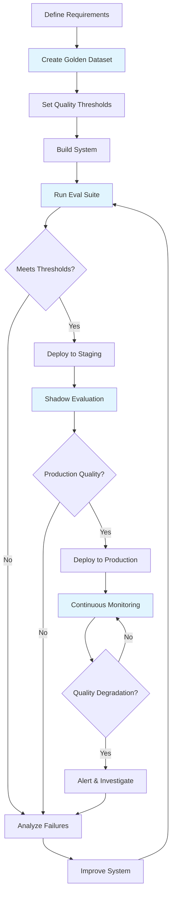

# Why Evaluation Matters for AI Systems

## The Fundamental Question

> "Would you deploy code without running tests?"

Every software engineer would say no. Yet teams ship AI systems without proper evaluation every day. The result? Hallucinating chatbots, biased recommendations, and costly production failures.

AI evaluation is your test suite — but for systems that give different answers each time you ask.

## The Unique Challenge: Non-Deterministic Outputs

Traditional software is deterministic: `add(2, 3)` always returns `5`. AI systems are fundamentally different:

| Ask the same question twice | You might get |
|---|---|
| "Summarize this article" | Different wording, different emphasis |
| "Write a SQL query for X" | Different but equivalent queries |
| "What caused WWI?" | Different details highlighted |

This non-determinism means you can't just assert `output == expected`. You need **quality metrics** — continuous measurements that tell you "is this good enough?"

## Traditional Testing vs AI Evaluation

| Dimension | Traditional Testing | AI Evaluation |
|---|---|---|
| Output | Deterministic | Non-deterministic |
| Pass/Fail | Binary (exact match) | Continuous (0.0 - 1.0 scores) |
| Ground Truth | Single correct answer | Multiple valid answers |
| Evaluation Method | Assertion | LLM-as-judge, human rating |
| When to Run | On code change | On code change + data change + prompt change + model change |
| Test Count | Hundreds | Golden dataset (50-500 examples) |
| Cost | Free (CPU) | Expensive (API calls, human time) |
| Speed | Milliseconds | Seconds to minutes |

## The Evaluation Pyramid

Think of it like the traditional test pyramid, but adapted for AI:

```
        /\
       /  \        Human Evals (expensive, gold standard)
      /    \       - Expert review of outputs
     /------\      - User satisfaction surveys
    /        \
   / System   \    System Evals (end-to-end)
  /  Evals     \   - Full pipeline quality
 /--------------\  - Multi-turn conversations
/                \
/ Integration     \ Integration Evals
/   Evals          \ - RAG retrieval + generation together
/------------------\ - Agent tool use + reasoning
/                    \
/    Unit Evals       \ Unit Evals (cheap, fast, many)
/                      \ - Single prompt quality
/------------------------\ - Retrieval relevance
                           - Individual tool accuracy
```

**Unit Evals** — Fast, cheap, run on every commit:
- Does this prompt produce the right format?
- Does retrieval return relevant documents?
- Does the classifier get the right label?

**Integration Evals** — Medium cost, run on PR:
- Does retrieval + generation produce faithful answers?
- Does the agent use the right tools in sequence?

**System Evals** — Expensive, run before deploy:
- Full end-to-end conversation quality
- Multi-turn coherence
- Edge case handling

**Human Evals** — Most expensive, periodic:
- Expert domain review
- User satisfaction measurement
- Safety and bias audits

## What Goes Wrong Without Evaluation

### Hallucinations Ship to Production
Without faithfulness evaluation, your RAG system might:
- Invent facts not in the retrieved documents
- Confidently state incorrect information
- Mix up details between different sources

### Regressions Go Unnoticed
Without regression testing:
- A prompt change improves one category but breaks another
- A model upgrade changes behavior in unexpected ways
- A retrieval index update surfaces wrong documents

### Slow Degradation
Without monitoring:
- Quality drops 1% per week as data drifts
- Nobody notices until users complain months later
- By then, trust is destroyed

## The Cost of NOT Evaluating

| Incident | What Happened | Cost |
|---|---|---|
| Air Canada chatbot | Hallucinated refund policy, court enforced it | Legal precedent + refund |
| Lawyer using ChatGPT | Cited non-existent cases in court filing | Sanctions, career damage |
| Healthcare chatbot | Gave dangerous medical advice | Pulled from production, PR crisis |
| Bing Chat launch | Hostile responses, misinformation | Reputation damage |

The pattern: ship fast → incident → expensive fix → rebuild trust. Evaluation upfront is 100x cheaper.

## Evaluation-Driven Development

Just like Test-Driven Development (TDD), the best AI teams practice **Eval-Driven Development (EDD)**:

1. **Define your eval suite first** — What does "good" look like?
2. **Build a golden dataset** — Curated examples with expected behavior
3. **Set quality thresholds** — Faithfulness > 0.9, relevance > 0.85
4. **Implement** — Build the system
5. **Measure** — Run evals, see where you stand
6. **Iterate** — Improve until thresholds are met
7. **Gate deployments** — Block deploys that drop quality

```
┌─────────────────────────────────────────────────┐
│          Eval-Driven Development Loop            │
│                                                  │
│  Define Evals → Build Golden Dataset → Set Gates │
│       ↑                                    │     │
│       │                                    ↓     │
│  Iterate ← Measure ← Implement                  │
└─────────────────────────────────────────────────┘
```

## The AI Development Lifecycle with Evaluation



## Key Takeaways

1. **AI without evaluation is like code without tests** — you're guessing it works
2. **Non-determinism requires quality metrics**, not pass/fail assertions
3. **The eval pyramid** guides where to invest: many cheap unit evals, fewer expensive human evals
4. **Eval-Driven Development** means defining "good" before building
5. **The cost of not evaluating** is always higher than the cost of evaluating
6. **Evaluation is continuous** — not a one-time gate, but ongoing monitoring

---

*Next: [02-rag-evaluation.md](./02-rag-evaluation.md) — How to evaluate RAG systems specifically*
