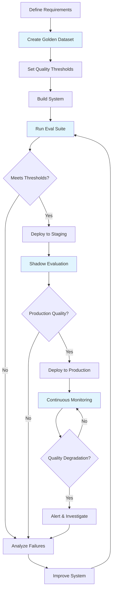

# Why Evaluation Matters for AI Systems

## The Fundamental Question

> "Would you deploy code without running tests?"

Every software engineer would say no. Yet teams ship AI systems without proper evaluation every day. The result? Hallucinating chatbots, biased recommendations, and costly production failures.

AI evaluation is your test suite — but for systems that give different answers each time you ask.

## The Unique Challenge: Non-Deterministic Outputs

Traditional software is deterministic: `add(2, 3)` always returns `5`. AI systems are fundamentally different:

| Ask the same question twice | You might get |
|---|---|
| "Summarize this article" | Different wording, different emphasis |
| "Write a SQL query for X" | Different but equivalent queries |
| "What caused WWI?" | Different details highlighted |

This non-determinism means you can't just assert `output == expected`. You need **quality metrics** — continuous measurements that tell you "is this good enough?"

## Traditional Testing vs AI Evaluation

| Dimension | Traditional Testing | AI Evaluation |
|---|---|---|
| Output | Deterministic | Non-deterministic |
| Pass/Fail | Binary (exact match) | Continuous (0.0 - 1.0 scores) |
| Ground Truth | Single correct answer | Multiple valid answers |
| Evaluation Method | Assertion | LLM-as-judge, human rating |
| When to Run | On code change | On code change + data change + prompt change + model change |
| Test Count | Hundreds | Golden dataset (50-500 examples) |
| Cost | Free (CPU) | Expensive (API calls, human time) |
| Speed | Milliseconds | Seconds to minutes |

## The Evaluation Pyramid

Think of it like the traditional test pyramid, but adapted for AI:

```
        /\
       /  \        Human Evals (expensive, gold standard)
      /    \       - Expert review of outputs
     /------\      - User satisfaction surveys
    /        \
   / System   \    System Evals (end-to-end)
  /  Evals     \   - Full pipeline quality
 /--------------\  - Multi-turn conversations
/                \
/ Integration     \ Integration Evals
/   Evals          \ - RAG retrieval + generation together
/------------------\ - Agent tool use + reasoning
/                    \
/    Unit Evals       \ Unit Evals (cheap, fast, many)
/                      \ - Single prompt quality
/------------------------\ - Retrieval relevance
                           - Individual tool accuracy
```

**Unit Evals** — Fast, cheap, run on every commit:
- Does this prompt produce the right format?
- Does retrieval return relevant documents?
- Does the classifier get the right label?

**Integration Evals** — Medium cost, run on PR:
- Does retrieval + generation produce faithful answers?
- Does the agent use the right tools in sequence?

**System Evals** — Expensive, run before deploy:
- Full end-to-end conversation quality
- Multi-turn coherence
- Edge case handling

**Human Evals** — Most expensive, periodic:
- Expert domain review
- User satisfaction measurement
- Safety and bias audits

## What Goes Wrong Without Evaluation

### Hallucinations Ship to Production
Without faithfulness evaluation, your RAG system might:
- Invent facts not in the retrieved documents
- Confidently state incorrect information
- Mix up details between different sources

### Regressions Go Unnoticed
Without regression testing:
- A prompt change improves one category but breaks another
- A model upgrade changes behavior in unexpected ways
- A retrieval index update surfaces wrong documents

### Slow Degradation
Without monitoring:
- Quality drops 1% per week as data drifts
- Nobody notices until users complain months later
- By then, trust is destroyed

## The Cost of NOT Evaluating

| Incident | What Happened | Cost |
|---|---|---|
| Air Canada chatbot | Hallucinated refund policy, court enforced it | Legal precedent + refund |
| Lawyer using ChatGPT | Cited non-existent cases in court filing | Sanctions, career damage |
| Healthcare chatbot | Gave dangerous medical advice | Pulled from production, PR crisis |
| Bing Chat launch | Hostile responses, misinformation | Reputation damage |

The pattern: ship fast → incident → expensive fix → rebuild trust. Evaluation upfront is 100x cheaper.

## Evaluation-Driven Development

Just like Test-Driven Development (TDD), the best AI teams practice **Eval-Driven Development (EDD)**:

1. **Define your eval suite first** — What does "good" look like?
2. **Build a golden dataset** — Curated examples with expected behavior
3. **Set quality thresholds** — Faithfulness > 0.9, relevance > 0.85
4. **Implement** — Build the system
5. **Measure** — Run evals, see where you stand
6. **Iterate** — Improve until thresholds are met
7. **Gate deployments** — Block deploys that drop quality

```
┌─────────────────────────────────────────────────┐
│          Eval-Driven Development Loop            │
│                                                  │
│  Define Evals → Build Golden Dataset → Set Gates │
│       ↑                                    │     │
│       │                                    ↓     │
│  Iterate ← Measure ← Implement                  │
└─────────────────────────────────────────────────┘
```

## The AI Development Lifecycle with Evaluation



## Key Takeaways

1. **AI without evaluation is like code without tests** — you're guessing it works
2. **Non-determinism requires quality metrics**, not pass/fail assertions
3. **The eval pyramid** guides where to invest: many cheap unit evals, fewer expensive human evals
4. **Eval-Driven Development** means defining "good" before building
5. **The cost of not evaluating** is always higher than the cost of evaluating
6. **Evaluation is continuous** — not a one-time gate, but ongoing monitoring

---

## Staff-Level: Anti-Patterns, Trade-offs & War Stories

### Anti-Patterns That Destroy AI Products

#### 1. "It Looks Good" Syndrome
The most dangerous words in AI development: "I tried a few queries and it looks good." This is the equivalent of testing a web app by loading the homepage once. Teams that ship on vibes:
- Have no baseline to detect regressions
- Cannot answer "did this prompt change make things better or worse?"
- Discover failures from angry users, not dashboards

#### 2. Manual Testing Only
A PM or engineer manually tries 10-20 queries before shipping. Problems:
- Selection bias — you test what you think works, not what actually fails
- No coverage of edge cases, adversarial inputs, or distribution tails
- Cannot be repeated consistently across changes
- "Works on my machine" but fails on production query distribution

#### 3. Evaluating Once, Not Continuously
Running evals before launch then never again. The world changes:
- Knowledge bases update, breaking retrieval
- User query patterns drift
- Model provider silently updates weights (looking at you, OpenAI)
- Seasonal patterns shift what "correct" means

#### 4. Using Accuracy for Generative Tasks
Treating LLM outputs like classification — "is the answer exactly right?" This fails because:
- Multiple valid phrasings exist for any answer
- Partial credit matters (80% correct answer has value)
- Binary metrics hide quality distribution (are failures catastrophic or minor?)

### Trade-offs Senior Engineers Navigate

| Trade-off | Conservative Choice | Aggressive Choice | Guidance |
|---|---|---|---|
| Eval cost vs confidence | 1000 samples, high confidence | 20 samples, fast iteration | Start with 50-100, scale up for launches |
| Speed of iteration vs rigor | Full eval on every commit (slow CI) | Eval only on release candidates | Tiered: fast evals in PR, thorough before deploy |
| Human eval vs automated | Expensive but gold standard | Cheap but misses nuance | Automate 90%, human-calibrate monthly |
| Domain-specific vs generic evals | Custom but expensive to build | Generic but misses domain failures | Build domain-specific for top 3 failure modes |
| Eval coverage vs maintenance burden | 500 test cases (hard to maintain) | 50 test cases (gaps) | 100-200, refresh quarterly |

### War Stories: The Price of Skipping Eval

**The Healthcare Chatbot (2023)**: A startup shipped a medical Q&A bot with "it seems to work well" validation. Within 2 weeks, users discovered it confidently recommended drug interactions that were contraindicated. Cost: full product shutdown, FDA scrutiny, $2M+ in legal fees, and the product never relaunched.

**The Legal Document Generator (2024)**: A law firm's AI tool for drafting contracts passed demos perfectly. Nobody evaluated it on edge cases — unusual jurisdiction combinations, non-standard clauses. It silently generated unenforceable contract language for 3 months. Discovery cost: 6-figure settlements.

**The E-commerce Recommendation Flip (2023)**: A retailer updated their embedding model without running regression evals. The new model had better average quality but catastrophically failed on their highest-revenue product category. Revenue dropped 12% for a week before anyone traced it to the model change. A 30-minute eval run would have caught it.

### The Evaluation Maturity Model

| Level | Practice | Typical Org |
|---|---|---|
| 0 — Ad Hoc | "I tried it and it seems fine" | Early startups |
| 1 — Basic | Golden dataset exists, run manually before launch | Seed-stage with technical founders |
| 2 — Automated | Evals in CI, blocking gates | Series A+ with AI platform team |
| 3 — Continuous | Production monitoring, drift detection, auto-rollback | Mature AI companies |
| 4 — Predictive | Eval results predict user satisfaction, business metrics | Industry leaders |

Most teams are at Level 0-1. Getting to Level 2 is the single highest-ROI investment in AI quality.

---

## Eval Infrastructure Architecture

```
┌─────────────────────────────────────────────────────────────────┐
│                    Eval Orchestration Layer                       │
│  ┌──────────┐  ┌──────────────┐  ┌────────────────────────┐    │
│  │ Scheduler │  │ CI/CD Hooks  │  │ Production Trigger Svc │    │
│  └─────┬────┘  └──────┬───────┘  └───────────┬────────────┘    │
│        └───────────────┴──────────────────────┘                  │
│                          │                                        │
│              ┌───────────▼───────────┐                           │
│              │    Eval Runner Pool    │  (parallel, sandboxed)    │
│              └───────────┬───────────┘                           │
│                          │                                        │
│  ┌───────────┬───────────┼───────────┬──────────────┐           │
│  ▼           ▼           ▼           ▼              ▼           │
│ Golden     LLM-as-    Human-in-   Statistical    Custom        │
│ Dataset    Judge       the-Loop    Tests          Metrics       │
│ Evals      Evals       Evals       (drift etc)   (domain)      │
│  │           │           │           │              │           │
│  └───────────┴───────────┴───────────┴──────────────┘           │
│                          │                                        │
│              ┌───────────▼───────────┐                           │
│              │   Results Data Store   │  (time-series + blob)    │
│              └───────────┬───────────┘                           │
│                          │                                        │
│        ┌─────────────────┼─────────────────┐                    │
│        ▼                 ▼                 ▼                    │
│  ┌──────────┐    ┌────────────┐    ┌────────────────┐          │
│  │Dashboard │    │ Alert Svc  │    │ Regression DB  │          │
│  └──────────┘    └────────────┘    └────────────────┘          │
└─────────────────────────────────────────────────────────────────┘
```

---

## Cost of Evaluation at Different Scales

| Scale (requests/day) | Eval Approach | Monthly Eval Cost | % of Inference Cost | Notes |
|---|---|---|---|---|
| 100 | Manual spot-checks | ~$0 (engineer time) | 0% | Acceptable at prototype stage |
| 1,000 | Golden set + LLM-judge on sample | $50-200 | 2-5% | Sample 10%, judge with cheaper model |
| 10,000 | Automated pipeline, 5% sample | $500-2,000 | 3-8% | Need dedicated eval infra |
| 100,000 | Full pipeline, statistical sampling | $2,000-10,000 | 2-5% | Sampling theory critical — 1% sample suffices |
| 1,000,000+ | Tiered: auto-metrics + targeted LLM-judge | $5,000-25,000 | 1-3% | Economies of scale kick in |

**Key insight:** Eval cost as a percentage of inference cost *decreases* at scale because statistical sampling means you don't need to evaluate every request. A 1% sample of 1M requests (10K evals) gives you tight confidence intervals.

**Cost optimization strategies:**
- Use cheaper models (GPT-4o-mini, Claude Haiku) as judges for screening, expensive models only for edge cases
- Cache eval results for identical inputs (dedup before evaluating)
- Run expensive evals (human review) only on samples flagged by cheap automated evals
- Amortize golden dataset creation across multiple eval runs

---

## Eval Team Structure

| Team Size | Composition | Responsibilities |
|---|---|---|
| **Solo (1)** | ML Engineer wearing eval hat | Maintain golden datasets, run evals before deploy |
| **Small (2-3)** | 1 ML Eng + 1 Data Eng + 0.5 PM | Eval pipeline, dashboards, quality standards |
| **Medium (4-6)** | 2 ML Eng + 1 Data Eng + 1 Linguist/Domain Expert + 1 PM | Eval framework, human eval ops, regression analysis |
| **Large (8+)** | Dedicated Eval Platform team | Eval-as-a-service for multiple product teams |

**Role: Eval-focused ML Engineer**
- Designs eval metrics and judges
- Builds and maintains golden datasets
- Analyzes eval failures to diagnose system issues
- Partners with product to translate quality requirements into measurable criteria

**Role: Human Eval Operations**
- Manages annotator workforce (internal or vendor)
- Designs annotation guidelines and rubrics
- Monitors inter-annotator agreement
- Calibrates human eval against automated metrics

**Anti-pattern:** Making eval everyone's job (and therefore no one's job). Assign clear ownership — even if it's one person part-time, someone must be accountable for eval quality and coverage.

---

*Next: [02-rag-evaluation.md](./02-rag-evaluation.md) — How to evaluate RAG systems specifically*
