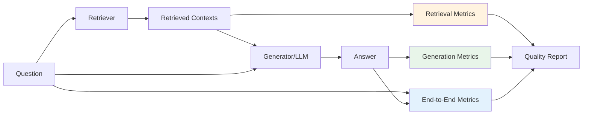
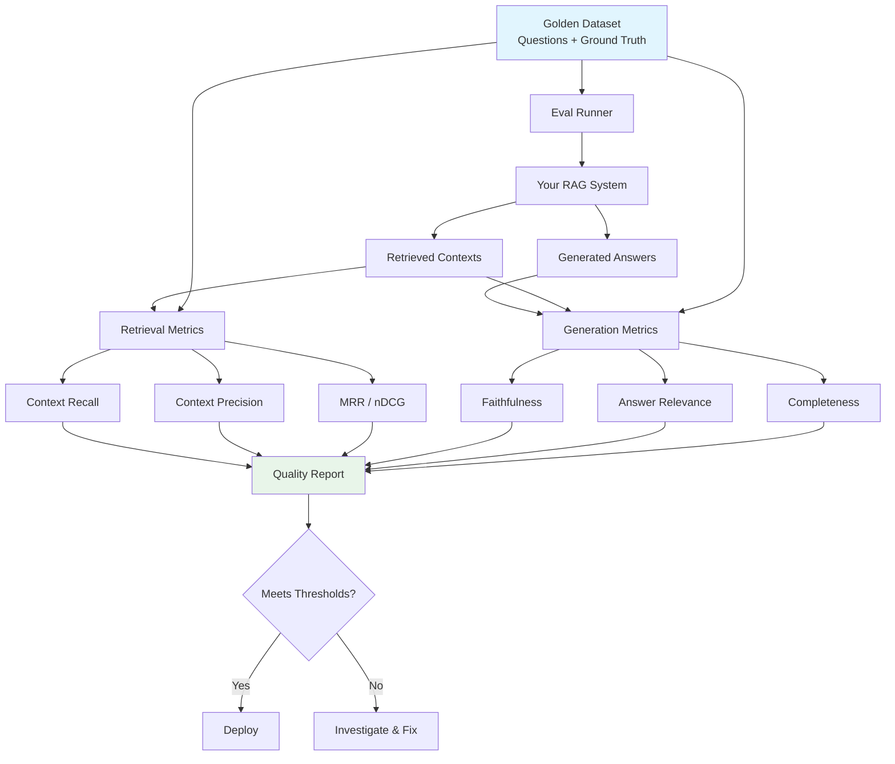

# RAG Evaluation

## The Challenge

A RAG system has two parts that can fail independently:
1. **Retrieval** — Did we find the right documents?
2. **Generation** — Did we produce a good answer from those documents?

It's like a relay race: even if your second runner is world-class, a bad handoff from the first runner loses the race. You need to evaluate both stages AND the end-to-end result.

## The RAG Evaluation Framework



## Retrieval Metrics

These answer: "Did we find the right information?"

### Context Recall

**Analogy**: You're studying for an exam. The textbook has 5 relevant pages. Context recall asks: "Did you find all 5 pages, or did you miss some?"

```
Context Recall = (Relevant items retrieved) / (Total relevant items that exist)
```

- Recall of 1.0 = found everything relevant
- Recall of 0.5 = missed half the relevant information
- **Why it matters**: Low recall means the LLM is missing critical information to answer correctly

### Context Precision

**Analogy**: You grabbed 10 pages from the textbook. Context precision asks: "How many of those 10 pages are actually useful?" If 3 are irrelevant, that's noise diluting the signal.

```
Context Precision = (Relevant items in top-K) / (Total items in top-K)
```

- Precision of 1.0 = every retrieved item is relevant
- Precision of 0.5 = half the context is noise
- **Why it matters**: Irrelevant context confuses the LLM and wastes token budget

### Mean Reciprocal Rank (MRR)

**Analogy**: When you Google something, you care whether the answer is the first result or buried on page 3. MRR measures how high the first relevant result ranks.

```
MRR = 1 / (position of first relevant result)
```

- First result relevant: MRR = 1.0
- Second result relevant: MRR = 0.5
- Fifth result relevant: MRR = 0.2

### Normalized Discounted Cumulative Gain (nDCG)

**Analogy**: MRR only cares about the first relevant result. nDCG cares about ALL results and their positions — like judging a playlist where song order matters.

Results at the top matter more than results at the bottom (logarithmic discount):

```
DCG = Σ (relevance_i / log2(position_i + 1))
nDCG = DCG / Ideal_DCG  (normalized to 0-1)
```

- nDCG of 1.0 = perfect ranking (most relevant first)
- nDCG of 0.5 = mediocre ranking

## Generation Metrics

These answer: "Given the context, did we generate a good answer?"

### Faithfulness / Groundedness

**Analogy**: A journalist should only report what their sources said, not make things up. Faithfulness measures: "Is every claim in the answer supported by the retrieved context?"

```
Faithfulness = (Claims supported by context) / (Total claims in answer)
```

- Faithfulness of 1.0 = every statement is backed by evidence
- Faithfulness of 0.7 = 30% of claims have no support (potential hallucination!)
- **This is the #1 metric for RAG** — if you measure nothing else, measure this

### Answer Relevance

**Analogy**: A student who writes a beautiful essay that doesn't answer the question still fails. Answer relevance asks: "Does this actually address what was asked?"

Measured by: Could you reconstruct the original question from the answer? If the answer is about topic X but the question was about topic Y, relevance is low.

### Answer Completeness

**Analogy**: "What are the 3 causes of X?" — if your answer only covers 2, it's incomplete even if those 2 are correct.

```
Completeness = (Aspects of question addressed) / (Total aspects in question)
```

## End-to-End Metrics

These answer: "Does the whole system work?"

### Answer Correctness

Compares the generated answer against a ground truth answer:
- Semantic similarity (embedding comparison)
- Key fact overlap (are the important facts present?)
- Factual accuracy (are stated facts correct?)

### Citation Accuracy

For systems that cite sources:
- Are citations real (not hallucinated)?
- Do citations support the claims they're attached to?
- Are important claims properly cited?

### Hallucination Rate

```
Hallucination Rate = (Answers containing unsupported claims) / (Total answers)
```

Target: < 5% for production systems.

## The RAGAS Framework

RAGAS (Retrieval Augmented Generation Assessment) is the standard framework for RAG evaluation. It computes:

| Metric | What it Measures | Needs |
|---|---|---|
| Faithfulness | Answer grounded in context | Context + Answer |
| Answer Relevance | Answer addresses the question | Question + Answer |
| Context Precision | Retrieved docs are relevant | Question + Context + Ground Truth |
| Context Recall | All relevant info retrieved | Context + Ground Truth |

**Key insight**: RAGAS uses LLM-as-judge internally. It breaks answers into claims, then checks each claim against the context.

## Building Golden Datasets

A golden dataset is your source of truth for evaluation. It contains:

```json
{
  "question": "What is the refund policy for annual subscriptions?",
  "ground_truth_answer": "Annual subscriptions can be refunded within 30 days...",
  "ground_truth_contexts": ["doc_id_1", "doc_id_2"],
  "metadata": {"category": "billing", "difficulty": "easy"}
}
```

### How to Build One

1. **Collect real questions** — from user logs, support tickets
2. **Get expert answers** — domain experts write gold-standard answers
3. **Identify relevant docs** — which documents should be retrieved
4. **Categorize** — by topic, difficulty, question type
5. **Aim for 50-200 examples** — cover your important cases

### Golden Dataset Best Practices

- Include edge cases (ambiguous questions, multi-hop reasoning)
- Balance across categories and difficulty levels
- Update quarterly as your knowledge base changes
- Version control your golden dataset
- Include "unanswerable" questions (system should say "I don't know")

## RAG Evaluation Pipeline



## Practical Thresholds

Starting points (adjust based on your domain):

| Metric | Minimum | Good | Excellent |
|---|---|---|---|
| Faithfulness | 0.85 | 0.92 | 0.97 |
| Answer Relevance | 0.80 | 0.88 | 0.95 |
| Context Recall | 0.75 | 0.85 | 0.95 |
| Context Precision | 0.70 | 0.82 | 0.92 |
| Hallucination Rate | < 10% | < 5% | < 2% |

## Key Takeaways

1. **Evaluate retrieval and generation separately** — know where failures happen
2. **Faithfulness is the #1 RAG metric** — hallucination is the biggest risk
3. **Build a golden dataset** — it's your source of truth
4. **Use RAGAS or similar frameworks** — don't reinvent metrics
5. **Set thresholds and gate deployments** — quality regressions should block releases

---

*Next: [03-agent-evaluation.md](./03-agent-evaluation.md) — Evaluating AI agents*
