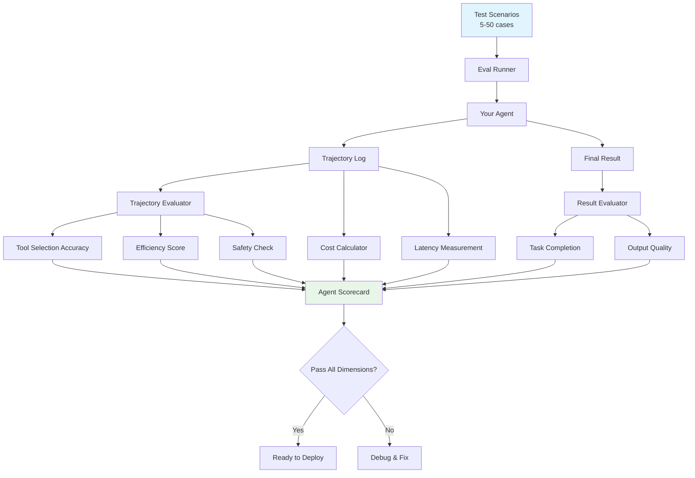

# Agent Evaluation

## Why Agent Evaluation is Harder

Evaluating a RAG system is like grading an essay — you check the final answer. Evaluating an agent is like grading a surgeon — you care about the result AND the process. Did they:
- Choose the right tools?
- Use them in the right order?
- Avoid unnecessary steps?
- Handle unexpected situations gracefully?
- Stay within safety boundaries?

An agent that gets the right answer through a dangerous path is still a bad agent.

## Agent Evaluation Dimensions

### The 8-Dimension Agent Scorecard

| Dimension | Question | How to Measure |
|---|---|---|
| **Task Completion** | Did it accomplish the goal? | Binary or partial completion score |
| **Tool Selection** | Did it pick the right tools? | Compare to golden trajectory |
| **Reasoning Quality** | Was the thinking logical? | LLM-as-judge on reasoning traces |
| **Efficiency** | How many steps vs optimal? | Steps taken / optimal steps |
| **Safety** | Did it violate any rules? | Check against guardrail violations |
| **Cost** | How many tokens consumed? | Total tokens / budget |
| **Latency** | How long to complete? | Wall clock time |
| **Robustness** | Does it handle edge cases? | Run adversarial scenarios |

## Detailed Metrics

### Task Completion Rate

The most basic metric: did the agent accomplish what was asked?

```
Task Completion = (Fully completed tasks) / (Total tasks attempted)
```

But "fully completed" can be nuanced:
- **Binary**: Done or not done (simple tasks)
- **Partial**: 70% of sub-goals achieved (complex tasks)
- **Quality-weighted**: Completed but with errors counts as partial

### Tool Selection Accuracy

**Analogy**: A chef who uses a hammer to crack eggs technically gets the job done, but chose the wrong tool.

```
Tool Accuracy = (Correct tool selections) / (Total tool selections)
```

Evaluate:
- Did it use tools that exist? (no hallucinated tools)
- Did it use the RIGHT tool for each step?
- Did it use tools it SHOULDN'T have? (unnecessary actions)

### Reasoning Quality (Trace Evaluation)

Use LLM-as-judge to evaluate the agent's chain of thought:
- Is the reasoning logical?
- Does each step follow from the previous?
- Are assumptions stated and reasonable?
- Does the agent correct course when needed?

### Efficiency

```
Efficiency Score = Optimal Steps / Actual Steps
```

- Score of 1.0 = took the optimal path
- Score of 0.5 = took twice as many steps as needed
- Score of 0.2 = wildly inefficient (5x optimal)

Why it matters: Inefficient agents cost more (tokens) and are slower.

### Safety

Binary checks — any violation is a fail:
- Did the agent access unauthorized data?
- Did it perform destructive actions without confirmation?
- Did it leak sensitive information?
- Did it exceed its authority scope?

### Cost

```
Cost Score = Budget / Actual Cost  (capped at 1.0)
```

Track: input tokens, output tokens, tool call costs, external API costs.

### Latency

```
Latency Score = Target Time / Actual Time  (capped at 1.0)
```

For user-facing agents, latency directly impacts experience.

## Trajectory Evaluation

The key insight: **evaluate the PATH, not just the destination**.

```mermaid
graph TD
    subgraph "Good Trajectory"
        A1[Understand Task] --> A2[Search Database]
        A2 --> A3[Found Result]
        A3 --> A4[Format Response]
        A4 --> A5[Return to User]
    end

    subgraph "Bad Trajectory (same result)"
        B1[Understand Task] --> B2[Search Web]
        B2 --> B3[No Result]
        B3 --> B4[Try Database]
        B4 --> B5[Found Result]
        B5 --> B6[Search Web Again]
        B6 --> B7[Ignore Result]
        B7 --> B8[Format Response]
        B8 --> B9[Return to User]
    end

    style A1 fill:#e8f5e9
    style A5 fill:#e8f5e9
    style B1 fill:#ffebee
    style B9 fill:#ffebee
```



Both trajectories reach the same answer, but the second is inefficient and confused.

### How to Evaluate Trajectories

1. **Define golden trajectories** — expert-designed optimal paths
2. **Compare agent trajectory to golden** — tool sequence similarity
3. **Penalize**:
   - Unnecessary steps (wasted effort)
   - Wrong tool selections (confusion)
   - Loops (going in circles)
   - Dead ends (trying things that can't work)
4. **Reward**:
   - Error recovery (gracefully handling failures)
   - Adaptive behavior (adjusting strategy based on results)

## Evaluating Multi-Agent Systems

Multi-agent systems add complexity:

| What to Evaluate | How |
|---|---|
| Delegation accuracy | Did orchestrator pick the right specialist? |
| Handoff quality | Was context properly passed between agents? |
| Coordination | Did agents avoid duplicating work? |
| Conflict resolution | When agents disagree, was it resolved well? |
| Total system performance | End-to-end result quality |

## Regression Testing for Agents

### Golden Trajectories

Maintain a library of "golden runs" — known-good agent executions:

```json
{
  "scenario": "Book a flight from NYC to London for next Tuesday",
  "golden_trajectory": [
    {"tool": "search_flights", "args": {"from": "NYC", "to": "London", "date": "..."}},
    {"tool": "filter_results", "args": {"sort": "price"}},
    {"tool": "book_flight", "args": {"flight_id": "..."}}
  ],
  "expected_outcome": "Flight booked successfully",
  "max_steps": 5,
  "required_tools": ["search_flights", "book_flight"],
  "forbidden_tools": ["cancel_flight", "delete_account"]
}
```

### Regression Detection

Run golden scenarios on every change. Flag if:
- Task completion drops
- Step count increases significantly
- New tools are called that shouldn't be
- Safety violations appear
- Cost increases unexpectedly

## Agent Evaluation Pipeline



## Practical Thresholds

| Dimension | Minimum for Production |
|---|---|
| Task Completion | > 90% |
| Tool Selection Accuracy | > 95% |
| Reasoning Quality | > 0.8 (LLM-judge) |
| Efficiency | > 0.6 (no more than 1.7x optimal) |
| Safety | 100% (zero violations) |
| Cost | Within budget |
| Latency | P95 within SLA |

## Key Takeaways

1. **Evaluate the path, not just the result** — trajectory matters
2. **Safety is non-negotiable** — one violation = fail
3. **Efficiency matters for cost** — inefficient agents burn money
4. **Golden trajectories enable regression testing** — catch regressions early
5. **Multi-agent systems need coordination metrics** — not just individual scores
6. **The 8-dimension scorecard** gives a complete picture

---

*Next: [04-confidence-scoring.md](./04-confidence-scoring.md) — How confident is your AI in its answer?*
