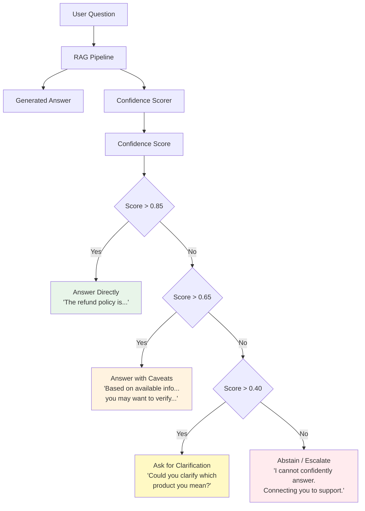
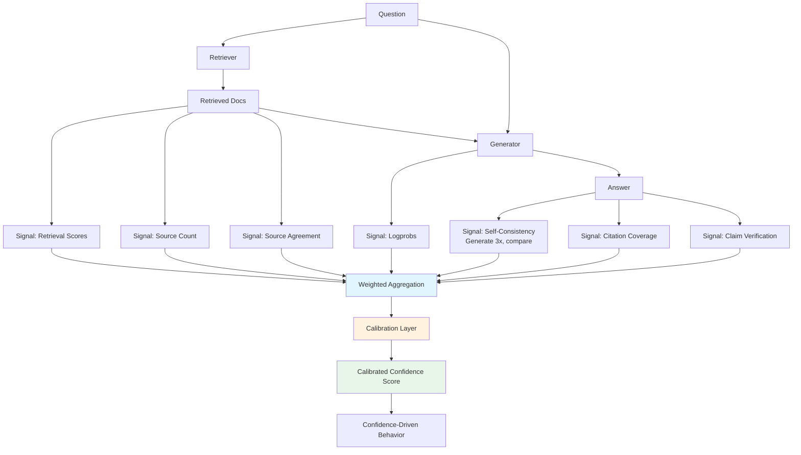

# Confidence Scoring for AI Systems

## What is Confidence Scoring?

**Analogy**: Imagine a doctor who always says "I'm 100% sure" — you'd trust them less than one who says "I'm fairly confident it's X, but let's run a test to rule out Y." Confidence scoring gives your AI system that same self-awareness.

Confidence scoring is the practice of computing a reliability estimate for each AI response. It answers: "How much should the user trust this answer?"

## Why Confidence Matters

Without confidence scoring:
- Users trust all answers equally (dangerous for wrong ones)
- The system can't know when to ask for help
- There's no way to prioritize human review
- You can't set different UX for certain vs uncertain answers

With confidence scoring:
- Low-confidence answers get caveats or human review
- Users understand when to verify independently
- The system can abstain rather than hallucinate
- You can route hard questions to experts

## The 11 Confidence Signals

Think of each signal as an independent "witness" testifying about answer quality. More agreeing witnesses = higher confidence.

### 1. Retrieval Relevance Scores

The similarity scores from your vector search. If the top document scores 0.95, that's a strong signal. If it scores 0.6, the retrieval is uncertain.

```
Signal: average cosine similarity of top-K results
Range: 0.0 - 1.0
Weight: High (foundational signal)
```

### 2. Number of Supporting Documents

**Analogy**: One source saying something is a rumor. Five independent sources saying it is likely true.

```
Signal: count of retrieved docs above relevance threshold
Range: 0 to K (normalized to 0-1)
Weight: Medium
```

### 3. Source Agreement/Disagreement

Do the retrieved documents agree with each other? If 4 sources say "yes" and 1 says "no," that's still fairly confident. If it's 2 vs 3, confidence drops.

```
Signal: semantic similarity between retrieved passages
Range: 0.0 (contradictory) - 1.0 (fully agreeing)
Weight: High
```

### 4. Model Logprobs (Token-Level Confidence)

LLMs assign probabilities to each token they generate. Low-probability tokens indicate uncertainty.

```
Signal: average log-probability of generated tokens
Range: -inf to 0 (higher = more confident)
Weight: Medium-High (when available)
```

### 5. Answer Consistency (Self-Consistency)

**Analogy**: Ask someone the same question 5 times. If they give the same answer every time, they're probably right. If they give 5 different answers, they're guessing.

Generate the answer 3-5 times with temperature > 0. Measure agreement.

```
Signal: semantic similarity across multiple generations
Range: 0.0 (all different) - 1.0 (all identical)
Weight: High (very reliable signal)
```

### 6. Citation Coverage

What percentage of claims in the answer can be traced to a specific source?

```
Signal: (claims with citations) / (total claims)
Range: 0.0 - 1.0
Weight: Medium
```

### 7. Query-Answer Semantic Similarity

Does the answer actually address the question? High semantic similarity between question and answer suggests relevance.

```
Signal: cosine similarity between question and answer embeddings
Range: 0.0 - 1.0
Weight: Low-Medium (catches off-topic answers)
```

### 8. Source Authority/Freshness

Are the sources authoritative and recent? A 2024 document from an official source is more reliable than a 2018 blog post.

```
Signal: weighted score based on source metadata
Range: 0.0 - 1.0
Weight: Medium
```

### 9. Claim Verification Count

How many individual claims in the answer can be verified against the context?

```
Signal: (verified claims) / (total claims)
Range: 0.0 - 1.0
Weight: High (directly measures groundedness)
```

### 10. Model Self-Assessment

Ask the model: "On a scale of 1-10, how confident are you in this answer? Explain why."

```
Signal: model's stated confidence (normalized)
Range: 0.0 - 1.0
Weight: Low-Medium (models are overconfident, but directionally useful)
```

### 11. Historical Accuracy for Similar Queries

For questions similar to ones you've evaluated before, use past accuracy as a prior.

```
Signal: accuracy rate for similar question types
Range: 0.0 - 1.0
Weight: Medium (requires evaluation history)
```

## Composite Confidence Formula

Combine signals using a weighted average:

```
Confidence = Σ(weight_i × signal_i) / Σ(weight_i)
```

Example weighting:

```python
weights = {
    "retrieval_score": 0.20,
    "source_count": 0.10,
    "source_agreement": 0.15,
    "logprobs": 0.10,
    "self_consistency": 0.20,
    "citation_coverage": 0.10,
    "claim_verification": 0.15,
}
```

The weights should be **calibrated** using your evaluation data — adjust until confidence correlates with actual accuracy.

## Confidence-Driven Behavior



### Behavior Mapping

| Confidence Level | Range | Action | UX Treatment |
|---|---|---|---|
| High | > 0.85 | Answer directly | No qualifiers |
| Medium | 0.65 - 0.85 | Answer with caveats | "Based on available information..." |
| Low | 0.40 - 0.65 | Seek clarification | "Could you provide more detail?" |
| Very Low | < 0.40 | Abstain/escalate | "I'm not confident enough. Let me connect you to..." |

## Confidence Calibration

**The key question**: When your system says "80% confident," is it actually correct 80% of the time?

### The Calibration Problem

Most AI systems are **overconfident** — they say 90% but are only correct 70% of the time.

### How to Calibrate

1. **Collect predictions** — run your system on evaluation data
2. **Bucket by confidence** — group answers by confidence level (0.0-0.1, 0.1-0.2, etc.)
3. **Measure accuracy per bucket** — what % are actually correct?
4. **Plot calibration curve** — perfect calibration = diagonal line

```
Accuracy
1.0 |          /
    |        /  ← Perfect calibration
0.8 |      /
    |    / ....← Your system (overconfident)
0.6 |  / ...
    | /..
0.4 |/
    |___________________
    0   0.2  0.4  0.6  0.8  1.0
              Confidence
```

### Calibration Methods

- **Platt Scaling**: Fit a logistic regression to map raw confidence → calibrated confidence
- **Temperature Scaling**: Single parameter that adjusts confidence distribution
- **Isotonic Regression**: Non-parametric calibration (more flexible)

## Confidence Scoring Pipeline



## Key Takeaways

1. **Confidence scoring makes AI self-aware** — it knows what it doesn't know
2. **Multiple signals are better than one** — no single signal is reliable alone
3. **Self-consistency is the most powerful signal** — if answers vary, confidence is low
4. **Calibrate your scores** — raw confidence is usually overconfident
5. **Drive behavior from confidence** — don't treat all answers the same
6. **Abstaining is better than hallucinating** — know when to say "I don't know"

---

## Staff-Level: Anti-Patterns, Trade-offs & Production Confidence Systems

### Anti-Patterns in Confidence Scoring

#### 1. Using Raw Logprobs as Confidence (Uncalibrated)
Token-level logprobs from LLMs are NOT confidence scores. They measure:
- How likely the model thinks this TOKEN follows the previous tokens
- NOT how likely the ANSWER is correct

A model can generate "The capital of France is Paris" with high token probabilities (common sequence) AND "The treatment for condition X is drug Y" with equally high probabilities (confident-sounding but potentially wrong). Raw logprobs are systematically overconfident for factual claims and unreliable across domains.

#### 2. Single Threshold for All Domains
Using confidence > 0.7 = "answer directly" across all query types is dangerous:
- Medical queries need higher thresholds (wrong answers cause harm)
- Casual chitchat can tolerate lower thresholds (low stakes)
- Legal queries need extremely high thresholds (liability)
- Creative tasks shouldn't use confidence at all (no "correct" answer)

A single threshold either over-escalates easy queries (bad UX) or under-escalates dangerous ones (risk).

#### 3. No Calibration Monitoring Over Time
You calibrated your confidence scores in January. By June:
- Query distribution has shifted
- Knowledge base has been updated 
- Model provider has made silent changes
- New user segments have different question patterns

Calibration drifts. A score of 0.85 that meant "correct 85% of the time" in January might mean "correct 70% of the time" by June. Without monitoring, you don't know.

#### 4. Treating Confidence as Binary (High/Low)
Confidence is a continuous signal. Teams that bucket it into just "confident" vs "not confident" lose:
- The ability to prioritize human review (review 0.4 scores before 0.6 scores)
- Nuanced UX (caveats vs abstention vs clarification)
- Cost optimization (only run expensive verification on borderline cases)

### Trade-offs: Conservative vs Aggressive Thresholds

| Approach | Behavior | Good For | Bad For |
|---|---|---|---|
| Conservative (high threshold) | Escalates/abstains frequently | Healthcare, legal, finance | Consumer apps (frustrating UX) |
| Aggressive (low threshold) | Answers almost everything | Casual Q&A, search | High-stakes domains (risk) |
| Adaptive (domain-aware) | Different thresholds per category | Production systems at scale | Small teams (complexity cost) |

**The economic calculus**:
```
Cost of wrong answer = P(wrong) × Impact(wrong)
Cost of escalation = P(escalate) × Cost(human_review)

Optimal threshold: minimize total cost
= min(wrong_answer_cost + escalation_cost)
```

For a medical chatbot: Impact(wrong) = very high → set conservative threshold
For a recipe suggestion bot: Impact(wrong) = low → set aggressive threshold

### How Confidence Drives Escalation in Production

**Real-world pattern from a financial services AI assistant**:

```
┌─────────────────────────────────────────────────────────────┐
│  Confidence-Driven Routing (Production System)               │
├─────────────────────────────────────────────────────────────┤
│                                                              │
│  Query arrives → Classify domain → Look up domain threshold  │
│                                                              │
│  Domain Thresholds:                                          │
│  ├── Account balance queries: 0.70 (low risk, factual)       │
│  ├── Transaction disputes: 0.90 (high risk, nuanced)         │
│  ├── Investment advice: 0.95 (regulated, liability)          │
│  └── General FAQ: 0.60 (low stakes)                          │
│                                                              │
│  Routing Logic:                                              │
│  ├── Above threshold → Answer directly (75% of queries)      │
│  ├── Within 0.10 of threshold → Answer + caveat (15%)        │
│  ├── Below threshold by 0.10-0.25 → Suggest human (8%)       │
│  └── Below threshold by >0.25 → Direct to human (2%)         │
│                                                              │
│  Result: 75% automation rate with <0.5% complaint rate       │
│  Previous (no confidence): 90% automation, 4% complaint rate │
└─────────────────────────────────────────────────────────────┘
```

### Calibration Monitoring in Production

Track weekly:
1. **Calibration curve**: Plot confidence vs actual accuracy (should be diagonal)
2. **Expected Calibration Error (ECE)**: Single number summarizing miscalibration
3. **Per-domain calibration**: Confidence means different things in different domains
4. **Threshold performance**: At your chosen threshold, what's the actual precision/recall?

When ECE drifts above 0.05, trigger recalibration:
- Pull last 2 weeks of production data with human feedback
- Refit calibration parameters (Platt scaling or isotonic regression)
- A/B test new calibration before full rollout

### The Confidence Paradox

The queries where confidence scoring matters most (ambiguous, novel, edge cases) are exactly the queries where confidence signals are least reliable. Mitigation:
- Use self-consistency (multiple generations) for borderline cases — it's expensive but the most reliable signal precisely when you need it most
- Track "confidence about confidence" — if signals disagree with each other, that disagreement IS the signal (route to human)
- Never trust a single signal in isolation for any decision that matters

---

*Next: [05-llm-as-judge.md](./05-llm-as-judge.md) — Using LLMs to evaluate LLM outputs*
