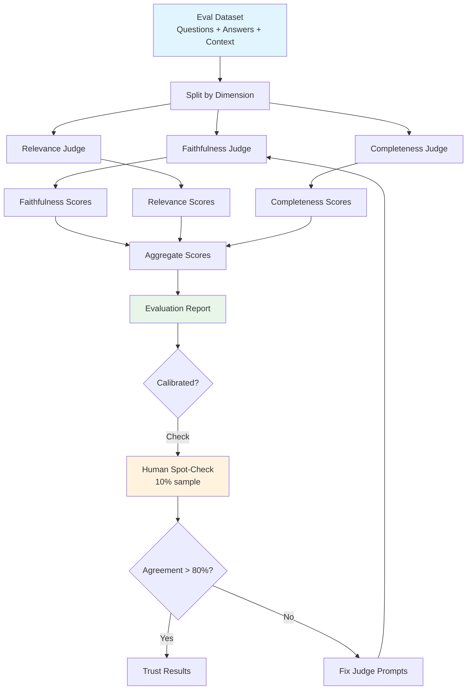

# LLM-as-Judge

## The Core Idea

**Analogy**: Imagine you're a teacher with 10,000 essays to grade. You can't read them all yourself, but you have a highly capable teaching assistant (TA). You give the TA a detailed rubric and spot-check their grading. That TA is your LLM judge.

LLM-as-judge uses one LLM to evaluate the outputs of another LLM (or the same LLM). It's the most scalable approach to AI evaluation when:
- Human evaluation is too expensive or slow
- You need to evaluate thousands of outputs
- You need consistent scoring criteria

## Why LLM-as-Judge Works

Research shows strong LLMs (GPT-4, Claude) agree with human evaluators ~80-85% of the time — comparable to inter-annotator agreement between humans themselves.

| Evaluation Method | Cost per Item | Speed | Scalability | Quality |
|---|---|---|---|---|
| Expert human | $2-10 | Minutes | Low | Gold standard |
| Crowdsource | $0.50-2 | Hours | Medium | Variable |
| LLM-as-judge | $0.01-0.05 | Seconds | High | Good (80-85% human agreement) |
| Heuristic | $0 | Instant | Infinite | Low (surface only) |

## LLM-as-Judge Patterns

### Pattern 1: Single Evaluator (Point-wise)

The simplest: give the judge a response and ask it to score.

```
You are an expert evaluator. Score the following answer on a scale of 1-5.

Question: {question}
Context: {context}
Answer: {answer}

Criteria:
- Faithfulness: Is every claim supported by the context?
- Completeness: Does it address all parts of the question?
- Clarity: Is it well-written and easy to understand?

Score each criterion 1-5 and explain your reasoning.
```

**Best for**: Quick evaluation, single-dimension scoring.

### Pattern 2: Pairwise Comparison

Show the judge two responses and ask which is better:

```
Which response better answers the question? Explain why.

Question: {question}
Response A: {response_a}
Response B: {response_b}

Output: "A is better", "B is better", or "Tie"
With explanation.
```

**Best for**: A/B testing, model comparison, ranking outputs.

### Pattern 3: Reference-Based Grading

Compare against a known-good answer:

```
Compare the candidate answer to the reference answer.

Question: {question}
Reference (correct) answer: {reference}
Candidate answer: {candidate}

Score the candidate 1-5 based on how well it captures
the key information from the reference.
```

**Best for**: When you have ground truth answers (golden datasets).

### Pattern 4: Rubric-Based Evaluation

Provide a detailed rubric with specific criteria:

```
Evaluate using this rubric:

5 - Excellent: All claims supported, complete, clear, properly caveated
4 - Good: Minor omissions, all claims supported, clear
3 - Acceptable: Mostly supported, some gaps, understandable
2 - Poor: Some unsupported claims, significant gaps
1 - Unacceptable: Hallucinations, wrong information, or off-topic

Question: {question}
Context: {context}
Answer: {answer}

Provide: score, evidence for the score, specific issues found.
```

**Best for**: Consistent, reproducible evaluation with clear standards.

## Designing Judge Prompts

### Key Principles

1. **Be specific** — "Is this good?" → "Is every factual claim supported by the provided context?"
2. **Provide rubrics** — Define what each score level means
3. **Ask for reasoning first** — "Explain your analysis, then give a score" (reduces bias)
4. **Include examples** — Show what a 1, 3, and 5 look like
5. **Decompose** — Evaluate one dimension at a time, not everything at once

### Example: Faithfulness Judge

```
You are evaluating whether an AI answer is faithful to the provided context.

TASK: Identify each factual claim in the answer. For each claim, determine
if it is SUPPORTED, PARTIALLY SUPPORTED, or NOT SUPPORTED by the context.

Context:
{context}

Answer to evaluate:
{answer}

Steps:
1. List each factual claim in the answer
2. For each claim, quote the supporting evidence from context (or state "no support")
3. Calculate: faithfulness = supported_claims / total_claims
4. Output the score as a decimal between 0 and 1

Output format:
Claims: [list]
Faithfulness Score: X.XX
```

## Judge Calibration

Your judge is only useful if it's accurate. Calibrate it:

1. **Create a calibration set** — 50-100 examples with human scores
2. **Run your judge** — Get LLM scores for the same examples
3. **Measure agreement** — Cohen's Kappa, Spearman correlation
4. **Identify failure modes** — Where does the judge disagree with humans?
5. **Iterate on prompts** — Improve the judge prompt based on failures

Target: Cohen's Kappa > 0.7 (substantial agreement).

## Biases in LLM Judges

LLM judges have systematic biases you must account for:

### Position Bias
In pairwise comparison, judges prefer the response shown FIRST (or sometimes LAST). **Mitigation**: Run both orderings, average results.

### Verbosity Bias
Judges prefer longer, more detailed responses even when shorter is better. **Mitigation**: Explicitly state "conciseness is valued" in rubric.

### Self-Preference Bias
GPT-4 rates GPT-4 outputs higher than equally good Claude outputs (and vice versa). **Mitigation**: Use a different model family as judge than the one being evaluated.

### Authority Bias
Judges are swayed by confident, authoritative tone even when content is wrong. **Mitigation**: Focus rubric on factual accuracy, not style.

### Format Bias
Well-formatted responses (bullet points, headers) score higher regardless of content. **Mitigation**: Evaluate content separately from presentation.

## When NOT to Use LLM-as-Judge

| Scenario | Why Not | Alternative |
|---|---|---|
| Safety-critical decisions | Liability requires human judgment | Human expert review |
| Legal compliance | Courts require human accountability | Legal team review |
| Highly subjective tasks | LLMs lack cultural/personal context | User ratings |
| Novel domains | Judge may not understand the domain | Domain expert |
| When judge accuracy < 70% | Unreliable evaluations | Human annotation |

## Cost Analysis

Evaluating 1,000 responses:

| Method | Cost | Time | Notes |
|---|---|---|---|
| GPT-4 judge | ~$15-50 | 30 min | Automated, consistent |
| Claude judge | ~$15-40 | 30 min | Automated, consistent |
| GPT-4-mini judge | ~$2-5 | 15 min | Cheaper, slightly less accurate |
| Human annotators | ~$2,000-5,000 | 1-2 weeks | Gold standard but slow |
| Crowdsource | ~$500-1,000 | 2-3 days | Variable quality |

For most teams: use LLM-as-judge for daily evaluation, human review for periodic calibration.

## LLM-as-Judge Pipeline



## Best Practices Summary

1. **Decompose evaluation** — One judge per dimension, not one judge for everything
2. **Always calibrate** — Verify against human judgments periodically
3. **Mitigate biases** — Randomize order, control for length, use cross-model judges
4. **Ask for reasoning before scores** — Reduces snap judgments
5. **Use rubrics** — Specific criteria produce consistent results
6. **Spot-check regularly** — 10% human review maintains quality
7. **Version your judge prompts** — They're as important as your system prompts

---

## Staff-Level: Anti-Patterns, Trade-offs & Judge Prompts That Work

### Anti-Patterns in LLM-as-Judge

#### 1. Single Judge Model (Biased and Fragile)
Using one model (e.g., only GPT-4) as your judge creates:
- **Systematic blind spots**: Every model has failure modes it can't detect in others
- **Self-preference bias**: If you judge GPT-4 outputs with GPT-4, scores inflate ~10-15%
- **Single point of failure**: Model API outage = no evaluation
- **Version drift**: Model updates silently change judge behavior

Fix: Use a panel of 2-3 judges (different model families), take majority vote or average.

#### 2. No Judge Calibration Against Human Labels
You built a judge prompt, it gives scores. But are those scores meaningful? Without calibration:
- A score of "4/5" from your judge might correspond to "2/5" from a human expert
- The judge might have compressed range (everything scores 3-4, never 1 or 5)
- Systematic biases go undetected until they cause real harm

Minimum viable calibration: 50 examples scored by both humans and judge. Compute Cohen's Kappa. If < 0.6, your judge is unreliable.

#### 3. Judging Own Outputs (Self-Evaluation Bias)
Asking GPT-4 to evaluate GPT-4's outputs is like asking a student to grade their own exam. Research shows:
- Models rate their own outputs 10-20% higher than equivalent outputs from other models
- They're less likely to identify hallucinations in their own text
- They share reasoning patterns, so "logical-sounding but wrong" fools them

Always use a different model family as judge than the model being evaluated.

#### 4. No Rubric (Vibes-Based Judging)
"Rate this answer 1-5" without criteria = random noise. The judge invents its own criteria each time, leading to:
- Inconsistent scores across runs
- Uninterpretable results (what does "3" mean?)
- Inability to improve (you don't know what dimension scored poorly)

### Trade-offs in LLM Judge Design

| Trade-off | Cheaper Option | Better Option | When to Upgrade |
|---|---|---|---|
| Judge model | GPT-4o-mini ($0.002/eval) | GPT-4o ($0.02/eval) | When mini disagrees with humans >25% of time |
| Single vs panel | 1 judge (fast, cheap) | 3 judges, majority vote (3x cost) | High-stakes decisions, deployment gates |
| Point-wise vs pairwise | Score individually (simple) | Compare pairs (more reliable) | A/B testing, model selection |
| Generic vs task-specific rubric | One rubric for all (easy) | Custom rubric per task type (maintenance) | When generic rubric misses domain failures |

**LLM judge agreement with humans (~80% typical)**:
- This means 1 in 5 judgments will disagree with expert humans
- For individual items, this is noisy. For aggregate scores over 100+ items, it's reliable
- Don't use LLM judges for individual high-stakes decisions. Use them for trend detection and regression monitoring.

### When to Use a Panel of Judges

Use a single judge when:
- Running in CI (cost-sensitive, high volume)
- Monitoring trends (aggregate accuracy compensates for individual noise)
- Evaluating clear-cut dimensions (format compliance, length)

Use a panel (2-3 judges) when:
- Making deployment go/no-go decisions
- Evaluating subjective dimensions (helpfulness, tone)
- Disagreement rate with humans exceeds 20% for single judge
- Results will be shared with stakeholders (higher credibility)

### Judge Prompts That Work Well in Practice

**Faithfulness Judge (Claim-Decomposition Approach)**:
```
You are a fact-checker. Your job is to verify if an answer is supported by the given context.

STEP 1: Break the answer into individual factual claims.
STEP 2: For each claim, determine:
  - SUPPORTED: The context explicitly states or directly implies this
  - NOT SUPPORTED: The context does not contain this information
  - CONTRADICTED: The context states the opposite

Context: {context}
Answer: {answer}

Output as JSON:
{"claims": [{"text": "...", "verdict": "SUPPORTED|NOT_SUPPORTED|CONTRADICTED", "evidence": "quote from context or 'none'"}],
 "faithfulness_score": <supported_count / total_count>}
```

**Relevance Judge (Question Reconstruction)**:
```
Given ONLY the answer below (not the question), generate 3 questions that this answer could be responding to. Then assess: does the answer address the actual question asked?

Actual question: {question}
Answer: {answer}

Score 1-5:
5 = Directly and completely answers the question
4 = Answers the question with minor tangents
3 = Partially answers but misses key aspects
2 = Mostly off-topic with some relevant info
1 = Does not address the question at all
```

**Comparative Judge (For A/B testing)**:
```
You are comparing two AI assistant responses. Focus ONLY on factual accuracy and completeness. Ignore style, formatting, and verbosity.

Question: {question}
Reference context: {context}

Response A: {response_a}
Response B: {response_b}

Which response is more accurate and complete? 
Output: {"winner": "A"|"B"|"TIE", "reason": "one sentence explanation"}
```

### The 80% Agreement Ceiling — And What To Do About It

Human inter-annotator agreement on subjective tasks is typically 80-85%. LLM judges hitting 80% agreement with humans is essentially AT the human ceiling. This means:
- Don't optimize for >85% agreement (you're fitting to annotator noise)
- Disagreements aren't always judge errors — sometimes the judge is right and the human is wrong
- Focus optimization on reducing SYSTEMATIC biases (position, verbosity) rather than increasing raw agreement

---

*Next: [06-observability-for-ai.md](./06-observability-for-ai.md) — Monitoring AI systems in production*
