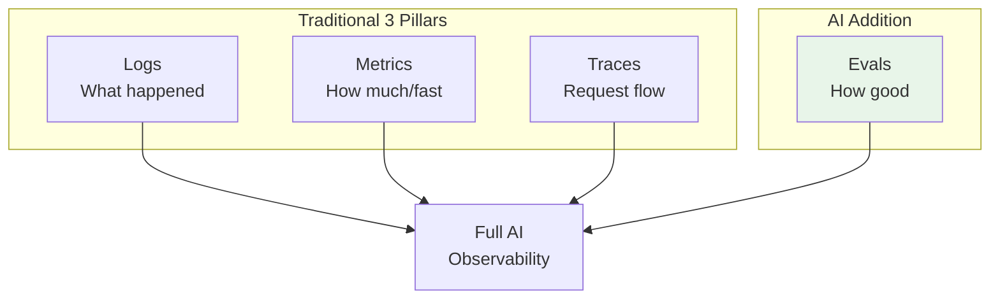
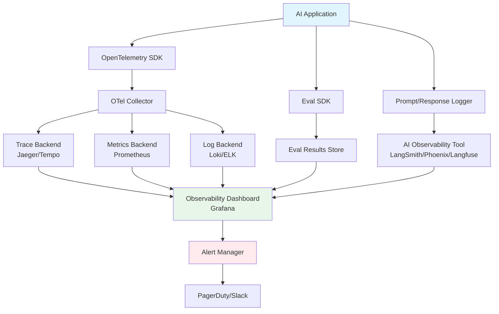

# Observability for AI Systems

## Beyond Traditional APM

Traditional Application Performance Monitoring (APM) tracks: Is the server up? How fast are requests? Are there errors?

AI observability asks deeper questions:
- Is the AI giving **correct** answers?
- Are responses **faithful** to source data?
- Is quality **degrading** over time?
- Which **types** of queries fail most?
- How much are we **spending** per request?

**Analogy**: Traditional observability is like checking if a restaurant is open and serving food quickly. AI observability also checks if the food tastes good.

## The 3+1 Pillars of AI Observability



### Pillar 1: Logs (What Happened)

For AI systems, log:
- **Full prompts** (system + user messages)
- **Full responses** (complete LLM output)
- **Tool calls** (name, arguments, results)
- **Retrieved contexts** (what was fetched from vector DB)
- **Decisions** (routing, model selection, confidence)

⚠️ **PII warning**: Prompts often contain user data. Implement PII scrubbing or secure storage.

### Pillar 2: Metrics (How Much / How Fast)

| Metric | What It Tells You |
|---|---|
| P50/P95/P99 latency | User experience |
| Tokens per request (in/out) | Cost driver |
| Cost per request | Budget tracking |
| Error rate by type | Reliability |
| Retrieval hit rate | RAG health |
| Confidence score distribution | System certainty |
| Hallucination rate | Quality |
| User satisfaction (thumbs up/down) | Real quality |

### Pillar 3: Traces (Request Flow)

An AI request touches many components. A trace shows the full journey:

```
User Question (t=0ms)
├── Query Understanding (t=5ms)
│   └── LLM call: classify intent (t=200ms, 150 tokens)
├── Retrieval (t=210ms)
│   ├── Embed query (t=50ms)
│   └── Vector search (t=80ms, 5 results)
├── Generation (t=350ms)
│   └── LLM call: generate answer (t=1200ms, 800 tokens)
├── Confidence Scoring (t=1550ms)
│   └── Score: 0.87
└── Response returned (t=1600ms)
```

Each span captures: duration, tokens used, model, cost, and any errors.

### Pillar +1: Evals (How Good)

Continuous evaluation metrics tracked over time:
- Daily faithfulness scores on sample
- Weekly golden dataset evaluation
- Trending quality metrics with alerts

## OpenTelemetry for GenAI

OpenTelemetry is the standard for observability. The GenAI semantic conventions define how to instrument LLM calls:

```
Span: "chat openai.chat"
Attributes:
  gen_ai.system: "openai"
  gen_ai.request.model: "gpt-4"
  gen_ai.request.temperature: 0.7
  gen_ai.usage.input_tokens: 1500
  gen_ai.usage.output_tokens: 350
  gen_ai.response.finish_reason: "stop"
```

This creates vendor-neutral traces that work with any observability backend.

## What to Trace

Every step in your AI pipeline should be a span:

| Component | What to Capture |
|---|---|
| Query preprocessing | Original query, transformed query, detected intent |
| Embedding | Model used, dimension, latency |
| Vector search | Query, top-K results with scores, latency |
| Reranking | Input order, output order, scores |
| LLM call | Model, messages, temperature, tokens, latency, cost |
| Tool calls | Tool name, args, result, success/failure |
| Post-processing | Transformations applied, filters |
| Guardrails | Checks run, pass/fail, blocked content |

## Key Metrics Dashboard

### The Essential AI Dashboard

```
┌─────────────────────────────────────────────────────┐
│  AI System Health Dashboard                          │
├──────────────────┬──────────────────────────────────┤
│ Latency          │ Quality                          │
│ P50: 1.2s       │ Faithfulness: 0.94 ✓            │
│ P95: 3.1s       │ Relevance: 0.91 ✓               │
│ P99: 5.8s ⚠️    │ Hallucination: 3.2% ✓           │
├──────────────────┼──────────────────────────────────┤
│ Cost             │ Usage                            │
│ Avg/req: $0.03  │ Requests/hr: 1,240              │
│ Daily: $892     │ Errors: 0.3%                    │
│ Monthly: $24.1k │ Avg tokens: 1,850               │
├──────────────────┴──────────────────────────────────┤
│ Quality Trend (7 days)                              │
│ ████████████████████████████ 0.94                   │
│ ███████████████████████████░ 0.93 ← slight drop    │
│ ████████████████████████████ 0.94                   │
└─────────────────────────────────────────────────────┘
```

### Model Performance Comparison

Track across models to inform decisions:

| Model | Latency P95 | Quality | Cost/req | Best For |
|---|---|---|---|---|
| GPT-4o | 2.1s | 0.94 | $0.04 | Complex reasoning |
| GPT-4o-mini | 0.8s | 0.88 | $0.005 | Simple Q&A |
| Claude Sonnet | 1.9s | 0.93 | $0.03 | Long context |

## Observability Tools

| Tool | Strengths | Best For |
|---|---|---|
| **LangSmith** | Deep LangChain integration, playground | LangChain-based apps |
| **Phoenix (Arize)** | Open source, great traces, evals | Teams wanting OSS |
| **Langfuse** | Open source, simple, self-hostable | Privacy-conscious teams |
| **OpenLIT** | OpenTelemetry native, lightweight | OTel-based stacks |
| **Weights & Biases** | Experiment tracking, evals | Research-heavy teams |

## Alerting for AI Systems

### What to Alert On

| Alert | Condition | Severity |
|---|---|---|
| Quality drop | Faithfulness < 0.85 for 1 hour | Critical |
| Latency spike | P95 > 5s for 15 min | High |
| Cost spike | Daily cost > 2x average | High |
| Error rate | > 5% for 10 min | Critical |
| Hallucination spike | Rate > 10% for 1 hour | Critical |
| Low confidence | > 30% responses below 0.5 confidence | Medium |
| Model errors | Rate limit or API errors > 1% | High |

### Alert Fatigue Prevention

- Use anomaly detection, not fixed thresholds (seasonal patterns exist)
- Group related alerts (latency spike + cost spike = one root cause)
- Require 15-minute sustained issues before alerting (avoid flapping)

## Observability Architecture



## Key Takeaways

1. **AI observability = traditional observability + quality** — you need evals alongside metrics
2. **Trace every LLM call** — tokens, cost, latency, model per span
3. **Monitor quality continuously** — not just at deploy time
4. **Alert on quality drops** — hallucination spikes are as critical as downtime
5. **Use OpenTelemetry** — vendor-neutral, standard, future-proof
6. **Cost is a first-class metric** — AI systems can silently become expensive
7. **Log prompts and responses** — essential for debugging, but handle PII carefully

---

*Next: [07-eval-in-ci-cd.md](./07-eval-in-ci-cd.md) — Integrating evaluation into your deployment pipeline*
