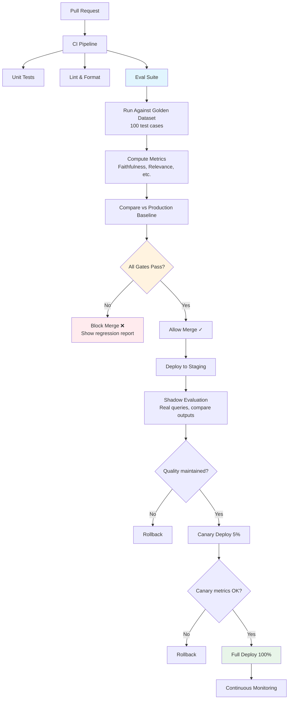
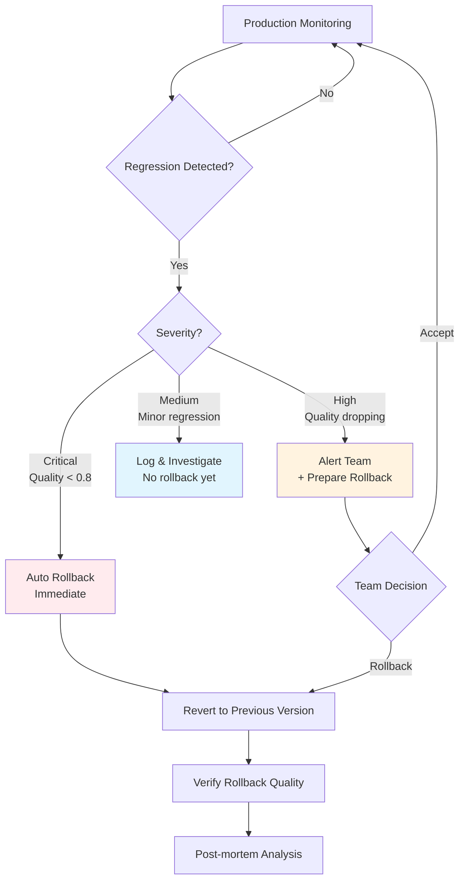

# Evaluation in CI/CD

## The Eval Gate Concept

**Analogy**: In manufacturing, quality control stops defective products from shipping. The eval gate does the same for AI — if quality drops, the deploy is blocked.

Traditional CI/CD gates:
- Tests pass ✓
- Lint passes ✓
- Build succeeds ✓

AI CI/CD gates add:
- Faithfulness > 0.9 ✓
- Hallucination rate < 5% ✓
- Latency P95 < 3s ✓
- No quality regression vs production ✓

## The CI/CD Evaluation Pipeline



## The 6 Stages

### Stage 1: On PR — Run Eval Suite

Every pull request triggers evaluation against your golden dataset:

```yaml
# .github/workflows/ai-eval.yml
on: pull_request
jobs:
  eval:
    steps:
      - run: python eval/run_eval.py --dataset golden_dataset.json
      - run: python eval/compare.py --baseline production_scores.json
      - run: python eval/gate.py --thresholds thresholds.yaml
```

### Stage 2: Compare — New vs Production

Don't just check absolute scores. Check for **regression**:

```
Metric          | Production | This PR | Delta  | Status
----------------|-----------|---------|--------|-------
Faithfulness    | 0.94      | 0.93    | -0.01  | ✓ (within tolerance)
Relevance       | 0.91      | 0.88    | -0.03  | ⚠️ WARNING
Hallucination   | 3.1%      | 7.2%    | +4.1%  | ❌ FAIL
Latency P95     | 2.8s      | 2.9s    | +0.1s  | ✓
```

### Stage 3: Gate — Block if Quality Drops

Block the deployment if ANY critical metric crosses its threshold.

### Stage 4: Shadow — Deploy to Shadow

Shadow deployment processes real production queries but doesn't serve responses to users. Compare shadow outputs against production outputs.

### Stage 5: Canary — 5% Traffic

Route 5% of real traffic to the new version. Monitor quality metrics in real-time. If any degradation, roll back immediately.

### Stage 6: Full Deploy

Only after all gates pass: full production deployment with ongoing monitoring.

## Minimum Eval Gates

### Recommended Thresholds

```yaml
# thresholds.yaml
gates:
  # Quality gates (absolute minimums)
  faithfulness:
    min: 0.90
    description: "Answer must be grounded in context"

  answer_relevance:
    min: 0.85
    description: "Answer must address the question"

  hallucination_rate:
    max: 0.05
    description: "No more than 5% of answers contain hallucinations"

  # Performance gates
  latency_p95:
    max_seconds: 3.0
    description: "95th percentile response time"

  cost_per_request:
    max_dollars: 0.05
    description: "Average cost per request"

  # Regression gates (relative to production)
  max_regression:
    faithfulness: 0.02      # Allow max 2% drop
    relevance: 0.03         # Allow max 3% drop
    latency_p95: 0.5        # Allow max 500ms increase
```

### Gate Decision Logic

```python
def check_gates(scores, thresholds, production_baseline):
    failures = []

    # Absolute gates
    if scores["faithfulness"] < thresholds["faithfulness"]["min"]:
        failures.append(f"Faithfulness {scores['faithfulness']:.2f} < {thresholds['faithfulness']['min']}")

    if scores["hallucination_rate"] > thresholds["hallucination_rate"]["max"]:
        failures.append(f"Hallucination {scores['hallucination_rate']:.1%} > {thresholds['hallucination_rate']['max']:.1%}")

    # Regression gates
    faith_drop = production_baseline["faithfulness"] - scores["faithfulness"]
    if faith_drop > thresholds["max_regression"]["faithfulness"]:
        failures.append(f"Faithfulness regression: {faith_drop:.2f} > allowed {thresholds['max_regression']['faithfulness']}")

    return len(failures) == 0, failures
```

## Statistical Significance

### How Many Eval Samples Do You Need?

Running eval on 5 examples tells you nothing. You need enough samples for statistical confidence.

| Desired Precision | Samples Needed | Reasoning |
|---|---|---|
| ±10% | ~50 | Quick sanity check |
| ±5% | ~200 | Reasonable for CI |
| ±2% | ~1,000 | High confidence |
| ±1% | ~5,000 | Research-grade |

**Rule of thumb**: 100-200 golden dataset examples is the sweet spot for CI/CD — fast enough to run on every PR, large enough to detect real regressions.

### Detecting Real Regressions vs Noise

Use confidence intervals:

```python
import numpy as np
from scipy import stats

def is_significant_regression(old_scores, new_scores, alpha=0.05):
    """Test if new scores are significantly worse than old scores."""
    t_stat, p_value = stats.ttest_ind(old_scores, new_scores, alternative='greater')
    return p_value < alpha  # True = statistically significant regression
```

## Regression Detection and Rollback

### Automatic Rollback Triggers

| Trigger | Condition | Action |
|---|---|---|
| Quality crash | Faithfulness < 0.8 for 5 min | Immediate rollback |
| Gradual degradation | Quality trending down 3 consecutive hours | Alert + auto-rollback |
| Error spike | Error rate > 10% for 5 min | Immediate rollback |
| Cost explosion | Cost > 5x normal for 15 min | Rate limit + alert |

### Rollback Strategy



## Putting It All Together

A complete CI/CD eval workflow:

1. **Developer changes prompt/code** → Opens PR
2. **CI runs eval suite** (2 min) → 150 golden examples evaluated
3. **Gate checks** → All metrics above threshold, no significant regression
4. **PR merged** → Deploy to staging
5. **Shadow evaluation** (1 hour) → Compare against production on real queries
6. **Canary deploy** (2 hours) → 5% traffic, monitor quality
7. **Full deploy** → 100% traffic
8. **Continuous monitoring** → Alert on any degradation
9. **Auto-rollback** → If quality drops below critical threshold

## Key Takeaways

1. **Eval gates block bad deployments** — like tests, but for AI quality
2. **Compare against production** — absolute scores AND regression detection
3. **Progressive deployment** — shadow → canary → full, with gates at each stage
4. **Statistical significance matters** — 100+ examples minimum for CI
5. **Auto-rollback on quality crashes** — don't wait for humans when quality collapses
6. **Version everything** — prompts, golden datasets, thresholds, eval code

---

## Staff-Level: Anti-Patterns, Trade-offs & Handling Non-Determinism

### Anti-Patterns in CI/CD Evaluation

#### 1. Eval Blocking Deploy for Minor Regressions
A 0.5% drop in faithfulness score blocks a critical security patch from shipping. This happens when:
- Thresholds are set too tight (no tolerance band)
- No distinction between "critical regression" and "noise"
- All metrics are treated as blocking (even informational ones)
- No override mechanism for senior engineers

Result: teams disable eval gates because they're "always blocking for no reason." You've now lost all protection.

Fix: Use tiered gates — hard blocks for critical metrics (safety, hallucination > 10%), warnings for minor regressions, informational for experimental metrics.

#### 2. No Baseline Comparison
Checking "faithfulness > 0.9" is necessary but insufficient. You also need:
- Is this WORSE than what's currently in production?
- Is this worse than the 7-day rolling average?
- Is this worse on specific CATEGORIES that matter most?

A new prompt might score 0.91 faithfulness (passes absolute gate) but production scores 0.95 — that's a 4% regression hidden behind a passing gate.

#### 3. Eval Suite That Takes Hours (Blocks Iteration)
Common failure mode: the "comprehensive" eval suite runs 1000 examples through GPT-4-as-judge, taking 45 minutes per PR. Developers:
- Stop running evals locally (too slow for iteration)
- Push PRs and context-switch, losing flow
- Start bypassing the gate ("just merge, we'll eval later")
- Accumulate regressions that compound

The eval suite should be fast enough that developers WANT to run it, not fast enough that they HAVE to wait.

#### 4. Flaky Eval Tests from Non-Determinism
LLM-as-judge gives different scores on different runs. Self-consistency varies by run. A test that passes 70% of the time and fails 30% is worse than no test — it teaches developers to ignore failures.

### Trade-offs: Fast vs Thorough Evaluation

| Context | Samples | Judge | Time | Use Case |
|---|---|---|---|---|
| Local dev | 10-20 | GPT-4o-mini | 30 sec | Quick sanity check during development |
| PR gate | 50-100 | GPT-4o-mini | 2-5 min | Block obvious regressions |
| Pre-merge | 100-200 | GPT-4o | 10-15 min | Final quality check |
| Nightly | 500-1000 | GPT-4o + panel | 1-2 hours | Comprehensive regression detection |
| Pre-release | Full golden set | GPT-4o + human spot-check | 4-8 hours | Release candidate validation |

**The key insight**: You don't need ONE eval strategy. You need a PYRAMID — fast/cheap evals run often, thorough/expensive evals run less often.

### Blocking vs Non-Blocking Quality Gates

| Gate Type | When to Use | Risk |
|---|---|---|
| Hard block | Safety violations, hallucination > threshold, critical regression | Can slow velocity if misconfigured |
| Soft block (require override) | Minor quality regression, cost increase | Senior engineer must consciously accept |
| Warning (non-blocking) | New/experimental metrics, informational | May be ignored |
| Informational | Trend data, nice-to-know metrics | No risk, no protection |

**Recommended configuration**:
```yaml
gates:
  hard_block:  # Cannot merge without passing
    - hallucination_rate > 0.08
    - safety_violations > 0
    - faithfulness < 0.85
  
  soft_block:  # Requires senior eng override to merge
    - faithfulness_regression > 0.03
    - latency_p95_regression > 1.0s
    - cost_regression > 50%
  
  warning:  # Shows in PR, doesn't block
    - any_metric_regression > 0.01
    - eval_flakiness > 20%
```

### Handling Non-Deterministic Eval Results

**Problem**: You run eval, get faithfulness = 0.92. Run again, get 0.89. Is that a real regression or noise?

**Solution 1: Multiple runs with confidence intervals**
```python
def robust_eval(system, dataset, n_runs=3):
    scores = [run_eval(system, dataset) for _ in range(n_runs)]
    mean = np.mean(scores)
    ci = stats.t.interval(0.95, len(scores)-1, loc=mean, scale=stats.sem(scores))
    return {"mean": mean, "ci_lower": ci[0], "ci_upper": ci[1]}

# Gate decision uses lower bound of CI
# If ci_lower < threshold → likely real regression
# If ci_lower > threshold → passes even accounting for noise
```

**Solution 2: Fixed seed for reproducibility where possible**
- Set temperature=0 for judge calls (reduces but doesn't eliminate variance)
- Use same sample ordering across runs
- Pin model versions explicitly

**Solution 3: Relative comparison with paired tests**
Instead of "is the new score > 0.9?", ask "is the new score worse than the old score on the SAME examples?"
```python
# Paired t-test: same questions, old system vs new system
old_scores = eval(old_system, questions)
new_scores = eval(new_system, questions)
t_stat, p_value = stats.ttest_rel(old_scores, new_scores)
# Regression only if p < 0.05 (statistically significant)
```

### The Eval CI/CD Maturity Model

| Level | Practice | Iteration Speed |
|---|---|---|
| 0 | No eval in CI | Fast but dangerous |
| 1 | Eval runs, results in PR comment (non-blocking) | Fast, some visibility |
| 2 | Blocking gates on critical metrics | Slightly slower, protected |
| 3 | Tiered gates (fast PR + thorough nightly) | Fast iteration + thorough coverage |
| 4 | Statistical gates with confidence intervals | Robust against flakiness |
| 5 | Automated baseline tracking + adaptive thresholds | Self-maintaining |

Target: Level 3 for most teams. Level 4-5 for teams with high-volume, high-stakes AI products.

### Practical Tip: The "Eval Budget"

Allocate eval spending like any other infrastructure cost:
- Typical: 5-15% of your LLM inference cost goes to evaluation
- If you spend $10k/mo on inference, budget $500-1500/mo on eval
- This covers: judge calls, nightly regression runs, human calibration
- ROI: catching one production regression before users do pays for months of eval

---

*Next: Programs — hands-on implementation of evaluation systems*
