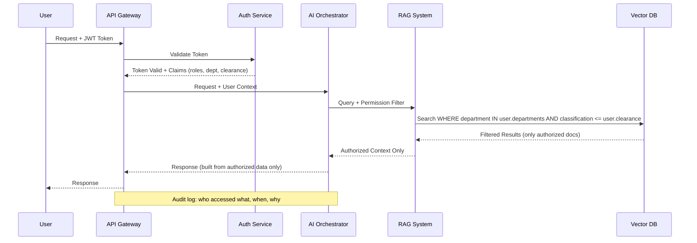

# Authentication & Authorization for AI Systems

## Why Auth for AI is More Complex

Traditional auth answers: "Can this user access this resource?" AI auth must answer a harder question: **"Can THIS user, through THIS agent, using THIS tool, access THIS data, for THIS purpose?"**

The analogy: Traditional auth is like checking someone's badge at a door. AI auth is like checking a badge for someone who sent their assistant, who might use various tools, and who might ask for things their boss can access but they can't.

---

## Authentication Methods

### API Keys (Simple but Risky)

```python
# Simple but dangerous - treat like passwords
headers = {"Authorization": "Bearer sk-abc123..."}
```

**Pros:** Simple to implement, low latency.
**Cons:** No expiration by default, no scope limitation, easily leaked in code/logs, no user identity.

**When to use:** Internal services, development, low-risk prototypes.

### OAuth2/OIDC (Recommended for Production)

The standard for production AI systems. Users authenticate through an identity provider, get scoped tokens.

```
User → Login → Identity Provider → Access Token (scoped) → AI Service
```

**Pros:** Industry standard, supports scopes, token expiration, refresh tokens, third-party integration.
**Cons:** More complex to implement, token management overhead.

### JWT Tokens (Stateless Verification)

```python
# JWT contains user identity and permissions
{
  "sub": "user-123",
  "roles": ["analyst"],
  "permissions": ["read:reports", "query:public-data"],
  "department": "finance",
  "exp": 1700000000
}
```

**Pros:** Stateless (no DB lookup needed), self-contained claims, fast validation.

### Service-to-Service Auth (mTLS)

For AI microservices communicating with each other:
```
AI Gateway ←mTLS→ Embedding Service ←mTLS→ Vector DB
```

---

## Authorization Models

### RBAC (Role-Based Access Control)

```
Roles:
  admin → can access all documents, all tools, all models
  analyst → can query data, use standard models, no tool execution
  viewer → can only ask questions, no data export
```

**Simple but coarse.** Works for small teams, breaks down with complex requirements.

### ABAC (Attribute-Based Access Control)

Decisions based on attributes of user, resource, environment:

```python
def can_access(user, resource, action):
    return (
        user.clearance_level >= resource.classification_level
        and user.department in resource.allowed_departments
        and action in user.permitted_actions
        and current_time in user.active_hours
    )
```

**Flexible but complex.** Good for enterprises with nuanced access rules.

### ReBAC (Relationship-Based Access Control)

Authorization based on relationships between entities (like Google Zanzibar):

```
user:alice is owner of document:budget-2024
user:bob is member of team:finance
team:finance is viewer of folder:financial-reports
document:budget-2024 is in folder:financial-reports
→ Therefore: bob can view document:budget-2024
```

### Policy-as-Code (OPA/Cedar)

```rego
# OPA policy for AI access
allow {
    input.user.role == "analyst"
    input.action == "query"
    input.resource.classification != "top-secret"
    input.resource.department == input.user.department
}
```

---

## Auth Flow for AI Systems



---

## Permission-Aware RAG

This is critical: your RAG system must filter results based on who's asking.

```python
def permission_aware_search(query: str, user: User) -> list[Document]:
    # Build filter based on user permissions
    permission_filter = {
        "department": {"$in": user.departments},
        "classification_level": {"$lte": user.clearance_level},
        "access_groups": {"$in": user.groups},
    }
    
    # Search with filter applied at the vector DB level
    results = vector_db.search(
        query=query,
        filter=permission_filter,  # User only sees authorized docs
        top_k=10
    )
    return results
```

**Without this:** A junior employee could ask "What are the executive compensation details?" and the RAG system would happily retrieve and summarize board-level documents.

---

## The "Confused Deputy" Problem

The confused deputy problem: an AI agent has broad permissions (it needs them to serve many users), but a user tricks it into using those permissions on their behalf.

**Example:**
- AI agent has access to all company documents (to serve all employees)
- User asks: "Summarize the HR investigation file about my colleague John"
- Agent has access, user doesn't — but the agent doesn't check user permissions before retrieving

**Solution:** The agent must always check: "Does THIS user have access to what I'm about to retrieve/do?"

```python
def handle_request(request, user):
    # Don't just check if the AGENT can access it
    # Check if the USER (through the agent) should access it
    if not user_authorized(user, request.target_resource):
        return "You don't have permission to access that information."
    
    # Only then proceed
    return process_with_agent(request)
```

---

## Agent Identity

When an AI agent acts on behalf of a user, we need dual identity:

```python
class AgentContext:
    agent_identity: str      # "customer-service-bot-v2"
    user_identity: str       # "user-123"
    delegated_scopes: list   # ["read:orders", "update:address"]
    
    # The agent can ONLY do what the user has delegated
    # Even if the agent technically has broader capabilities
```

**Token delegation:** User grants the agent a subset of their own permissions:
```
User permissions: [read:all, write:own, admin:none]
Delegated to agent: [read:own-orders, read:product-catalog]
                    ↑ Subset of user's permissions
```

---

## Token Scope Limitation

Always issue the narrowest possible token:

```python
# BAD: Agent gets full access
token = issue_token(scopes=["*"])

# GOOD: Agent gets only what's needed for this interaction
token = issue_token(
    scopes=["read:user-profile", "read:order-history"],
    subject=user_id,
    expires_in=300,  # 5 minutes
    audience="customer-service-ai"
)
```

**Principle of least privilege** is even more important for AI because:
1. AI behavior is less predictable than traditional code
2. Prompt injection can redirect the AI's actions
3. The blast radius of a compromised AI with broad permissions is enormous

---

## Key Takeaways

1. **Never give AI agents more permissions than the user they serve**
2. **Filter data at retrieval time**, not after the LLM sees it (too late by then)
3. **Use short-lived, narrowly-scoped tokens** for all AI service interactions
4. **Audit everything** — who asked what, what was retrieved, what was returned
5. **Treat the AI agent as an untrusted intermediary** between user and data
