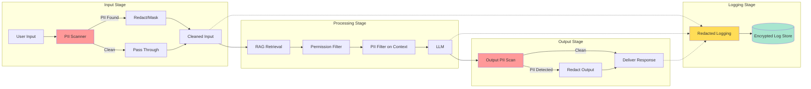

# Data Privacy and Compliance for AI Systems

## Privacy Challenges Specific to AI

AI systems are privacy nightmares because they **consume, process, and generate** personal data at every stage. Unlike a traditional database where PII sits in defined columns, AI systems scatter personal data across prompts, embeddings, model weights, logs, and outputs in ways that are hard to track and harder to delete.

The analogy: Traditional systems are like a filing cabinet — you know exactly where the sensitive folder is. AI systems are like a person who read the sensitive folder — the information is now distributed throughout their memory in unpredictable ways.

---

## Where PII Hides in AI Systems

### PII in Prompts

Users accidentally (or intentionally) include personal data:
```
"My SSN is 123-45-6789, can you help me fill out this tax form?"
"Here's my colleague's email: john.smith@company.com, please draft a message"
```

**Risk:** This PII goes to the model provider, gets logged, may be used for training.

### PII in Training Data

Models memorize training data, especially repeated or distinctive text:
```
# A model trained on emails might complete:
"Dear Mr. Johnson, your account number 4532-XXXX-XXXX-7891..."
```

**Risk:** Model regurgitates PII from training data to other users.

### PII in RAG Data

Your vector database contains documents with personal information:
```
Employee handbook → names, titles
Customer records → addresses, purchase history
Support tickets → detailed personal issues
```

**Risk:** Retrieved context exposes PII from others to the current user.

### PII in Logs and Traces

Observability captures everything:
```json
{
  "timestamp": "2024-01-15T10:30:00Z",
  "prompt": "My credit card 4532-1234-5678-9012 was charged incorrectly",
  "response": "I see the charge on card ending 9012...",
  "tokens_used": 450
}
```

**Risk:** Log aggregation systems become PII goldmines for attackers.

---

## Data Flow with Privacy Controls



---

## Data Minimization for AI

**Principle:** Only send the minimum data necessary to the LLM.

```python
# BAD: Send entire customer record to LLM
prompt = f"Help this customer: {customer.to_json()}"
# Sends: name, SSN, DOB, address, payment methods, full history...

# GOOD: Send only what's needed for this specific task
relevant_data = {
    "first_name": customer.first_name,
    "issue_category": ticket.category,
    "product": ticket.product_name,
}
prompt = f"Help resolve this {relevant_data['issue_category']} issue about {relevant_data['product']} for {relevant_data['first_name']}"
```

---

## GDPR Compliance for AI

### Right to Erasure (Article 17)

**The hard question:** Can you delete someone's data from embeddings?

- **Vector databases:** You can delete specific document embeddings ✓
- **Fine-tuned models:** You cannot easily remove individual data points ✗
- **Foundation models:** Impossible to remove from base model weights ✗

**Practical approach:**
1. Don't fine-tune on personal data
2. Keep personal data in retrievable/deletable stores (RAG, not weights)
3. Maintain deletion audit trails
4. Re-embed documents after removing PII

### Purpose Limitation (Article 5)

Data collected for customer support cannot be used to train a marketing model without consent.

```python
class DataUsagePolicy:
    def check_purpose(self, data_source, intended_use):
        allowed_purposes = self.get_consent_purposes(data_source)
        if intended_use not in allowed_purposes:
            raise PurposeLimitationViolation(
                f"Data from {data_source} not consented for {intended_use}"
            )
```

### Automated Decision-Making (Article 22)

If your AI makes decisions that significantly affect people (loan approvals, hiring), users have the right to:
- Know a decision was automated
- Get a human review
- Receive an explanation of the logic

---

## HIPAA for Healthcare AI

Protected Health Information (PHI) in AI systems requires:

| Requirement | AI Implementation |
|------------|------------------|
| Minimum necessary | Only include relevant medical data in prompts |
| Access controls | Permission-aware RAG for patient records |
| Audit trails | Log all access to PHI through AI |
| BAA with vendors | Business Associate Agreement with model providers |
| De-identification | Strip 18 HIPAA identifiers before processing |
| Encryption | Encrypt PHI in transit to/from model APIs |

**Critical:** Most cloud LLM providers are NOT HIPAA-compliant by default. You need specific enterprise agreements (Azure OpenAI with BAA, AWS Bedrock with BAA).

---

## SOC2 for AI SaaS

If you're building AI products, SOC2 auditors will ask:

1. **How do you protect customer data sent to AI models?** → Encryption, DLP, data minimization
2. **Where does the data go geographically?** → Data residency controls
3. **Is customer data used for training?** → Opt-out mechanisms, contractual guarantees
4. **How do you handle data breaches involving AI?** → Incident response plan
5. **What's your data retention policy?** → Auto-deletion of prompts/logs after N days

---

## Data Residency Requirements

**The problem:** You send a prompt to OpenAI's API — where does that data physically go?

```
User in EU → Your EU server → OpenAI API (US?) → Response
                                    ↑
                     Potential GDPR violation!
```

**Solutions:**
- Use regional API endpoints (Azure OpenAI in EU regions)
- Self-host models for sensitive workloads
- Contractual data processing agreements
- Encrypt data client-side before sending

---

## The Data Flow Audit

For compliance, you must be able to answer: "Where does personal data go in our AI system?"

**Audit checklist:**
1. What PII enters the system? (Input classification)
2. Where is it sent? (Model provider, vector DB, cache, logs)
3. How long is it retained? (TTLs on all stores)
4. Who can access it? (Access controls at every layer)
5. Can it be deleted on request? (Erasure capability)
6. Is it encrypted at rest and in transit? (Encryption audit)
7. Does it cross borders? (Data residency map)
8. Is it used for purposes beyond original consent? (Purpose tracking)

Document this as a **Data Protection Impact Assessment (DPIA)** — required under GDPR for high-risk processing like AI.

---

## Key Takeaways

1. **PII is everywhere in AI systems** — prompts, embeddings, logs, outputs. Scan all layers.
2. **Data minimization is your best defense** — don't send data you don't need.
3. **Logging vs privacy is a real tension** — redact PII from logs, or use privacy-preserving logging.
4. **Deletion from AI is hard** — keep PII in deletable stores, not model weights.
5. **Regional deployment matters** — know where your data physically travels.

---

## Staff-Level: Anti-Patterns, Trade-offs, and Regulatory Specifics

### Anti-Patterns in AI Data Privacy

**1. Training on Customer Data Without Consent**
"We'll use customer interactions to improve the model" sounds reasonable until legal reviews it. Under GDPR, using personal data for model training requires explicit consent (not buried in ToS), a legitimate interest assessment, or anonymization that actually removes re-identification risk. Fine-tuning on customer conversations without opt-in consent is a compliance violation waiting to become a headline. OpenAI, Anthropic, and Google all offer enterprise tiers specifically because their consumer tiers may use data for training.

**2. Logging PII in Traces**
Observability teams instrument everything — prompts, responses, tool calls, retrieved documents. This creates massive PII exposure in logging systems that often have weaker access controls than production databases. The fix isn't "don't log" (you need observability) — it's structured redaction: hash PII before logging, use reference IDs instead of values, and apply retention policies (30-90 days max for detailed traces).

**3. No Data Retention Policy for AI Interactions**
Conversation histories accumulate indefinitely. This violates storage limitation principles (GDPR Article 5(1)(e)) and creates growing liability. Every AI system needs: auto-deletion after N days, user-triggered deletion, and clear documentation of what's retained and why. Embeddings of deleted content must also be removed from vector stores.

**4. Sending Sensitive Data to Third-Party Models**
Teams send full customer records, medical data, or financial information to OpenAI/Anthropic APIs without considering: who processes it, where it's stored, whether it's used for training, and what happens in a breach. Data classification must gate model routing: public data → any model, internal data → enterprise API with DPA, restricted data → self-hosted models only.

### Trade-offs in AI Privacy Architecture

| Trade-off | More Data (Better AI) | Less Data (More Privacy) | Staff Guidance |
|-----------|----------------------|--------------------------|----------------|
| Data utility vs Privacy | Full context → better responses | Minimal context → worse responses but safe | Progressively disclose: start minimal, expand context only when needed for the specific query. Never send more than task requires. |
| On-premise vs Cloud | Self-hosted models (full control, expensive, less capable) | Cloud APIs (better models, data leaves your perimeter) | Tiered: cloud for non-sensitive, on-premise for regulated data. Hybrid architectures with routing logic based on data classification. |
| Logging detail vs Privacy | Full prompt/response logging (great debugging, PII everywhere) | Minimal logging (privacy-preserving, hard to debug) | Structured approach: log metadata always, log content with PII redaction, retain full content only for flagged interactions with short TTL. |
| Personalization vs Anonymity | Use full user history for better personalization | Treat every request independently | Session-scoped personalization with explicit consent. No cross-session profiling without opt-in. Allow anonymous/ephemeral modes. |

### GDPR-Specific Requirements for AI Systems

**Lawful Basis for Processing (Article 6):**
- Consent: Must be freely given, specific, informed, unambiguous. Pre-checked boxes don't count.
- Legitimate Interest: Requires documented balancing test (your interest vs user's rights). Using data for AI training rarely passes this test for sensitive data.
- Contractual necessity: AI processing must be necessary to fulfill the service contracted.

**Data Protection Impact Assessment (DPIA) — Required for AI:**
Any AI system that profiles individuals, processes sensitive data at scale, or makes automated decisions requires a DPIA before deployment. This must document: purpose, necessity, risks to individuals, and mitigation measures. Regulators can request these at any time.

**Right to Explanation (Articles 13-15, 22):**
When AI makes decisions affecting individuals, they have the right to "meaningful information about the logic involved." This doesn't require revealing model weights, but does require explaining: what data was used, what factors mattered most, and how to contest the decision.

**CCPA/CPRA Specifics:**
- Right to know what personal information is used in AI inference
- Right to opt-out of "automated decision-making technology"
- Right to delete (includes derived data like embeddings)
- Businesses must disclose AI use in profiling
- CPRA adds purpose limitation: data collected for one purpose can't be used for materially different AI purpose

### The Deletion Problem in AI Systems

Deleting user data from AI systems is genuinely hard:
1. **Vector embeddings:** Must be individually deleted from vector stores (possible but requires document-to-embedding mapping)
2. **Conversation logs:** Straightforward deletion, but ensure all replicas/backups are covered
3. **Fine-tuned models:** If a user's data was in the fine-tuning set, you may need to retrain without it (expensive)
4. **Cached responses:** Invalidate any cached responses that contain the user's data
5. **Analytics/aggregates:** If data was used in aggregate metrics, it may be irrecoverable but also non-personal

Staff engineers design for deletion from Day 0: maintain provenance tracking (which user's data is in which embedding/model/cache), implement soft-delete with grace periods, and architect so that deletion is a routine operation, not an emergency procedure.

---

## Data Classification Framework for AI Systems

| Classification | Description | AI Usage Constraints | Retention | Examples |
|---|---|---|---|---|
| **Public** | Freely available | Any use; fine-tuning OK | Indefinite | Public web data, open datasets |
| **Internal** | Business non-sensitive | RAG allowed; no external model training | Per policy (1-3 yr) | Internal docs, wikis |
| **Confidential** | Business-sensitive | On-premises models only; no third-party APIs | Minimum necessary | Financial data, strategy docs |
| **Restricted** | Regulated/PII | Anonymize before any AI processing; audit all access | Regulatory minimum | Health records, SSNs, payment data |
| **Prohibited** | Must never enter AI | Block at ingestion; alerting on detection | Immediate deletion if ingested | Credentials, encryption keys, child safety |

---

## Compliance Checklist for AI Systems

- [ ] Data Processing Agreement (DPA) in place with all AI model providers
- [ ] Privacy Impact Assessment (PIA) completed for AI features processing personal data
- [ ] Lawful basis documented for each AI processing activity (GDPR Art. 6)
- [ ] Data residency requirements mapped — models and data in correct regions
- [ ] Right to explanation implemented for automated decisions (GDPR Art. 22)
- [ ] Data retention schedules defined for prompts, completions, embeddings, and logs
- [ ] Deletion pipeline tested end-to-end (vector stores, caches, logs, fine-tuned models)
- [ ] Consent mechanisms updated to cover AI-specific data uses
- [ ] Vendor AI sub-processors listed in privacy policy
- [ ] Cross-border transfer mechanisms validated (SCCs, adequacy decisions)
- [ ] Children's data protections implemented if applicable (COPPA, Age-appropriate design)
- [ ] AI-specific records of processing activities maintained
- [ ] Incident response plan covers AI data breaches (model inversion, training data extraction)
- [ ] Regular compliance audits scheduled (quarterly for high-risk, annually for low-risk)
