# Responsible AI and Bias

## What is Responsible AI?

Responsible AI means building AI systems that are **fair, transparent, accountable, safe, and privacy-preserving**. It's not just about what the AI *can* do — it's about what it *should* do and who gets harmed when it gets things wrong.

The analogy: A powerful car needs not just an engine (capability) but also brakes, seatbelts, mirrors, and traffic laws (responsibility). Responsible AI is the safety engineering of artificial intelligence.

---

## Types of Bias in AI Systems

### Training Data Bias

The model learns the biases present in its training data.

**Example:** A hiring model trained on historical hiring decisions learns that the company previously preferred male candidates for engineering roles. It then ranks male resumes higher — not because of explicit programming, but because it learned from biased history.

### Representation Bias

Certain groups are under-represented in training data.

**Example:** A facial recognition system trained mostly on light-skinned faces performs poorly on dark-skinned faces. It's not malicious — it simply never learned those patterns adequately.

### Measurement Bias

The features used to make decisions are proxies that correlate with protected attributes.

**Example:** Using zip code as a feature in a loan model. Zip codes correlate with race due to historical redlining. The model appears race-neutral but produces discriminatory outcomes.

### Aggregation Bias

Assuming one model works equally well for all subgroups.

**Example:** A medical AI trained on combined data from all demographics may miss that certain diseases present differently in different populations.

### Evaluation Bias

The benchmark used to evaluate the model doesn't represent all users equally.

**Example:** Testing a language model only on formal English text, then deploying it for users who speak various dialects.

---

## Fairness Metrics

### Demographic Parity

The model's positive prediction rate should be equal across groups.

```
P(approved | male) ≈ P(approved | female)
```

**Limitation:** Doesn't account for legitimate differences in qualification rates.

### Equalized Odds

True positive rate and false positive rate should be equal across groups.

```
P(predicted positive | actually positive, male) ≈ P(predicted positive | actually positive, female)
P(predicted positive | actually negative, male) ≈ P(predicted positive | actually negative, female)
```

**Better but:** Mathematically impossible to satisfy all fairness metrics simultaneously (Chouldechova's theorem).

### Individual Fairness

Similar individuals should receive similar predictions.

```
If person A and person B are similar on relevant attributes,
their predictions should be similar.
```

**Challenge:** Defining "similar" is subjective and domain-dependent.

---

## Bias Detection Techniques

1. **Disaggregated evaluation** — Break down model performance by demographic group
2. **Counterfactual testing** — Change only the protected attribute, see if prediction changes
3. **Adversarial debiasing** — Train a model to predict demographics from outputs (if it can, there's leakage)
4. **Statistical parity testing** — Compare outcome distributions across groups
5. **Red teaming for bias** — Deliberately test edge cases for different groups

---

## Bias Mitigation Strategies

| Stage | Strategy | Description |
|-------|----------|-------------|
| Pre-processing | Data augmentation | Balance representation in training data |
| Pre-processing | Re-sampling | Over/under-sample to equalize groups |
| In-processing | Adversarial training | Penalize model for learning protected attributes |
| In-processing | Fairness constraints | Add fairness metrics to loss function |
| Post-processing | Threshold adjustment | Different decision thresholds per group |
| Post-processing | Calibration | Ensure probability estimates are accurate per group |

---

## Transparency Requirements

### Model Cards

A document describing a model's:
- Intended use cases and limitations
- Training data sources
- Performance metrics (disaggregated by group)
- Known biases and failure modes
- Ethical considerations

### System Cards

Describes the entire AI system (not just the model):
- Architecture and components
- Safety measures and guardrails
- Human oversight mechanisms
- Feedback and reporting channels

### Data Cards

Documents a dataset's:
- Collection methodology
- Demographic composition
- Known gaps and limitations
- Consent and licensing

---

## Accountability Frameworks

Who is responsible when AI causes harm?

```
Developers → Built the system, tested for bias
Deployers → Chose to deploy in this context, configured appropriately
Operators → Monitor, respond to incidents, maintain
Users → Use as intended, report issues
Regulators → Set rules, enforce compliance
```

Every AI system should have a clear **RACI matrix** (Responsible, Accountable, Consulted, Informed) for ethical decisions.

---

## The EU AI Act Risk Levels

```mermaid
graph TD
    subgraph "EU AI Act Risk Classification"
        UNACCEPTABLE[Unacceptable Risk - BANNED]
        HIGH[High Risk - Heavy Regulation]
        LIMITED[Limited Risk - Transparency Required]
        MINIMAL[Minimal Risk - No Specific Rules]
    end

    UNACCEPTABLE --- U1[Social scoring by governments]
    UNACCEPTABLE --- U2[Real-time biometric surveillance]
    UNACCEPTABLE --- U3[Manipulation of vulnerable groups]
    UNACCEPTABLE --- U4[Emotion recognition in workplace/school]

    HIGH --- H1[Hiring and recruitment]
    HIGH --- H2[Credit scoring]
    HIGH --- H3[Law enforcement]
    HIGH --- H4[Critical infrastructure]
    HIGH --- H5[Education access]

    LIMITED --- L1[Chatbots - must disclose AI]
    LIMITED --- L2[Deepfakes - must label]
    LIMITED --- L3[Emotion recognition - must inform]

    MINIMAL --- M1[Spam filters]
    MINIMAL --- M2[Video game AI]
    MINIMAL --- M3[Inventory management]

    style UNACCEPTABLE fill:#ff4444
    style HIGH fill:#ff9944
    style LIMITED fill:#ffdd57
    style MINIMAL fill:#44bb44
```



**High-risk requirements:** Risk assessment, data governance, technical documentation, human oversight, accuracy/robustness testing, registration in EU database.

---

## NIST AI Risk Management Framework (AI RMF)

Four core functions:

1. **GOVERN** — Establish policies, roles, and culture for AI risk management
2. **MAP** — Identify and categorize AI risks in context
3. **MEASURE** — Assess identified risks with appropriate metrics
4. **MANAGE** — Prioritize and respond to AI risks

Not prescriptive — it's a flexible framework organizations adapt to their context.

---

## ISO 42001 (AI Management System)

The international standard for AI governance. Requires:
- AI policy and objectives
- Risk assessment methodology
- Data management practices
- Performance evaluation
- Continuous improvement
- Impact assessments for AI systems

Think of it as "ISO 27001 but for AI" — a certifiable management system standard.

---

## Key Takeaways

1. **Bias is systemic, not accidental** — It enters through data, design choices, and evaluation methods
2. **Fairness has no single definition** — Choose metrics appropriate to your context and stakeholders
3. **Transparency builds trust** — Model cards, explanations, and disclosure are non-negotiable
4. **Regulation is here** — EU AI Act, NIST AI RMF, and ISO 42001 set concrete requirements
5. **Responsible AI is not optional** — It's a legal, ethical, and business requirement

---

## Staff-Level: Anti-Patterns, Trade-offs, and Real-World Bias Cases

### Anti-Patterns in Responsible AI Practice

**1. Testing Only on English/Western Data**
Teams evaluate models on English benchmarks and declare them "ready for production" — then deploy globally. Non-English languages, different cultural contexts, and minority dialects are underserved. A sentiment classifier trained on American English misclassifies African American Vernacular English (AAVE) as "toxic" at 2x the rate. A content moderation system that works for English fails catastrophically for code-switching languages. Test on representative data for ALL your user populations.

**2. No Fairness Metrics in Evaluation**
Teams track accuracy, latency, and cost — but never disaggregate performance by demographic group. You might have 95% overall accuracy but 72% accuracy for a minority subgroup. Without slicing metrics by protected attributes (where legally permissible), you're blind to disparate impact. Add fairness metrics to your eval suite: disaggregated accuracy, false positive/negative rates by group, prediction rate parity.

**3. "We'll Fix Bias Later" Approach**
Bias is treated as a polish item — something to address after launch. This fails because: biased systems cause real harm from Day 1, bias becomes harder to fix after deployment (users depend on current behavior), and regulatory exposure grows with every day of biased operation. Bias testing belongs in the development cycle, not the post-launch roadmap.

**4. Demographic Proxies in Features**
Teams remove protected attributes (race, gender) from model inputs and believe they've achieved fairness. But proxy variables remain: zip code correlates with race, first name correlates with gender/ethnicity, browsing history correlates with age. A "race-blind" model using zip code, income, and education level can reconstruct racial predictions with >80% accuracy. Fairness requires auditing the actual outcomes, not just the input features.

### Trade-offs: The Fairness-Accuracy Tension

**The Fundamental Impossibility:**
Chouldechova's theorem (2017) proves that when base rates differ between groups, you CANNOT simultaneously achieve: equal false positive rates, equal false negative rates, and equal positive predictive values. You must choose which fairness criterion matters most for your context.

| Fairness Definition | What It Optimizes | What It Sacrifices | Best For |
|--------------------|--------------------|--------------------|-|
| Demographic Parity | Equal selection rates across groups | May select less qualified candidates from one group | Representation goals (hiring pipelines) |
| Equal Opportunity | Equal true positive rates (qualified people have equal chance) | May have different false positive rates | Merit-based decisions (loan approvals) |
| Predictive Parity | Equal precision across groups | May have different selection rates | Risk assessment (criminal justice) |
| Individual Fairness | Similar people get similar outcomes | Hard to define "similar"; computationally expensive | Any context where you can define a distance metric |

**Staff Guidance:** The choice of fairness metric is a VALUES decision, not a technical one. Engineers should present the trade-offs to stakeholders (legal, ethics, business) and document the chosen metric with justification. Different products in the same company may legitimately choose different definitions.

### Real Cases: What Went Wrong

**Amazon's Hiring AI (2018 - Cancelled):**
- Trained on 10 years of resumes of people hired (mostly men in tech roles)
- Learned to penalize resumes containing the word "women's" (e.g., "women's chess club captain")
- Downgraded graduates of all-women's colleges
- Root cause: Historical hiring data encoded historical bias; the model learned to replicate human prejudice
- Lesson: Biased training data → biased model, regardless of whether protected attributes are explicit inputs

**Healthcare Risk Scoring Bias (Obermeyer et al., 2019):**
- Algorithm used by hospitals to identify patients needing extra care
- Used healthcare COST as a proxy for healthcare NEED
- Black patients systematically received lower risk scores than equally sick white patients
- Why: Black patients historically had less access to healthcare → lower costs → algorithm concluded they were healthier
- Impact: At a given risk score, Black patients were significantly sicker than white patients
- Lesson: Proxy variables can encode structural inequality; the bias was in the LABEL definition, not the features

**COMPAS Recidivism Prediction (ProPublica, 2016):**
- Criminal risk assessment tool used in sentencing decisions
- Black defendants were 2x as likely to be falsely flagged as high-risk
- White defendants were 2x as likely to be falsely flagged as low-risk
- The tool's creators argued it had equal predictive parity (equal precision)
- ProPublica argued it violated equal false positive rates
- Lesson: Different fairness definitions lead to different conclusions about the SAME system. Both sides were technically correct by their chosen metric.

**Google Photos "Gorilla" Incident (2015, still relevant):**
- Image classification labeled Black people as "gorillas"
- Google's fix: removed the "gorilla" label entirely rather than fixing the classifier
- 8 years later (2023), the label was still blocked rather than fixed
- Lesson: Representation bias in training data has long-term consequences; quick fixes (removing labels) don't address root causes

### Staff Interview Insight

When discussing responsible AI in staff interviews, demonstrate:
1. Understanding that fairness is mathematically constrained (impossibility theorems)
2. Ability to translate technical fairness concepts into business/stakeholder language
3. Knowledge of the regulatory landscape (EU AI Act risk tiers, NYC Local Law 144 for hiring AI)
4. A framework for CHOOSING which fairness metric applies to a given context
5. Recognition that responsible AI is ongoing (not a one-time audit) — models drift, populations shift, standards evolve

---

## Responsible AI Checklist

- [ ] Fairness metrics defined and baselined before launch (demographic parity, equalized odds, or calibration — pick based on context)
- [ ] Bias testing completed across all protected attributes available in evaluation data
- [ ] Model card published internally (capabilities, limitations, known failure modes)
- [ ] Human escalation path exists for high-stakes automated decisions
- [ ] Ongoing monitoring for fairness drift deployed (alert if metric degrades > threshold)
- [ ] User feedback mechanism exists to report perceived bias or harmful outputs
- [ ] Red-teaming completed for harmful content generation (if generative AI)
- [ ] Regulatory requirements mapped (EU AI Act risk tier, sector-specific rules)

## Team Accountability Matrix

| Responsibility | Owner | Consulted | Informed |
|---|---|---|---|
| Define fairness metrics | ML Ethics Lead | Product, Legal | Engineering |
| Implement bias testing in CI | ML Engineer | Ethics Lead | Product |
| Approve launch (fairness sign-off) | Ethics Review Board | Legal, Product | Exec |
| Monitor production fairness | ML Ops | Ethics Lead | Product |
| Respond to bias incident | Incident Commander | Ethics, Legal, Comms | Exec, Affected Users |
| Regulatory compliance mapping | Legal/Policy | Ethics Lead, Engineering | Product |
| User-facing transparency (explanations) | Product | Engineering, Ethics | Legal |
| Periodic re-evaluation (quarterly) | Ethics Lead | ML Eng, Product | Exec |
