# Responsible AI and Bias

## What is Responsible AI?

Responsible AI means building AI systems that are **fair, transparent, accountable, safe, and privacy-preserving**. It's not just about what the AI *can* do — it's about what it *should* do and who gets harmed when it gets things wrong.

The analogy: A powerful car needs not just an engine (capability) but also brakes, seatbelts, mirrors, and traffic laws (responsibility). Responsible AI is the safety engineering of artificial intelligence.

---

## Types of Bias in AI Systems

### Training Data Bias

The model learns the biases present in its training data.

**Example:** A hiring model trained on historical hiring decisions learns that the company previously preferred male candidates for engineering roles. It then ranks male resumes higher — not because of explicit programming, but because it learned from biased history.

### Representation Bias

Certain groups are under-represented in training data.

**Example:** A facial recognition system trained mostly on light-skinned faces performs poorly on dark-skinned faces. It's not malicious — it simply never learned those patterns adequately.

### Measurement Bias

The features used to make decisions are proxies that correlate with protected attributes.

**Example:** Using zip code as a feature in a loan model. Zip codes correlate with race due to historical redlining. The model appears race-neutral but produces discriminatory outcomes.

### Aggregation Bias

Assuming one model works equally well for all subgroups.

**Example:** A medical AI trained on combined data from all demographics may miss that certain diseases present differently in different populations.

### Evaluation Bias

The benchmark used to evaluate the model doesn't represent all users equally.

**Example:** Testing a language model only on formal English text, then deploying it for users who speak various dialects.

---

## Fairness Metrics

### Demographic Parity

The model's positive prediction rate should be equal across groups.

```
P(approved | male) ≈ P(approved | female)
```

**Limitation:** Doesn't account for legitimate differences in qualification rates.

### Equalized Odds

True positive rate and false positive rate should be equal across groups.

```
P(predicted positive | actually positive, male) ≈ P(predicted positive | actually positive, female)
P(predicted positive | actually negative, male) ≈ P(predicted positive | actually negative, female)
```

**Better but:** Mathematically impossible to satisfy all fairness metrics simultaneously (Chouldechova's theorem).

### Individual Fairness

Similar individuals should receive similar predictions.

```
If person A and person B are similar on relevant attributes,
their predictions should be similar.
```

**Challenge:** Defining "similar" is subjective and domain-dependent.

---

## Bias Detection Techniques

1. **Disaggregated evaluation** — Break down model performance by demographic group
2. **Counterfactual testing** — Change only the protected attribute, see if prediction changes
3. **Adversarial debiasing** — Train a model to predict demographics from outputs (if it can, there's leakage)
4. **Statistical parity testing** — Compare outcome distributions across groups
5. **Red teaming for bias** — Deliberately test edge cases for different groups

---

## Bias Mitigation Strategies

| Stage | Strategy | Description |
|-------|----------|-------------|
| Pre-processing | Data augmentation | Balance representation in training data |
| Pre-processing | Re-sampling | Over/under-sample to equalize groups |
| In-processing | Adversarial training | Penalize model for learning protected attributes |
| In-processing | Fairness constraints | Add fairness metrics to loss function |
| Post-processing | Threshold adjustment | Different decision thresholds per group |
| Post-processing | Calibration | Ensure probability estimates are accurate per group |

---

## Transparency Requirements

### Model Cards

A document describing a model's:
- Intended use cases and limitations
- Training data sources
- Performance metrics (disaggregated by group)
- Known biases and failure modes
- Ethical considerations

### System Cards

Describes the entire AI system (not just the model):
- Architecture and components
- Safety measures and guardrails
- Human oversight mechanisms
- Feedback and reporting channels

### Data Cards

Documents a dataset's:
- Collection methodology
- Demographic composition
- Known gaps and limitations
- Consent and licensing

---

## Accountability Frameworks

Who is responsible when AI causes harm?

```
Developers → Built the system, tested for bias
Deployers → Chose to deploy in this context, configured appropriately
Operators → Monitor, respond to incidents, maintain
Users → Use as intended, report issues
Regulators → Set rules, enforce compliance
```

Every AI system should have a clear **RACI matrix** (Responsible, Accountable, Consulted, Informed) for ethical decisions.

---

## The EU AI Act Risk Levels

```mermaid
graph TD
    subgraph "EU AI Act Risk Classification"
        UNACCEPTABLE[Unacceptable Risk - BANNED]
        HIGH[High Risk - Heavy Regulation]
        LIMITED[Limited Risk - Transparency Required]
        MINIMAL[Minimal Risk - No Specific Rules]
    end

    UNACCEPTABLE --- U1[Social scoring by governments]
    UNACCEPTABLE --- U2[Real-time biometric surveillance]
    UNACCEPTABLE --- U3[Manipulation of vulnerable groups]
    UNACCEPTABLE --- U4[Emotion recognition in workplace/school]

    HIGH --- H1[Hiring and recruitment]
    HIGH --- H2[Credit scoring]
    HIGH --- H3[Law enforcement]
    HIGH --- H4[Critical infrastructure]
    HIGH --- H5[Education access]

    LIMITED --- L1[Chatbots - must disclose AI]
    LIMITED --- L2[Deepfakes - must label]
    LIMITED --- L3[Emotion recognition - must inform]

    MINIMAL --- M1[Spam filters]
    MINIMAL --- M2[Video game AI]
    MINIMAL --- M3[Inventory management]

    style UNACCEPTABLE fill:#ff4444
    style HIGH fill:#ff9944
    style LIMITED fill:#ffdd57
    style MINIMAL fill:#44bb44
```



**High-risk requirements:** Risk assessment, data governance, technical documentation, human oversight, accuracy/robustness testing, registration in EU database.

---

## NIST AI Risk Management Framework (AI RMF)

Four core functions:

1. **GOVERN** — Establish policies, roles, and culture for AI risk management
2. **MAP** — Identify and categorize AI risks in context
3. **MEASURE** — Assess identified risks with appropriate metrics
4. **MANAGE** — Prioritize and respond to AI risks

Not prescriptive — it's a flexible framework organizations adapt to their context.

---

## ISO 42001 (AI Management System)

The international standard for AI governance. Requires:
- AI policy and objectives
- Risk assessment methodology
- Data management practices
- Performance evaluation
- Continuous improvement
- Impact assessments for AI systems

Think of it as "ISO 27001 but for AI" — a certifiable management system standard.

---

## Key Takeaways

1. **Bias is systemic, not accidental** — It enters through data, design choices, and evaluation methods
2. **Fairness has no single definition** — Choose metrics appropriate to your context and stakeholders
3. **Transparency builds trust** — Model cards, explanations, and disclosure are non-negotiable
4. **Regulation is here** — EU AI Act, NIST AI RMF, and ISO 42001 set concrete requirements
5. **Responsible AI is not optional** — It's a legal, ethical, and business requirement
