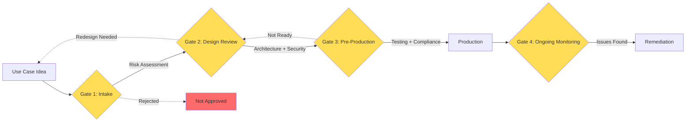
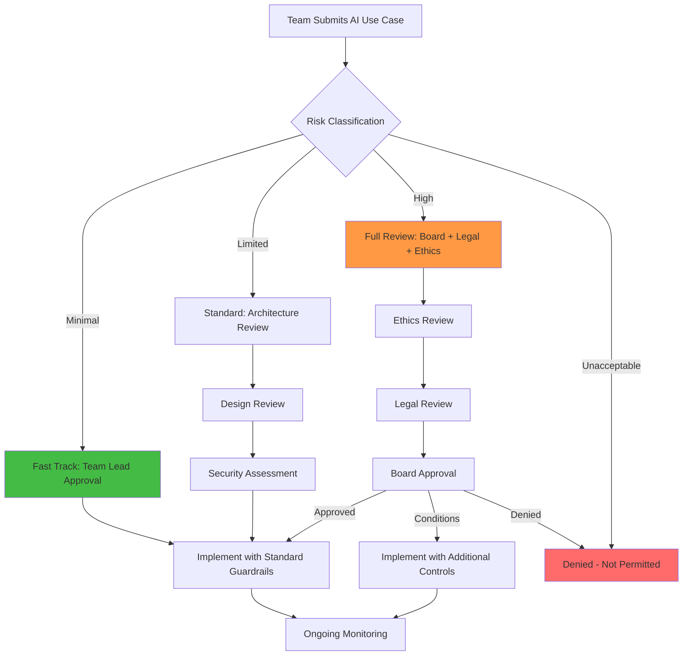

# AI Governance Operating Model

## The "Traffic Laws for AI" Analogy

Imagine a city without traffic laws: cars going any speed, no stop signs, no lanes. Some drivers would be careful, others reckless, and accidents would be constant. Traffic laws don't prevent all accidents, but they create predictable, safe behavior at scale.

AI governance is the same: it creates rules, processes, and oversight so that AI systems in your organization behave predictably, safely, and legally — even as dozens of teams build different AI features independently.

Without governance, you get: shadow AI deployments, unreviewed models accessing sensitive data, compliance violations discovered during audits, and "who approved this?" moments after incidents.

---

## The AI Architecture Review Board

### Who's On It

| Role | Why They're Needed |
|------|-------------------|
| AI/ML Architect | Technical feasibility, architecture patterns |
| Security Engineer | Threat assessment, attack surface analysis |
| Privacy/Legal Counsel | Compliance, data protection, liability |
| Ethics Representative | Fairness, bias, societal impact |
| Business Stakeholder | Value alignment, risk appetite |
| Platform Engineer | Infrastructure, cost, operational readiness |

### What Gets Reviewed

- New AI use cases before development starts
- Model changes (new model, fine-tuning, provider switch)
- Data access changes (new data sources for RAG)
- Permission changes (new capabilities for agents)
- Third-party AI integrations
- Production incidents (post-mortems)

### Review Gates and Criteria

**Gate 1 - Intake:** Is this a valid use case? What's the risk level? Does it comply with policy?

**Gate 2 - Design Review:** Is the architecture sound? Are guardrails in place? Is auth/authz correct?

**Gate 3 - Pre-Production:** Has it been tested (including adversarial)? Are monitoring and alerting configured?

**Gate 4 - Ongoing:** Are metrics healthy? Any drift? Any incidents?

---

## Governance Artifacts

### AI Risk Register

| Risk ID | Description | Likelihood | Impact | Mitigation | Owner | Status |
|---------|-------------|-----------|--------|-----------|-------|--------|
| R-001 | PII leaked via chatbot | Medium | High | Output guardrails + PII scanner | Security Team | Mitigated |
| R-002 | Biased hiring recommendations | Low | Critical | Fairness testing + human review | ML Team | Monitoring |
| R-003 | Model hallucination in medical context | High | Critical | Human-in-the-loop mandatory | Product Team | Active |

### Model Inventory

Track every model in production:
- Model name and version
- Provider (OpenAI, Anthropic, self-hosted)
- Use case and owner
- Data inputs (what does it access?)
- Risk level classification
- Last review date
- Compliance certifications

### Use Case Registry

Every AI use case documented:
- Business justification
- Target users
- Data sources
- Expected behavior and boundaries
- Risk assessment outcome
- Approval status and approvers
- Go-live date and review schedule

### Incident Register

AI-specific incidents:
- Hallucinations that reached users
- Guardrail bypasses
- PII exposures
- Bias complaints
- Cost overruns
- Availability issues

### Policy Library

- Acceptable AI Use Policy
- AI Data Governance Policy
- Model Risk Management Policy
- AI Incident Response Plan
- Third-Party AI Vendor Policy
- AI Ethics Guidelines

---

## Approval Process for New AI Use Cases

---

## Monitoring and Auditing

### What to Monitor

| Metric | Why | Alert Threshold |
|--------|-----|----------------|
| Guardrail trigger rate | Spike = attack or model drift | >2x baseline |
| PII detection rate in output | Leakage indicator | Any detection |
| Cost per request | Budget control | >$X per request |
| Latency p99 | User experience | >5 seconds |
| Hallucination rate | Quality degradation | >5% (sampled) |
| User feedback (thumbs down) | Satisfaction proxy | >20% negative |
| Token usage trend | Cost forecasting | >projected budget |

### Audit Trail Requirements

Every AI interaction should log (with PII redacted):
- Who made the request (user identity)
- What was asked (sanitized prompt)
- What was retrieved (document IDs, not content)
- What was returned (response hash or category)
- What tools were called (with parameters)
- What guardrails fired (if any)

---

## Incident Response for AI Failures

AI incidents are different from traditional incidents:

1. **Detection** — Often reported by users ("the AI said something weird") not monitoring
2. **Triage** — Is it a one-off hallucination or systematic failure?
3. **Containment** — Can you disable the feature? Fallback to non-AI path?
4. **Root cause** — Was it prompt injection? Model drift? Data issue? Guardrail gap?
5. **Remediation** — Update guardrails, retrain, add monitoring, fix data
6. **Communication** — Inform affected users if PII was exposed
7. **Prevention** — Add test cases, update policies, improve detection

---

## AI Maturity Model

| Level | Name | Characteristics |
|-------|------|----------------|
| 1 | Ad-hoc | Individual experiments, no oversight, shadow AI |
| 2 | Aware | Basic policies exist, some teams follow them |
| 3 | Governed | Central registry, review process, standard guardrails |
| 4 | Measured | Metrics tracked, audits regular, incidents managed |
| 5 | Optimized | Continuous improvement, predictive risk management, automated compliance |

Most organizations are at level 1-2. Level 3 is the critical transition — this is where governance becomes real, not just aspirational.

---

## Key Takeaways

1. **Governance is not bureaucracy** — It's the minimum structure needed to prevent chaos at scale
2. **Risk-based approach** — Not every AI feature needs full board review; classify and act accordingly
3. **Artifacts matter** — If it's not documented, it doesn't exist (for compliance purposes)
4. **Monitor continuously** — AI systems drift in ways traditional software doesn't
5. **Start with the review board** — Even a lightweight one prevents the worst mistakes
