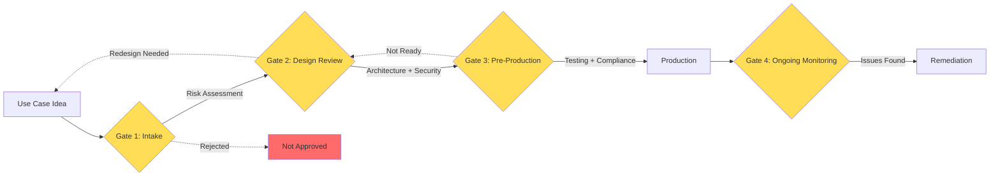
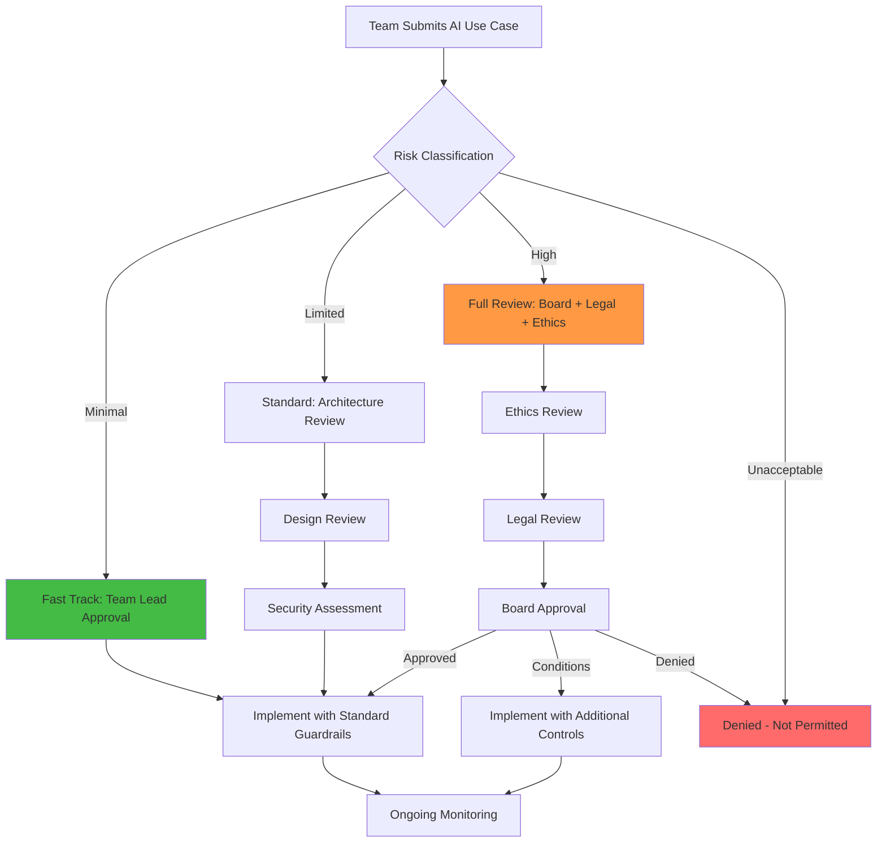

# AI Governance Operating Model

## The "Traffic Laws for AI" Analogy

Imagine a city without traffic laws: cars going any speed, no stop signs, no lanes. Some drivers would be careful, others reckless, and accidents would be constant. Traffic laws don't prevent all accidents, but they create predictable, safe behavior at scale.

AI governance is the same: it creates rules, processes, and oversight so that AI systems in your organization behave predictably, safely, and legally — even as dozens of teams build different AI features independently.

Without governance, you get: shadow AI deployments, unreviewed models accessing sensitive data, compliance violations discovered during audits, and "who approved this?" moments after incidents.

---

## The AI Architecture Review Board

### Who's On It

| Role | Why They're Needed |
|------|-------------------|
| AI/ML Architect | Technical feasibility, architecture patterns |
| Security Engineer | Threat assessment, attack surface analysis |
| Privacy/Legal Counsel | Compliance, data protection, liability |
| Ethics Representative | Fairness, bias, societal impact |
| Business Stakeholder | Value alignment, risk appetite |
| Platform Engineer | Infrastructure, cost, operational readiness |

### What Gets Reviewed

- New AI use cases before development starts
- Model changes (new model, fine-tuning, provider switch)
- Data access changes (new data sources for RAG)
- Permission changes (new capabilities for agents)
- Third-party AI integrations
- Production incidents (post-mortems)

### Review Gates and Criteria

**Gate 1 - Intake:** Is this a valid use case? What's the risk level? Does it comply with policy?

**Gate 2 - Design Review:** Is the architecture sound? Are guardrails in place? Is auth/authz correct?

**Gate 3 - Pre-Production:** Has it been tested (including adversarial)? Are monitoring and alerting configured?

**Gate 4 - Ongoing:** Are metrics healthy? Any drift? Any incidents?

---

## Governance Artifacts

### AI Risk Register

| Risk ID | Description | Likelihood | Impact | Mitigation | Owner | Status |
|---------|-------------|-----------|--------|-----------|-------|--------|
| R-001 | PII leaked via chatbot | Medium | High | Output guardrails + PII scanner | Security Team | Mitigated |
| R-002 | Biased hiring recommendations | Low | Critical | Fairness testing + human review | ML Team | Monitoring |
| R-003 | Model hallucination in medical context | High | Critical | Human-in-the-loop mandatory | Product Team | Active |

### Model Inventory

Track every model in production:
- Model name and version
- Provider (OpenAI, Anthropic, self-hosted)
- Use case and owner
- Data inputs (what does it access?)
- Risk level classification
- Last review date
- Compliance certifications

### Use Case Registry

Every AI use case documented:
- Business justification
- Target users
- Data sources
- Expected behavior and boundaries
- Risk assessment outcome
- Approval status and approvers
- Go-live date and review schedule

### Incident Register

AI-specific incidents:
- Hallucinations that reached users
- Guardrail bypasses
- PII exposures
- Bias complaints
- Cost overruns
- Availability issues

### Policy Library

- Acceptable AI Use Policy
- AI Data Governance Policy
- Model Risk Management Policy
- AI Incident Response Plan
- Third-Party AI Vendor Policy
- AI Ethics Guidelines

---

## Approval Process for New AI Use Cases

---

## Monitoring and Auditing

### What to Monitor

| Metric | Why | Alert Threshold |
|--------|-----|----------------|
| Guardrail trigger rate | Spike = attack or model drift | >2x baseline |
| PII detection rate in output | Leakage indicator | Any detection |
| Cost per request | Budget control | >$X per request |
| Latency p99 | User experience | >5 seconds |
| Hallucination rate | Quality degradation | >5% (sampled) |
| User feedback (thumbs down) | Satisfaction proxy | >20% negative |
| Token usage trend | Cost forecasting | >projected budget |

### Audit Trail Requirements

Every AI interaction should log (with PII redacted):
- Who made the request (user identity)
- What was asked (sanitized prompt)
- What was retrieved (document IDs, not content)
- What was returned (response hash or category)
- What tools were called (with parameters)
- What guardrails fired (if any)

---

## Incident Response for AI Failures

AI incidents are different from traditional incidents:

1. **Detection** — Often reported by users ("the AI said something weird") not monitoring
2. **Triage** — Is it a one-off hallucination or systematic failure?
3. **Containment** — Can you disable the feature? Fallback to non-AI path?
4. **Root cause** — Was it prompt injection? Model drift? Data issue? Guardrail gap?
5. **Remediation** — Update guardrails, retrain, add monitoring, fix data
6. **Communication** — Inform affected users if PII was exposed
7. **Prevention** — Add test cases, update policies, improve detection

---

## AI Maturity Model

| Level | Name | Characteristics |
|-------|------|----------------|
| 1 | Ad-hoc | Individual experiments, no oversight, shadow AI |
| 2 | Aware | Basic policies exist, some teams follow them |
| 3 | Governed | Central registry, review process, standard guardrails |
| 4 | Measured | Metrics tracked, audits regular, incidents managed |
| 5 | Optimized | Continuous improvement, predictive risk management, automated compliance |

Most organizations are at level 1-2. Level 3 is the critical transition — this is where governance becomes real, not just aspirational.

---

## Key Takeaways

1. **Governance is not bureaucracy** — It's the minimum structure needed to prevent chaos at scale
2. **Risk-based approach** — Not every AI feature needs full board review; classify and act accordingly
3. **Artifacts matter** — If it's not documented, it doesn't exist (for compliance purposes)
4. **Monitor continuously** — AI systems drift in ways traditional software doesn't
5. **Start with the review board** — Even a lightweight one prevents the worst mistakes

---

## Staff-Level: Anti-Patterns, Trade-offs, and Real Operating Models

### Anti-Patterns in AI Governance

**1. Governance That Blocks All Innovation**
When the governance process takes 6 weeks for a low-risk chatbot, teams route around it. They deploy shadow AI, use personal API keys, or relabel projects to avoid triggering review. Governance that treats every AI use case as high-risk creates a bureaucratic wall that drives innovation underground — the exact opposite of its intent. The solution is risk-tiered governance: minimal friction for low-risk, proportional rigor for high-risk.

**2. Governance Without Tooling (Paper-Only)**
Governance that exists only in policy documents and spreadsheets fails at scale. If registering an AI use case means filling out a 40-field form and waiting for manual review, compliance drops to near zero. Effective governance requires tooling: automated risk classification, self-service registration, integrated CI/CD policy checks, and dashboards that show compliance status in real-time. Policy-as-code > policy-as-PDF.

**3. One-Size-Fits-All Governance**
Applying the same governance process to an internal FAQ chatbot and a medical diagnosis AI is either: (a) too onerous for the chatbot (killing velocity) or (b) too lax for the medical AI (creating risk). Risk classification should determine the governance path. A spam filter doesn't need ethics board review. A hiring algorithm does. Governance must be proportional to potential harm.

**4. No Clear Ownership**
"The AI team handles governance" or "Legal owns AI risk" — neither works alone. Without clear RACI (Responsible, Accountable, Consulted, Informed) for each governance activity, things fall through cracks. Who approves a new model? Who monitors for drift? Who responds to bias complaints? Who decides to shut down a failing system? Every governance function needs a named owner, not a committee.

### Trade-offs: Centralized vs Federated Governance

| Dimension | Centralized (Central AI Governance Team) | Federated (Each BU Governs Own AI) | Staff Guidance |
|-----------|------------------------------------------|-------------------------------------|----------------|
| Consistency | Uniform standards across org | Standards vary by team/BU | Hub-and-spoke: central team sets minimum standards, BUs can add stricter controls |
| Speed | Slow (central bottleneck) | Fast (local decisions) | Risk-tiered: central review only for high-risk, local approval for low-risk with guardrails |
| Expertise | Deep AI governance expertise concentrated | Expertise spread thin, may not exist in all BUs | Central CoE provides tooling/templates, embedded AI champions in each BU |
| Accountability | Clear (central team owns it) | Diffuse (hard to enforce) | Central team accountable for framework, BU leaders accountable for compliance within their scope |
| Scalability | Doesn't scale (100 use cases → central team drowns) | Scales with org | Automate the boring parts (registration, classification), human review only where judgment needed |

**The winning pattern for large orgs:** Federated execution with centralized standards. The central governance team owns: policies, tooling, risk framework, and audit. Business units own: registration, implementation, monitoring, and incident response — within the central framework.

### Real Operating Models: Risk-Tiered Governance

**Banking/Financial Services Model (e.g., JPMorgan, Goldman):**
- **Tier 1 (Minimal Risk):** Internal productivity tools, code completion, document summarization → Team lead approval, standard guardrails, 48-hour registration
- **Tier 2 (Limited Risk):** Customer-facing chatbots, report generation, data analysis → Architecture review + security assessment, 2-week process
- **Tier 3 (High Risk):** Credit decisions, fraud detection, trading algorithms → Full board review + legal + compliance + external audit, 2-3 month process
- **Tier 4 (Prohibited):** Fully autonomous trading without human oversight, unsupervised customer-facing decisions above $X threshold → Not permitted under any circumstances
- Key characteristic: Model risk management (SR 11-7 compliance) extends to AI models same as statistical models

**Healthcare Model (e.g., Kaiser, Mayo Clinic):**
- **Clinical AI:** Multi-stage review (clinical validation → IRB-like ethics review → patient safety board → phased rollout with monitoring). Minimum 6-month validation period with clinician oversight.
- **Operational AI:** Standard IT governance with privacy addendum (scheduling optimization, resource allocation). 2-4 week process.
- **Research AI:** IRB approval required, data use agreements, no production patient data without de-identification proof.
- Key characteristic: Patient safety trumps all velocity concerns; human-in-the-loop mandatory for any clinical decision support.

**Tech Company Model (e.g., Microsoft, Google):**
- Responsible AI teams embedded in product groups (not just central)
- Automated RAI checks in CI/CD pipeline (fairness metrics, content safety benchmarks)
- "RAI Impact Assessment" required before launch, proportional to risk tier
- Red team reviews for high-risk launches
- Public model cards and system cards for transparency
- Key characteristic: Automation-first governance — tooling enables speed while maintaining standards

### The Governance Maturity Journey

Moving from Level 1 (ad-hoc) to Level 3 (governed) requires:
1. **Executive sponsorship** — Governance without teeth is ignored. Someone with authority must enforce it.
2. **A catalyst event** — Often an incident (PII leak, biased output in production, regulatory inquiry) creates urgency.
3. **Quick wins** — Start with a lightweight registry and risk classification, not a 50-page policy. Show value before adding complexity.
4. **Tooling investment** — Policy-as-code, automated classification, self-service registration. Reduce friction below the threshold where teams bypass governance.
5. **Metrics that matter** — Track: time-to-approval by risk tier, incidents prevented, compliance rate, shadow AI detected. Report to leadership quarterly.

### Staff Interview Insight

When asked "How would you set up AI governance for a large organization?", demonstrate:
1. Risk-tiered approach (not one-size-fits-all)
2. Balance between control and velocity (governance that enables, not just restricts)
3. Tooling mindset (automate everything automatable)
4. Clear ownership model (RACI, not "the AI team")
5. Continuous improvement (governance evolves as AI capabilities and risks evolve)
6. Pragmatism: "What's the minimum governance that prevents the worst outcomes while maximizing organizational learning speed?"

---

## Governance Tooling Landscape

| Category | Tools/Platforms | Purpose |
|---|---|---|
| **Model Registry** | MLflow, Weights & Biases, Vertex AI Model Registry | Track model versions, lineage, approval status |
| **Policy-as-Code** | OPA/Rego, Sentinel, custom policy engines | Encode governance rules; automate enforcement |
| **Risk Assessment** | ServiceNow AI Risk, OneTrust AI Governance, custom intake forms | Structured risk evaluation for new AI use cases |
| **Monitoring** | Arize, WhyLabs, Fiddler, Evidently AI | Detect drift, bias, quality degradation in production |
| **Documentation** | Model cards (Google), Datasheets for Datasets, internal wikis | Standardized documentation of models and data |
| **Audit Trail** | Immutable logging (append-only stores), blockchain-based (rare) | Non-repudiable record of decisions and approvals |
| **Access Control** | Cloud IAM, Vault, custom RBAC for model endpoints | Control who can deploy, invoke, or modify AI systems |

---

## Governance Metrics to Track

| Metric | Target | Why It Matters |
|---|---|---|
| Time-to-approval (by risk tier) | Tier 1: < 1 day, Tier 2: < 1 week, Tier 3: < 4 weeks | Governance that's too slow gets bypassed |
| % of AI use cases registered | > 95% | Low registration = shadow AI |
| Incidents prevented by governance gates | Track count + severity | Justifies governance investment |
| Policy compliance rate | > 90% (with trajectory toward 100%) | Measures adoption |
| Shadow AI detection rate | Decreasing trend | Shows coverage improving |
| Governance process satisfaction (team survey) | > 3.5/5 | Governance must be usable |
| Mean time to policy update | < 2 weeks from trigger event | Governance must evolve with threats |
| Audit finding closure rate | > 80% within SLA | Findings without remediation are theater |
