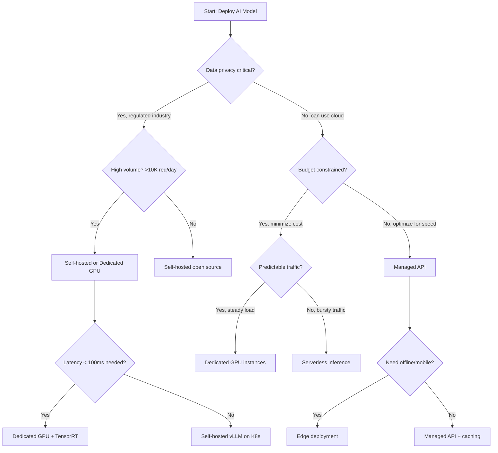
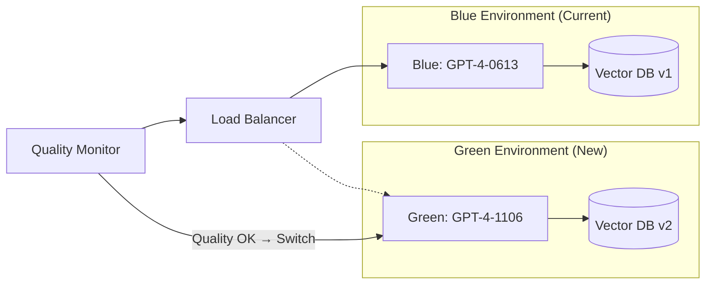
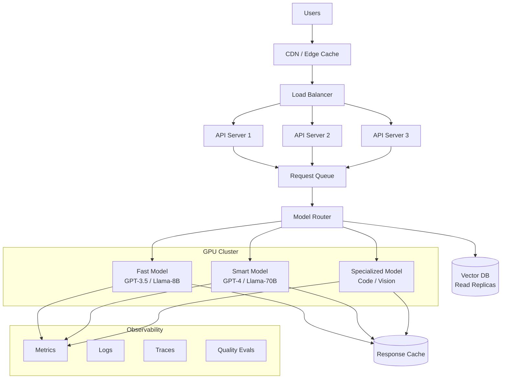

# Deployment Patterns for AI Systems

## The Restaurant Analogy

Deploying an AI system is like opening a restaurant:
- **Managed API** = ordering catering (someone else cooks, you just serve)
- **Self-hosted** = running your own kitchen (full control, full responsibility)
- **Serverless** = food truck (scales up/down, pay per meal)
- **Dedicated GPU** = owning a commercial kitchen (expensive but powerful)
- **Hybrid** = catering for parties, own kitchen for daily meals
- **Edge** = vending machines (limited menu, but instant and everywhere)

---

## Deployment Options Comparison

| Option | Latency | Cost at Scale | Data Privacy | Setup Effort | Flexibility |
|--------|---------|---------------|--------------|--------------|-------------|
| Managed API (OpenAI, Anthropic) | 200-2000ms | High ($$$) | Low (data leaves your infra) | Minutes | Low |
| Self-hosted (vLLM, TGI) | 50-500ms | Medium ($$) | High (data stays local) | Days | High |
| Serverless (Bedrock, Vertex) | 300-3000ms | Medium ($$) | Medium | Hours | Medium |
| Dedicated GPU (A100/H100) | 20-200ms | Low at scale ($) | Highest | Weeks | Highest |
| Hybrid | Varies | Optimized | Configurable | Days-Weeks | High |
| Edge (on-device) | 5-50ms | Lowest (one-time) | Highest | Weeks | Lowest |

---

## Decision Tree: Which Deployment to Choose?



---

## Detailed Breakdown of Each Option

### 1. Managed API (OpenAI, Anthropic, Azure OpenAI)

**When to use:** Prototyping, small-to-medium scale, when you need frontier models.

```
Your App → HTTPS → OpenAI API → Response
```

Pros:
- Zero infrastructure management
- Access to best models (GPT-4, Claude, etc.)
- Automatic scaling
- Always latest model versions

Cons:
- Data leaves your infrastructure
- Rate limits imposed by provider
- Vendor lock-in risk
- Cost grows linearly with usage

### 2. Self-Hosted Open Source (vLLM, TGI, Ollama)

**When to use:** High volume, data privacy requirements, cost optimization at scale.

```
Your App → Your Infra → vLLM (Llama 3, Mistral) → Response
```

Pros:
- Full data control
- No per-token costs (just compute)
- Customize models (fine-tuning)
- No rate limits except hardware

Cons:
- GPU procurement and management
- Model updates are your responsibility
- Need ML engineering expertise
- Hardware failures are your problem

### 3. Serverless Inference (AWS Bedrock, GCP Vertex AI)

**When to use:** Variable traffic, want cloud provider integration, moderate privacy needs.

Pros:
- Pay per request (no idle costs)
- Auto-scales to zero
- Integrated with cloud ecosystem
- Multiple models available

Cons:
- Cold start latency (can be 5-30 seconds)
- Less model customization
- Still sending data to cloud provider
- Premium pricing per token

### 4. Dedicated GPU Instances (A100, H100)

**When to use:** Consistent high load, lowest latency needed, cost-optimized at scale.

Break-even analysis:
```
Managed API cost:    $0.03 per 1K tokens × 10M tokens/day = $300/day
Dedicated H100:     $30/day (cloud) or $3/day (owned, amortized)
Break-even:         ~100K tokens/day
```

### 5. Hybrid Deployment

**When to use:** Different needs for different environments or request types.

```
Development:  Managed API (fast iteration, low volume)
Staging:      Self-hosted (test infra, validate perf)
Production:   Self-hosted primary + Managed API fallback
```

### 6. Edge Deployment (On-Device)

**When to use:** Offline capability, ultra-low latency, maximum privacy.

Models: Phi-3 Mini, Gemma 2B, TinyLlama, ONNX-optimized models

---

## Container Orchestration for AI (Kubernetes + GPU)

AI workloads on Kubernetes have unique needs:

```yaml
# GPU Pod Spec Example
apiVersion: v1
kind: Pod
spec:
  containers:
  - name: model-server
    image: vllm/vllm-openai:latest
    resources:
      limits:
        nvidia.com/gpu: 1  # Request 1 GPU
    env:
    - name: MODEL
      value: "meta-llama/Llama-3-8B"
  nodeSelector:
    gpu-type: a100
```

Key challenges:
- GPUs are scarce and expensive → need efficient scheduling
- Model loading takes minutes → minimize pod restarts
- Memory is limited → right-size models to GPU VRAM
- Multi-GPU models need pod affinity (keep GPUs together)

---

## Model Serving Frameworks

| Framework | Best For | Key Feature |
|-----------|----------|-------------|
| **vLLM** | High throughput | PagedAttention (efficient memory) |
| **TGI** (Text Generation Inference) | Production HuggingFace models | Built-in batching |
| **TensorRT-LLM** | Lowest latency on NVIDIA | Kernel fusion optimization |
| **Ray Serve** | Complex pipelines | Multi-model orchestration |

---

## Blue-Green Deployment for AI Models



Steps:
1. Deploy new model version to Green environment
2. Run eval suite against Green
3. If evals pass, switch traffic from Blue to Green
4. Keep Blue running for instant rollback
5. After confidence period, decommission Blue

---

## Canary Deployments for AI

Unlike web apps, AI canary deployments need **quality metrics**, not just error rates:

```
Traffic split:
  95% → Current model (proven quality)
   5% → New model (being tested)

Monitor for:
  - Latency regression (> 20% increase = bad)
  - Quality scores (eval on sample of responses)
  - User feedback (thumbs up/down ratio)
  - Cost per request change
  - Error rate increase
```

Progressive rollout: 5% → 10% → 25% → 50% → 100%

---

## Rollback Strategies

AI rollbacks are tricky because "worse" is subjective:

| Signal | Action |
|--------|--------|
| Error rate > 5% | Immediate rollback |
| P99 latency > 10s | Immediate rollback |
| Quality score drops > 10% | Rollback within 1 hour |
| Cost per request > 2x | Rollback within 1 hour |
| User complaints spike | Investigate, then decide |

---

## Deployment Topology Diagram



---

## Key Takeaways

1. **Start with managed APIs** — don't over-engineer early
2. **Move to self-hosted** when cost or privacy demands it
3. **Always have a fallback** — AI systems are less reliable than traditional APIs
4. **Canary everything** — new models can fail in unexpected ways
5. **GPU scheduling is hard** — use Kubernetes with GPU operators
6. **Model loading is slow** — keep warm instances ready

---

## Staff-Level: Anti-Patterns

### 1. Big-Bang Deployment for AI Models
Deploying a new model version to 100% of traffic simultaneously. Unlike traditional code deployments, AI models have **non-deterministic behavior** — a model that passes evals can still fail catastrophically on production traffic patterns you didn't test.

### 2. No Rollback Plan
"We'll just deploy the old version if something goes wrong." But model rollbacks require:
- The old model weights still loaded (or reload time of 5-30 minutes)
- The old vector DB index if embeddings changed
- The old prompt templates if they were co-deployed
- State reconciliation for in-flight requests

### 3. Deploying Without Shadow Testing
Pushing a new model without first running it in shadow mode (receiving real traffic, generating responses, but not serving them to users). Shadow testing catches issues that synthetic evals miss — production queries are weirder than test suites.

### 4. Same Deployment Strategy for All Model Types
Using canary deployment for a fine-tuned classifier (where A/B comparison is easy) AND for a generative model (where quality is subjective and takes days to measure). Different model types need different deployment strategies:
- **Classifiers:** Fast A/B test, statistical significance in hours
- **Generative models:** Slow canary, human eval required, days to validate
- **Embedding models:** Must deploy atomically with re-indexed vector DB

---

## Staff-Level: Trade-offs

### Deployment Speed vs Safety
| Strategy | Speed | Safety | Best For |
|----------|-------|--------|----------|
| Blue-Green | Instant switch | High (full env ready) | Critical production models |
| Canary | Slow (days for AI) | Highest (gradual) | Generative models |
| Shadow | No user impact | Highest (no risk) | Major model changes |
| Rolling | Medium | Medium | Stateless classifiers |

### Blue-Green: Expensive but Safe
- **Cost:** 2x infrastructure during transition (2 full GPU clusters)
- **Benefit:** Instant rollback (just flip the load balancer)
- **Hidden cost:** Vector DB must also be duplicated if embeddings changed
- **When worth it:** Revenue-critical models, regulated industries

### Canary: Cheaper but Slower
- **Cost:** Only 5-10% extra capacity needed
- **Benefit:** Real production validation before full rollout
- **Hidden cost:** AI quality metrics take days to converge (unlike error rates which converge in minutes)
- **When worth it:** Most generative AI deployments

### Zero-Downtime vs Simplicity
Zero-downtime for AI models requires pre-loading model weights (minutes), warm GPU pools, and request draining. Sometimes a 30-second maintenance window at 3 AM is simpler and cheaper than the engineering required for true zero-downtime.

---

## Staff-Level: Real-World — How OpenAI Deploys Model Updates

OpenAI's deployment strategy (inferred from observed behavior and public statements):
1. **Internal dogfooding:** New model versions used internally for weeks
2. **Staged rollout by endpoint:** `/v1/chat/completions` gets updates before fine-tuning endpoints
3. **Date-stamped model versions:** `gpt-4-0613` vs `gpt-4-1106` — users pin to versions
4. **Parallel availability:** Old and new versions coexist for months (deprecation timeline)
5. **Shadow evaluation:** New models scored against production queries before public release
6. **Gradual default migration:** The `gpt-4` alias points to newer versions only after extended validation

**Key lesson:** Even OpenAI — with the best eval infrastructure — takes weeks to months for major model transitions. If they need that long, your team certainly does too. Plan deployment timelines in weeks, not hours.
