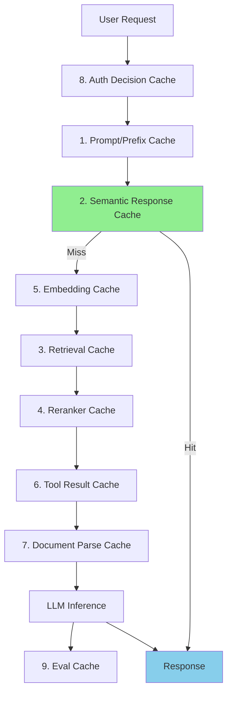
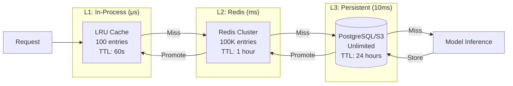

# Caching Architecture for AI Systems

## The Library Analogy

Imagine you're a librarian answering questions:
- **No cache:** Every question requires walking to the stacks, finding the book, reading it, then answering. Every. Single. Time.
- **Exact cache:** You keep a notebook of previous Q&A. Same question? Read from notebook instantly.
- **Semantic cache:** You recognize "What's the capital of France?" and "Tell me France's capital city" are the same question — one notebook entry serves both.

Caching in AI systems saves **money** (fewer API calls), **time** (milliseconds vs seconds), and **capacity** (serve more users with same resources).

---

## Why Caching is Critical for AI

| Without Cache | With Cache |
|--------------|------------|
| Every request costs $0.01-$0.10 | Repeated requests cost ~$0 |
| 500ms-5s latency per request | <50ms for cache hits |
| Limited throughput by model capacity | Cache hits don't use model at all |
| 100% GPU utilization at peak | GPU handles only unique requests |

**Real example:** A customer support bot gets asked "What are your hours?" 500 times/day. Without caching: 500 × $0.03 = $15/day on one question. With caching: $0.03 once, then free.

---

## The 9 Cache Types for AI Systems



---

### 1. Prompt/Prefix Cache (KV Cache)

**What:** When many requests share the same system prompt or prefix, cache the computed attention states.

**Analogy:** Like pre-reading the introduction of a textbook once, then jumping straight to the relevant chapter for each student's question.

```
System prompt (2000 tokens) + User message (50 tokens)
                ↓
First request:  Compute all 2050 tokens        (slow)
Second request: Reuse 2000 cached + compute 50  (fast!)
```

**Savings:** 30-80% latency reduction for long system prompts. OpenAI and Anthropic offer this natively.

### 2. Semantic Response Cache

**What:** If a new question is semantically similar to a previously answered question, return the cached answer.

```python
# Cache stores: (embedding, question, answer)
cached = [
    (embed("What are your hours?"), "What are your hours?", "We're open 9-5 M-F"),
]

new_query = "When are you open?"
new_embed = embed(new_query)
similarity = cosine(new_embed, cached[0].embedding)  # 0.95
if similarity > 0.92:  # threshold
    return cached[0].answer  # Cache hit!
```

### 3. Retrieval Cache

**What:** Same RAG query → same retrieved chunks. Skip the vector search.

**Key:** Cache key = hash(query_embedding + filters + top_k)

**Savings:** Vector DB queries cost 10-50ms each. At 1000 req/s, that's significant.

### 4. Reranker Cache

**What:** Same set of chunks + same query → same reranking order.

**Key:** Cache key = hash(query + sorted(chunk_ids))

**Savings:** Reranking models (like Cohere Rerank) add 100-300ms. Cache eliminates this.

### 5. Embedding Cache

**What:** Same text → same embedding vector. Never embed the same string twice.

```python
cache = {}
def cached_embed(text: str) -> list[float]:
    key = hash(text)
    if key not in cache:
        cache[key] = openai.embeddings.create(input=text)
    return cache[key]
```

**Savings:** Embedding API calls cost money and add latency. Documents rarely change.

### 6. Tool Result Cache

**What:** Same tool call with same parameters → same result (for a TTL period).

```python
# Weather API result valid for 30 minutes
@cache(ttl=1800)
def get_weather(city: str) -> dict:
    return weather_api.get(city)
```

**Savings:** External API calls are slow (100-2000ms) and often rate-limited.

### 7. Document Parse Cache

**What:** Same PDF/document → same extracted text. Parsing is expensive.

**Key:** Cache key = hash(file_content) or hash(file_path + last_modified)

**Savings:** PDF parsing can take 1-10 seconds per document.

### 8. Auth Decision Cache

**What:** Same user + same resource → same permission decision (short TTL!).

**DANGER:** This cache must have very short TTL (30-60 seconds) or be invalidated on permission changes. Stale auth = security vulnerability.

### 9. Eval Cache

**What:** Same model + same input → same evaluation score. Useful during development.

**Savings:** Running evals repeatedly during development wastes tokens.

---

## Cache Key Design

Good cache keys are the difference between useful caching and cache pollution:

```python
# BAD: Too specific (low hit rate)
key = hash(full_request_json_including_timestamp)

# BAD: Too broad (returns wrong answers)
key = hash(first_3_words_of_query)

# GOOD: Captures semantic intent
key = hash(normalized_query + model_version + relevant_filters)

# For semantic cache:
key = embedding_vector  # Use ANN search, not exact match
```

**Normalization tricks:**
- Lowercase
- Remove extra whitespace
- Strip punctuation
- Remove stop words (for retrieval cache)
- Canonicalize dates/numbers

---

## Cache Invalidation Strategies

The two hardest problems in computer science: cache invalidation, naming things, and off-by-one errors.

| Strategy | How It Works | Best For |
|----------|-------------|----------|
| **Time-based (TTL)** | Expire after N seconds | Tool results, weather, stock prices |
| **Event-based** | Invalidate when source changes | Document updates, permission changes |
| **Version-based** | New model version = new cache | Model upgrades, prompt changes |
| **Capacity-based (LRU)** | Evict least-recently-used when full | General purpose |
| **Manual** | Admin purges specific entries | Emergency corrections |

```python
# Version-based example
CACHE_VERSION = "v3"  # Bump when prompt changes
CACHE_PREFIX = f"response_cache:{CACHE_VERSION}:"

def get_cache_key(query: str) -> str:
    return f"{CACHE_PREFIX}{hash(query)}"
```

---

## Cache Safety Rules

1. **NEVER cache auth decisions for more than 60 seconds**
2. **NEVER serve cached responses after a model version change** (old answers may be wrong)
3. **ALWAYS cache with the model version in the key**
4. **NEVER cache error responses** (transient failures should be retried)
5. **Tag cached responses** so users know it's cached (for debugging)

---

## Semantic Caching Deep Dive

The key question: "How similar is similar enough?"

```
Threshold = 0.92: Very strict, fewer hits, always accurate
Threshold = 0.85: Moderate, more hits, occasional mismatches
Threshold = 0.78: Loose, many hits, risky for nuanced queries
```

**Recommended:** Start at 0.95 and lower gradually while monitoring quality.

**Failure modes:**
- "How do I delete my account?" vs "How do I create an account?" → Similarity: 0.89! Too close despite opposite intent.
- Solution: Also check for negation words, key entity differences.

---

## Cache Hit Rate Optimization

Target hit rates by cache type:

| Cache Type | Target Hit Rate | If Below Target |
|------------|----------------|-----------------|
| Embedding cache | >90% | Your corpus is too dynamic |
| Document parse cache | >95% | Documents changing too often |
| Retrieval cache | 30-60% | Normal — queries are diverse |
| Semantic response cache | 20-50% | Normal for varied user base |
| Tool result cache | 40-70% | Depends on tool diversity |

**Improving hit rates:**
- Normalize queries before cache lookup
- Increase TTL where safe
- Pre-warm cache with common queries
- Use tiered caching (L1 in-memory, L2 in Redis, L3 in disk)

---

## Caching Layers Architecture



---

## Cost Savings Example

For a RAG chatbot handling 100K requests/day:

```
Without caching:
  100K × $0.03 (inference) = $3,000/day
  100K × $0.001 (embedding) = $100/day
  100K × $0.005 (retrieval) = $500/day
  Total: $3,600/day = $108,000/month

With caching (40% hit rate):
  60K × $0.03 + 40K × $0.0001 = $1,804/day
  Total: ~$54,000/month
  
  Savings: $54,000/month (50%!)
```

---

## Key Takeaways

1. **Layer your caches** — each stage of the AI pipeline can be cached
2. **Semantic cache is the biggest win** — similar questions are extremely common
3. **Cache keys are an art** — too specific = no hits, too broad = wrong answers
4. **Safety first** — never serve stale auth or outdated critical data
5. **Monitor hit rates** — if below target, investigate and optimize
6. **Version your caches** — model changes should invalidate response caches
