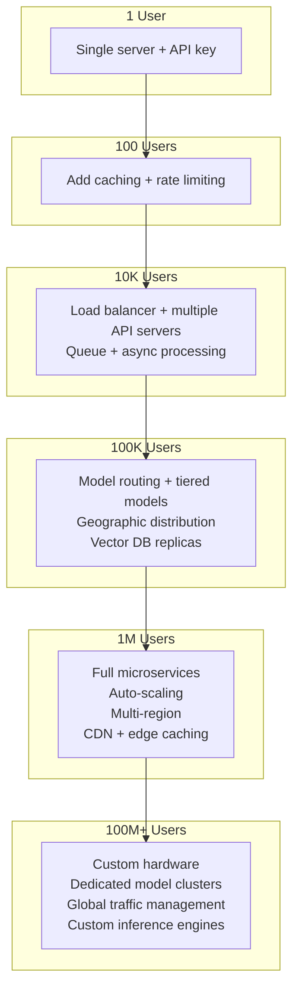
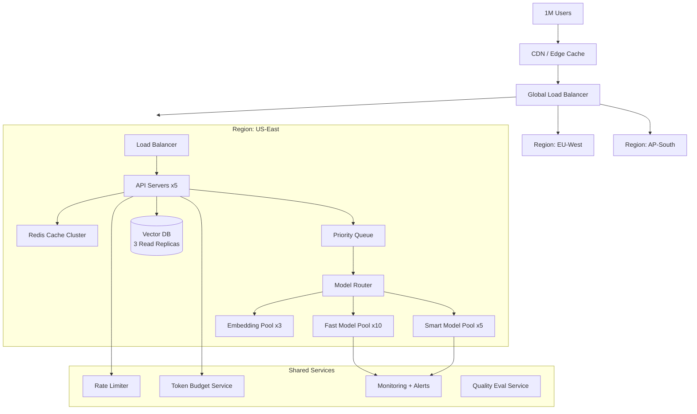

# Scaling AI Systems to Millions of Users

## The Highway Analogy

Scaling an AI system is like expanding a highway system:
- **1 user** = a single dirt road works fine
- **100 users** = you need a paved two-lane road
- **10K users** = you need a highway with multiple lanes
- **1M users** = you need an interstate system with on-ramps, exits, traffic signals, and alternate routes
- **1B users** = you need a global network of highways with air traffic control

The key insight: **you don't build the interstate on day one.** You scale as needed.

---

## Capacity Planning Formula

```
Requests/sec = Daily_Active_Users × Avg_requests_per_user / 86,400

Required_tokens/sec = Requests/sec × Avg_tokens_per_request

GPU_count = Tokens/sec / Tokens_per_GPU_per_sec
```

**Worked example:**
```
Users: 500,000 DAU
Avg requests/user/day: 10
Peak multiplier: 3x (lunch hour spike)

Base requests/sec = 500,000 × 10 / 86,400 = 58 req/s
Peak requests/sec = 58 × 3 = 174 req/s

Avg tokens per request: 2,000 (input + output)
Required tokens/sec = 174 × 2,000 = 348,000 tokens/sec

A100 throughput (Llama-70B): ~2,000 tokens/sec
GPU count = 348,000 / 2,000 = 174 GPUs at peak

With 70% target utilization: 174 / 0.7 = 249 GPUs
```

---

## The Capacity Onion: Layers of Scaling



---

## 12 Patterns for Million-User AI Architecture

### 1. Request Queuing and Prioritization

AI inference is slow (500ms-30s). You can't hold connections open for thousands of concurrent users.

```
User Request → Queue (prioritized) → Worker Pool → Response
                  ↓
         Priority levels:
         P0: Paying users, real-time
         P1: Free users, interactive
         P2: Background/batch jobs
```

### 2. Model Routing (Route to Cheapest Capable Model)

Not every request needs GPT-4. Route intelligently:

```python
def route_request(query: str, complexity: float) -> str:
    if complexity < 0.3:
        return "gpt-3.5-turbo"      # Simple: $0.002/1K tokens
    elif complexity < 0.7:
        return "gpt-4o-mini"        # Medium: $0.01/1K tokens
    else:
        return "gpt-4o"             # Complex: $0.03/1K tokens
```

**Savings:** 60-70% cost reduction with <5% quality loss.

### 3. Prompt Compression

Reduce token count without losing meaning:

- Remove redundant instructions
- Use shorter variable names in few-shot examples
- Compress retrieved context (summarize before injecting)
- Remove whitespace and formatting from context

### 4. Batch Processing for Non-Urgent Requests

```
Urgent (real-time):  User typing in chat → immediate inference
Non-urgent (batch):  Generate daily report → queue for off-peak
                     Re-embed updated docs → batch at night
                     Run evals → batch process
```

### 5. Response Streaming

Streaming doesn't make total latency faster, but **perceived latency** drops dramatically:

```
Without streaming: User waits 3 seconds, then sees full response
With streaming:    User sees first word in 200ms, full response in 3s

Perceived latency: 3000ms → 200ms (15x improvement in user experience)
```

### 6. Geographic Distribution

```
US users → US-East model cluster (30ms network)
EU users → EU-West model cluster (30ms network)
Asia users → AP-Southeast model cluster (30ms network)

vs. single region:
Asia users → US-East (200ms network overhead on every request)
```

### 7. Read Replicas for Vector Databases

Vector DBs are read-heavy in production:

```
Write path: Document ingestion → Primary Vector DB
Read path:  Query → Any of N read replicas (load balanced)

Typical ratio: 1 write primary : 5 read replicas
```

### 8. CDN for Static AI Assets

Cache at the edge:
- Embedding models (for client-side embedding)
- Static prompt templates
- Model cards and documentation
- Pre-computed responses for FAQ

### 9. Connection Pooling for Model Endpoints

```python
# BAD: New connection per request
async def infer(prompt):
    async with aiohttp.ClientSession() as session:  # New connection!
        return await session.post(MODEL_URL, json={"prompt": prompt})

# GOOD: Shared connection pool
pool = aiohttp.ClientSession(connector=aiohttp.TCPConnector(limit=100))
async def infer(prompt):
    return await pool.post(MODEL_URL, json={"prompt": prompt})
```

### 10. Auto-Scaling Based on Queue Depth

```
Queue depth < 10:   Scale to minimum (2 instances)
Queue depth 10-50:  Scale to medium (5 instances)
Queue depth 50-200: Scale to high (10 instances)
Queue depth > 200:  Scale to maximum (20 instances) + alert

Scale-down cooldown: 5 minutes (avoid thrashing)
```

### 11. Token Budget Enforcement

```python
class TokenBudget:
    def __init__(self, user_id: str):
        self.daily_limit = 100_000  # tokens per day
        self.used_today = get_usage(user_id)
    
    def can_process(self, estimated_tokens: int) -> bool:
        return self.used_today + estimated_tokens <= self.daily_limit
    
    def on_limit_reached(self):
        return "Switch to smaller model" or "Queue for tomorrow"
```

### 12. Graceful Degradation

When the system is overloaded, degrade gracefully instead of failing completely:

```
Level 0 (Normal):     Full GPT-4 + RAG + reranking
Level 1 (Busy):       GPT-4 + RAG (skip reranking)
Level 2 (Very busy):  GPT-3.5 + RAG
Level 3 (Overloaded): GPT-3.5 + cached context only
Level 4 (Emergency):  Pre-computed FAQ responses only
```

---

## Load Balancing for AI Systems

AI load balancing is **different from web apps** because request costs vary enormously:

```
Web app request:    ~equal cost (serve a page)
AI request:         Cost varies 100x (10 tokens vs 4000 tokens)
```

**Strategies:**
- **Least-connections:** Good for equal-cost requests (not great for AI)
- **Weighted round-robin:** Assign weights based on GPU capacity
- **Least-tokens-in-flight:** Track active token generation per instance
- **Cost-aware routing:** Route expensive requests to powerful instances

---

## Million-User Architecture Diagram



---

## Scaling Milestones Checklist

| Users | Must Have | Nice to Have |
|-------|-----------|--------------|
| 0-100 | Single API key, basic error handling | Logging |
| 100-1K | Rate limiting, response caching | Monitoring dashboard |
| 1K-10K | Queue, async processing, auto-retry | Model routing |
| 10K-100K | Multi-instance, load balancing, Redis cache | Geographic distribution |
| 100K-1M | Multi-region, auto-scaling, model routing | Custom models |
| 1M+ | Everything above + dedicated infrastructure | Custom inference engines |

---

## Key Takeaways

1. **Don't over-engineer early** — start simple, add complexity when needed
2. **Model routing is the #1 cost saver** — not every request needs the best model
3. **Queue everything** — AI inference is too slow for synchronous processing at scale
4. **Stream responses** — users perceive streaming as 10-15x faster
5. **Degrade gracefully** — a simple answer is better than a timeout
6. **Capacity plan with peaks** — lunch hour traffic can be 3-5x average
