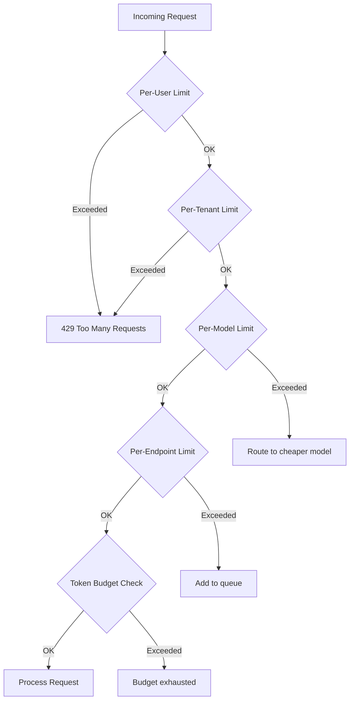
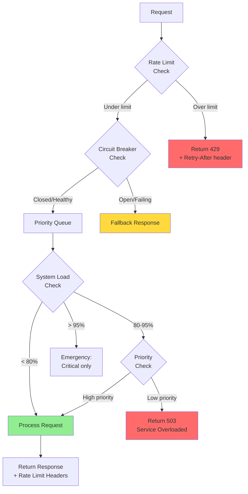

# Rate Limiting and Backpressure for AI Systems

## The Nightclub Analogy

Rate limiting is like a nightclub bouncer:
- **Fixed window:** "Only 100 people per hour" (at hour boundary, counter resets)
- **Sliding window:** "Only 100 people in any 60-minute period"
- **Token bucket:** "You get 10 tokens. Each entry costs 1 token. Tokens refill at 2/minute"
- **Leaky bucket:** "People leave at a steady rate. If the line is too long, newcomers are turned away"

**Backpressure** is what happens when the nightclub is full:
- "Sorry, we're at capacity" (reject)
- "You can wait in line" (queue)
- "VIP? Right this way" (priority)
- "The club next door has room" (redirect/fallback)

---

## Why Rate Limiting is Essential for AI

AI operations are **expensive and slow**:

| Operation | Cost | Latency | Why Limit? |
|-----------|------|---------|------------|
| GPT-4 inference | $0.03-0.06/1K tokens | 1-30s | $$$ adds up fast |
| Embedding generation | $0.0001/1K tokens | 50-200ms | Can be DDoS'd |
| Vector DB query | $0.001/query | 10-50ms | DB can be overwhelmed |
| RAG pipeline (full) | $0.05-0.20/request | 2-45s | GPU capacity is finite |

**Without rate limiting:** One user running a script can consume $1000/hour and starve all other users.

---

## Rate Limiting Strategies

### Fixed Window

```
Window: 1 minute
Limit: 60 requests

[minute 0:00-0:59] → Allow 60 requests, then reject
[minute 1:00-1:59] → Counter resets, allow 60 more

Problem: "Burst at boundary" — 60 requests at 0:59, 60 more at 1:00 = 120 in 2 seconds
```

### Sliding Window

```
Track timestamps of all requests in last 60 seconds.
If count >= 60, reject.

More accurate but more memory (store all timestamps).
Compromise: Sliding window counter (weighted average of current + previous window).
```

### Token Bucket (Recommended for AI)

```
Bucket capacity: 10 tokens
Refill rate: 1 token per second

Request arrives:
  - If bucket has tokens → consume 1 token, allow request
  - If bucket empty → reject (429)

Allows bursts (up to bucket capacity) while enforcing average rate.
```

### Leaky Bucket

```
Queue with fixed processing rate.
Requests enter queue.
Processed at steady rate (e.g., 10/second).
If queue full → reject new requests.

Good for: smoothing traffic to model endpoints.
```

### Adaptive Rate Limiting

```python
def get_current_limit(system_load: float) -> int:
    if system_load < 0.5:
        return 100  # Generous limits
    elif system_load < 0.8:
        return 50   # Tightening
    elif system_load < 0.95:
        return 20   # Restrictive
    else:
        return 5    # Emergency — survival mode
```

---

## Rate Limiting Dimensions for AI



### Per User (Fair Usage)
```
Free tier:  10 requests/minute, 10K tokens/day
Pro tier:   60 requests/minute, 100K tokens/day
Enterprise: 200 requests/minute, unlimited tokens
```

### Per Model (Protect Expensive Models)
```
GPT-3.5:  1000 requests/minute (cheap, generous)
GPT-4:    100 requests/minute (expensive, restricted)
GPT-4-Vision: 20 requests/minute (very expensive)
```

### Per Tenant (Multi-tenant Isolation)
```
Tenant A (paying $1000/mo): 500 req/min
Tenant B (paying $100/mo):  50 req/min
Neither can starve the other.
```

### Per Token Budget (Cost Control)
```python
class TokenBudgetLimiter:
    def check(self, user_id: str, estimated_tokens: int) -> bool:
        used = self.get_daily_usage(user_id)
        limit = self.get_daily_limit(user_id)
        return used + estimated_tokens <= limit
```

---

## Request Costing (Weighted Rate Limiting)

Not all AI requests are equal. A simple classification costs 100x less than a long generation:

```python
def calculate_request_cost(request) -> float:
    """Each request has a cost weight."""
    base_cost = 1.0
    
    # Model multiplier
    model_costs = {"gpt-3.5": 1, "gpt-4": 20, "gpt-4-vision": 40}
    base_cost *= model_costs[request.model]
    
    # Token multiplier (estimated)
    base_cost *= request.max_tokens / 1000
    
    # Feature multipliers
    if request.uses_rag:
        base_cost *= 1.5
    if request.uses_tools:
        base_cost *= 2.0
    
    return base_cost

# Rate limit: 1000 cost-units per minute (not raw request count)
```

---

## Backpressure Patterns

### Queue + Timeout

```
Request → Queue (max size: 1000)
               ↓
         Worker pool processes at capacity
               ↓
         If in queue > 30 seconds → timeout, return 504

User experience: "Your request is being processed..."
```

### Circuit Breaker

When downstream is failing, stop sending requests (see next chapter for details).

### Load Shedding

When overloaded, reject low-priority requests to protect high-priority ones:

```python
def should_shed(request, system_load: float) -> bool:
    if system_load < 0.8:
        return False  # Accept everything
    if system_load < 0.9:
        return request.priority == "low"  # Shed low priority
    if system_load < 0.95:
        return request.priority in ("low", "medium")  # Shed low + medium
    return request.priority != "critical"  # Only critical survives
```

### Priority Queues

```
┌─────────────────────────────┐
│ Priority Queue               │
├─────────────────────────────┤
│ P0 (Critical): VIP users    │ ← Processed first
│ P1 (High): Paying users     │
│ P2 (Normal): Free users     │
│ P3 (Low): Batch jobs        │ ← Processed last (or shed)
└─────────────────────────────┘
```

---

## Communicating Rate Limits to Users

Always include these HTTP headers:

```http
HTTP/1.1 429 Too Many Requests
X-RateLimit-Limit: 60
X-RateLimit-Remaining: 0
X-RateLimit-Reset: 1672531260
Retry-After: 32
Content-Type: application/json

{
  "error": {
    "type": "rate_limit_exceeded",
    "message": "You've exceeded 60 requests per minute. Please retry after 32 seconds.",
    "retry_after_seconds": 32
  }
}
```

**Client-side handling:**
```python
async def call_with_retry(request):
    response = await client.post(url, json=request)
    if response.status == 429:
        retry_after = int(response.headers.get("Retry-After", 60))
        await asyncio.sleep(retry_after)
        return await call_with_retry(request)  # Retry
    return response
```

---

## Rate Limiting + Backpressure Flow



---

## Implementation Checklist

1. **Start with per-user token bucket** — simplest and most effective
2. **Add per-model limits** — protect expensive models
3. **Add cost-weighted limiting** — fair accounting for varied requests
4. **Add adaptive limits** — tighten under load
5. **Always return rate limit headers** — good API citizenship
6. **Log all rejections** — understand your traffic patterns
7. **Alert on high rejection rates** — might indicate an attack or need to scale

---

## Key Takeaways

1. **Token bucket is best for AI** — allows bursts while enforcing average rate
2. **Rate limit on multiple dimensions** — user, model, tenant, cost
3. **Weight requests by cost** — a GPT-4 call ≠ a GPT-3.5 call
4. **Backpressure protects the system** — better to reject some than crash for all
5. **Always communicate limits** — clear headers and error messages
6. **Priority queues are essential** — not all users/requests are equal
