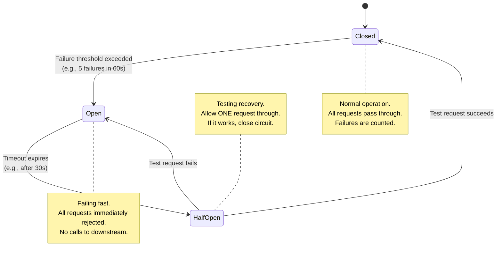
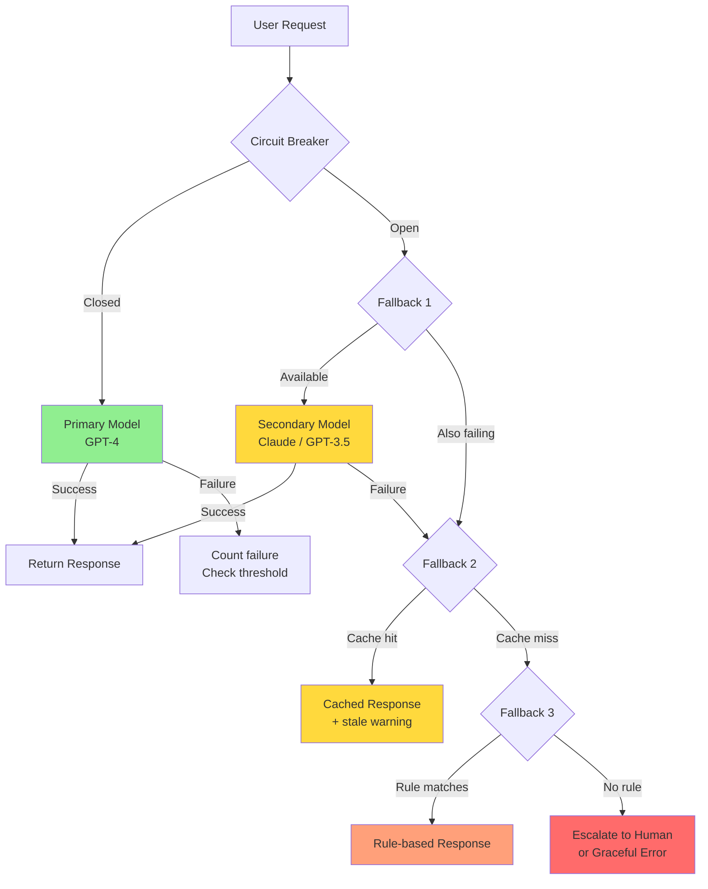
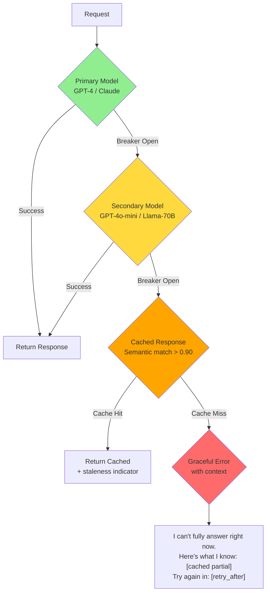

# Circuit Breaker and Fallbacks for AI Systems

## The Electrical Circuit Breaker Analogy

Your home has a circuit breaker panel. When too much current flows (a short circuit), the breaker **trips** — cutting power to that circuit. This prevents:
- Your house burning down (catastrophic failure)
- Other circuits being affected (fault isolation)

It doesn't fix the problem. It **stops the damage from spreading** while you investigate.

Software circuit breakers work the same way: when a downstream service is failing, **stop calling it** instead of piling up timeouts and failures that cascade through your system.

---

## Circuit Breaker States



### State Details

| State | Behavior | Duration |
|-------|----------|----------|
| **Closed** | Requests flow normally. Count failures. | Until failure threshold hit |
| **Open** | All requests fail immediately (no waiting). Use fallback. | Configurable timeout (30-60s) |
| **Half-Open** | Allow 1 test request through. | Until test succeeds or fails |

---

## Why AI Systems Need Circuit Breakers

AI systems have **unique failure modes** that traditional health checks miss:

### 1. Model API Goes Down
```
OpenAI returns 500/503 → Circuit opens → Fallback to Anthropic or local model
```

### 2. Model Starts Returning Garbage
```
Response quality drops (detected by eval) → Circuit opens → Use cached or simpler model
This is INVISIBLE to traditional health checks — the API returns 200!
```

### 3. Latency Spikes Beyond Acceptable
```
Normal: 500ms → Suddenly: 15 seconds
Without breaker: Threads pile up waiting, system freezes
With breaker: After 5 slow responses, circuit opens, use fallback
```

### 4. Cost Per Request Exceeds Budget
```
Model starts generating very long responses (token explosion)
Cost per request jumps from $0.03 to $0.50
Circuit breaker on cost: open circuit, use cheaper model
```

---

## Fallback Strategies

When the circuit is open, you need a plan B (and C, and D):



### Fallback 1: Simpler Model
```python
# GPT-4 is down? Try GPT-3.5
fallback_chain = ["gpt-4", "gpt-3.5-turbo", "local-llama-8b"]
```

### Fallback 2: Cached Response
```python
# Return a previously cached response for similar query
cached = semantic_cache.get_similar(query, threshold=0.85)
if cached:
    return CachedResponse(cached.answer, stale=True)
```

### Fallback 3: Rule-Based Response
```python
# Simple pattern matching for common queries
rules = {
    "hours": "We're open Monday-Friday, 9 AM to 5 PM.",
    "pricing": "Please visit our pricing page at /pricing.",
    "contact": "Email us at support@company.com.",
}
```

### Fallback 4: Human Escalation
```python
return {
    "message": "I'm having trouble answering right now. A team member will follow up within 2 hours.",
    "ticket_created": True
}
```

### Fallback 5: Graceful Error
```python
return {
    "message": "I'm temporarily unable to help with complex questions. Please try again in a few minutes.",
    "retry_after": 60
}
```

---

## Model Routing for Resilience

```python
class ResilientModelRouter:
    def __init__(self):
        self.models = [
            {"name": "gpt-4", "breaker": CircuitBreaker(), "priority": 1},
            {"name": "claude-3", "breaker": CircuitBreaker(), "priority": 2},
            {"name": "local-llama", "breaker": CircuitBreaker(), "priority": 3},
        ]
    
    async def route(self, request):
        for model in sorted(self.models, key=lambda m: m["priority"]):
            if model["breaker"].state != "open":
                try:
                    return await self.call_model(model["name"], request)
                except Exception as e:
                    model["breaker"].record_failure(e)
        
        # All models failing — use fallback
        return self.fallback_response(request)
```

---

## Health Checking for Model Endpoints

Traditional health checks (ping /health) are **insufficient** for AI models. You need:

| Check | What It Tests | Frequency |
|-------|---------------|-----------|
| **Liveness** | Process is running | Every 10s |
| **Readiness** | Model is loaded and accepting requests | Every 30s |
| **Quality** | Responses are coherent (run mini-eval) | Every 5 min |
| **Latency** | Response time within SLA | Every request |
| **Cost** | Tokens generated within budget | Every request |

```python
async def deep_health_check(model_endpoint: str) -> dict:
    # 1. Basic connectivity
    response = await client.post(endpoint, json=HEALTH_PROMPT)
    
    # 2. Latency check
    if response.latency > 5000:  # ms
        return {"healthy": False, "reason": "latency_exceeded"}
    
    # 3. Quality check (does 2+2=4?)
    if "4" not in response.text:
        return {"healthy": False, "reason": "quality_degraded"}
    
    return {"healthy": True}
```

---

## Recovery Patterns

### Exponential Backoff with Jitter

When circuit is half-open and testing recovery:

```python
def get_retry_delay(attempt: int) -> float:
    """Exponential backoff with jitter."""
    base_delay = 1.0  # seconds
    max_delay = 60.0
    
    # Exponential: 1, 2, 4, 8, 16, 32, 60, 60...
    delay = min(base_delay * (2 ** attempt), max_delay)
    
    # Add jitter (±25%) to prevent thundering herd
    jitter = delay * 0.25 * (random.random() * 2 - 1)
    
    return delay + jitter
```

**Why jitter?** Without it, if 100 clients all back off at the same intervals, they all retry at the same time, causing another spike. Jitter spreads retries evenly.

### Gradual Recovery

Don't go from "open" to "fully closed" instantly:

```
Half-Open: Allow 1 request
  → Success → Allow 2 requests
    → Success → Allow 5 requests
      → Success → Allow 10 requests
        → All succeeding → Fully closed

Any failure at any stage → Back to Open
```

---

## Circuit Breaker Configuration

```python
class CircuitBreakerConfig:
    failure_threshold: int = 5        # Failures before opening
    success_threshold: int = 3        # Successes to close from half-open
    timeout: float = 30.0             # Seconds before half-open attempt
    
    # AI-specific thresholds
    latency_threshold: float = 5.0    # Seconds — treat slow as failure
    cost_threshold: float = 0.50      # Dollars — treat expensive as failure
    quality_threshold: float = 0.5    # Score — treat low quality as failure
    
    # Monitoring window
    window_size: int = 60             # Seconds to count failures in
```

---

## Common Mistakes

1. **No fallback defined** — Circuit opens, users get raw errors
2. **Timeout too short** — AI requests are naturally slow; 30s isn't unusual for complex queries
3. **No jitter on retry** — Thundering herd when service recovers
4. **Only checking HTTP status** — AI can return 200 with garbage content
5. **Shared circuit for different operations** — A slow embedding API shouldn't trip the inference circuit
6. **Never testing the circuit breaker** — Practice failure in staging regularly

---

## Key Takeaways

1. **Circuit breakers prevent cascade failures** — one bad model doesn't take down everything
2. **AI needs quality-aware breakers** — HTTP 200 with hallucinations is still a failure
3. **Always have fallbacks** — simpler model > cached answer > rules > error message
4. **Use exponential backoff + jitter** — be gentle when recovering
5. **Test your breakers** — chaos engineering for AI (kill a model, see what happens)
6. **Monitor state transitions** — every open/close is worth investigating

---

## Staff-Level: Anti-Patterns

### 1. No Circuit Breaker on LLM Provider Calls
"OpenAI has 99.9% uptime, we don't need a breaker." But LLM providers have:
- Regional outages (your region might be down while global status shows green)
- Degraded performance modes (200 responses but 30s latency)
- Quality degradation (model returns garbage but HTTP 200)
- Rate limit storms (one bad client triggers org-wide throttling)

Without a breaker, your entire application hangs waiting for 30s timeouts × retry count × concurrent requests = thread pool exhaustion = cascading failure.

### 2. Fallback to Worse Model Without Telling User
Silently switching from GPT-4 to GPT-3.5 during an outage might seem seamless, but:
- Users notice quality drops and blame your product (not the outage)
- Compliance/audit requirements may mandate specific model versions
- Users making critical decisions deserve to know they're getting degraded answers

**Fix:** Always indicate degraded mode. "⚡ Currently using a faster model for quick responses. Complex questions may have reduced accuracy."

### 3. Circuit Breaker Threshold Too Sensitive (Flapping)
Setting `failure_threshold=2` means two consecutive timeouts (which happen routinely with AI) will open the circuit. The circuit opens, one test request succeeds (half-open → closed), then two more timeouts → open again. This flapping between states is worse than no breaker at all — inconsistent user experience.

**Fix:** Use a failure **rate** over a window, not a raw count. "Open if >30% of requests fail within 60 seconds" is more stable than "open after 5 failures."

### 4. No Recovery Testing
You built a fallback chain but never tested it end-to-end. When the primary model actually fails:
- The secondary model's API key expired 3 months ago
- The cached response store was migrated and the connection string is stale
- The rule-based fallback references a product catalog that no longer exists

**Fix:** Monthly "circuit breaker fire drills" — force the breaker open in staging and verify the full fallback chain works.

---

## Staff-Level: Trade-offs

### Automatic Recovery vs Manual Recovery
| Dimension | Automatic | Manual |
|-----------|-----------|--------|
| Recovery time | Seconds (half-open test) | Minutes-hours (human decides) |
| Risk | May close too early (problem not fixed) | Guaranteed fix before resuming |
| Operational load | Low (self-healing) | High (requires human) |
| Best for | Transient failures (network blips) | Persistent issues (model degradation) |

**Recommendation:** Automatic for infrastructure failures (timeouts, 5xx). Manual for quality failures (hallucination spikes) — you need a human to verify the model is producing good outputs before resuming.

### Aggressive Breaking vs Tolerant Breaking
- **Aggressive** (low threshold, quick to open): Protects downstream systems and costs, but causes more downtime. Good for expensive models where a single bad request costs dollars.
- **Tolerant** (high threshold, slow to open): Maximizes availability, but risks cascading failures during real outages. Good for cheap, fast models where a few failures are acceptable.

```
Aggressive: Open after 3 failures in 30s → More fallback usage, safer costs
Tolerant:   Open after 20 failures in 60s → More availability, higher risk

Match to model cost:
  GPT-4 ($0.03/req): Aggressive (each failed call wastes money)
  Local Llama-8B ($0.001/req): Tolerant (failures are cheap, try harder)
```

---

## Staff-Level: Fallback Chain Design

### The Complete Fallback Architecture



### Design Principles for Fallback Chains

1. **Each level should be strictly more available than the previous.** If your secondary model shares infrastructure with your primary, it'll fail at the same time.

2. **Latency budget decreases at each level.** If primary has 10s timeout and secondary has 10s timeout, total worst-case is 20s — unacceptable. Use: primary 5s → secondary 3s → cache 100ms → error instant.

3. **Quality disclosure at each level.** Users must know what tier they're getting:
   - Primary: Full quality (no indicator)
   - Secondary: "Using fast model" badge
   - Cached: "Based on a previous answer" + timestamp
   - Error: Clear messaging with retry guidance

4. **Independent failure domains.** Primary on OpenAI? Secondary should be Anthropic or self-hosted, not another OpenAI model. Cache should be local Redis, not a cloud service that might also be down.

5. **Cost caps per level.** Don't let fallback attempts accumulate unbounded cost. If primary times out after spending $0.05 on partial generation, the total request cost (primary attempt + fallback) should still be bounded.
