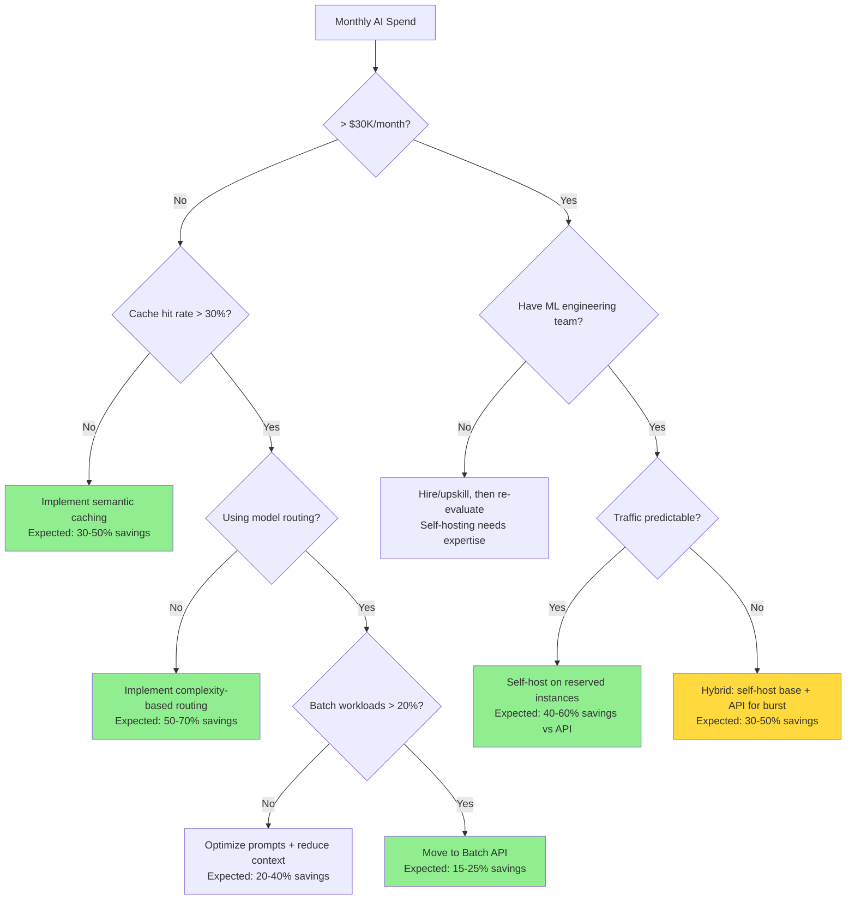

# Cost Optimization for AI Systems

## The Utility Bill Analogy

Running AI in production is like heating a large building:
- You pay for every unit of energy (tokens) consumed
- Some rooms (features) are energy hogs
- Insulation (caching) reduces waste
- Smart thermostats (model routing) apply heat only where needed
- Off-peak rates (batch processing) save money

The goal: **same warmth (quality), less energy (cost)**.

---

## AI System Cost Components

Typical cost breakdown for a production AI system:

```
┌─────────────────────────────────────────┐
│          AI System Monthly Costs         │
├─────────────────────────────────────────┤
│ ███████████████████████████░░░ 65%  Model Inference (LLM calls)
│ ████░░░░░░░░░░░░░░░░░░░░░░░░  8%  Embedding Generation
│ ███░░░░░░░░░░░░░░░░░░░░░░░░░  7%  Vector DB (storage + queries)
│ ████░░░░░░░░░░░░░░░░░░░░░░░░  9%  GPU/Compute (self-hosted)
│ ██░░░░░░░░░░░░░░░░░░░░░░░░░░  5%  Storage (logs, docs, traces)
│ ██░░░░░░░░░░░░░░░░░░░░░░░░░░  4%  Bandwidth
│ █░░░░░░░░░░░░░░░░░░░░░░░░░░░  2%  Other (monitoring, etc.)
└─────────────────────────────────────────┘
```

**Key insight:** Model inference dominates. Optimize there first.

---

## 14 Cost Optimization Strategies

### 1. Model Routing (Biggest Win: 50-70% savings)

Route each request to the **cheapest model that can handle it well**:

```python
def route_by_complexity(query: str) -> str:
    complexity = classify_complexity(query)  # cheap classifier
    
    if complexity == "simple":   # "What time is it?" 
        return "gpt-3.5-turbo"   # $0.002/1K tokens
    elif complexity == "medium": # "Explain recursion"
        return "gpt-4o-mini"     # $0.01/1K tokens  
    else:                        # "Design a distributed system"
        return "gpt-4o"          # $0.03/1K tokens

# Result: 60% of queries handled by cheapest model
```

### 2. Prompt Compression

Every token costs money. Compress aggressively:

```
Before (850 tokens):
"You are a helpful assistant. Please help the user with their question. 
Be thorough and detailed. Consider all aspects. Here is the context: ..."

After (400 tokens):
"Answer using this context: ..."

Savings: 53% fewer input tokens per request
```

### 3. Response Caching (30-50% savings for repetitive workloads)

See caching chapter. Key metric: **cache hit rate × cost per request = savings**.

### 4. Batch Processing

Real-time costs more than batch (API providers offer batch discounts):

```
OpenAI Batch API: 50% discount for 24-hour turnaround
Use for: Daily reports, bulk classification, document processing
```

### 5. Quantized Models (Self-hosted: 2-4x throughput)

```
Full precision (FP16):  Llama-70B needs 140GB VRAM (2× A100-80GB)
4-bit quantized (GPTQ): Llama-70B needs 35GB VRAM (1× A100-40GB)
Quality loss: <5% on most benchmarks
Cost savings: 50-75% fewer GPUs needed
```

### 6. Knowledge Distillation

Train a smaller model to mimic a larger one on your specific use case:

```
Step 1: Run GPT-4 on 10K examples from your domain → collect outputs
Step 2: Fine-tune Llama-8B on those GPT-4 outputs
Step 3: Deploy Llama-8B (10-20x cheaper) for 90%+ same quality on your task
```

### 7. Token Budget Enforcement

Set hard limits to prevent runaway costs:

```python
MAX_INPUT_TOKENS = 4000   # Truncate context beyond this
MAX_OUTPUT_TOKENS = 1000  # Stop generation here
DAILY_BUDGET_PER_USER = 50000  # tokens

# Emergency stop: if daily spend > $X, halt non-critical requests
```

### 8. Streaming to Reduce Wasted Tokens

Without streaming: If user disconnects at 3s, you still pay for the full 10s generation.
With streaming: If user disconnects, stop generation immediately. Pay only for tokens sent.

### 9. Embedding Dimension Reduction

```
text-embedding-3-large: 3072 dimensions → expensive storage/search
text-embedding-3-small: 1536 dimensions → half the storage
Matryoshka embeddings: Truncate to 512 dimensions → 6x savings, ~3% quality loss
```

### 10. Tiered Storage for Vectors

```
Hot tier (Redis/Pinecone):  Last 30 days of vectors — fast, expensive
Warm tier (PostgreSQL):     30-180 days — moderate speed, cheaper
Cold tier (S3 + reindex):   180+ days — slow to access, very cheap
```

### 11. Log Sampling

Don't log every request in production:

```python
import random

def should_log_full(request) -> bool:
    if request.had_error:
        return True  # Always log errors
    if request.cost > 0.10:
        return True  # Always log expensive requests
    return random.random() < 0.1  # Sample 10% of normal requests
```

### 12. Pre-computation of Common Responses

Identify your top 100 queries and pre-compute answers:

```python
# Nightly job
common_queries = get_top_queries(limit=100)
for query in common_queries:
    response = generate_response(query)
    cache.set(query, response, ttl=86400)

# Result: Top queries served from cache instantly, $0 inference cost
```

### 13. Self-Hosting Break-Even Analysis

```
Monthly API cost at volume: $50,000/month (OpenAI)
Self-hosted equivalent:
  - 8× A100 GPUs (cloud): $25,000/month
  - Engineering time: $10,000/month
  - Total: $35,000/month
  - Savings: $15,000/month (30%)

Break-even volume: ~$30,000/month in API costs
Below that: managed API is cheaper (less operational overhead)
```

### 14. Volume Discounts

At scale, negotiate:
- OpenAI: Committed use discounts at >$10K/month
- Anthropic: Enterprise agreements
- Cloud GPU: Reserved instances (40-60% savings vs on-demand)

---

## Unit Economics

Track these metrics religiously:

```
Cost per conversation:  Total AI cost / Number of conversations
Cost per user/month:    Total AI cost / Monthly active users
Cost per action:        Total AI cost / Successful task completions

Example:
  Monthly AI spend:     $30,000
  Monthly conversations: 200,000
  Cost per conversation: $0.15

  Monthly active users:  50,000
  Cost per user:         $0.60

  Is $0.60/user sustainable with your pricing?
  If users pay $20/month → 3% of revenue on AI (excellent)
  If users pay $2/month → 30% of revenue on AI (dangerous)
```

---

## Building a Cost Dashboard

Track daily:

| Metric | Target | Alert If |
|--------|--------|----------|
| Total daily spend | <$1,000 | >$1,200 |
| Cost per request (avg) | <$0.05 | >$0.08 |
| Cost per request (P99) | <$0.50 | >$1.00 |
| Cache hit rate | >40% | <30% |
| Model routing efficiency | >60% cheap model | <50% |
| Wasted tokens (timeouts) | <5% | >10% |

---

## Budget Alerts and Automatic Throttling

```python
class BudgetGuard:
    def __init__(self, daily_budget: float = 1000.0):
        self.daily_budget = daily_budget
    
    def check(self, current_spend: float) -> str:
        ratio = current_spend / self.daily_budget
        
        if ratio < 0.7:
            return "normal"          # All systems go
        elif ratio < 0.85:
            return "warning"         # Alert team, no action
        elif ratio < 0.95:
            return "throttle"        # Route all to cheapest model
        else:
            return "emergency"       # Reject non-critical requests
```

---

## Cost Optimization Prioritization

Start with the highest-impact, lowest-effort optimizations:

```
Impact vs Effort:

HIGH IMPACT, LOW EFFORT (do first):
  ✓ Response caching
  ✓ Prompt compression
  ✓ Token budget limits

HIGH IMPACT, MEDIUM EFFORT:
  ✓ Model routing
  ✓ Batch processing
  ✓ Embedding dimension reduction

HIGH IMPACT, HIGH EFFORT:
  ✓ Self-hosting
  ✓ Knowledge distillation
  ✓ Custom model fine-tuning

LOW IMPACT (do last or skip):
  ✗ Log sampling (saves storage, not inference)
  ✗ Bandwidth optimization
```

---

## Key Takeaways

1. **Model inference is 60-80% of cost** — optimize there first
2. **Model routing is the single biggest lever** — not every request needs GPT-4
3. **Caching compounds** — 40% cache hit rate = 40% cost reduction
4. **Track unit economics** — cost per user must be sustainable with your pricing
5. **Set budget guardrails** — automatic throttling prevents surprise bills
6. **Self-host only when the math works** — below $30K/month, managed is usually cheaper

---

## Staff-Level: Anti-Patterns

### 1. Optimizing Cost Before Validating Quality
Teams that start with "use the cheapest model everywhere" often ship a product that doesn't work, then spend months debugging quality issues. The correct order:
1. Build with the best model (prove the feature works)
2. Measure quality baselines
3. Downgrade models one-by-one, measuring quality at each step
4. Stop downgrading when quality drops below acceptable threshold

Premature cost optimization is the root of many failed AI products.

### 2. No Cost Tracking Per Feature/Team
"Our AI bill is $80K/month" tells you nothing actionable. Without per-feature attribution, you can't answer: Which feature is the cost hog? Which team is over-budget? Where is the ROI negative?

**Fix:** Tag every API call with `feature_id`, `team_id`, `user_tier`. Aggregate costs by these dimensions daily. Make teams own their AI spend like they own their cloud spend.

### 3. Using Most Expensive Model Everywhere "Just in Case"
"GPT-4 is better, so let's use it for everything." But 60-70% of production queries are simple enough for GPT-3.5-turbo. The difference: $0.002/1K vs $0.03/1K — a 15x cost multiplier for marginal quality improvement on easy tasks.

### 4. Not Leveraging Batch API When Possible
Many AI workloads aren't truly real-time: daily report generation, document processing, eval runs, embedding updates. OpenAI's Batch API offers 50% discount for 24-hour turnaround. If even 30% of your workload can tolerate batch, that's 15% total cost reduction for free.

---

## Staff-Level: Trade-offs

### Quality vs Cost: The Pareto Frontier
You cannot optimize both simultaneously. Every cost reduction has a quality trade-off:

```
Quality Score
    │
1.0 │     ●  GPT-4 (expensive, best quality)
    │    ●   GPT-4o-mini (good balance)
0.9 │   ●    Fine-tuned Llama-70B (self-hosted, good quality)
    │  ●     Llama-8B (cheap, adequate for simple tasks)
0.8 │ ●      Cached responses (free, stale risk)
    │●       Rule-based (free, limited scope)
    └────────────────────────────────────────── Cost/request
    $0      $0.001    $0.01     $0.03     $0.10
```

**The Pareto frontier:** Points where you can't improve quality without increasing cost (or vice versa). Your job is to stay ON the frontier — many teams operate below it (paying more than necessary for their quality level).

### Latency vs Cost
| Approach | Latency | Cost | When |
|----------|---------|------|------|
| Real-time API | 500ms-5s | $$$ | User waiting in chat |
| Batch API (50% off) | 1-24 hours | $$ | Background processing |
| Self-hosted spot instances | 100ms-2s | $ | Predictable workloads |
| Pre-computed (cache) | <50ms | ~$0 | Common queries |

### Build vs Buy at Different Scales

| Monthly Spend | Recommendation | Reasoning |
|--------------|----------------|-----------|
| <$5K | Buy (managed API) | Engineering time > API cost |
| $5K-$30K | Buy + optimize | Add caching, routing, compression |
| $30K-$100K | Evaluate self-hosting | Break-even zone, depends on team |
| >$100K | Build (self-host) | ROI on infrastructure investment clear |

---

## Staff-Level: Cost Optimization Decision Tree



**Optimization sequence (apply in order, measure after each):**
1. Caching (easiest, highest ROI)
2. Model routing (medium effort, huge savings)
3. Prompt compression (low effort, moderate savings)
4. Batch API for non-real-time (low effort, moderate savings)
5. Self-hosting (high effort, high savings at scale)
6. Knowledge distillation (highest effort, best long-term economics)
