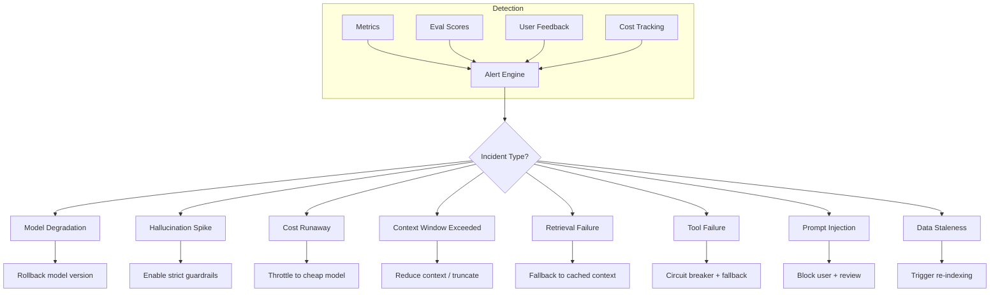
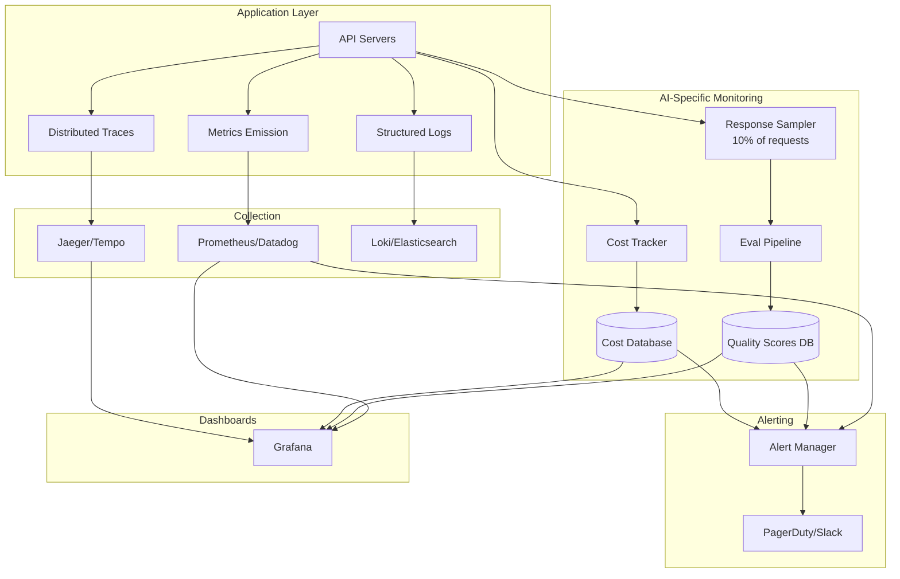

# SRE for AI Systems

## Why AI SRE is Different

Traditional SRE monitors: "Is the server up? Is it fast? Is it returning correct HTTP codes?"

AI SRE monitors all that **plus**: "Is the model giving good answers? Is it hallucinating? Is it costing too much? Is the knowledge fresh?"

**Analogy:** Traditional SRE is like monitoring a vending machine (did it dispense a can?). AI SRE is like monitoring a restaurant (did it dispense a can? Was the food good? Was it the right order? Did the chef use fresh ingredients? Did it cost what we expected?).

---

## SLOs for AI Systems

### Defining Your SLOs

| SLO Category | Metric | Target | Measurement |
|-------------|--------|--------|-------------|
| **Availability** | Model endpoint uptime | 99.9% | Synthetic probes every 30s |
| **Latency** | P50 response time | <1s | Per-request timing |
| **Latency** | P95 response time | <5s | Per-request timing |
| **Latency** | P99 response time | <15s | Per-request timing |
| **Quality** | Faithfulness score | >0.85 | Sampled eval (10% of requests) |
| **Quality** | Relevance score | >0.80 | Sampled eval |
| **Freshness** | RAG data age | <24 hours | Check last index timestamp |
| **Cost** | Cost per request | <$0.10 | Per-request tracking |
| **Safety** | Harmful output rate | <0.01% | Content filter + sampling |

### Error Budget

```
Availability SLO: 99.9% = 43.8 minutes downtime/month allowed

If you've used 30 minutes this month:
  → 13.8 minutes remaining
  → FREEZE deployments until next month
  → Focus on reliability, not features
```

---

## AI-Specific Incidents



---

## Incident Response Runbooks

### 1. Model Degradation (Quality Drops)

**Detection:** Eval scores drop >10% from baseline over 15 minutes.

**Runbook:**
1. Check if model provider had an update (check status page)
2. Compare recent responses to baseline (A/B eval)
3. If confirmed degradation:
   - Route traffic to backup model
   - Alert team
   - Open incident ticket with provider
4. If false alarm: adjust eval thresholds

### 2. Hallucination Spike

**Detection:** Faithfulness score drops below threshold; user reports increase.

**Runbook:**
1. Sample 20 recent responses, manually check for hallucinations
2. Check if RAG retrieval is working (are chunks relevant?)
3. Check if system prompt was accidentally changed
4. Immediate mitigation: lower temperature, add "only use provided context" instruction
5. If RAG is broken: fix retrieval, re-index if needed

### 3. Cost Runaway

**Detection:** Hourly spend >2x normal; single request cost >$1.

**Runbook:**
1. Identify source: which user/endpoint/model?
2. Check for: infinite loops, missing max_tokens, prompt injection causing long outputs
3. Immediate: enable strict token limits, throttle to cheap model
4. Investigate root cause after bleeding stops

### 4. Retrieval Failure (Vector DB Down)

**Detection:** Vector DB health check fails; retrieval latency >5s.

**Runbook:**
1. Check vector DB status (Pinecone status page, or your cluster health)
2. If DB is down: activate circuit breaker, serve from cache
3. If DB is slow: reduce top_k, increase timeout temporarily
4. If data is corrupted: failover to replica, trigger re-index

### 5. Prompt Injection Detected

**Detection:** Input filter triggers; unusual output patterns.

**Runbook:**
1. Block the offending user/session immediately
2. Review the injection attempt (what were they trying to do?)
3. Check if any data was leaked
4. Update input filters to catch this pattern
5. Review logs for similar attempts from other users

---

## On-Call for AI Systems

### What to Monitor (Dashboard)

```
Real-time Panels:
├── Request rate (req/s) and error rate (%)
├── Latency distribution (P50/P95/P99)
├── Model endpoint health (per model)
├── Token usage rate (tokens/s)
├── Cost per hour (rolling)
├── Cache hit rate
├── Queue depth
├── Eval scores (rolling average)
└── Active circuit breakers
```

### When to Page (Alert Severity)

| Severity | Condition | Action |
|----------|-----------|--------|
| **P1 (Page immediately)** | >5% error rate for 5 min | Wake someone up |
| **P1** | All model endpoints down | Wake someone up |
| **P2 (Page during hours)** | P95 latency >10s for 15 min | Investigate within 1 hour |
| **P2** | Quality score <0.7 for 30 min | Investigate within 1 hour |
| **P3 (Ticket)** | Cost 50% above forecast | Address within 24 hours |
| **P3** | Cache hit rate drops >20% | Address within 24 hours |
| **P4 (Info)** | Single user hitting rate limits | Review weekly |

---

## Post-Incident Review for AI Failures

Traditional post-mortem asks: "What broke? Why? How do we prevent it?"

AI post-mortem adds:

1. **Was the failure detectable earlier?** (Could eval scores have caught it?)
2. **Did the fallback work?** (Was the degraded experience acceptable?)
3. **What was the quality impact?** (How many users got bad answers?)
4. **Was there data exposure?** (Did hallucinations leak private info?)
5. **Cost of the incident:** (Money spent on bad responses)

### Template

```markdown
## AI Incident Report: [Title]

**Duration:** [start] to [end]
**Impact:** [X users received degraded responses]
**Cost:** [$ wasted on bad inference]

### Timeline
- HH:MM - First signal (eval score dropped)
- HH:MM - Alert fired
- HH:MM - On-call acknowledged
- HH:MM - Root cause identified
- HH:MM - Mitigation applied
- HH:MM - Full recovery confirmed

### Root Cause
[What actually went wrong]

### Quality Impact
- Responses served during incident: [N]
- Estimated bad responses: [N]
- User complaints received: [N]

### What Went Well
- [Fallback activated correctly]
- [Circuit breaker limited blast radius]

### What Went Poorly
- [Detection took 15 minutes]
- [No fallback for embedding endpoint]

### Action Items
- [ ] Add quality eval on every response (not sampled)
- [ ] Create fallback for embedding endpoint
- [ ] Lower alert threshold for eval scores
```

---

## SRE Monitoring Architecture



---

## Reliability Practices

1. **Chaos engineering for AI:** Randomly kill model endpoints in staging. Does fallback work?
2. **Load testing with realistic prompts:** Not just "hello" — use production-like queries
3. **Eval regression testing:** Run eval suite before every deployment
4. **Canary analysis automation:** Auto-rollback if canary metrics degrade
5. **Game days:** Practice incident response for AI-specific failures quarterly

---

## Key Takeaways

1. **AI SLOs need quality metrics** — uptime alone is insufficient
2. **Hallucinations are invisible to traditional monitoring** — need eval-based detection
3. **Cost is an SLO** — treat budget overruns as incidents
4. **Fallbacks are your safety net** — test them regularly
5. **On-call needs AI context** — traditional SRE training isn't enough
6. **Post-mortems must cover quality impact** — not just availability
