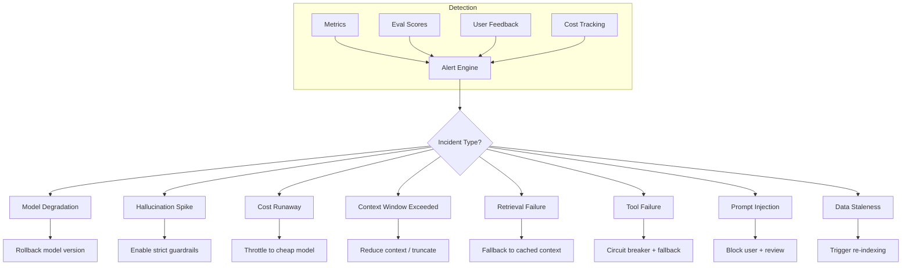
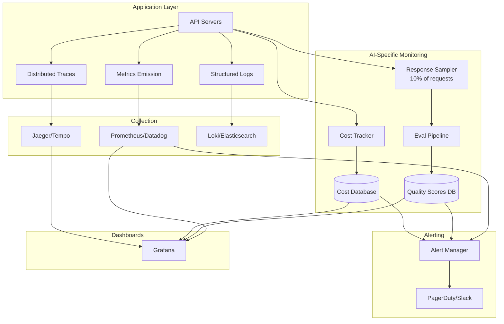

# SRE for AI Systems

## Why AI SRE is Different

Traditional SRE monitors: "Is the server up? Is it fast? Is it returning correct HTTP codes?"

AI SRE monitors all that **plus**: "Is the model giving good answers? Is it hallucinating? Is it costing too much? Is the knowledge fresh?"

**Analogy:** Traditional SRE is like monitoring a vending machine (did it dispense a can?). AI SRE is like monitoring a restaurant (did it dispense a can? Was the food good? Was it the right order? Did the chef use fresh ingredients? Did it cost what we expected?).

---

## SLOs for AI Systems

### Defining Your SLOs

| SLO Category | Metric | Target | Measurement |
|-------------|--------|--------|-------------|
| **Availability** | Model endpoint uptime | 99.9% | Synthetic probes every 30s |
| **Latency** | P50 response time | <1s | Per-request timing |
| **Latency** | P95 response time | <5s | Per-request timing |
| **Latency** | P99 response time | <15s | Per-request timing |
| **Quality** | Faithfulness score | >0.85 | Sampled eval (10% of requests) |
| **Quality** | Relevance score | >0.80 | Sampled eval |
| **Freshness** | RAG data age | <24 hours | Check last index timestamp |
| **Cost** | Cost per request | <$0.10 | Per-request tracking |
| **Safety** | Harmful output rate | <0.01% | Content filter + sampling |

### Error Budget

```
Availability SLO: 99.9% = 43.8 minutes downtime/month allowed

If you've used 30 minutes this month:
  → 13.8 minutes remaining
  → FREEZE deployments until next month
  → Focus on reliability, not features
```

---

## AI-Specific Incidents



---

## Incident Response Runbooks

### 1. Model Degradation (Quality Drops)

**Detection:** Eval scores drop >10% from baseline over 15 minutes.

**Runbook:**
1. Check if model provider had an update (check status page)
2. Compare recent responses to baseline (A/B eval)
3. If confirmed degradation:
   - Route traffic to backup model
   - Alert team
   - Open incident ticket with provider
4. If false alarm: adjust eval thresholds

### 2. Hallucination Spike

**Detection:** Faithfulness score drops below threshold; user reports increase.

**Runbook:**
1. Sample 20 recent responses, manually check for hallucinations
2. Check if RAG retrieval is working (are chunks relevant?)
3. Check if system prompt was accidentally changed
4. Immediate mitigation: lower temperature, add "only use provided context" instruction
5. If RAG is broken: fix retrieval, re-index if needed

### 3. Cost Runaway

**Detection:** Hourly spend >2x normal; single request cost >$1.

**Runbook:**
1. Identify source: which user/endpoint/model?
2. Check for: infinite loops, missing max_tokens, prompt injection causing long outputs
3. Immediate: enable strict token limits, throttle to cheap model
4. Investigate root cause after bleeding stops

### 4. Retrieval Failure (Vector DB Down)

**Detection:** Vector DB health check fails; retrieval latency >5s.

**Runbook:**
1. Check vector DB status (Pinecone status page, or your cluster health)
2. If DB is down: activate circuit breaker, serve from cache
3. If DB is slow: reduce top_k, increase timeout temporarily
4. If data is corrupted: failover to replica, trigger re-index

### 5. Prompt Injection Detected

**Detection:** Input filter triggers; unusual output patterns.

**Runbook:**
1. Block the offending user/session immediately
2. Review the injection attempt (what were they trying to do?)
3. Check if any data was leaked
4. Update input filters to catch this pattern
5. Review logs for similar attempts from other users

---

## On-Call for AI Systems

### What to Monitor (Dashboard)

```
Real-time Panels:
├── Request rate (req/s) and error rate (%)
├── Latency distribution (P50/P95/P99)
├── Model endpoint health (per model)
├── Token usage rate (tokens/s)
├── Cost per hour (rolling)
├── Cache hit rate
├── Queue depth
├── Eval scores (rolling average)
└── Active circuit breakers
```

### When to Page (Alert Severity)

| Severity | Condition | Action |
|----------|-----------|--------|
| **P1 (Page immediately)** | >5% error rate for 5 min | Wake someone up |
| **P1** | All model endpoints down | Wake someone up |
| **P2 (Page during hours)** | P95 latency >10s for 15 min | Investigate within 1 hour |
| **P2** | Quality score <0.7 for 30 min | Investigate within 1 hour |
| **P3 (Ticket)** | Cost 50% above forecast | Address within 24 hours |
| **P3** | Cache hit rate drops >20% | Address within 24 hours |
| **P4 (Info)** | Single user hitting rate limits | Review weekly |

---

## Post-Incident Review for AI Failures

Traditional post-mortem asks: "What broke? Why? How do we prevent it?"

AI post-mortem adds:

1. **Was the failure detectable earlier?** (Could eval scores have caught it?)
2. **Did the fallback work?** (Was the degraded experience acceptable?)
3. **What was the quality impact?** (How many users got bad answers?)
4. **Was there data exposure?** (Did hallucinations leak private info?)
5. **Cost of the incident:** (Money spent on bad responses)

### Template

```markdown
## AI Incident Report: [Title]

**Duration:** [start] to [end]
**Impact:** [X users received degraded responses]
**Cost:** [$ wasted on bad inference]

### Timeline
- HH:MM - First signal (eval score dropped)
- HH:MM - Alert fired
- HH:MM - On-call acknowledged
- HH:MM - Root cause identified
- HH:MM - Mitigation applied
- HH:MM - Full recovery confirmed

### Root Cause
[What actually went wrong]

### Quality Impact
- Responses served during incident: [N]
- Estimated bad responses: [N]
- User complaints received: [N]

### What Went Well
- [Fallback activated correctly]
- [Circuit breaker limited blast radius]

### What Went Poorly
- [Detection took 15 minutes]
- [No fallback for embedding endpoint]

### Action Items
- [ ] Add quality eval on every response (not sampled)
- [ ] Create fallback for embedding endpoint
- [ ] Lower alert threshold for eval scores
```

---

## SRE Monitoring Architecture



---

## Reliability Practices

1. **Chaos engineering for AI:** Randomly kill model endpoints in staging. Does fallback work?
2. **Load testing with realistic prompts:** Not just "hello" — use production-like queries
3. **Eval regression testing:** Run eval suite before every deployment
4. **Canary analysis automation:** Auto-rollback if canary metrics degrade
5. **Game days:** Practice incident response for AI-specific failures quarterly

---

## Key Takeaways

1. **AI SLOs need quality metrics** — uptime alone is insufficient
2. **Hallucinations are invisible to traditional monitoring** — need eval-based detection
3. **Cost is an SLO** — treat budget overruns as incidents
4. **Fallbacks are your safety net** — test them regularly
5. **On-call needs AI context** — traditional SRE training isn't enough
6. **Post-mortems must cover quality impact** — not just availability

---

## Staff-Level: Anti-Patterns

### 1. Using Traditional SLIs for AI (Uptime Alone Is Insufficient)
A model endpoint can be "up" (200 OK, low latency) while producing complete garbage. Traditional SLIs (availability, latency, error rate) miss the most common AI failure mode: **quality degradation without infrastructure symptoms**.

A production AI system needs SLIs across three dimensions:
- **Infrastructure SLIs:** Availability, latency, error rate (traditional)
- **Quality SLIs:** Faithfulness, relevance, coherence, hallucination rate
- **Business SLIs:** Task completion rate, user satisfaction, cost efficiency

### 2. No Quality-Based SLOs
"Our SLO is 99.9% availability and P95 latency < 5s." This SLO allows a system that's always up, always fast, and always wrong. Without quality SLOs, you have no error budget mechanism for quality regressions — no trigger to freeze deployments when the model starts hallucinating.

**Example quality SLO:** "95% of responses score > 0.8 on faithfulness eval, measured on a 10% sample, rolling 1-hour window."

### 3. On-Call Team Doesn't Understand AI-Specific Failures
Traditional SREs know how to handle: server down, disk full, network partition. AI-specific failures require different skills:
- "Model is hallucinating" — Is the retrieval broken? Did the prompt change? Did the model version update?
- "Responses are slow" — Is it the model? The vector DB? Token generation length increased?
- "Costs spiked" — Prompt injection causing long outputs? New feature shipping without budget approval?

**Fix:** AI-specific on-call training, AI failure mode catalog, and runbooks that go beyond "restart the service."

### 4. Runbooks That Say "Restart the Model"
Restarting an LLM inference server takes 5-30 minutes (model reload into GPU memory). During that time you have zero capacity. Traditional runbook advice ("restart the service") is actively harmful for AI systems.

**Better runbook entries:**
- "If quality degraded: route to backup model, investigate root cause, DO NOT restart primary"
- "If latency spiked: check batch size, check GPU memory pressure, reduce max concurrent requests"
- "If costs spiked: check per-request token counts, look for prompt injection, enable strict max_tokens"

---

## Staff-Level: Trade-offs

### SLO Strictness vs Engineering Cost
| SLO Level | Quality SLO | Engineering Required | Team Size |
|-----------|-------------|---------------------|-----------|
| Basic | None (just uptime) | Standard infra monitoring | 1-2 SREs |
| Intermediate | Weekly quality eval batch | Eval pipeline + alerting | 2-3 SREs + ML eng |
| Advanced | Real-time quality scoring on 10% sample | Streaming eval, judge models, quality DB | 4-6 SREs + ML team |
| Elite | Per-request quality scoring | Dedicated eval infrastructure, custom judge models | Full platform team |

Each level is 2-3x more expensive than the previous. Most teams should target Intermediate and move to Advanced only when AI is core to revenue.

### Error Budget: Quality vs Availability
You need **separate error budgets** for quality and availability:

```
Availability budget: 99.9% = 43 min downtime/month
Quality budget:      95% of responses above threshold = 5% allowed to be low-quality

These are INDEPENDENT:
- System can be "up" but burning quality budget (hallucinating)
- System can be "down" briefly but have perfect quality when up

Policy:
- Availability budget exhausted → freeze infra changes
- Quality budget exhausted → freeze model/prompt changes
- Both exhausted → full deployment freeze, all hands on reliability
```

### Human Review vs Automated Recovery
| Failure Type | Automated Recovery | Human Review |
|-------------|-------------------|--------------|
| Latency spike (transient) | Auto-scale, reduce batch size | Not needed |
| Single model endpoint down | Circuit breaker → fallback | Not needed |
| Quality score drops 10% | Route to backup model | Required before resuming primary |
| Hallucination spike | Enable strict guardrails | Required (investigate root cause) |
| Cost runaway | Auto-throttle to cheap model | Required (find source) |
| Data breach/prompt injection | Block user, enable filters | Required (assess damage) |

**Principle:** Automate recovery from **infrastructure** failures. Require human judgment for **quality** and **safety** failures.

---

## Staff-Level: AI-Specific SLIs

### The Complete AI SLI Framework

| SLI | How to Measure | Target | Alert Threshold |
|-----|---------------|--------|-----------------|
| **Quality Score** | LLM-as-judge on 10% sample | > 0.85 | < 0.75 for 15 min |
| **Hallucination Rate** | Faithfulness eval (claim vs source) | < 3% | > 8% for 10 min |
| **Latency P95** | Per-request timing | < 5s | > 10s for 5 min |
| **Latency P99** | Per-request timing | < 15s | > 30s for 5 min |
| **Retrieval Relevance** | NDCG@10 on sampled queries | > 0.7 | < 0.5 for 30 min |
| **Cost per Request** | Token count × price | < $0.10 | > $0.25 avg over 1hr |
| **Task Completion Rate** | User completes intended action | > 70% | < 50% for 1 hr |
| **Safety Violation Rate** | Content filter triggers | < 0.1% | > 0.5% for 5 min |

### Measuring Hallucination Rate in Production

```python
# Sample 10% of responses for quality eval
async def quality_monitor(request, response):
    if random.random() > 0.1:
        return  # Skip 90%
    
    # Run faithfulness check (is response supported by retrieved context?)
    score = await eval_faithfulness(
        question=request.query,
        context=request.retrieved_chunks,
        answer=response.text
    )
    
    metrics.record("hallucination_rate", 1.0 if score < 0.5 else 0.0)
    metrics.record("quality_score", score)
    
    if score < 0.3:  # Severe hallucination
        alert("SEVERE_HALLUCINATION", request_id=request.id)
```

**Key insight:** You cannot measure quality on every request (too expensive — eval itself requires LLM calls). 10% sampling with statistical alerting is the standard approach. At 1000 req/s, that's 100 evals/s — still expensive, budget $3-5K/month for quality monitoring alone.
