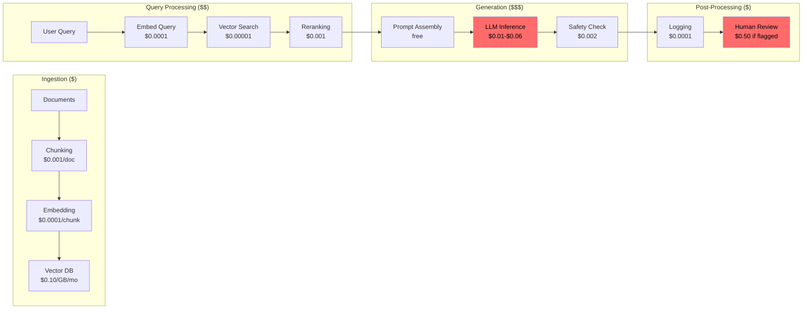
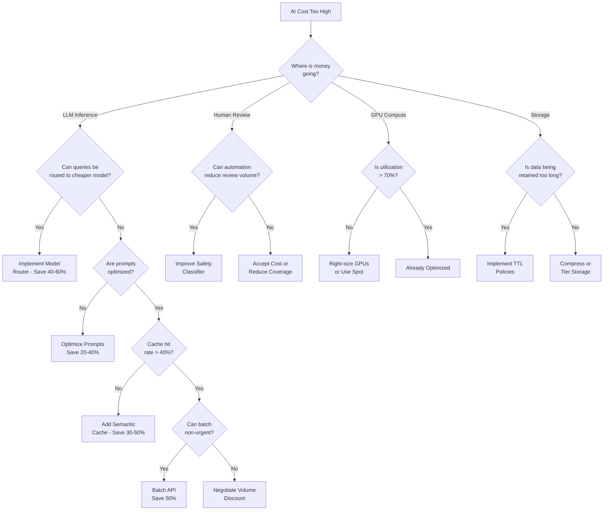

# FinOps for AI at Scale

## AI Cost Anatomy

Every AI query flows through multiple cost centers. Understanding where money goes is prerequisite to optimization.

### Cost Components

| Component | Typical % of Total | Unit | Example Cost |
|-----------|-------------------|------|-------------|
| LLM Inference (tokens) | 40-60% | per 1K tokens | $0.01-$0.06 input, $0.03-$0.12 output |
| Embedding Generation | 5-10% | per 1K tokens | $0.0001-$0.001 |
| Vector DB (storage + queries) | 10-15% | per GB + per query | $0.10/GB/mo + $0.01/1K queries |
| GPU Compute (self-hosted) | 20-40% | per GPU-hour | $2-$30/hr |
| Storage (documents, logs) | 3-5% | per GB/month | $0.02-$0.10 |
| Human Review/RLHF | 5-15% | per task | $0.10-$2.00 |
| Networking/Egress | 1-3% | per GB | $0.05-$0.12 |

### Real Cost Breakdown Example

**Enterprise AI Assistant** processing 10M queries/month:
- Average query: 500 input tokens, 800 output tokens
- 60% routed to GPT-3.5, 30% to GPT-4, 10% to specialized models
- 70% queries hit embedding + retrieval (RAG)

```
Monthly costs:
├── GPT-3.5 (6M queries): 6M × ($0.0005 + $0.0012) = $10,200
├── GPT-4 (3M queries):   3M × ($0.015 + $0.048)   = $189,000
├── Specialized (1M):     1M × $0.005               = $5,000
├── Embeddings (7M):      7M × 500 tokens × $0.0001/1K = $350
├── Vector DB:            Storage $500 + Queries $7,000 = $7,500
├── GPU (fine-tuned):     4 × A100 × 730hrs × $3    = $8,760
├── Storage:              50TB × $0.023              = $1,150
├── Human review (1%):    100K × $0.50              = $50,000
└── TOTAL: ~$272,000/month ($3.3M/year)
```

---

## Cost Flow Through AI Pipeline



**Key insight**: LLM inference and human review dominate costs. Everything else is noise unless you're at massive scale.

---

## Cost Attribution

### Per-Team Attribution

```python
class CostAttributor:
    """Attribute AI costs to teams, features, and customers."""
    
    def __init__(self, pricing: dict):
        self.pricing = pricing
        self.ledger = []
    
    def record_usage(self, query_metadata: dict, usage: dict):
        """Record a single query's cost with full attribution."""
        cost = self.calculate_cost(usage)
        
        self.ledger.append({
            "timestamp": datetime.utcnow(),
            "team": query_metadata["team"],
            "feature": query_metadata["feature"],
            "customer_id": query_metadata.get("customer_id"),
            "model": usage["model"],
            "input_tokens": usage["input_tokens"],
            "output_tokens": usage["output_tokens"],
            "embedding_tokens": usage.get("embedding_tokens", 0),
            "vector_queries": usage.get("vector_queries", 0),
            "cost_breakdown": cost,
            "total_cost": sum(cost.values()),
        })
    
    def calculate_cost(self, usage: dict) -> dict:
        model = usage["model"]
        return {
            "inference_input": usage["input_tokens"] / 1000 * self.pricing[model]["input"],
            "inference_output": usage["output_tokens"] / 1000 * self.pricing[model]["output"],
            "embedding": usage.get("embedding_tokens", 0) / 1000 * self.pricing["embedding"],
            "vector_search": usage.get("vector_queries", 0) * self.pricing["vector_query"],
        }
    
    def report_by_team(self, period: str = "monthly") -> dict:
        """Generate cost report grouped by team."""
        from collections import defaultdict
        team_costs = defaultdict(float)
        for entry in self.ledger:
            team_costs[entry["team"]] += entry["total_cost"]
        return dict(team_costs)
    
    def cost_per_customer(self) -> dict:
        """Unit economics: cost to serve each customer."""
        from collections import defaultdict
        customer_costs = defaultdict(lambda: {"cost": 0, "queries": 0})
        for entry in self.ledger:
            cid = entry.get("customer_id", "internal")
            customer_costs[cid]["cost"] += entry["total_cost"]
            customer_costs[cid]["queries"] += 1
        return dict(customer_costs)
```

### Chargeback Models

| Model | Description | Pros | Cons |
|-------|-------------|------|------|
| **Direct Chargeback** | Team pays exactly what they use | Accurate, incentivizes optimization | Complex metering, team friction |
| **Showback** | Show costs but don't charge | Awareness without friction | No financial incentive to optimize |
| **Allocation** | Split shared costs by usage % | Simple, fair-ish | Doesn't capture true marginal cost |
| **Tiered** | Free tier + pay for overages | Encourages adoption | Hard to set right thresholds |

**Staff recommendation**: Start with **showback** to build awareness, move to **direct chargeback** once teams understand their costs. Never start with chargeback — it kills adoption.

---

## FinOps Framework Applied to AI

### Phase 1: Inform

Build visibility into AI spend:

```python
class AIFinOpsInform:
    """Phase 1: Make AI costs visible."""
    
    def executive_dashboard(self) -> dict:
        """What the CFO sees."""
        return {
            "total_ai_spend_mtd": self.total_spend(),
            "spend_vs_budget": self.spend_vs_budget(),
            "cost_per_revenue_dollar": self.ai_cost / self.revenue,
            "top_3_cost_drivers": self.top_cost_drivers(n=3),
            "month_over_month_trend": self.mom_trend(),
            "forecast_end_of_month": self.forecast_eom(),
        }
    
    def team_dashboard(self, team: str) -> dict:
        """What engineering managers see."""
        return {
            "team_spend_mtd": self.team_spend(team),
            "cost_per_query": self.team_unit_cost(team),
            "model_mix": self.team_model_distribution(team),
            "optimization_opportunities": self.find_savings(team),
            "anomalies": self.detect_anomalies(team),
        }
    
    def developer_tools(self, feature: str) -> dict:
        """What developers see in their IDE/CLI."""
        return {
            "last_deploy_cost_impact": self.cost_diff_last_deploy(feature),
            "prompt_cost_estimate": self.estimate_prompt_cost(feature),
            "cache_hit_rate": self.cache_stats(feature),
            "token_usage_breakdown": self.token_analysis(feature),
        }
```

### Phase 2: Optimize

Reduce costs without reducing value:

```python
class AIFinOpsOptimize:
    """Phase 2: Reduce AI costs systematically."""
    
    def optimization_playbook(self) -> list[dict]:
        """Ordered by typical impact."""
        return [
            {
                "strategy": "Model Routing",
                "typical_savings": "40-60%",
                "effort": "Medium",
                "risk": "Low",
                "description": "Route simple queries to cheaper models",
            },
            {
                "strategy": "Prompt Optimization",
                "typical_savings": "20-40%",
                "effort": "Low",
                "risk": "Low",
                "description": "Shorter prompts, fewer examples",
            },
            {
                "strategy": "Semantic Caching",
                "typical_savings": "30-50%",
                "effort": "Medium",
                "risk": "Low",
                "description": "Cache similar query responses",
            },
            {
                "strategy": "Batch Processing",
                "typical_savings": "50%",
                "effort": "Medium",
                "risk": "Medium",
                "description": "Batch non-urgent requests for discount",
            },
            {
                "strategy": "Reserved Capacity",
                "typical_savings": "20-40%",
                "effort": "Low",
                "risk": "Medium",
                "description": "Commit to volume for discounts",
            },
        ]
```

### Phase 3: Operate

Continuous governance and automation:

```python
class AIFinOpsOperate:
    """Phase 3: Automated governance and continuous optimization."""
    
    def spending_limits(self) -> dict:
        return {
            "per_query_hard_limit": 0.50,      # Kill query if > $0.50
            "per_user_daily_limit": 10.00,      # Rate limit user
            "per_team_monthly_budget": 50000,    # Alert + escalation
            "total_monthly_budget": 300000,      # Emergency shutdown
        }
    
    def automated_actions(self) -> list:
        return [
            "Auto-downgrade model if cost/query > threshold",
            "Auto-enable caching if cache hit rate < 30%",
            "Auto-alert if daily spend > 2x average",
            "Auto-kill runaway agents after $100 spend",
            "Weekly optimization report to team leads",
        ]
```

---

## Unit Economics

### Key Metrics

```python
def calculate_unit_economics(monthly_data: dict) -> dict:
    """Calculate AI unit economics for executive reporting."""
    return {
        "cost_per_conversation": (
            monthly_data["total_cost"] / monthly_data["conversations"]
        ),
        "cost_per_document_processed": (
            monthly_data["ingestion_cost"] / monthly_data["documents_processed"]
        ),
        "cost_per_decision": (
            monthly_data["total_cost"] / monthly_data["decisions_made"]
        ),
        "cost_per_customer_per_month": (
            monthly_data["total_cost"] / monthly_data["active_customers"]
        ),
        "ai_cost_as_pct_of_revenue": (
            monthly_data["total_cost"] / monthly_data["revenue"] * 100
        ),
        "gross_margin_impact": (
            monthly_data["total_cost"] / monthly_data["cogs"] * 100
        ),
    }

# Example output:
# cost_per_conversation: $0.027
# cost_per_document: $0.15
# cost_per_decision: $0.08
# cost_per_customer/month: $2.72
# AI as % of revenue: 3.2%
# Gross margin impact: 8.1%
```

### Benchmarks

| Metric | Good | Acceptable | Needs Work |
|--------|------|------------|------------|
| Cost per conversation | < $0.02 | $0.02-$0.10 | > $0.10 |
| Cost per document | < $0.10 | $0.10-$0.50 | > $0.50 |
| AI % of revenue | < 2% | 2-5% | > 5% |
| Cache hit rate | > 50% | 30-50% | < 30% |
| Model routing savings | > 40% | 20-40% | < 20% |

---

## Budget Forecasting

```python
def forecast_ai_budget(
    current_monthly_spend: float,
    query_growth_rate: float,      # e.g., 0.15 = 15% month-over-month
    efficiency_improvements: float, # e.g., 0.05 = 5% cost reduction/month
    price_changes: float,           # e.g., -0.10 = 10% API price drop expected
    new_features: list[dict] = None # Planned features with cost estimates
) -> dict:
    """Forecast next quarter AI budget."""
    months = []
    spend = current_monthly_spend
    
    for month in range(1, 4):
        # Growth increases cost
        spend *= (1 + query_growth_rate)
        # Optimizations decrease cost
        spend *= (1 - efficiency_improvements)
        # Price changes
        if month == 1:  # Apply once
            spend *= (1 + price_changes)
        
        # New feature costs
        if new_features:
            for feature in new_features:
                if feature["launch_month"] == month:
                    spend += feature["monthly_cost"]
        
        months.append(round(spend, 2))
    
    return {
        "month_1": months[0],
        "month_2": months[1],
        "month_3": months[2],
        "quarter_total": sum(months),
        "vs_current_quarter": sum(months) / (current_monthly_spend * 3),
    }

# Example
forecast = forecast_ai_budget(
    current_monthly_spend=272000,
    query_growth_rate=0.12,
    efficiency_improvements=0.05,
    price_changes=-0.10,
    new_features=[
        {"name": "AI Code Review", "launch_month": 2, "monthly_cost": 30000}
    ]
)
# quarter_total: ~$850K (up from $816K current quarter)
```

---

## Optimization Strategies (Ordered by Impact)

### 1. Model Routing (Saves 40-60%)

**Principle**: 80% of queries don't need GPT-4.

```python
class CostAwareRouter:
    """Route queries to cheapest model that meets quality threshold."""
    
    MODEL_COSTS = {
        "gpt-4": 0.06,        # per 1K output tokens
        "gpt-3.5": 0.002,     # 30x cheaper
        "claude-haiku": 0.001, # 60x cheaper
        "local-llama": 0.0005, # Self-hosted, cheapest
    }
    
    def route(self, query: str, context: dict) -> str:
        complexity = self.estimate_complexity(query)
        
        if complexity == "simple":
            return "local-llama"      # FAQ, simple extraction
        elif complexity == "moderate":
            return "gpt-3.5"          # Summarization, classification
        elif complexity == "complex":
            return "gpt-4"            # Reasoning, multi-step, code gen
        else:
            return "gpt-4"            # Default to best for unknown
    
    def estimate_complexity(self, query: str) -> str:
        """Fast complexity classifier (itself uses cheap model)."""
        # Use a fine-tuned tiny model or heuristics
        features = {
            "length": len(query),
            "has_code": "```" in query,
            "multi_step": any(w in query for w in ["then", "after", "step"]),
            "reasoning": any(w in query for w in ["why", "explain", "compare"]),
        }
        
        if features["has_code"] or features["reasoning"]:
            return "complex"
        elif features["multi_step"] or features["length"] > 500:
            return "moderate"
        return "simple"
```

### 2. Prompt Optimization (Saves 20-40%)

```python
def optimize_prompt(original_prompt: str) -> dict:
    """Strategies to reduce prompt token count."""
    strategies = {
        "remove_redundant_instructions": {
            "savings": "10-20%",
            "risk": "Low",
            "example": "Remove 'You are a helpful assistant' boilerplate",
        },
        "reduce_few_shot_examples": {
            "savings": "30-50%",
            "risk": "Medium",
            "example": "5 examples → 2 examples (test quality first)",
        },
        "compress_system_prompt": {
            "savings": "15-25%",
            "risk": "Low",
            "example": "Use abbreviations in system prompt, full words in user-facing",
        },
        "dynamic_context_selection": {
            "savings": "20-40%",
            "risk": "Low",
            "example": "Only include relevant RAG chunks, not all top-10",
        },
    }
    return strategies
```

### 3. Semantic Caching (Saves 30-50%)

```python
class SemanticCache:
    """Cache responses for semantically similar queries."""
    
    def __init__(self, similarity_threshold: float = 0.95):
        self.threshold = similarity_threshold
        self.cache = {}  # embedding -> response
    
    def get(self, query: str) -> str | None:
        query_embedding = embed(query)
        
        for cached_embedding, response in self.cache.items():
            similarity = cosine_similarity(query_embedding, cached_embedding)
            if similarity > self.threshold:
                return response  # Cache hit! Saved $0.03-$0.06
        
        return None  # Cache miss
    
    def put(self, query: str, response: str):
        query_embedding = embed(query)
        self.cache[query_embedding] = response

# Typical hit rates by domain:
# Customer support: 50-70% (many repeated questions)
# Code generation: 20-30% (more unique queries)
# Document Q&A: 40-60% (same docs, similar questions)
# Creative writing: 5-10% (mostly unique)
```

### 4. Batch vs Real-Time (Batch is 50% Cheaper)

```python
class BatchProcessor:
    """Accumulate non-urgent requests for batch processing."""
    
    BATCH_ELIGIBLE = [
        "document_summarization",
        "content_moderation",
        "translation",
        "data_extraction",
        "report_generation",
    ]
    
    def should_batch(self, request: dict) -> bool:
        return (
            request["type"] in self.BATCH_ELIGIBLE
            and request.get("urgency", "normal") != "immediate"
            and request.get("sla_hours", 1) > 1
        )
    
    def process_batch(self, requests: list[dict]):
        """Process accumulated requests with batch API (50% discount)."""
        # OpenAI Batch API: 50% off, 24-hour SLA
        batch_file = self.create_batch_file(requests)
        batch_id = openai.batches.create(
            input_file_id=batch_file.id,
            endpoint="/v1/chat/completions",
            completion_window="24h"
        )
        return batch_id
```

### 5. Reserved Capacity vs On-Demand

| Commitment | Discount | Best For |
|-----------|----------|----------|
| On-demand | 0% | Spiky/unpredictable traffic |
| 1-month commit | 10-20% | Stable baseline load |
| 3-month commit | 20-30% | Established products |
| Annual commit | 30-50% | Mature, predictable workloads |

---

## Cost Anomaly Detection

```python
class CostAnomalyDetector:
    """Detect cost anomalies before they become $50K surprises."""
    
    def __init__(self, alert_threshold_multiplier: float = 2.0):
        self.threshold = alert_threshold_multiplier
        self.history = []  # Rolling window of hourly costs
    
    def check(self, current_hourly_cost: float) -> dict | None:
        if len(self.history) < 24:
            self.history.append(current_hourly_cost)
            return None
        
        mean = np.mean(self.history[-168:])  # 7-day average
        std = np.std(self.history[-168:])
        
        if current_hourly_cost > mean + self.threshold * std:
            return {
                "alert": "COST_ANOMALY",
                "severity": "HIGH" if current_hourly_cost > mean * 3 else "MEDIUM",
                "current_hourly": current_hourly_cost,
                "expected_hourly": mean,
                "excess_cost_per_hour": current_hourly_cost - mean,
                "projected_daily_excess": (current_hourly_cost - mean) * 24,
                "action": "INVESTIGATE_IMMEDIATELY",
            }
        
        self.history.append(current_hourly_cost)
        return None
    
    def common_causes(self) -> list:
        return [
            "Runaway agent loop (retrying failures infinitely)",
            "Prompt injection causing massive output generation",
            "Cache invalidation causing 100% miss rate",
            "Model routing bug sending everything to GPT-4",
            "Embedding regeneration triggered accidentally",
            "DDoS / abuse of AI endpoint",
            "New feature launched without cost estimation",
        ]
```

---

## Cost Optimization Decision Tree



---

## Governance

### Spending Limits and Approval Workflows

```python
GOVERNANCE_POLICY = {
    "per_query_limits": {
        "soft_limit": 0.10,    # Log warning
        "hard_limit": 0.50,    # Kill query, return cached/fallback
        "absolute_max": 2.00,  # Should never happen, page on-call
    },
    "per_user_limits": {
        "free_tier": 1.00,     # Per day
        "standard": 10.00,     # Per day
        "enterprise": 100.00,  # Per day
    },
    "team_budgets": {
        "approval_required_above": 10000,  # Monthly
        "director_approval_above": 50000,
        "vp_approval_above": 200000,
    },
    "new_feature_launch": {
        "cost_estimate_required": True,
        "load_test_required_above": 5000,   # Monthly estimate
        "gradual_rollout_required_above": 10000,
    },
    "alerts": {
        "daily_spend_2x_average": "slack_channel",
        "daily_spend_3x_average": "page_oncall",
        "monthly_budget_80_pct": "email_team_lead",
        "monthly_budget_100_pct": "escalate_director",
    },
}
```

---

## Reporting

### Executive Dashboard KPIs

```
┌─────────────────────────────────────────────────────────┐
│  AI SPEND: $272K MTD          Budget: $300K  (91% used) │
│  ═══════════════════════════════════════════════════════ │
│                                                         │
│  Unit Costs           │  Efficiency            │        │
│  ─────────────────────│────────────────────────│        │
│  Cost/conversation: $0.027  Cache hit: 47%     │        │
│  Cost/customer: $2.72       Routing savings: 52%│       │
│  AI % revenue: 3.2%        Batch %: 23%        │        │
│                                                         │
│  Top Spenders (Teams)  │  Trend                │        │
│  ──────────────────────│───────────────────────│        │
│  1. Search: $89K       │  ↗ +8% MoM            │        │
│  2. Support: $72K      │  ↘ -3% MoM            │        │
│  3. Content: $61K      │  ↗ +15% MoM (new feat)│        │
│                                                         │
│  Forecast: $295K EOM (within budget)                    │
└─────────────────────────────────────────────────────────┘
```

---

## What Does $1M/Year Look Like?

At $1M/year AI budget (~$83K/month) serving 10M queries/month:

```
Cost per query: $0.0083

Budget allocation:
├── LLM API calls:     $500K (50%)
│   ├── GPT-4 (5%):   $150K  (complex queries only)
│   ├── GPT-3.5 (60%): $200K (bulk of traffic)
│   └── Haiku (35%):   $150K (simple/classification)
├── Vector DB:         $150K (15%)
├── GPU (fine-tuned):  $100K (10%)
├── Human review:      $100K (10%)
├── Storage/logging:   $50K  (5%)
├── Engineering tools: $50K  (5%)
└── Buffer/growth:     $50K  (5%)

What you can serve:
├── 10M queries/month
├── ~333K queries/day
├── ~14K queries/hour
├── Average latency: 800ms (p50), 2.5s (p99)
├── 99.9% availability
└── Human review coverage: 1% of queries
```

---

## Anti-Patterns

### 1. No Cost Tracking
**Problem**: "We use AI" but nobody knows what it costs
**Impact**: $50K surprise bills, no optimization possible
**Fix**: Instrument EVERY API call with cost metadata from day 1

### 2. Shared Cost Pool
**Problem**: AI costs in one "infrastructure" bucket
**Impact**: No accountability, no optimization incentive
**Fix**: Tag every query with team + feature + customer

### 3. Ignoring Embedding Costs
**Problem**: "Embeddings are cheap" → re-embedding entire corpus weekly
**Impact**: At 100M documents, embedding costs $10K+ per re-index
**Fix**: Incremental embedding, only re-embed changed documents

### 4. No Model Routing
**Problem**: Using GPT-4 for everything "to be safe"
**Impact**: 30x cost premium for queries that don't need it
**Fix**: Complexity classifier → route 70-80% to cheaper models

### 5. Optimizing Too Early
**Problem**: Spending weeks on caching before you have 1K users
**Impact**: Premature optimization, wrong abstractions
**Fix**: Optimize when costs > $5K/month or > 5% of revenue

### 6. No Spending Limits
**Problem**: Agent loops, prompt injection → infinite API calls
**Impact**: $10K-$100K incidents
**Fix**: Hard per-query, per-user, and per-hour limits

### 7. Cost Optimization Without Quality Measurement
**Problem**: Switched to cheaper model, didn't measure quality drop
**Impact**: User satisfaction drops, churn increases
**Fix**: Always A/B test cost optimizations against quality metrics

---

## Staff Deliverable: AI Cost Proposal Template

When proposing AI budget or cost changes, use this structure:

```markdown
# AI Cost Proposal: [Feature/Change Name]

## Executive Summary
- Current monthly AI spend: $X
- Proposed change impact: +/- $Y per month
- ROI justification: [business value / cost]

## Current State
- Queries/month: X
- Cost/query: $X
- Model mix: [breakdown]
- Efficiency metrics: cache hit %, routing savings %

## Proposed Change
- What: [description]
- Why: [business justification]
- Expected cost impact: [detailed breakdown]
- Quality impact: [expected metric changes]

## Implementation Plan
- Phase 1: [pilot scope, timeline, cost]
- Phase 2: [expansion criteria]
- Phase 3: [full rollout]
- Rollback plan: [if quality degrades]

## Success Criteria
- Cost reduction: X% within Y months
- Quality maintained: [specific metrics and thresholds]
- Monitoring: [dashboards, alerts]

## Risks
- [Risk 1]: [mitigation]
- [Risk 2]: [mitigation]

## Approval Required
- [ ] Engineering Director (> $X/month)
- [ ] VP Engineering (> $Y/month)
- [ ] Finance review (> $Z/month)
```

---

## Summary

FinOps for AI is not optional at scale. The difference between a well-optimized AI system and a naive one is 5-10x in cost. The playbook:

1. **Instrument everything** - you can't optimize what you can't measure
2. **Route intelligently** - biggest single savings lever
3. **Cache aggressively** - 40-60% of queries are repeated
4. **Set limits** - protect against runaway costs
5. **Report transparently** - teams that see costs optimize costs
6. **Forecast proactively** - no budget surprises

At $1M+/year AI spend, a dedicated FinOps engineer pays for themselves 10x over.
