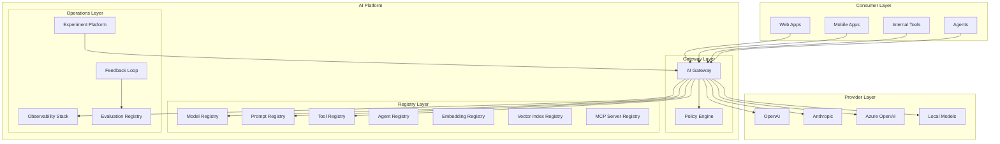

# Enterprise AI Platform Overview

## The "Operating System for AI" Analogy

Think of an enterprise AI platform like an **operating system for your computer**. Without an OS, every application would need to manage its own memory, disk access, networking, and security. That would be chaos. The OS provides shared services so applications can focus on their purpose.

Similarly, an enterprise AI platform provides **shared infrastructure** so that every AI application in your organization doesn't reinvent the wheel — routing, security, cost management, observability, and more are handled centrally.

```
Without Platform:                    With Platform:
┌─────────┐ ┌─────────┐            ┌─────────┐ ┌─────────┐
│ App A   │ │ App B   │            │ App A   │ │ App B   │
│ routing │ │ routing │            │ (logic) │ │ (logic) │
│ auth    │ │ auth    │            └────┬────┘ └────┬────┘
│ logging │ │ logging │                 │           │
│ cost    │ │ cost    │            ┌────┴───────────┴────┐
│ cache   │ │ cache   │            │   AI PLATFORM       │
└─────────┘ └─────────┘            │ routing, auth, logs │
                                    │ cost, cache, eval   │
 Every team rebuilds                └─────────────────────┘
 everything from scratch             Shared services
```

## Why Enterprises Need a Platform vs Ad-Hoc Solutions

| Ad-Hoc AI | Platform AI |
|-----------|-------------|
| Each team picks their own LLM provider | Centralized provider management |
| No visibility into total AI spend | Real-time cost dashboards |
| Inconsistent security practices | Uniform guardrails everywhere |
| No way to compare model quality | Built-in evaluation framework |
| Prompt sprawl across repos | Versioned prompt registry |
| "It works on my laptop" deployments | Standardized CI/CD for AI |
| No audit trail | Full observability and compliance |

The tipping point is usually **3-5 AI applications**. Below that, ad-hoc works. Above that, you're drowning in operational complexity.

## The 13 Core Components of an AI Platform

### 1. AI Gateway (Traffic Management)
The **front door** for all AI traffic. Every request to any model goes through here. Handles routing, rate limiting, caching, auth, and logging. Think of it as an NGINX specifically designed for LLM traffic.

### 2. Model Registry (Version, Deploy, Route)
A **catalog of all models** available in the organization. Tracks which models are deployed where, their capabilities, costs, and performance characteristics. Like a package registry (npm) but for AI models.

### 3. Prompt Registry (Version, Test, Deploy Prompts)
**Git for prompts.** Stores prompt templates with versions, allows A/B testing between versions, and supports instant rollback. Prompts are treated as first-class deployable artifacts.

### 4. Embedding Registry (Manage Embedding Models)
Tracks which embedding models are used for which data. Critical because if you change embedding models, all your vectors become incompatible. Like a schema registry for your vector space.

### 5. Tool Registry (Catalog of Available Tools)
A **service catalog** for AI tools. Lists all functions/APIs that agents can call, with schemas, permissions, rate limits, and documentation. Agents discover capabilities through this registry.

### 6. MCP Server Registry (Discover MCP Servers)
Directory of Model Context Protocol servers available in the org. Agents query this to discover what integrations exist — databases, APIs, file systems, etc.

### 7. Agent Registry (Catalog of Agents)
Lists all deployed agents with their capabilities, tools, models, and guardrails. Enables agent-to-agent communication and orchestration.

### 8. Vector Index Registry (Manage Collections/Indexes)
Tracks all vector databases, collections, and indexes. Knows what data is in each index, which embedding model was used, freshness guarantees, and ownership.

### 9. Evaluation Registry (Eval Suites, Results)
Stores evaluation datasets, test cases, and historical results. Enables regression testing — "did this prompt change make quality worse?"

### 10. Policy Engine (Rules, Guardrails, Limits)
Central enforcement point for organizational rules: "no PII in prompts," "max $50/day per user," "block harmful content." Policies apply uniformly across all AI applications.

### 11. Observability Stack (Traces, Metrics, Logs)
End-to-end visibility into every AI interaction. Distributed traces that show the full journey from user query through routing, model call, tool use, and response.

### 12. Feedback Loop (User Feedback, Corrections)
Captures thumbs up/down, corrections, and implicit signals. Feeds back into evaluation, prompt improvement, and model selection.

### 13. Experiment Platform (A/B Tests, Canary)
Run controlled experiments: "Does GPT-4o perform better than Claude for customer support?" Route traffic, measure outcomes, and make data-driven decisions.

## Platform Architecture



## Platform Maturity Levels

| Level | Name | Description |
|-------|------|-------------|
| **L0** | Ad-Hoc | Individual developers calling APIs directly. No shared infrastructure. |
| **L1** | Managed | Centralized API keys, basic cost tracking. Shared gateway. |
| **L2** | Standardized | Prompt registry, evaluation framework, observability. Consistent practices. |
| **L3** | Optimized | Smart routing, caching, cost optimization. A/B testing. Data-driven decisions. |
| **L4** | Governed | Full policy engine, compliance automation, audit trails. Enterprise-ready. |
| **L5** | Adaptive | Self-optimizing. Platform learns from usage to improve routing, caching, quality automatically. |

Most organizations are at L0-L1. The goal is to reach L3-L4 within 12-18 months of serious AI adoption.

## Key Takeaways

1. **An AI platform is infrastructure, not a product** — it enables other teams to build AI products faster and safer.
2. **Start with the gateway** — it gives immediate value (cost visibility, security, logging) with minimal effort.
3. **Add registries as complexity grows** — you don't need all 13 components on day one.
4. **Maturity is a journey** — move from L0 to L5 incrementally, driven by actual pain points.
5. **Platform thinking prevents AI sprawl** — without it, every team builds their own mini-platform poorly.
