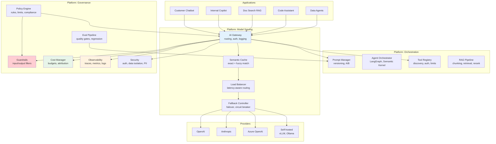

# Enterprise AI Platform Overview

## What Is an Enterprise AI Platform?

An enterprise AI platform is the **shared infrastructure layer** that enables an organization to build, deploy, operate, and govern AI applications at scale. It sits between raw model providers (OpenAI, Anthropic, open-source models) and the applications that serve end users.

**Definition**: A set of centralized services, APIs, and tooling that abstracts away the operational complexity of AI — so product teams focus on application logic, not infrastructure.

**Scope**: Not a single product. It's a composition of capabilities spanning model access, prompt management, evaluation, observability, cost control, security, and governance.

### The "Operating System" Analogy

Without an OS, every application manages its own memory, disk, networking, and security. Without an AI platform, every AI application manages its own:
- API keys and provider failover
- Cost tracking and budgets
- Prompt versioning and rollback
- Quality evaluation
- Content safety and guardrails
- Logging and debugging
- Caching and latency optimization

The platform is the OS. Applications become thin, focused, and fast to build.

---

## Why Platforms Matter

### Without a Platform (3+ AI Applications)

```
Team A: Built custom OpenAI wrapper, logs to Datadog, no cost visibility
Team B: Uses Anthropic directly, built own prompt versioning in Git
Team C: Self-hosted LLaMA, no guardrails, no evaluation
Team D: Using Team A's wrapper (undocumented), breaks when A refactors

Result: 4 different auth patterns, no cost visibility, no quality baseline,
        one compliance incident away from shutting everything down.
```

### The Four Pillars of Platform Value

| Pillar | Without Platform | With Platform |
|--------|-----------------|---------------|
| **Consistency** | Every team builds differently, quality varies wildly | Standardized patterns, shared best practices, uniform quality floor |
| **Governance** | No visibility, no audit trail, compliance risk | Central policy enforcement, full audit log, automated compliance |
| **Efficiency** | Duplicated effort, each team solves same problems | Build once, use everywhere; 80% of infra work eliminated |
| **Velocity** | Weeks to go from idea to production | Days (or hours) from idea to production with platform primitives |

### The Tipping Point

- **1-2 AI applications**: Ad-hoc is fine. Don't build a platform.
- **3-5 AI applications**: Pain emerges. Inconsistency, duplicate work, cost surprises.
- **5+ AI applications**: Platform is mandatory. Without it, you're accumulating technical debt faster than you're delivering value.

---

## Platform Layers

An enterprise AI platform is structured in layers, each building on the one below:

```
┌─────────────────────────────────────────────────────────────┐
│                    APPLICATION LAYER                          │
│  Chatbots, RAG apps, Agents, Copilots, Workflows            │
├─────────────────────────────────────────────────────────────┤
│                   ORCHESTRATION LAYER                         │
│  Prompt management, Agent frameworks, RAG pipelines,         │
│  Tool registries, Workflow engines                            │
├─────────────────────────────────────────────────────────────┤
│                   MODEL SERVING LAYER                         │
│  Gateway, Router, Cache, Load balancer, Fallback,            │
│  Rate limiting, Model registry                               │
├─────────────────────────────────────────────────────────────┤
│                   INFRASTRUCTURE LAYER                        │
│  Compute (GPU/CPU), Storage, Networking, Vector DBs,         │
│  Message queues, Container orchestration                     │
├─────────────────────────────────────────────────────────────┤
│                    GOVERNANCE LAYER (cross-cutting)           │
│  Security, Compliance, Cost management, Observability,       │
│  Guardrails, Audit, Policy engine                            │
└─────────────────────────────────────────────────────────────┘
```

---

## Enterprise AI Platform Architecture



---

## Core Platform Capabilities

### 1. Model Gateway (The Front Door)

Every AI request flows through the gateway. It's the single point of control.

**Responsibilities**:
- **Routing**: Direct requests to the right model/provider based on task, cost tier, or latency requirements
- **Load balancing**: Distribute across multiple API keys, regions, or model instances
- **Fallback**: If OpenAI is down, automatically route to Anthropic or Azure OpenAI
- **Rate limiting**: Per-user, per-team, per-application quotas
- **Authentication**: Verify identity, check permissions, validate API keys
- **Logging**: Every request/response captured for debugging and audit

**Architecture pattern**: The gateway is stateless and horizontally scalable. Think of it as NGINX/Envoy but purpose-built for LLM traffic (handling streaming, token counting, prompt transformation).

**Key metric**: p99 added latency < 5ms. The gateway must be nearly invisible.

### 2. Prompt Management

Prompts are code. They need versioning, testing, review, and safe deployment.

**Capabilities**:
- **Version control**: Every prompt change tracked with diff, author, timestamp
- **A/B testing**: Route 10% of traffic to new prompt version, measure quality
- **Rollback**: Instant revert to previous version when quality drops
- **Parameterization**: Templates with variables, not hardcoded strings
- **Environment promotion**: dev → staging → production pipeline
- **Collaboration**: Non-engineers (product, legal) can propose prompt changes through UI

**Anti-pattern**: Prompts hardcoded in application code, deployed with the application, requiring a full redeploy to change a single word.

### 3. Evaluation Pipeline

You cannot improve what you cannot measure. Automated quality gates prevent regressions.

**Components**:
- **Eval datasets**: Curated input/expected-output pairs per use case
- **Automated scoring**: LLM-as-judge, embedding similarity, regex checks, human labels
- **Regression detection**: "This prompt change reduced accuracy on dataset X by 8%"
- **Quality gates**: Block deployment if eval score drops below threshold
- **Continuous evaluation**: Sample production traffic, run evals, alert on drift

**Pipeline flow**:
```
Prompt Change → Run Eval Suite → Compare to Baseline → Gate Decision → Deploy/Block
```

### 4. Guardrails (Input/Output Protection)

Prevent harmful, non-compliant, or off-topic content at the platform level.

**Input guardrails**:
- PII detection and redaction before sending to external models
- Prompt injection detection
- Topic restriction ("only answer questions about our product")
- Token/cost limits per request

**Output guardrails**:
- Toxicity/harm detection
- Hallucination checks (claim verification against source documents)
- Format validation (JSON schema compliance, etc.)
- Brand safety filters

**Key design decision**: Guardrails must be fast (< 50ms added latency) or async (check after response, flag for review). Synchronous guardrails that add 500ms kill UX.

### 5. Observability (Tracing, Metrics, Dashboards)

End-to-end visibility into every AI interaction. This is what makes AI systems debuggable.

**Three pillars**:

| Pillar | What | Example |
|--------|------|---------|
| **Traces** | Full request journey with timing | User query → gateway (2ms) → prompt template (1ms) → cache miss → OpenAI (850ms) → guardrail check (15ms) → response |
| **Metrics** | Aggregated measurements | p50/p95/p99 latency, tokens/min, cost/hour, error rate, cache hit rate |
| **Logs** | Detailed event records | Full prompt sent, full response received, metadata, user context |

**Critical metrics for AI platforms**:
- Token usage (input/output) per model, team, application
- Latency distribution (p50, p95, p99) per route
- Error rate by provider (distinguishes platform bugs from provider outages)
- Cache hit rate (semantic cache saves 30-60% of costs when tuned)
- Quality scores (from eval pipeline) over time

### 6. Cost Management

AI costs grow exponentially if unmanaged. Platform-level cost control is non-negotiable.

**Capabilities**:
- **Attribution**: Which team/app/user generated which costs
- **Budgets**: Hard/soft limits per team, per application, per environment
- **Alerts**: "Team X has used 80% of monthly budget in week 2"
- **Optimization levers**: Caching, model downgrading for simple queries, batch processing
- **Showback/chargeback**: Monthly reports attributed to business units

**Cost architecture**:
```
Every request → count tokens → multiply by model price → attribute to team → check budget → alert/block
```

### 7. Security (Auth, Data Isolation, Audit)

**Authentication & Authorization**:
- Service identity (which application is calling)
- User identity (on whose behalf)
- Permission model (which models, which tools, which data)

**Data isolation**:
- Multi-tenant: user A's data never appears in user B's context
- PII handling: detect, redact, or route to private models
- Data residency: ensure prompts/completions stay in correct geography

**Audit trail**:
- Every model interaction logged immutably
- Who asked what, when, which model answered, what was returned
- Required for SOC2, HIPAA, GDPR compliance

---

## Platform Maturity Levels

| Level | Name | Characteristics | Team Size | Timeline |
|-------|------|----------------|-----------|----------|
| **L0** | Ad-Hoc | Developers call APIs directly. Shared API key on Slack. No visibility. | Any | Starting point |
| **L1** | Managed | Central API key management. Basic cost dashboard. Shared gateway with logging. | 1-2 platform engineers | Month 1-3 |
| **L2** | Self-Service | Prompt registry, eval framework, self-service onboarding. Teams can ship without platform team involvement. | 3-5 platform engineers | Month 3-9 |
| **L3** | Optimized | Smart routing, semantic caching, automated quality gates. A/B testing. Data-driven model selection. | 5-8 platform engineers | Month 9-18 |
| **L4** | Governed | Full policy engine, compliance automation, audit trails. Enterprise-ready for regulated industries. | 8-12 engineers | Month 12-24 |

**Reality check**: Most organizations in 2024-2025 are at L0-L1. Reaching L2 is the critical milestone — that's when the platform starts generating compound returns on investment.

### Progression Triggers

- L0 → L1: First cost surprise or security incident
- L1 → L2: Third team asks "how do I deploy an AI feature?"
- L2 → L3: Cost becomes a board-level concern
- L3 → L4: Regulatory audit or enterprise customer requirement

---

## Build vs Buy

### Commercial Platforms

| Platform | Strengths | Weaknesses | Best For |
|----------|-----------|------------|----------|
| **Azure AI Studio** | Enterprise integration (Entra, RBAC), responsible AI built-in, hybrid (cloud + on-prem) | Microsoft ecosystem lock-in, some features preview-only | Microsoft shops, regulated industries |
| **AWS Bedrock** | Multi-model access, deep AWS integration, serverless | Limited orchestration, less opinionated | AWS-native organizations |
| **Google Vertex AI** | Strong MLOps heritage, Gemini access, grounding with Google Search | Smaller LLM ecosystem, fewer third-party integrations | GCP organizations, ML-heavy teams |
| **Databricks (Mosaic)** | Data + AI unified, fine-tuning native, MLflow integration | Expensive, complex, more ML than LLM-native | Data-centric organizations |

### Custom-Built

| Aspect | Buy (Commercial) | Build (Custom) |
|--------|------------------|----------------|
| Time to value | Weeks | Months |
| Fit to your needs | 70-80% | 100% (eventually) |
| Ongoing maintenance | Vendor handles | Your team handles |
| Cost (Year 1) | $100K-500K licensing | $500K-1M engineering time |
| Cost (Year 3) | Growing licensing | Decreasing marginal cost |
| Flexibility | Constrained by vendor roadmap | Unlimited |
| Vendor risk | High | None |

**Staff decision**: Most organizations should start with a commercial platform for L0-L2 maturity, then build custom components where the commercial platform creates friction. Pure custom-build only makes sense for tech companies with 50+ AI applications and strong platform engineering culture.

---

## Organizational Models

Platform teams can be structured in several ways (covered in depth in files 08-09):

| Model | Description | Best For |
|-------|-------------|----------|
| **Central Platform Team** | Dedicated team owns the entire platform | Clear ownership, consistent quality |
| **Federated Contribution** | Platform team sets standards, product teams contribute components | Scale, diverse expertise |
| **Embedded + Central** | Platform engineers embedded in product teams, reporting to central | Best of both worlds, expensive |

**Anti-pattern**: Platform team that builds for 12 months without customers. Platforms must be built with and for their users from day 1.

---

## Anti-Patterns

### 1. Platform Nobody Uses

You built a beautiful, comprehensive platform. Product teams route around it because it's too complex, too slow, or doesn't fit their needs.

**Root cause**: Built in isolation without developer feedback loops.
**Fix**: Treat product teams as customers. Measure adoption. Prioritize developer experience over feature completeness.

### 2. Over-Engineering V1

Attempting to build L4 maturity from day one. 18 months later, nothing is in production.

**Root cause**: Perfectionism, fear of tech debt, architecture astronaut syndrome.
**Fix**: Ship the gateway + logging in week 2. Add capabilities iteratively based on actual pain.

### 3. No Developer Experience

Platform exists but onboarding takes 2 weeks, documentation is sparse, APIs are inconsistent, and there's no self-service.

**Root cause**: Platform team thinks about systems, not users.
**Fix**: Hire/designate a DX-focused engineer. Measure time-to-first-successful-request. Target < 30 minutes.

### 4. Governance Without Tooling

Policies exist on paper ("all AI must be evaluated before production") but no tooling supports them. Teams either ignore policies or spend weeks on manual compliance.

**Root cause**: Security/compliance team mandates without platform team support.
**Fix**: Every policy must have a corresponding automated check. If you can't automate it, you can't enforce it.

### 5. One-Size-Fits-All

Forcing a chatbot, a batch classification pipeline, and a real-time agent through the same platform abstractions. They have fundamentally different latency, cost, and reliability requirements.

**Root cause**: Over-abstraction.
**Fix**: Platform provides primitives (gateway, eval, observability), not prescriptive patterns. Support multiple interaction modes.

---

## Trade-offs

| Dimension | Option A | Option B | Guidance |
|-----------|----------|----------|----------|
| **Flexibility vs Standardization** | Let teams use any model/framework | Mandate approved models and patterns | Start standardized, open exceptions with justification |
| **Speed vs Safety** | Ship fast, fix issues in production | Gate everything with evals and reviews | Tier by risk: low-risk apps ship fast, high-risk apps gate |
| **Centralized vs Federated** | Platform team owns everything | Product teams own their AI components | Platform owns horizontal concerns (gateway, security), products own vertical logic |
| **Build vs Buy** | Custom everything | Commercial platform | Buy the commodity, build the differentiator |
| **Opinionated vs Flexible** | One way to do things | Support every pattern | Opinionated defaults, escape hatches for power users |

---

## Real Examples

### Uber — Michelangelo

- **What they built**: End-to-end ML platform covering data pipelines, feature stores, model training, deployment, and monitoring
- **Key insight**: Built because no commercial platform handled their scale (millions of predictions/second) or their data complexity
- **Architecture**: Spark for data, custom model serving, Kafka for real-time features
- **Lesson for AI platforms**: Start with the serving/inference layer (highest leverage), add training/fine-tuning later

### Airbnb — AI Platform

- **What they built**: Centralized LLM gateway, prompt versioning, evaluation framework, cost attribution
- **Key insight**: Started with a simple proxy (< 1 month to build), iterated based on team requests
- **Architecture**: Gateway → prompt registry → eval service → observability (incremental build)
- **Lesson**: Ship the thinnest possible platform, then let real usage drive priorities

### Stripe — AI Foundations

- **What they built**: Internal model gateway with smart routing, caching, and cost optimization
- **Key insight**: Financial services constraints (PII, compliance, audit) made a platform mandatory even for 2-3 AI features
- **Architecture**: Heavy investment in guardrails and data isolation; every token auditable
- **Lesson**: In regulated industries, governance isn't a "later" feature — it's a prerequisite

### LinkedIn — Generative AI Platform

- **What they built**: Centralized serving layer for 20+ AI features across feed, messaging, jobs, and recruiter products
- **Key insight**: Model routing intelligence (choosing between GPT-4, smaller models, and fine-tuned models per request) saves millions annually
- **Architecture**: Request classifier → model router → serving fleet → quality monitor
- **Lesson**: Smart routing (quality-aware, cost-aware) is the highest-ROI platform capability after basic gateway

---

## Staff Decision: Platform Roadmap

### Year 1: Foundation (L0 → L2)

**Quarter 1-2**: The essentials
- AI Gateway (routing, auth, logging) ← **Start here, immediate value**
- Basic cost dashboard (per-team attribution)
- Centralized API key management
- Simple guardrails (PII detection on inputs)

**Quarter 3-4**: Self-service
- Prompt registry with versioning
- Basic evaluation framework (eval datasets + automated scoring)
- Self-service onboarding (new team → first request in < 30 min)
- Observability integration (traces in existing APM tool)

### Year 2: Optimization (L2 → L3)

- Semantic caching (30-50% cost reduction)
- Smart routing (cost/quality/latency-aware model selection)
- A/B testing framework for prompts and models
- Advanced guardrails (output quality checks, hallucination detection)
- Automated quality gates (block deploys that regress eval scores)
- Multi-model fallback with circuit breakers

### Year 3: Governance & Scale (L3 → L4)

- Full policy engine (declarative rules, automated enforcement)
- Compliance automation (audit reports, data lineage)
- Fine-tuning pipeline (as a platform service)
- Agent orchestration primitives
- Cross-application knowledge sharing
- Platform self-optimization (auto-tune routing, caching, model selection)

---

## Success Metrics

### Adoption Metrics (Is the platform being used?)

| Metric | Target | Why It Matters |
|--------|--------|---------------|
| % of AI traffic through gateway | > 95% | If teams bypass, you have no visibility |
| Number of teams onboarded | Growing quarter-over-quarter | Adoption velocity |
| Self-service success rate | > 80% onboard without help | Developer experience quality |

### Efficiency Metrics (Is the platform delivering value?)

| Metric | Target | Why It Matters |
|--------|--------|---------------|
| Time-to-production for new AI feature | < 2 weeks (from > 8 weeks) | Platform velocity impact |
| Cache hit rate | > 30% | Direct cost savings |
| Duplicate work eliminated | Measurable reduction in "build from scratch" | Platform leverage |

### Quality Metrics (Is AI getting better?)

| Metric | Target | Why It Matters |
|--------|--------|---------------|
| Eval score trend | Stable or improving | Platform enables quality, not just speed |
| Production incidents (AI-related) | Decreasing | Guardrails and eval gates working |
| Mean time to detect quality regression | < 1 hour | Observability effectiveness |

### Developer Satisfaction

| Metric | Target | Why It Matters |
|--------|--------|---------------|
| Developer NPS for platform | > 40 | Platform nobody likes gets bypassed |
| Time-to-first-request (onboarding) | < 30 minutes | First impression determines adoption |
| Support ticket volume | Decreasing (self-service improving) | Platform maturity indicator |

---

## Key Takeaways

1. **An AI platform is infrastructure, not a product** — it enables other teams to build AI products faster, cheaper, and safer.
2. **Start with the gateway** — it provides immediate value (visibility, security, cost tracking) with minimal investment.
3. **Ship in weeks, not months** — a thin platform used by 5 teams beats a comprehensive platform used by nobody.
4. **Measure adoption obsessively** — if teams bypass your platform, it's not a platform, it's a hobby project.
5. **Governance is a feature, not a tax** — when done well (automated, fast, invisible), teams want it because it removes their compliance burden.
6. **Year 1 is foundation and trust-building** — resist the urge to build the full vision before proving value with the basics.
7. **The platform team's customer is the product engineer** — optimize for their experience, not for architectural purity.

---

*Next: [02 - AI Gateway Design](./02-ai-gateway-design.md)*
