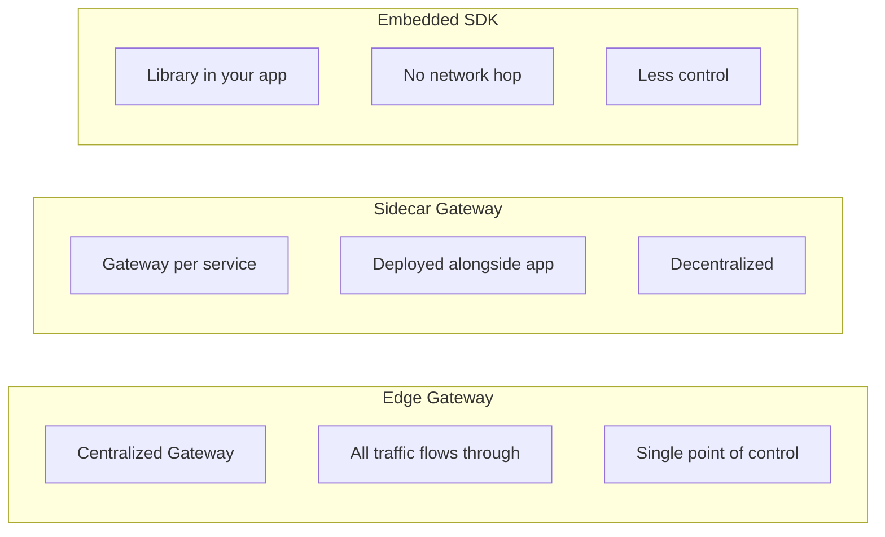
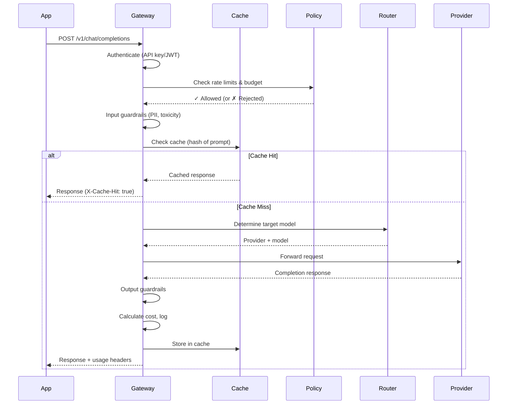

# AI Gateway Design

## What is an AI Gateway?

An AI Gateway is the **"front door" for all AI traffic** in your organization. Every request to any AI model — whether it's OpenAI, Anthropic, a local model, or a fine-tuned variant — flows through this single point.

Think of it like an airport terminal. Passengers (requests) arrive, go through security (auth, guardrails), get routed to the correct gate (model), and their journey is tracked (logging, cost). Without the terminal, passengers would be running directly onto runways — chaotic and dangerous.

```
Before Gateway:                     After Gateway:
                                    
App A ──→ OpenAI                    App A ─┐
App B ──→ OpenAI                           │    ┌──→ OpenAI
App C ──→ Anthropic                 App B ─┼──→ │Gateway│ ──→ Anthropic
App D ──→ Azure OpenAI                     │    └──→ Azure OpenAI
App E ──→ Local Model               App C ─┘         └──→ Local Model
                                    
5 API keys scattered               1 gateway, centralized control
No visibility                      Full observability
No cost control                    Budget enforcement
```

## AI Gateway vs API Gateway

| Dimension | Traditional API Gateway | AI Gateway |
|-----------|------------------------|------------|
| **Traffic type** | REST/GraphQL requests | LLM completions, embeddings, images |
| **Payload size** | Small (KB) | Large (prompt + context = 100KB+) |
| **Latency** | Milliseconds | Seconds to minutes (streaming) |
| **Billing model** | Per request | Per token (input + output separately) |
| **Caching** | URL + headers | Semantic similarity of prompts |
| **Rate limiting** | Requests/second | Tokens/minute, cost/day |
| **Load balancing** | Round-robin, least-connections | Token-aware, cost-aware |
| **Failover** | Same API, different instance | Different model entirely |
| **Content inspection** | Headers, query params | Full prompt content (PII, toxicity) |
| **Streaming** | Rare | Common (SSE for token streaming) |
| **Retry logic** | Simple retry | Model-aware (retry with smaller context) |

## 14 Responsibilities of an AI Gateway

### 1. Request Routing
Route requests to the correct model provider based on the `model` parameter, tenant configuration, or routing rules.

```python
# Route based on model name
if model == "gpt-4o":
    route_to("openai")
elif model == "claude-3":
    route_to("anthropic")
elif model.startswith("internal/"):
    route_to("local-cluster")
```

### 2. Load Balancing Across Model Replicas
Distribute traffic across multiple deployments of the same model. Token-aware balancing ensures no single replica gets overwhelmed.

### 3. Rate Limiting (Per User/Tenant/Model)
Enforce limits at multiple levels:
- **Per user:** Max 100 requests/minute
- **Per tenant:** Max 1M tokens/day
- **Per model:** Max 500 RPM to GPT-4 (provider limit protection)

### 4. Authentication and Authorization
Validate API keys, JWT tokens, or OAuth. Check permissions: "Can this user access GPT-4?" "Is this tenant allowed to use the vision model?"

### 5. Input Validation and Guardrails
Before sending to the model:
- Check prompt length (reject if over context window)
- Detect PII in prompts
- Block prohibited topics
- Validate JSON schema of request

### 6. Output Validation and Guardrails
After receiving from the model:
- Check for harmful content in response
- Validate structured output matches expected schema
- Redact any leaked PII
- Enforce response length limits

### 7. Response Caching
Cache responses for identical (or semantically similar) requests. Massive cost savings for repeated queries.

### 8. Cost Tracking and Budget Enforcement
Calculate cost per request (input tokens × price + output tokens × price). Block requests when budget is exhausted.

### 9. Prompt Transformation
Inject system prompts, add context, or transform requests before sending to the model:
- Add organization-wide system prompt
- Inject user context from session
- Apply prompt templates from registry

### 10. Model Fallback
If primary model fails (rate limited, down, timeout), automatically route to a secondary:
- GPT-4o fails → fallback to Claude 3.5
- Azure OpenAI down → fallback to direct OpenAI

### 11. Request/Response Logging
Log every interaction for debugging, compliance, and improvement:
- Full request (prompt, parameters)
- Full response (completion, tokens used)
- Metadata (latency, model, user, cost)

### 12. Usage Metering and Billing
Track usage for internal chargeback or external billing. Aggregate by team, project, or customer.

### 13. PII Detection and Redaction
Scan prompts for personal information before sending to external models. Replace with placeholders, restore in response.

### 14. Compliance Policy Enforcement
Apply organizational policies: data residency (EU data stays in EU), model restrictions (no external models for classified data), retention policies.

## Gateway Architecture Patterns



| Pattern | Pros | Cons | Use When |
|---------|------|------|----------|
| **Edge** | Full control, single point of enforcement | Single point of failure, added latency | Enterprise with strict governance |
| **Sidecar** | Per-service isolation, no SPOF | Harder to manage uniformly | Kubernetes-native, microservices |
| **Embedded** | Zero network overhead | No central control, hard to update | Low-latency requirements, simple setup |

## Gateway Request Flow



## Existing Solutions

| Solution | Type | Key Features |
|----------|------|-------------|
| **LiteLLM** | OSS proxy | 100+ providers, OpenAI-compatible API, basic routing |
| **Portkey** | SaaS/OSS | Gateway + observability, caching, fallbacks |
| **Kong AI Gateway** | Enterprise | Plugin-based, existing Kong ecosystem |
| **Azure API Management** | Cloud | AI token limiting, semantic caching, enterprise features |
| **AWS Bedrock** | Cloud | Managed routing, guardrails built-in |
| **MLflow AI Gateway** | OSS | Simple routing, Databricks ecosystem |

## Build vs Buy Decision

**Build when:**
- You need deep customization (custom routing logic, internal models)
- You have strict data residency requirements
- You want to avoid vendor lock-in
- Your team has the expertise

**Buy when:**
- You need to move fast (weeks not months)
- You don't have platform engineering capacity
- Standard features cover 80%+ of your needs
- You want managed operations

**Hybrid approach (most common):**
- Use an OSS gateway (LiteLLM) as a base
- Add custom middleware for your specific policies
- Integrate with your existing observability stack

## Key Design Decisions

1. **Sync vs Async:** Support both synchronous responses and streaming (SSE)
2. **Stateless vs Stateful:** Gateway should be stateless for horizontal scaling; state lives in Redis/DB
3. **OpenAI-compatible API:** Present a unified API regardless of backend provider
4. **Graceful degradation:** If gateway is overloaded, degrade gracefully (bypass cache, skip logging) rather than failing
5. **Multi-region:** Deploy gateway close to users AND close to providers for minimal latency

## Key Takeaways

1. The AI Gateway is the **first component** you should build — it gives immediate value
2. It's NOT just an API gateway with a new name — token-based billing, streaming, and semantic caching are fundamentally different
3. Start simple (auth + logging + cost tracking) and add capabilities incrementally
4. Make it **transparent** — applications should barely know it's there (OpenAI-compatible API)
5. Observability from the gateway alone provides 80% of the visibility you need

---

## Staff+ Deep Dive: Anti-Patterns, Trade-offs, and Real-World Implementations

### Anti-Patterns to Avoid

**1. Gateway as Single Point of Failure Without HA**
The most dangerous mistake: building a gateway that becomes the one thing that, when it goes down, takes ALL AI capabilities offline. If your gateway has no redundancy, you've created a system that's less available than having no gateway at all.

Fix: Active-active deployment across availability zones, with circuit breakers that allow direct-to-provider fallback when the gateway is unhealthy.

**2. The "Thick Gateway" Trap**
Gateways that accumulate too many responsibilities — response transformation, caching, guardrails, PII detection, prompt rewriting. Each added capability increases latency, failure modes, and deployment complexity. Eventually the gateway itself needs its own team and becomes the slowest-moving component.

Fix: Clear separation — the gateway handles routing, auth, rate limiting, and telemetry. Everything else belongs in sidecars or separate services.

**3. No Request Routing Telemetry**
Operating a gateway without tracking which requests go where, with what latency and success rate, is flying blind. Teams can't debug why their AI feature is slow because they can't see that the gateway is routing them to an overloaded region.

**4. Hardcoded Routing Rules**
Rules baked into config files that require a deployment to change. When a provider has an outage at 2 AM, you need to shift traffic in seconds — not wait for a PR review and deploy pipeline.

### Critical Trade-offs

| Dimension | Thin Gateway | Thick Gateway |
|-----------|-------------|---------------|
| Scope | Routing, auth, logging only | + Transform, cache, guardrails, PII |
| Latency added | 5-15ms | 50-200ms |
| Team needed | 1-2 engineers | 5-8 engineers |
| Blast radius | Small (routing only) | Large (many failure modes) |
| When to choose | Early stage, <10 services | Mature org, regulatory needs |

**Centralized vs. Edge Gateway**
- Centralized: single gateway cluster — easier to manage, single point of visibility, but adds latency for geographically distributed services
- Edge: gateway instances at the edge (per-region) — lower latency, but harder to maintain consistency of policies and routing rules
- Hybrid (what most mature orgs land on): edge for latency-sensitive, centralized for governance-heavy

**Custom Build vs. Commercial**
- Azure API Management: strong enterprise governance, built-in AI token tracking, but opinionated and can be slow to adopt new providers
- Kong: flexible plugin architecture, good for multi-cloud, but AI-specific features are newer
- Custom: maximum flexibility, but you're now maintaining infrastructure that isn't your core business
- Rule of thumb: build custom only if AI is your product, not just a feature

### Real-World Implementations

**Uber's AI Gateway**
Uber routes millions of AI requests daily across multiple providers. Their gateway implements: automatic provider failover (sub-second), per-team cost attribution with real-time dashboards, request deduplication for identical prompts within time windows, and graduated rate limiting that degrades gracefully (slower responses before outright rejection).

**Stripe's Approach**
Stripe treats their AI gateway as an internal product with SLAs. Key design: the gateway is stateless (all state in Redis/DynamoDB), allowing horizontal scaling. They separate the data plane (request routing) from the control plane (policy management), so policy updates don't require gateway restarts.

**LinkedIn's Federated Gateway**
LinkedIn uses a federated model where each major product area has a gateway instance, but all instances share a common configuration service. This gives teams autonomy over routing while maintaining org-wide policies for cost control and compliance. The shared config service pushes updates in real-time via gRPC streams.

---

## Gateway Technology Comparison

| Solution | Type | Strengths | Weaknesses | Best For |
|---|---|---|---|---|
| **Kong + custom plugins** | Open-source + custom | Mature, extensible, large ecosystem | AI-specific features require custom dev | Teams with existing Kong infra |
| **Envoy + WASM filters** | Open-source + custom | High performance, fine-grained control | Steep learning curve; WASM debugging painful | Performance-critical, K8s-native orgs |
| **LiteLLM Proxy** | Open-source AI-native | Multi-provider routing, cost tracking built-in | Limited enterprise features (auth, audit) | Startups, quick PoCs |
| **Portkey** | Commercial AI gateway | Purpose-built for AI; caching, fallbacks, observability | Vendor lock-in; cost at scale | Mid-market, fast time-to-value |
| **Azure API Management + AI** | Cloud-native | Integrated with Azure OpenAI; enterprise auth | Azure-only ecosystem | Azure-first enterprises |
| **Custom (Go/Rust)** | Build-your-own | Full control, exact fit | High dev cost, maintenance burden | Large orgs with unique requirements |

---

## Gateway Sizing Guidelines

| Traffic Tier | Requests/sec | Recommended Setup | Compute | Notes |
|---|---|---|---|---|
| Small | < 50 RPS | Single instance + standby | 2 vCPU, 4GB RAM | Most startups |
| Medium | 50-500 RPS | 3-node cluster, load-balanced | 4 vCPU, 8GB per node | Series B+ |
| Large | 500-5000 RPS | Regional clusters, auto-scaling | 8+ vCPU, 16GB per node | Enterprise |
| XL | 5000+ RPS | Multi-region, edge PoPs, dedicated pools per priority | Custom sizing | Hyperscale |

**Key sizing considerations:**
- Streaming responses hold connections open (10-60s) — size for concurrent connections, not just RPS
- Token counting and policy evaluation add ~2-5ms latency per request
- Semantic caching (embedding similarity) requires GPU or vector search co-located with gateway
- Log/audit writes should be async (buffered) to avoid becoming the bottleneck

---

## Reference Architecture: Enterprise AI Gateway

```
                    ┌─────────────────┐
                    │   Load Balancer  │
                    └────────┬────────┘
                             │
              ┌──────────────┼──────────────┐
              ▼              ▼              ▼
        ┌──────────┐  ┌──────────┐  ┌──────────┐
        │ Gateway  │  │ Gateway  │  │ Gateway  │  (stateless, auto-scaled)
        │ Node 1   │  │ Node 2   │  │ Node 3   │
        └────┬─────┘  └────┬─────┘  └────┬─────┘
             │              │              │
             └──────────────┼──────────────┘
                            │
          ┌─────────────────┼─────────────────┐
          ▼                 ▼                 ▼
   ┌────────────┐   ┌────────────┐   ┌────────────┐
   │ OpenAI API │   │ Anthropic  │   │ Self-hosted│
   │            │   │ API        │   │ (vLLM)    │
   └────────────┘   └────────────┘   └────────────┘

   Shared Services:
   ┌──────────┐ ┌───────────┐ ┌──────────┐ ┌───────────┐
   │  Redis   │ │ Policy DB │ │ Metrics  │ │ Audit Log │
   │ (cache)  │ │ (config)  │ │ (TSDB)   │ │ (append)  │
   └──────────┘ └───────────┘ └──────────┘ └───────────┘
```
