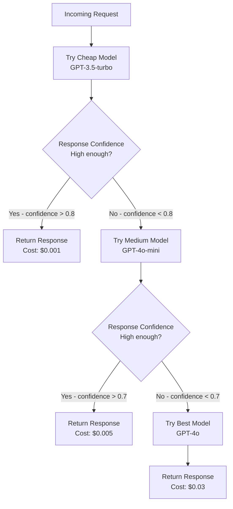
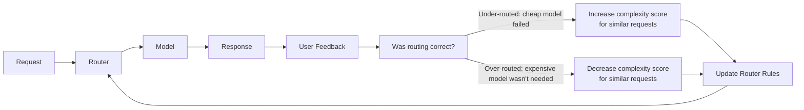
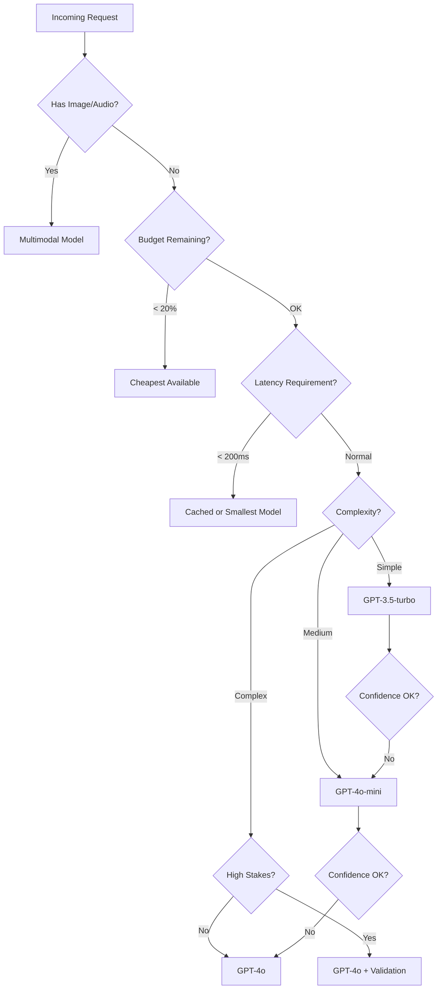

# Model Routing Strategies

## Why Model Routing Matters

Imagine a hospital where every patient — from a common cold to a heart attack — goes directly to the top surgeon. The surgeon is overwhelmed, costs are astronomical, and people with colds wait hours unnecessarily.

**Model routing is triage for AI requests.** Not every question needs GPT-4. A simple "what's the capital of France?" can be answered by a tiny, cheap model. A complex legal analysis needs the best model available. Routing saves 40-70% of costs while maintaining quality.

```
Without Routing:                    With Routing:
                                    
"Hi" ──────────→ GPT-4 ($$$)       "Hi" ──────────→ GPT-3.5 ($)
"Summarize" ──→ GPT-4 ($$$)        "Summarize" ──→ GPT-4o-mini ($$)
"Write legal                        "Write legal
 contract" ───→ GPT-4 ($$$)         contract" ───→ GPT-4 ($$$)
                                    
Cost: $$$$$$$                       Cost: $$
Quality: Overkill for simple tasks  Quality: Right-sized for each task
```

## Routing Dimensions

### 1. Complexity-Based Routing
Route based on how hard the request is:

| Complexity | Signals | Route To | Cost |
|-----------|---------|----------|------|
| Simple | Short query, FAQ-like, factual | GPT-3.5-turbo | $0.001 |
| Medium | Moderate reasoning, summarization | GPT-4o-mini | $0.005 |
| Complex | Multi-step reasoning, code, analysis | GPT-4o | $0.03 |

**Signals of complexity:**
- Token count of input
- Presence of code blocks
- Multi-part questions
- Domain-specific terminology
- Requires reasoning chains

### 2. Cost-Based Routing
Route to stay within budget:
```
if daily_spend > budget * 0.8:
    route_to("cheapest_model")
elif daily_spend > budget * 0.5:
    route_to("medium_model")
else:
    route_to("best_model")
```

### 3. Latency-Based Routing
| Scenario | Latency Need | Route To |
|----------|-------------|----------|
| Real-time chat | < 500ms TTFT | Small/fast model or cached |
| Background processing | Don't care | Cheapest model, batch API |
| Autocomplete | < 200ms | Smallest possible model |

### 4. Quality-Based Routing
High-stakes requests get the best model:
- Medical advice → best model + human review
- Casual chat → cheapest model
- Legal documents → best model + structured output

### 5. Capability-Based Routing
Route based on what the request needs:
- Contains image → multimodal model (GPT-4o, Claude 3.5)
- Code generation → coding model (Claude 3.5, GPT-4o)
- Embedding request → embedding model (text-embedding-3)
- Structured output → model with JSON mode

### 6. Availability-Based Routing
If primary is unavailable, route to fallback:
```
primary: gpt-4o (OpenAI)
fallback_1: gpt-4o (Azure OpenAI)  # same model, different provider
fallback_2: claude-3.5-sonnet       # different model entirely
```

## Implementing a Complexity Classifier

The complexity classifier is itself a lightweight model or heuristic that decides where to route:

```python
def classify_complexity(message: str) -> str:
    """Classify request complexity using heuristics + lightweight model."""
    
    # Rule-based fast path
    if len(message.split()) < 10:
        return "simple"
    if any(kw in message.lower() for kw in ["hello", "hi", "thanks", "bye"]):
        return "simple"
    
    # Heuristic signals
    signals = {
        "has_code": "```" in message,
        "multi_question": message.count("?") > 1,
        "long_context": len(message) > 2000,
        "domain_terms": has_domain_terminology(message),
        "reasoning_needed": any(w in message.lower() for w in 
            ["analyze", "compare", "explain why", "design", "architect"]),
    }
    
    complexity_score = sum(signals.values()) / len(signals)
    
    if complexity_score < 0.2:
        return "simple"
    elif complexity_score < 0.5:
        return "medium"
    else:
        return "complex"
```

## The Cascade Pattern

The cascade pattern is like **escalation in customer support**: start with Level 1, escalate to Level 2 if they can't handle it.



**How to measure confidence:**
- Model's own logprobs (high probability = confident)
- Response length (very short response to complex question = uncertain)
- Hedge words ("I'm not sure", "it might be") = low confidence
- Self-consistency (ask twice, compare — if different, low confidence)

**Trade-off:** Cascade adds latency when escalation happens. On average:
- 70% resolved at Level 1 (fast + cheap)
- 20% escalated to Level 2
- 10% escalated to Level 3
- Average cost: 70% × $0.001 + 20% × $0.005 + 10% × $0.03 = $0.0047 (vs $0.03 always)

## A/B Testing with Routing

Route a percentage of traffic to a new model to compare quality:

```python
def route_with_experiment(request, experiment_config):
    """Route with A/B test: 95% to control, 5% to variant."""
    if random.random() < experiment_config.traffic_split:
        # Variant: try new model
        response = call_model(experiment_config.variant_model, request)
        log_experiment("variant", request, response)
    else:
        # Control: existing model
        response = call_model(experiment_config.control_model, request)
        log_experiment("control", request, response)
    return response
```

After sufficient data, compare:
- Quality scores (human eval or automated)
- Latency (p50, p95, p99)
- Cost per request
- User satisfaction (thumbs up/down)

## Router Training: Learning from Production

The router gets better over time by learning from outcomes:



**Feedback signals:**
- User thumbs down after cheap model → should have used better model
- User thumbs up after cheap model → routing was correct
- Response regenerated → first model wasn't good enough
- Short time-to-next-action → response was useful (good routing)

## The Cost-Quality Tradeoff Curve

```
Quality
  │
  │         ┌─── GPT-4o ($$$)
  │        ╱
  │       ╱ ─── Claude 3.5 Sonnet ($$)
  │      ╱
  │     ╱ ───── GPT-4o-mini ($$)
  │    ╱
  │   ╱ ──────── GPT-3.5-turbo ($)
  │  ╱
  │ ╱
  │╱
  └──────────────────────────── Cost
```

**The key insight:** The curve has diminishing returns. Going from GPT-3.5 to GPT-4o-mini gives a big quality jump for modest cost. Going from GPT-4o-mini to GPT-4o gives a smaller quality jump for much more cost. Smart routing keeps you on the efficient frontier.

## Routing Decision Tree



## Implementation Tips

1. **Start with simple heuristics** — token count + keyword matching gets you 70% of the way
2. **Log everything** — you need data to improve routing decisions
3. **Measure actual quality** — not just cost savings, ensure quality doesn't degrade
4. **Make routing transparent** — return which model was used in response headers
5. **Allow overrides** — let users force a specific model when needed
6. **Monitor routing distribution** — if 90% goes to the cheapest model, your classifier might be too aggressive

## Key Takeaways

1. **Not every request deserves the best model** — match model capability to request complexity
2. **The cascade pattern** saves 60-80% of costs with minimal quality impact
3. **Routing is not static** — it learns and improves from production feedback
4. **Multiple dimensions matter** — complexity, cost, latency, capability, availability
5. **Measure, don't guess** — use A/B testing to validate routing decisions with real data

---

## Staff+ Deep Dive: Anti-Patterns, Trade-offs, and Real Numbers

### Anti-Patterns to Avoid

**1. Manual Routing Rules That Don't Adapt**
Hand-written rules like "if query length > 100, use GPT-4" seem reasonable initially but quickly become stale. Query complexity doesn't correlate well with length. The real world is messier — a short query about quantum physics needs a better model than a long query asking for a list of colors.

Fix: Use routing signals from production (success rate, user satisfaction, task completion) to continuously update routing decisions.

**2. Always Routing to the Most Expensive Model**
The "just use GPT-4 for everything" approach. It feels safe — best model, best results. But at scale, you're burning 10-20x the cost for tasks where a smaller model produces identical output. This becomes untenable at enterprise volumes (millions of requests/day).

**3. No Fallback Chain**
When the primary model is unavailable or rate-limited, requests simply fail. No degraded experience, just errors. Users see failures for minutes while the team scrambles.

Fix: Every routing decision should have a fallback chain: primary → secondary → tertiary → cached/degraded response. Define this upfront, not during an incident.

**4. Routing Without Measuring Routing Quality**
You built a router, but how do you know it's making good decisions? If you're not comparing "what the router chose" vs. "what would have been optimal," you can't improve. This is the meta-problem of routing — you need evaluation of the evaluator.

### Critical Trade-offs

**Cost-Based vs. Quality-Based Routing**
- Cost-based: always pick cheapest model that "might work" → saves money but quality degrades silently over time as query distribution shifts
- Quality-based: always pick best model unless explicitly simple → expensive but predictable quality
- Hybrid (what works): quality-based with cost budgets per team/feature, and automatic downgrade when budget exhausted

**Static Rules vs. ML-Based Router**
- Static rules: interpretable, debuggable, no training needed, but brittle and can't generalize
- ML-based router (a small classifier that predicts which model will succeed): adapts, generalizes, but adds latency (10-50ms for inference), needs training data, and is itself a model that can fail
- Practical middle ground: start with rules, collect data, train a router when you have 10K+ labeled routing decisions

**The Latency of the Routing Decision Itself**
If your router takes 200ms to decide which model to use, you've already added 200ms to every request. For interactive use cases (chat, autocomplete), the router must decide in <20ms. This constrains router complexity — you can't call an LLM to decide which LLM to call.

### Real Numbers from Production Systems

**The 60-80% Rule**: In practice across multiple enterprises, 60-80% of AI queries are "simple" — summarization of short text, extraction of well-defined fields, classification into known categories. These can use models at 1/10th the cost (GPT-4o-mini, Claude Haiku, Gemini Flash) with <2% quality degradation as measured by human evaluation.

**Cost Impact at Scale**:
- 1M requests/day, all GPT-4: ~$30K/day ($900K/month)
- Same traffic with smart routing (70% to mini, 30% to GPT-4): ~$6K/day ($180K/month)
- Savings: $720K/month — this is why routing is a Staff-level priority

**Routing Accuracy Benchmarks**:
- Rule-based routers: 70-75% optimal routing accuracy
- ML-based routers (trained on production data): 85-92% optimal routing accuracy
- The gap represents both cost savings and quality improvements

**Latency Overhead**:
- Embedding-based classifier router: 15-25ms added latency
- Rule-based router: <1ms added latency
- LLM-as-router (asking a small model to classify): 200-500ms — usually too slow for real-time
