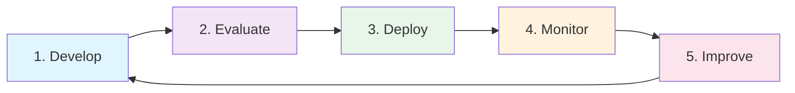
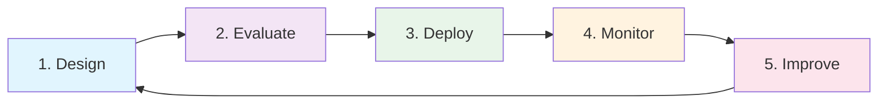

# LLMOps and AgentOps

## LLMOps: Operations for LLM-Based Systems

LLMOps is **DevOps for AI applications**. Just as DevOps brought discipline to software deployment (CI/CD, monitoring, rollbacks), LLMOps brings the same discipline to LLM-powered applications.

The key difference from traditional MLOps: in LLMOps, you're not training models — you're managing **prompts, configurations, and orchestration** around pre-trained models. Your "code" is a combination of prompts, tool definitions, and routing logic.

```
Traditional Software:  Code → Build → Test → Deploy → Monitor
MLOps:                 Data → Train → Evaluate → Deploy → Monitor
LLMOps:               Prompts → Evaluate → Deploy → Monitor → Improve
AgentOps:             Agent Design → Test → Deploy → Monitor → Improve
```

## LLMOps Lifecycle



### 1. Develop (Prompts, Tools, Pipelines)
- Write and iterate on prompts locally
- Define tool schemas and integrations
- Build orchestration pipelines (chains, graphs)
- Use playground environments for rapid iteration
- Version control everything (prompts are code)

### 2. Evaluate (Test Against Golden Sets)
- Run prompts against evaluation datasets
- Measure: accuracy, relevance, faithfulness, toxicity
- Compare against baseline (previous version)
- Automated evaluation with judge LLMs
- Human evaluation for subjective quality

### 3. Deploy (Version, Canary, Rollout)
- Deploy new prompt version to registry
- Canary: route 5% of traffic to new version
- Monitor quality metrics during canary
- If quality holds, gradually increase to 100%
- If quality drops, instant rollback

### 4. Monitor (Quality, Cost, Latency)
- Track per-request quality scores
- Monitor cost trends and anomalies
- Alert on latency spikes
- Detect quality drift over time
- Dashboard for real-time visibility

### 5. Improve (Feedback, Tuning, Iteration)
- Collect user feedback (thumbs up/down)
- Identify failure patterns
- Fine-tune prompts based on failures
- Add few-shot examples for common errors
- Update evaluation sets with new edge cases

## AgentOps: Operations for Agent-Based Systems

AgentOps extends LLMOps for **autonomous agents**. Agents are harder to operate because they make decisions, use tools, and have multi-step workflows. A single prompt change can cascade into completely different behavior.

Think of the difference like this:
- **LLMOps** = managing a call center script (predictable flow)
- **AgentOps** = managing a field agent (autonomous decisions, unpredictable paths)

## AgentOps Lifecycle



### 1. Design (Agent Architecture, Tools, Guardrails)
- Define agent's purpose and boundaries
- Select tools the agent can access
- Set guardrails (what it cannot do)
- Design escalation paths (when to involve humans)
- Define success criteria

### 2. Evaluate (Trajectory Testing, Safety Testing)
- **Trajectory testing:** Does the agent take correct steps?
- **Safety testing:** Can it be jailbroken? Does it stay in bounds?
- **Tool usage testing:** Does it call the right tools with right params?
- **Multi-turn testing:** Does it maintain coherence over long conversations?
- **Adversarial testing:** What happens with malicious inputs?

### 3. Deploy (Staged Rollout, Feature Flags)
- Deploy with feature flags (enable for internal users first)
- Staged rollout: internal → beta → 10% → 50% → 100%
- Shadow mode: agent runs but humans approve actions
- Parallel mode: agent + human both handle, compare results

### 4. Monitor (Agent Behavior, Tool Usage, Failures)
- Track tool call patterns (is it using tools correctly?)
- Monitor loop detection (is it stuck in a cycle?)
- Alert on unusual behavior (10x normal tool calls)
- Track success/failure rates per task type
- Cost per agent run (agents can be expensive)

### 5. Improve (Tune Prompts, Add Tools, Adjust Guardrails)
- Analyze failure trajectories
- Add new tools for gaps in capability
- Tighten guardrails where agent misbehaves
- Add few-shot examples for tricky scenarios
- Update system prompts based on patterns

## Key Operational Requirements

### Version Control for Prompts (Git for Prompts)

Prompts are code. They need the same rigor:

```yaml
# prompt-v3.yaml
id: customer-support-agent
version: 3
author: jane@company.com
created: 2024-03-15
description: "Added tone guidelines after negative feedback"
template: |
  You are a helpful customer support agent for {{company_name}}.
  Always be empathetic and solution-oriented.
  Never blame the customer.
  ...
changelog:
  - v3: Added empathy guidelines
  - v2: Added refund policy context
  - v1: Initial version
```

### Rollback Capability
When a new prompt version causes quality issues:
```
[Alert: Quality score dropped 15% after deploying prompt v3]
[Action: Rollback to v2]
[Result: Quality restored in < 60 seconds]
```

### Canary Deployments
```
Time 0:   100% → v2 (current)
Time 1:   95% → v2, 5% → v3 (canary)
Time 2:   Monitor quality metrics...
Time 3:   If good: 80% → v2, 20% → v3
Time 4:   If good: 50% → v2, 50% → v3
Time 5:   If good: 0% → v2, 100% → v3
           If bad at any step: 100% → v2 (instant rollback)
```

### A/B Testing
Compare two models or prompts head-to-head:
```
Experiment: "claude-vs-gpt4-for-summarization"
Control:    GPT-4o (current)
Variant:    Claude 3.5 Sonnet
Split:      50/50
Metrics:    quality_score, latency_p95, cost_per_request
Duration:   7 days
Result:     Claude 3.5 wins on quality (+5%), loses on cost (+10%)
Decision:   Switch to Claude for premium tier, keep GPT-4o for standard
```

### Feature Flags
Enable/disable agent capabilities without code deployment:
```json
{
  "agent_features": {
    "can_issue_refunds": true,
    "can_access_billing": true,
    "can_escalate_to_human": true,
    "can_send_emails": false,
    "max_tool_calls_per_turn": 5,
    "allowed_models": ["gpt-4o", "gpt-4o-mini"]
  }
}
```

### Audit Trails
Every change is logged:
```
2024-03-15 10:30 | jane@co.com | Updated prompt "customer-support" v2→v3
2024-03-15 10:35 | system      | Canary started: 5% traffic to v3
2024-03-15 11:00 | system      | Quality alert: v3 score 0.72 (threshold: 0.80)
2024-03-15 11:01 | system      | Auto-rollback to v2
2024-03-15 11:05 | jane@co.com | Investigating rollback cause
```

## LLMOps vs AgentOps Comparison

| Dimension | LLMOps | AgentOps |
|-----------|--------|----------|
| **Unit of work** | Single LLM call | Multi-step agent trajectory |
| **Testing** | Input/output pairs | Trajectory correctness |
| **Failure modes** | Wrong answer | Stuck in loop, wrong tool, unsafe action |
| **Cost predictability** | Predictable (fixed prompt) | Variable (agent decides how many steps) |
| **Rollback scope** | Prompt version | Agent config + tools + prompts |
| **Monitoring** | Quality per response | Behavior patterns over sessions |
| **Safety** | Output filtering | Action-level guardrails |

## Tooling Landscape

| Category | Tools |
|----------|-------|
| **Prompt Management** | PromptLayer, Humanloop, Langfuse |
| **Evaluation** | Braintrust, Ragas, DeepEval |
| **Observability** | Langfuse, LangSmith, Arize Phoenix |
| **Deployment** | LangServe, Modal, Replicate |
| **Agent Frameworks** | LangGraph, CrewAI, AutoGen |
| **Feature Flags** | LaunchDarkly, Statsig |

## Key Takeaways

1. **Prompts are code** — version, test, deploy, and rollback them like software
2. **Canary deployments** prevent catastrophic quality drops from reaching all users
3. **AgentOps is harder** than LLMOps because agents are non-deterministic and multi-step
4. **Observability is non-negotiable** — you can't improve what you can't measure
5. **The feedback loop** is what separates good AI systems from great ones
6. **Start with LLMOps basics** (versioning + eval + monitoring) before adding AgentOps complexity
