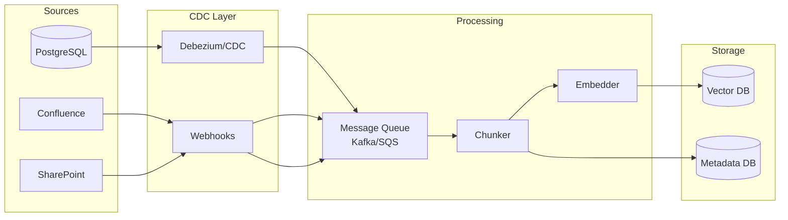
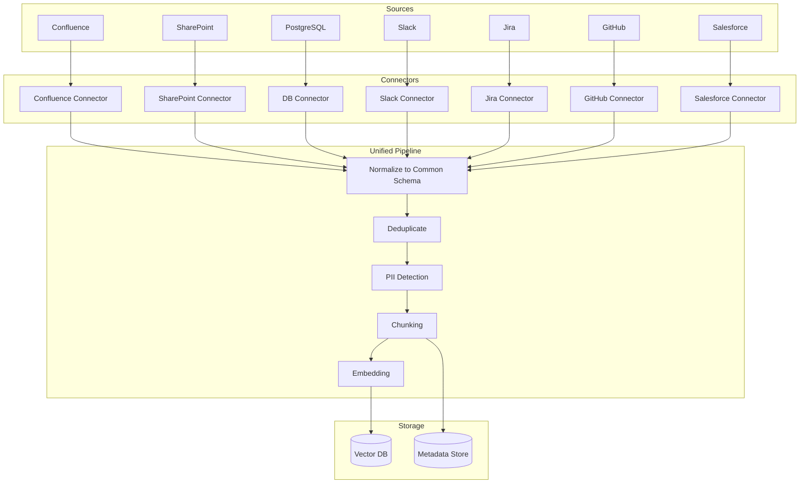

# Data Engineering for AI

## Data is the Foundation

If an AI system is a building, data is the foundation. No matter how sophisticated your models, prompts, or agents — if the data is stale, incomplete, or wrong, your AI will produce garbage.

Think of it like cooking: the best chef in the world can't make a great meal from rotten ingredients. **Data quality determines AI quality.**

```
User Question → Retrieval → LLM → Answer
                    ↑
              Vector Store
                    ↑
              Embeddings
                    ↑
              Chunked Documents
                    ↑
              Raw Data (Source of Truth)
              
If ANY layer is broken, the answer is wrong.
```

## Data Pipeline Architecture for AI

### Change Data Capture (CDC) for Real-Time Updates

CDC watches your source systems for changes and propagates them to your AI pipeline in real-time.



**Why CDC matters:** Without it, you're doing full reindexing on a schedule (e.g., nightly). That means your AI is always 12-24 hours behind reality. With CDC, updates propagate in minutes.

### Incremental Indexing

Don't re-embed your entire corpus when one document changes:

```python
def handle_document_change(event):
    if event.type == "created":
        chunks = chunk_document(event.document)
        embeddings = embed_chunks(chunks)
        vector_db.upsert(embeddings)
        
    elif event.type == "updated":
        # Only re-embed changed document
        vector_db.delete(where={"doc_id": event.doc_id})
        chunks = chunk_document(event.document)
        embeddings = embed_chunks(chunks)
        vector_db.upsert(embeddings)
        
    elif event.type == "deleted":
        # Cascade delete
        vector_db.delete(where={"doc_id": event.doc_id})
```

### Deletion Propagation

This is the most commonly missed requirement. When a source document is deleted:

```
Source deleted → Metadata deleted → Chunks deleted → Vectors deleted
```

Without this, your AI will answer questions using documents that no longer exist. Imagine an employee leaves and their access is revoked, but the AI still retrieves their old notes.

### Schema Evolution

What happens when your data format changes?

| Scenario | Solution |
|----------|----------|
| New field added | Re-chunk affected documents, update metadata |
| Field renamed | Update extraction logic, backfill metadata |
| Embedding model changed | Full re-indexing required (vectors incompatible) |
| Chunk strategy changed | Full re-chunking and re-embedding |

**Key principle:** Version your pipeline configuration alongside your data. Know which version of chunking + embedding produced each vector.

### Data Contracts

Agreements between data producers and AI consumers:

```yaml
# data-contract: hr-policies
producer: hr-team
consumer: ai-platform
schema:
  format: markdown
  required_fields: [title, department, effective_date, content]
  max_document_size: 50KB
freshness:
  max_staleness: 4_hours
  update_frequency: on_change
quality:
  completeness: 99%
  no_pii_in_titles: true
sla:
  availability: 99.9%
  notification_on_breaking_change: true
```

## Data Quality for AI

### Deduplication
Duplicate documents = duplicate chunks = duplicate vectors = retrieval pollution.

```python
def deduplicate(documents):
    """Remove duplicates using content hashing."""
    seen_hashes = set()
    unique = []
    for doc in documents:
        content_hash = hashlib.sha256(doc.content.encode()).hexdigest()
        if content_hash not in seen_hashes:
            seen_hashes.add(content_hash)
            unique.append(doc)
        else:
            log.info(f"Skipping duplicate: {doc.id}")
    return unique
```

Near-duplicates (slightly different versions of same content) are harder — use MinHash or SimHash for fuzzy deduplication.

### Freshness Guarantees
- Define SLA per data source: "HR policies within 4 hours, Slack messages within 1 hour"
- Monitor freshness with timestamps
- Alert when data is staler than SLA

### Completeness Checking
- Verify all expected documents are indexed
- Compare source count vs indexed count
- Detect gaps: "We have 500 Confluence pages but only 480 indexed"

### Consistency Validation
- Same document shouldn't have conflicting information across sources
- Cross-reference metadata (title in source matches title in index)
- Validate embeddings aren't NaN or zero vectors

## PII Pipeline

Before embedding data, detect and handle personally identifiable information:

```mermaid
flowchart LR
    A[Raw Document] --> B[PII Detector<br/>Presidio/Comprehend]
    B --> C{PII Found?}
    C -->|No| D[Chunk & Embed<br/>as-is]
    C -->|Yes| E{Strategy}
    E -->|Redact| F[Replace with [REDACTED]]
    E -->|Anonymize| G[Replace with fake data]
    E -->|Encrypt| H[Encrypt PII fields]
    F & G & H --> I[Chunk & Embed]
    I --> J[(Vector DB)]
```

**Types of PII to detect:**
- Names, emails, phone numbers
- Social Security numbers, credit cards
- Addresses, dates of birth
- Medical record numbers
- Employee IDs (context-dependent)

**Strategy by use case:**
- Internal knowledge base → anonymize (replace names with Person A, Person B)
- Customer-facing AI → redact completely
- Regulated industry → encrypt + access control

## Data Lineage

Trace from source through every transformation to the final answer:

```
Answer: "The refund policy allows 30-day returns"
  ↑ Generated by: GPT-4o
  ↑ Retrieved chunk: "...customers may return items within 30 days..."
  ↑ Chunk ID: chunk_abc123
  ↑ Source document: refund-policy-v3.pdf
  ↑ Source system: SharePoint/Policies/
  ↑ Last updated: 2024-03-01
  ↑ Indexed at: 2024-03-01T10:30:00Z
  ↑ Embedded with: text-embedding-3-small
  ↑ Chunked with: recursive_character(1000, 200)
```

This lineage is critical for:
- **Debugging:** Why did the AI give a wrong answer?
- **Compliance:** Can we prove the source of information?
- **Freshness:** Is this answer based on current data?
- **Attribution:** Which source contributed to this answer?

## Multi-Source Data Integration

Most enterprises have data in 5-20 different systems:



**Challenges:**
- Different auth mechanisms per source
- Different update frequencies
- Conflicting information across sources
- Access control: user can access Confluence but not SharePoint
- Rate limits on source APIs

**Solutions:**
- Unified connector framework (standard interface per source)
- Metadata tagging with source + permissions
- Conflict resolution rules (most recent wins, or specific source is authoritative)
- Respect source permissions in retrieval (filter by user's access)

## Key Takeaways

1. **Data freshness is a feature** — stale data = wrong answers = lost trust
2. **Deletion propagation is critical** — orphaned vectors are a liability
3. **PII handling is non-negotiable** — one leak can cost millions in fines
4. **Lineage enables debugging** — when answers are wrong, trace back to the source
5. **Data contracts prevent surprises** — agree on format, freshness, quality upfront
6. **Incremental > full reindex** — process only what changed for speed and cost
7. **Multi-source is the norm** — design for 10+ data sources from day one

---

## Staff+ Deep Dive: Anti-Patterns, Trade-offs, and AI-Specific Challenges

### Anti-Patterns to Avoid

**1. ETL Pipelines That Ignore AI-Specific Needs**
Traditional ETL moves rows between databases. AI data engineering needs: chunking strategies (how to split documents), embedding generation (compute-intensive), metadata extraction, and relationship preservation. Teams that reuse their existing ETL for AI end up with pipelines that produce data the AI system can't effectively use.

Fix: Build AI-aware pipelines that understand: chunk boundaries matter (don't split mid-sentence), embeddings must be regenerated when the embedding model changes, and metadata (source, date, author) must travel with the content.

**2. No Data Quality Monitoring for AI Inputs**
Traditional data quality checks (null checks, type checks, range checks) don't catch AI-specific issues: embedding drift (vectors shifting as model updates), semantic duplicates (same content, different wording counted twice), stale documents still being retrieved, or chunks that lost context during splitting.

Fix: AI-specific quality metrics — embedding distribution monitoring, retrieval relevance sampling, freshness SLAs per data source, and periodic human evaluation of retrieved context quality.

**3. Batch-Only When Real-Time Freshness Matters**
Running nightly batch ingestion when users expect current information. "The document was updated 2 hours ago, why does the AI still give the old answer?" This erodes trust faster than anything else.

Fix: Hybrid architecture — batch for bulk historical data, streaming (CDC/webhooks) for updates to frequently-changing sources. Define freshness SLAs per source: legal docs can be daily, product inventory must be real-time.

**4. Ignoring Data Lineage for AI**
When the AI gives a wrong answer, can you trace back to: which chunks were retrieved, from which documents, ingested when, processed by which pipeline version? Without lineage, debugging AI quality issues is guesswork.

### Critical Trade-offs

**Real-Time Ingestion vs. Batch**

| Dimension | Real-Time (Streaming) | Batch |
|-----------|----------------------|-------|
| Freshness | Seconds to minutes | Hours to days |
| Cost | 3-10x more expensive | Baseline |
| Complexity | High (event ordering, dedup) | Low (simple scheduled jobs) |
| Error handling | Complex (dead letter queues) | Simple (retry the whole batch) |
| When to use | User-facing, trust-critical | Internal analytics, historical |

**Managed Services vs. Custom Pipelines**
- Managed (Azure AI Search indexers, Pinecone ingest, Weaviate cloud): faster to start, less control over chunking/processing, vendor lock-in
- Custom (Airflow/Dagster + custom code): full control, more engineering effort, portable
- Decision framework: use managed until you hit a limitation that costs you quality, then custom for that specific pipeline

### AI-Specific vs. Traditional Data Engineering

| Challenge | Traditional | AI-Specific |
|-----------|-------------|-------------|
| Schema | Fixed, enforced | Semi-structured, evolving |
| Quality metric | Completeness, accuracy | Retrieval relevance, context quality |
| Processing | Transform, aggregate | Chunk, embed, extract relationships |
| Storage | Tables, lakes | Vector stores + metadata stores |
| Update granularity | Row-level | Chunk-level (one doc = many chunks) |
| Deletion | Delete row | Delete all chunks + vectors + references |
| Versioning | Schema versions | Embedding model versions change everything |

**The Embedding Model Update Problem**: When you upgrade your embedding model (which you will — they improve constantly), ALL existing vectors become incompatible. You need to re-embed your entire corpus. At scale (millions of documents), this is a multi-day, expensive operation. Plan for it: maintain infrastructure to do full re-indexing within your freshness SLA, or run dual indexes during transition.
