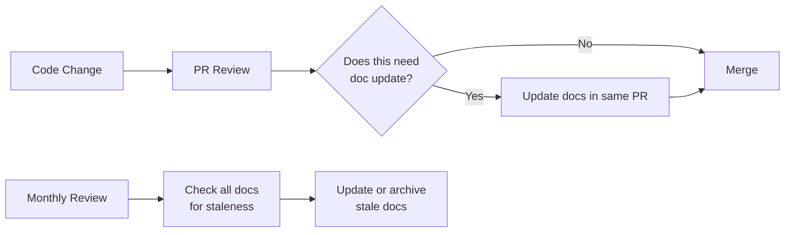

# Architecture Documentation for AI Systems

## Why Document AI Architecture?

The **"bus factor" problem**: If the person who designed your AI system gets hit by a bus (or, more realistically, leaves for a competitor), can the team continue operating and evolving the system?

AI systems are particularly dangerous to leave undocumented because:
- Prompt engineering decisions look arbitrary without context ("why is this word here?")
- Model choices have non-obvious tradeoffs
- Data pipeline decisions cascade through the entire system
- Guardrails exist for reasons that aren't obvious until they're removed

**Without documentation:**
```
New engineer: "Why do we use GPT-4 here instead of GPT-3.5?"
Team: "...Bob set that up. Bob left 6 months ago."
New engineer: *changes to GPT-3.5*
Result: Quality drops 40%, nobody knows why for 2 weeks
```

## 14 Must-Have Architecture Documents

### 1. Architecture Decision Records (ADRs)

Record **why** decisions were made, not just what was decided. The "why" is what gets lost.

```markdown
# ADR-007: Use GPT-4o for Legal Document Analysis

## Status: Accepted

## Context
We need to analyze legal contracts for risk clauses. Accuracy is critical 
because errors have financial and legal consequences.

## Decision
Use GPT-4o (not GPT-3.5 or GPT-4o-mini) for legal analysis despite 10x cost.

## Consequences
- Higher per-request cost ($0.03 vs $0.003)
- Higher accuracy (92% vs 71% on our legal eval set)
- Acceptable because volume is low (< 100 docs/day)
- Budget impact: ~$90/day

## Alternatives Considered
- GPT-3.5: Too low accuracy for legal domain (71%)
- Claude 3.5: Good accuracy (89%) but no Azure deployment (data residency)
- Fine-tuned model: Not enough training data yet (< 500 examples)
```

### 2. System Context Diagram
Shows how your AI system fits in the broader organization. What systems does it interact with? Who are the users?

### 3. Component Diagram
Internal components and their responsibilities. The gateway, registries, vector stores, etc.

### 4. Data Flow Diagram
How data moves from sources through pipelines to vectors to answers. Critical for debugging and compliance.

### 5. Deployment Diagram
Where things run: which cloud, which region, which Kubernetes cluster, how many replicas.

### 6. API Specifications
OpenAPI specs for every API surface. Include AI-specific details like token limits, streaming behavior, and rate limits.

### 7. Tool Contracts
For every tool an agent can call: schema, permissions, rate limits, side effects, error handling.

### 8. Agent Specifications
Per agent: purpose, tools, models, guardrails, escalation paths, expected behavior.

### 9. Evaluation Strategy
What metrics, how they're measured, thresholds for deployment, evaluation datasets.

### 10. Security Architecture
Auth flows, PII handling, data classification, encryption, access control, threat model.

### 11. Disaster Recovery Plan
What happens when OpenAI goes down? When the vector DB corrupts? RTO and RPO for each component.

### 12. Capacity Plan
Current usage, growth projections, scaling triggers, cost projections.

### 13. Cost Model
Cost per request, per user, per feature. Budget allocation and alerts.

### 14. Runbook Library
Step-by-step procedures for common operational tasks: "How to rollback a prompt," "How to reindex a data source," "How to investigate quality drops."

## ADR Template

```markdown
# ADR-{NUMBER}: {TITLE}

## Status
[Proposed | Accepted | Deprecated | Superseded by ADR-XXX]

## Context
What is the issue that we're seeing that motivates this decision?

## Decision
What is the change that we're proposing and/or doing?

## Consequences
What becomes easier or more difficult because of this change?

## Alternatives Considered
What other options were evaluated and why were they rejected?

## References
Links to relevant docs, benchmarks, discussions.
```

## Architecture Review Checklist

Before deploying any AI system, verify:

**Functional:**
- [ ] Does the system meet quality requirements? (eval scores above threshold)
- [ ] Are all data sources connected and fresh?
- [ ] Are guardrails tested against adversarial inputs?
- [ ] Is the system accessible to all intended users?

**Operational:**
- [ ] Is observability in place? (traces, metrics, logs)
- [ ] Are alerts configured for quality/cost/latency?
- [ ] Is there a rollback procedure documented and tested?
- [ ] Is the on-call rotation defined?

**Security:**
- [ ] Is PII handled correctly?
- [ ] Are API keys rotated and stored securely?
- [ ] Is access control enforced at retrieval time?
- [ ] Has a security review been completed?

**Cost:**
- [ ] Is the cost model documented?
- [ ] Are budgets set and alerts configured?
- [ ] Is there a path to cost optimization?

**Compliance:**
- [ ] Data residency requirements met?
- [ ] Retention policies configured?
- [ ] Audit trail in place?
- [ ] Regulatory requirements addressed?

## Keeping Documentation Alive

Documentation rots fast. Combat this with automation:

### 1. Documentation as Code
Store docs in the same repo as code. Review docs in the same PR.

### 2. CI Checks
```yaml
# .github/workflows/docs-check.yml
- name: Check ADR exists for new models
  run: |
    if git diff --name-only | grep -q "model_config"; then
      echo "Model config changed - verify ADR exists"
    fi

- name: Validate API specs match implementation
  run: openapi-diff expected.yaml actual.yaml

- name: Check runbooks are up to date
  run: ./scripts/validate-runbooks.sh
```

### 3. Auto-Generated Docs
- API docs from OpenAPI specs (auto-generated)
- Deployment diagrams from Terraform/Kubernetes configs
- Cost reports from usage data
- Component diagrams from code dependencies

### 4. Documentation Reviews
- Monthly "doc review" calendar event
- Assign document owners (like code owners)
- Track freshness: "Last reviewed: 2024-03-01"

## The "Living Documentation" Principle



**Rules for living documentation:**
1. **Docs live with code** — same repo, same PR
2. **No orphan docs** — every doc has an owner
3. **Stale = deleted** — outdated docs are worse than no docs
4. **Automate what you can** — generate from code wherever possible
5. **Review regularly** — monthly freshness check

## Documentation Anti-Patterns

| Anti-Pattern | Problem | Solution |
|-------------|---------|----------|
| Wiki graveyard | Nobody reads or updates | Docs in repo, CI checks |
| Novel-length docs | Nobody reads past page 1 | Keep concise, link for depth |
| Missing "why" | Future team repeats mistakes | ADRs capture reasoning |
| Screenshots of architecture | Can't update, go stale | Mermaid/PlantUML in markdown |
| Tribal knowledge | Bus factor = 1 | Write it down, review in PR |

## Key Takeaways

1. **ADRs are the highest-value document** — capture the "why" before it's forgotten
2. **14 documents sounds like a lot** — start with ADRs + system context + runbooks
3. **Documentation is a team practice** — enforce through PR reviews and CI
4. **Auto-generate what you can** — reduce manual maintenance burden
5. **Stale docs are worse than no docs** — actively maintain or delete
6. **Diagrams as code** (Mermaid) stay current because they're easy to update
