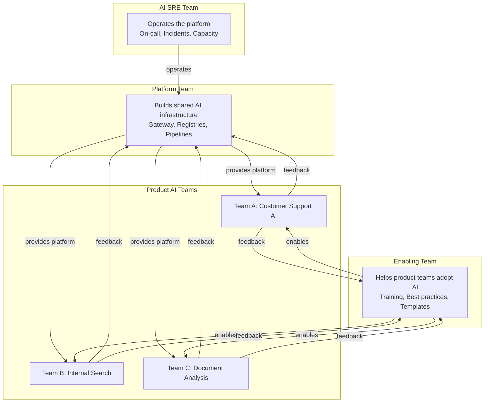
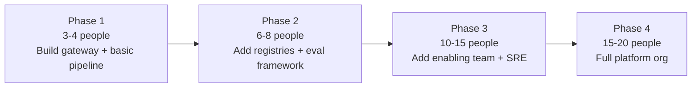

# Platform Team and Organizational Design for AI

## Team Topology for AI Platforms

Borrowing from the "Team Topologies" framework, an AI organization needs four types of teams:



### Platform Team (Builds Shared Infrastructure)
**Mission:** Build and maintain the AI platform so product teams don't reinvent the wheel.

**Owns:**
- AI Gateway
- Model/Prompt/Tool registries
- Data pipelines and vector infrastructure
- Evaluation framework
- Observability stack
- Cost management

**Analogy:** The platform team is like the city's public works department. They build roads, water systems, and electricity grids. Individual businesses (product teams) use this infrastructure to serve customers.

### Enabling Team (Helps Product Teams Adopt AI)
**Mission:** Accelerate AI adoption across the organization.

**Does:**
- Create templates and starter kits
- Run internal training and workshops
- Review AI architectures from product teams
- Write best-practice guides
- Help teams with their first AI project

**Analogy:** They're the consultants who help you move into a new house. They know all the tricks, have the tools, and get you productive fast.

### Product AI Teams (Build Features Using the Platform)
**Mission:** Deliver AI-powered features to end users.

**Does:**
- Build domain-specific AI applications
- Write prompts and evaluation sets for their domain
- Define data sources and quality requirements
- Own the user experience

**Analogy:** Restaurants that use the city's water and electricity to serve food. They focus on the food (product), not the plumbing (platform).

### AI SRE Team (Operates the Platform)
**Mission:** Keep the AI platform running reliably.

**Does:**
- On-call rotation for AI infrastructure
- Incident response and post-mortems
- Capacity planning and scaling
- Cost optimization
- Performance tuning

## Roles in an AI Platform Team

| Role | Responsibility | Key Skills |
|------|---------------|------------|
| **AI Architect** | System design, technical strategy, ADRs | Broad AI knowledge, system design, trade-off analysis |
| **ML Engineers** | Model integration, fine-tuning, evaluation | Python, ML frameworks, evaluation methodology |
| **Data Engineers** | Pipelines, data quality, vector management | ETL, streaming, databases, data modeling |
| **Platform Engineers** | Gateway, APIs, infrastructure | Go/Rust/Python, K8s, distributed systems |
| **SRE** | Reliability, monitoring, incident response | Observability, on-call, capacity planning |
| **Security Engineer** | PII, access control, threat modeling | AppSec, compliance, cryptography |
| **Product Manager** | Prioritization, roadmap, stakeholder management | Technical PM skills, AI literacy |

### Minimum Viable Team (Startup / Early Stage)
- 1 AI Architect (part-time, also codes)
- 2 Full-stack engineers (build everything)
- 1 Data engineer (pipelines)
Total: 3-4 people

### Growth Stage Team
- 1 AI Architect
- 3 Platform engineers (gateway, APIs)
- 2 ML engineers (evaluation, optimization)
- 2 Data engineers (pipelines, quality)
- 1 SRE
Total: 9-10 people

### Enterprise Team
- 2 AI Architects (strategy + hands-on)
- 5 Platform engineers
- 3 ML engineers
- 3 Data engineers
- 2 SREs
- 1 Security engineer
- 1 Product manager
Total: 17-18 people

## Conway's Law Applied to AI

> "Organizations design systems that mirror their communication structures." — Melvin Conway

**Implication for AI:**

```
Siloed Org:                          Unified Org:
┌──────────┐ ┌──────────┐           ┌─────────────────────┐
│ Team A   │ │ Team B   │           │  AI Platform Team   │
│ Own LLM  │ │ Own LLM  │           │  Shared Gateway     │
│ Own Data │ │ Own Data │           │  Shared Data Layer  │
│ Own Eval │ │ Own Eval │           └─────────────────────┘
└──────────┘ └──────────┘                    │
                                    ┌────────┼────────┐
Result: Duplicated effort,          │ Team A │ Team B │
inconsistent quality,               │(product│(product│
no shared learning                  │ logic) │ logic) │
                                    └────────┴────────┘
                                    Result: Shared infra,
                                    consistent quality,
                                    cross-team learning
```

**If your org is siloed, your AI will be siloed.** You'll end up with 5 different AI gateways, 5 different evaluation approaches, and 5 different data pipelines — all slightly broken in different ways.

## Build vs Buy Decisions

| Component | Build When | Buy When |
|-----------|-----------|----------|
| **AI Gateway** | Custom routing logic needed, strict data control | Standard features suffice, speed to market |
| **Vector DB** | Almost never build | Always buy (Pinecone, Weaviate, pgvector) |
| **Evaluation** | Custom domain metrics needed | Standard NLP metrics suffice |
| **Observability** | Never build from scratch | Langfuse, LangSmith, Datadog |
| **Data Pipelines** | Custom connectors needed | Standard sources (use Airbyte, Fivetran) |
| **Prompt Registry** | Deep workflow integration | Standalone usage (use Humanloop) |

**The golden rule:** Build what differentiates you. Buy everything else.

## Skills Matrix

What skills does your team need?

| Skill | Platform | Enabling | Product AI | SRE |
|-------|----------|----------|------------|-----|
| Prompt engineering | Medium | High | High | Low |
| System design | High | Medium | Medium | Medium |
| Python/Go | High | Medium | High | Medium |
| Kubernetes | High | Low | Low | High |
| Data engineering | High | Medium | Medium | Low |
| ML/evaluation | Medium | High | High | Low |
| Security | High | Medium | Low | Medium |
| Communication | Medium | High | Medium | Low |

## Organizational Change Management

AI adoption requires cultural change, not just technical change:

### 1. Executive Sponsorship
AI platform needs C-level support. Without it, teams won't adopt the platform — they'll keep doing their own thing.

### 2. Incentive Alignment
- Don't penalize teams for using the platform (even if slower initially)
- Reward platform contributions (shared tools, eval datasets)
- Make platform adoption the path of least resistance

### 3. Education Programs
- "AI Fundamentals" for all engineers
- "AI Platform 101" for teams starting AI projects
- "Advanced AI Architecture" for tech leads
- Regular demos of what the platform enables

### 4. Inner Source Model
- Platform code is visible to all teams
- Product teams can contribute back
- Platform team reviews and merges contributions
- Shared ownership increases adoption

### 5. Success Stories
- Publicize wins: "Team X shipped in 2 weeks using the platform (vs 3 months before)"
- Share metrics: "Platform saved $500K in duplicate infrastructure this quarter"

## Maturity-Based Team Evolution



| Phase | Team Size | Focus | Duration |
|-------|-----------|-------|----------|
| **1. Foundation** | 3-4 | Gateway, basic pipeline, first use case | 3-6 months |
| **2. Standardize** | 6-8 | Registries, evaluation, observability | 6-12 months |
| **3. Scale** | 10-15 | Enable multiple teams, SRE practices | 6-12 months |
| **4. Optimize** | 15-20 | Self-service, automation, cost optimization | Ongoing |

## Key Takeaways

1. **Start with a platform team of 3-4** — don't wait until you "need" a big team
2. **The enabling team is as important as the platform team** — adoption > features
3. **Conway's Law is real** — org structure determines AI architecture quality
4. **Build what differentiates, buy everything else** — don't build vector DBs
5. **Cultural change is harder than technical change** — invest in education and incentives
6. **Grow the team with maturity** — don't hire 20 people on day one
7. **Product teams own their AI quality** — the platform enables, it doesn't guarantee

---

## Staff+ Deep Dive: Anti-Patterns, Trade-offs, and Conway's Law

### Anti-Patterns to Avoid

**1. Platform Team Building What Nobody Asked For**
The classic trap: a platform team disappears for 6 months, builds an elaborate "AI platform," then emerges to find that product teams already solved their problems differently — or worse, the platform solves problems nobody actually has.

Fix: Start from pain points. Interview product teams monthly. Build only what 3+ teams independently request. Ship incrementally, not big-bang.

**2. No Feedback Loop With Consumers**
Platform team ships a feature, marks it "done," moves on. No usage metrics, no satisfaction surveys, no office hours. They don't know if teams are actually using the platform, working around it, or suffering silently.

Fix: Treat the platform as a product. Track adoption metrics (DAU, feature usage, time-to-integrate). Run regular user research with consuming teams. NPS for internal platforms sounds silly but works.

**3. Centralized Team Becoming a Bottleneck**
Every AI request flows through the platform team's backlog. Product teams wait weeks for simple changes. The platform team is perpetually understaffed because demand grows faster than headcount.

Fix: Self-service by default. The platform team builds capabilities that teams can configure themselves. The platform team is only in the critical path for genuinely cross-cutting concerns (security, cost governance).

**4. Forcing Adoption Without Proving Value**
Mandating platform usage via policy rather than earning adoption through quality. "All teams must use the AI platform by Q3" — but the platform is harder to use than direct API calls. Forced adoption breeds resentment and shadow IT.

Fix: Make the platform easier than the alternative. If using the platform is more work than calling OpenAI directly, the platform has failed. Prove value first, mandate (if necessary) later.

### Critical Trade-offs

**Centralized Platform vs. Federated Model**

| Dimension | Centralized | Federated |
|-----------|-------------|-----------|
| Consistency | High — one way to do things | Low — each team innovates differently |
| Speed of adoption | Slow — one team, one backlog | Fast — teams self-serve |
| Governance | Easy — central control | Hard — distributed responsibility |
| Innovation | Slower (bottleneck) | Faster (parallel experimentation) |
| Duplication | None | Significant |
| Best for | Regulated industries, early stage | Large orgs, mature teams |

**Enabling Team vs. Mandating Team**
- Enabling: "We help you succeed with AI. Here are tools, templates, and experts." Teams adopt voluntarily because it's genuinely easier.
- Mandating: "All AI usage must go through our platform. Non-compliant services will be blocked." Compliance through enforcement.
- Reality: start enabling, add mandates only where compliance/security requires it (PII handling, cost controls, audit logging). Never mandate UX — only mandate guardrails.

### Conway's Law: Your AI System Will Mirror Your Org

Conway's Law states: "Organizations design systems that mirror their communication structures." This is especially powerful (and dangerous) for AI platforms:

**If your org has siloed teams** → you'll get siloed AI capabilities (marketing has their own RAG, support has theirs, sales has theirs) → duplicate infrastructure, inconsistent quality, no shared learnings.

**If your org has a strong platform team** → you'll get a centralized AI platform → consistent but potentially inflexible, with a bottleneck team.

**If your org has cross-functional squads** → you'll get AI capabilities embedded in products → fast iteration but potential inconsistency and duplication.

**The Inverse Conway Maneuver**: Deliberately structure your teams to produce the architecture you want. If you want a shared AI platform with product-specific customization, create:
- A small platform team (4-6) that owns shared infrastructure (gateway, vector stores, eval framework)
- Enabling/consulting engineers (2-3) that embed with product teams temporarily
- Product teams that own their AI features end-to-end, building on platform primitives

**Practical Org Design Patterns for AI**:
- **< 50 engineers**: One AI-aware team, no dedicated platform. Shared libraries, not services.
- **50-200 engineers**: Small platform team (3-5), enabling function, product teams adopt voluntarily.
- **200-1000 engineers**: Full platform team (8-15), dedicated enabling team, architecture governance board for cross-cutting decisions.
- **1000+ engineers**: Platform organization (multiple teams), per-domain AI specialists, formal architecture review for new AI services.

---

## Platform Team Maturity Model

| Level | Name | Characteristics | Typical Org Stage |
|---|---|---|---|
| 0 — Absent | No platform | Each team builds their own AI infra; massive duplication | Pre-product-market fit |
| 1 — Reactive | Shared libraries | Common code shared via packages; no dedicated team | Early growth |
| 2 — Foundational | Basic platform | Dedicated team owns gateway + vector store; adoption voluntary | Series B/C |
| 3 — Managed | Platform-as-product | SLAs, self-service, documentation; adoption expected | Scale-up |
| 4 — Strategic | Platform drives architecture | Platform team influences product roadmap; golden paths enforced | Enterprise |

---

## Hiring Profile: AI Platform Engineer

**Must-have skills:**
- Distributed systems fundamentals (consistency, availability, partitioning)
- Production ML experience (not just training — serving, monitoring, versioning)
- Infrastructure-as-code and Kubernetes proficiency
- API design and developer experience sensibility
- Incident response and operational maturity

**Differentiating skills (senior/staff):**
- Designed systems serving > 10K QPS with AI components
- Built internal developer platforms with self-service interfaces
- Experience with cost optimization at scale ($100K+/month AI spend)
- Can articulate trade-offs between build vs. buy for AI infra components
- Cross-functional communication: translates platform capabilities into product value

**Red flags in interviews:**
- Only talks about model architecture, never about serving/ops
- No experience with multi-tenant systems
- Cannot explain how they'd handle a 10x traffic spike
- Dismisses developer experience as "not real engineering"

---

## Platform Team Success Metrics

| Metric | Target | Measures |
|---|---|---|
| Adoption rate | > 80% of AI features on platform | Platform value and usability |
| Time-to-first-AI-feature (new team) | < 2 weeks | Developer experience quality |
| Platform availability | > 99.9% | Operational excellence |
| Mean time to onboard new model provider | < 1 sprint | Extensibility of architecture |
| Cost per 1K AI requests (platform overhead) | < $0.01 | Efficiency |
| Developer satisfaction (quarterly survey) | > 4/5 | Product-market fit for internal platform |
| Incidents caused by platform | < 1/quarter | Reliability |
| Self-service completion rate | > 90% of requests need no platform team help | Maturity of golden paths |
