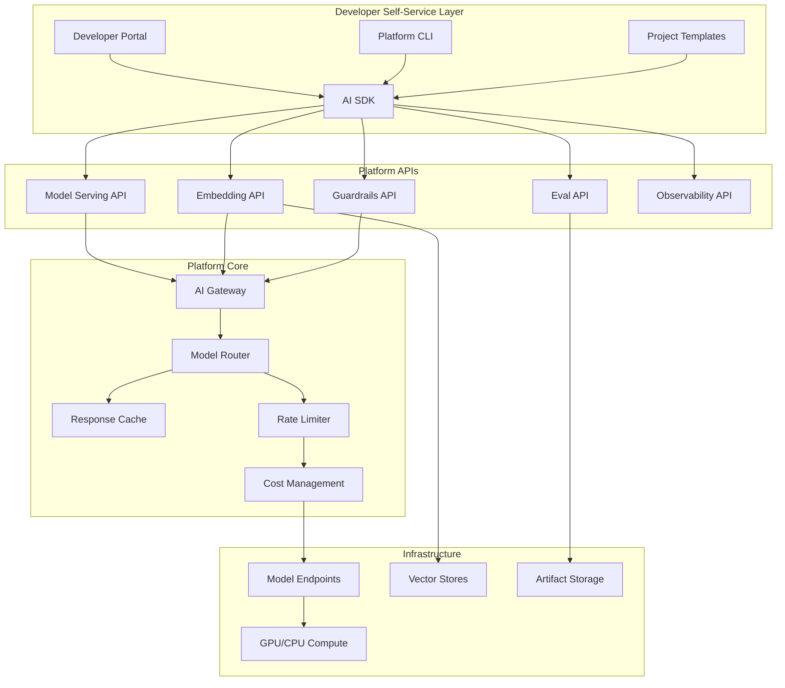

# Platform as Product

## Why Platform Thinking Matters

Your AI platform's users are internal developers. If they don't adopt it, you've built expensive shelfware. Treat them like paying customers—because their time and productivity have real cost.

**The mindset shift:**
- From "we built it, they must use it" → "we built it, how do we make them love it?"
- From "compliance mandate" → "golden path that's faster than doing it yourself"
- From "infrastructure team" → "product team with internal customers"

## Internal Developer Experience (DevX)

### Golden Paths

A golden path is the opinionated, well-supported way to accomplish a task:

```yaml
# Example: golden path for deploying an AI feature
golden_paths:
  text_generation:
    recommended_model: "gpt-4o-mini"
    sdk: "internal-ai-sdk v3.x"
    deployment: "ai-gateway → model-router → managed-endpoint"
    eval: "pre-built eval suite for text quality"
    monitoring: "standard AI dashboard template"
    time_to_production: "< 2 weeks for standard use cases"
    
  embedding_search:
    recommended_model: "text-embedding-3-small"
    vector_store: "managed-pgvector"
    sdk: "internal-ai-sdk v3.x with RAG module"
    deployment: "ai-gateway → embedding-service → vector-store"
    time_to_production: "< 1 week for standard use cases"
```

### Self-Service Principles

1. **Zero-ticket experiences**: developers should never need to file a ticket for standard operations
2. **Instant provisioning**: API keys, model access, sandbox environments in minutes
3. **Progressive disclosure**: simple things simple, complex things possible
4. **Guardrails, not gates**: prevent mistakes automatically rather than requiring approvals

## Platform APIs

### Model Serving API

```python
# What developers see - clean, simple, consistent
from internal_ai_sdk import AIClient

client = AIClient()  # auto-discovers credentials, gateway, config

# Text generation
response = client.generate(
    model="gpt-4o-mini",  # or "claude-sonnet", "llama-3-70b"
    messages=[{"role": "user", "content": prompt}],
    guardrails=["pii-filter", "toxicity-check"],
    metadata={"team": "search", "use_case": "query-expansion"}
)

# Embeddings
embeddings = client.embed(
    model="text-embedding-3-small",
    texts=["document chunk 1", "document chunk 2"],
    metadata={"team": "search", "index": "product-catalog"}
)

# Evaluations
eval_result = client.evaluate(
    model="gpt-4o-mini",
    test_suite="text-quality-v2",
    samples=my_test_cases
)
```

### Guardrails API

```python
# Standalone guardrails - can be used independently
from internal_ai_sdk import Guardrails

guard = Guardrails()

# Check input before sending to model
input_check = guard.check_input(
    text=user_input,
    policies=["no-pii", "no-prompt-injection", "topic-allowed"]
)

if not input_check.passed:
    return fallback_response(input_check.violations)

# Check output before returning to user
output_check = guard.check_output(
    text=model_response,
    policies=["no-hallucination", "brand-safe", "factual"]
)
```

### Eval API

```python
# Self-service evaluation
from internal_ai_sdk import EvalSuite

suite = EvalSuite(
    name="my-chatbot-eval",
    metrics=["relevance", "faithfulness", "latency"],
    golden_dataset="s3://eval-data/my-team/golden-set.jsonl"
)

results = suite.run(
    model="gpt-4o-mini",
    prompt_template=my_prompt,
    compare_to="baseline-v2"  # compare against previous version
)

# Publish results to platform dashboard
results.publish()
```

## Platform Product Architecture



## Developer Portal

### Model Catalog

```yaml
# What developers see in the portal
models:
  gpt-4o:
    status: "GA"
    use_cases: ["complex reasoning", "code generation", "analysis"]
    cost: "$$$"
    latency: "2-8s"
    context_window: "128k tokens"
    guardrails: ["all standard guardrails supported"]
    sla: "99.9% availability"
    getting_started: "/docs/models/gpt-4o/quickstart"
    
  gpt-4o-mini:
    status: "GA"
    use_cases: ["classification", "extraction", "simple generation"]
    cost: "$"
    latency: "0.5-2s"
    context_window: "128k tokens"
    guardrails: ["all standard guardrails supported"]
    sla: "99.9% availability"
    recommendation: "DEFAULT CHOICE for most use cases"
    getting_started: "/docs/models/gpt-4o-mini/quickstart"

  llama-3-70b:
    status: "GA"
    use_cases: ["high-volume batch", "data-residency-required"]
    cost: "$$"
    latency: "1-4s"
    context_window: "8k tokens"
    guardrails: ["standard guardrails, custom fine-tune available"]
    sla: "99.5% availability"
    note: "Self-hosted, data never leaves our infrastructure"
    getting_started: "/docs/models/llama-3/quickstart"
```

### Usage Dashboards

Every team sees:
- Requests per day/week/month
- Cost breakdown by model, by use case
- Latency percentiles (p50, p95, p99)
- Error rates and types
- Guardrail trigger rates
- Eval scores over time

### Getting-Started Guides

Structure for every capability:
1. **5-minute quickstart**: copy-paste working example
2. **Concept explanation**: what it does and when to use it
3. **Full API reference**: every parameter documented
4. **Common patterns**: recipes for typical use cases
5. **Troubleshooting**: top 10 issues and solutions
6. **Migration guide**: coming from a different approach

## Onboarding Journey

### Stage 1: Discovery (Day 1)
"I want to use AI in my feature"

**Platform provides:**
- Use case assessment wizard (5 questions → recommended approach)
- Cost estimator (expected volume → estimated monthly cost)
- Self-service API key provisioning (< 5 minutes)
- Sandbox environment with playground

### Stage 2: Prototype (Week 1)
"I'm building a proof of concept"

**Platform provides:**
- SDK quickstart with working examples
- Prompt engineering guide
- Eval framework for measuring quality
- Shared development model endpoints (free tier)

### Stage 3: Production Readiness (Week 2-4)
"I want to ship this to users"

**Platform provides:**
- Production checklist (security, guardrails, monitoring, cost)
- Load testing tools
- Guardrail configuration
- Automated eval CI/CD integration
- Cost allocation setup

### Stage 4: Production (Ongoing)
"My AI feature is live"

**Platform provides:**
- Production dashboards
- Alerting and on-call support
- Regular model upgrade notifications
- Cost optimization recommendations
- Quarterly platform roadmap sharing

## Feedback Loops

### Internal Platform NPS

```yaml
quarterly_survey:
  questions:
    - "How likely are you to recommend the AI platform to another team? (0-10)"
    - "What's the biggest friction point in using the platform?"
    - "What capability would help you most in the next quarter?"
    - "Rate your experience: provisioning, documentation, support, reliability"
    
  targets:
    nps_score: "> 40"
    response_rate: "> 60%"
    action_items_per_quarter: "top 3 friction points addressed"
```

### Usage Metrics

```yaml
adoption_metrics:
  - teams_onboarded_this_quarter
  - active_teams (made API call in last 30 days)
  - requests_per_day (trend)
  - new_use_cases_launched
  - time_from_signup_to_first_production_request

quality_metrics:
  - platform_availability (target: 99.9%)
  - median_onboarding_time (target: < 1 week)
  - support_ticket_volume (target: decreasing)
  - documentation_coverage (target: 100% of APIs)
  - sdk_adoption_rate (vs raw API calls)
```

### Developer Surveys and Interviews

- Monthly office hours (open Q&A with platform team)
- Quarterly roadmap review (input from top users)
- Post-onboarding retrospectives (what was hard?)
- Annual developer experience survey (deep dive)

## Versioning and Backward Compatibility

### API Versioning Strategy

```yaml
versioning_policy:
  scheme: "date-based (2024-01-15)"
  support_window: "12 months after deprecation announcement"
  breaking_changes: "new version only, never in existing version"
  
  compatibility_guarantees:
    - "Response schema fields are never removed (only added)"
    - "Required parameters are never added to existing endpoints"
    - "Error codes are never reused with different meanings"
    - "Default behavior never changes within a version"
    
  deprecation_process:
    - "Announce 6 months before end-of-life"
    - "Email all active users of deprecated version"
    - "Provide automated migration tool"
    - "Run both versions in parallel during transition"
    - "Offer migration support office hours"
```

### SDK Versioning

```
internal-ai-sdk v3.x → stable, production
internal-ai-sdk v4.x-beta → preview, opt-in
internal-ai-sdk v2.x → deprecated, security fixes only

Migration: v2 → v3 guide with codemod tool
Timeline: v2 EOL in 6 months (announced Q1 2024)
```

## Migration Support

When deprecating a model or API version:

1. **Announce early**: 6 months minimum notice
2. **Provide migration path**: step-by-step guide, not just "upgrade"
3. **Offer tooling**: codemods, compatibility shims, test suites
4. **Track progress**: dashboard showing teams still on old version
5. **Support directly**: reach out to teams that haven't migrated
6. **Grace period**: extend deadline for teams with legitimate blockers

```python
# Example: compatibility shim during migration
from internal_ai_sdk.compat import v2_to_v3

# This adapter lets v2 code work with v3 backend
# Use as temporary bridge while migrating
client = v2_to_v3.CompatClient()
# All v2 method signatures work, internally calls v3
```

## Anti-Patterns

### Build-It-and-They-Won't-Come
- **Symptom**: Platform exists but teams build their own
- **Cause**: Platform doesn't solve their actual problems
- **Fix**: Start with user research, not architecture

### Forced Adoption
- **Symptom**: Mandate from leadership, teams comply minimally
- **Cause**: Platform is harder to use than alternatives
- **Fix**: Make the platform the easiest path, not the required path

### No Documentation
- **Symptom**: Every onboarding requires hand-holding from platform team
- **Cause**: Documentation is an afterthought
- **Fix**: Documentation is a feature—ship it with every capability

### Over-Abstraction
- **Symptom**: Simple things require understanding 5 layers of abstraction
- **Cause**: Platform designed for max flexibility, not usability
- **Fix**: Progressive disclosure—simple defaults, escape hatches for power users

### No Feedback Loop
- **Symptom**: Platform team surprised when teams bypass them
- **Cause**: No mechanism to hear about friction
- **Fix**: Regular surveys, office hours, embedded platform liaisons

## Case Study: Internal ML Platforms

### Spotify (Hendrix Platform)
- **Approach**: Centralized platform, federated ML teams
- **Key insight**: Built ML platform as internal product with PM and UX
- **Result**: 100+ ML models in production, self-service for data scientists
- **Lesson**: Invested heavily in golden paths and defaults

### Netflix (Metaflow + Internal Platform)
- **Approach**: Open-source core (Metaflow) + internal layer
- **Key insight**: Let data scientists write Python, platform handles infra
- **Result**: Thousands of ML workflows, minimal platform team overhead
- **Lesson**: Meet users where they are (Python notebooks → production)

### Uber (Michelangelo)
- **Approach**: End-to-end ML platform, highly integrated
- **Key insight**: Standardized the entire ML lifecycle
- **Result**: Thousands of models across rides, eats, freight
- **Lesson**: Standardization enables velocity at scale

### Common Themes
1. Dedicated product management for the platform
2. Golden paths that cover 80% of use cases
3. Self-service with guardrails
4. Investment in documentation and developer experience
5. Metrics-driven platform development

## Staff Decision: Centralized vs Federated Self-Service

| Dimension | Centralized Platform | Federated Self-Service |
|-----------|---------------------|----------------------|
| Control | High, consistent | Low, diverse |
| Innovation speed | Slower (bottleneck) | Faster (independent) |
| Cost efficiency | Higher (shared infra) | Lower (duplication) |
| Governance | Easier to enforce | Harder to coordinate |
| Developer freedom | Limited | High |
| Operational burden | Concentrated | Distributed |

**Staff recommendation**: Hub-and-spoke hybrid
- **Central platform** provides: gateway, guardrails, model serving, cost management, security
- **Teams provide**: prompt engineering, eval suites, domain-specific fine-tuning, feature integration
- **Shared ownership**: observability, incident response, model selection

The platform should be opinionated about infrastructure and security, but flexible about how teams build AI features on top.

---

*Next: [09-ai-center-of-excellence.md](./09-ai-center-of-excellence.md) - Organizational models for AI capabilities*
