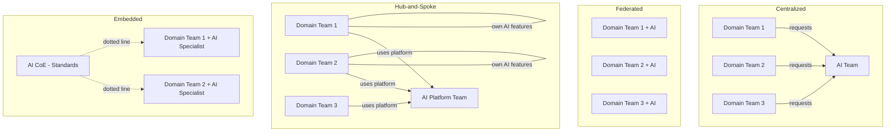

# AI Center of Excellence

## Organizational Models for AI Capabilities

How you structure AI teams determines how fast you can scale adoption, how consistent your implementations are, and whether your AI platform actually gets used.

## Four Models Compared

### 1. Centralized Model
One team owns all AI development. Domain teams submit requests.

**Pros**: Consistency, deep expertise, cost control
**Cons**: Bottleneck, disconnected from domain knowledge, slow

### 2. Federated Model
Every team builds their own AI capabilities independently.

**Pros**: Speed, domain expertise, autonomy
**Cons**: Duplication, inconsistency, security gaps, cost sprawl

### 3. Hub-and-Spoke Model
Central platform team provides infrastructure; domain teams build on top.

**Pros**: Balance of consistency and speed, shared infrastructure, domain ownership
**Cons**: Requires clear boundaries, coordination overhead

### 4. Embedded Model
AI specialists sit within domain teams but report to central AI org (dotted line).

**Pros**: Deep domain integration, central standards, career growth for AI specialists
**Cons**: Complex reporting, identity confusion, coordination cost

## Organizational Models Compared



## Team Roles

### AI Platform Team
**Mission**: Build and operate the shared AI infrastructure

**Responsibilities:**
- AI Gateway and model routing
- Model serving infrastructure (GPU management)
- SDK and API development
- Cost management and optimization
- Security and guardrails infrastructure
- Observability and monitoring

**Size**: 6-12 engineers for a large enterprise

### AI Enablement Team
**Mission**: Help domain teams successfully adopt AI

**Responsibilities:**
- Developer documentation and guides
- Training and workshops
- Architecture reviews for new AI use cases
- Best practices and patterns library
- Onboarding support
- Community building (internal AI guild)

**Size**: 3-6 people (mix of engineers and developer advocates)

### Domain AI Teams
**Mission**: Build AI features for their specific domain

**Responsibilities:**
- Prompt engineering and optimization
- Domain-specific evaluation
- Feature integration
- User research for AI features
- Fine-tuning and customization
- Domain data pipelines

**Size**: 1-3 AI-focused engineers per major domain team

## Skills Matrix

| Skill | Platform Team | Enablement Team | Domain AI Team |
|-------|:---:|:---:|:---:|
| Infrastructure/DevOps | Expert | Basic | None |
| ML/AI fundamentals | Strong | Strong | Strong |
| Prompt engineering | Basic | Expert | Expert |
| Domain knowledge | None | Broad/shallow | Deep |
| SDK/API design | Expert | Good | Consumer |
| Cost optimization | Expert | Good | Basic |
| Security | Expert | Good | Basic |
| Technical writing | Good | Expert | Basic |
| Eval methodology | Good | Expert | Expert |
| GPU management | Expert | None | None |

## Governance

### Decision Rights Matrix

| Decision | Who Decides | Who Advises | Who Is Informed |
|----------|-------------|-------------|-----------------|
| Which models are available | Platform Team | Security, Legal | All teams |
| Model choice for a use case | Domain Team | Enablement | Platform |
| Cost budget per team | Finance + Engineering VP | Platform Team | Domain Teams |
| Security standards | Security + Platform | Legal | All teams |
| Guardrail policies | Platform + Legal | Domain Teams | All teams |
| New model onboarding | Platform Team | Enablement, Security | All teams |
| Deprecation timeline | Platform Team | Domain Teams | Leadership |
| Data handling policies | Security + Legal | Platform | All teams |

### Governance Cadence

```yaml
weekly:
  - Platform team standup (priorities, blockers)
  - Enablement office hours (open Q&A)

monthly:
  - AI steering committee (leadership alignment)
  - Cost review (budget vs actual per team)
  - Security review (new threats, policy updates)

quarterly:
  - Platform roadmap review (with input from domain teams)
  - Architecture review board (new AI use cases)
  - Skills assessment (training needs)
  - Adoption metrics review
```

## Scaling AI Adoption: Maturity Levels

### Level 1: Experimentation (0-6 months)
**Characteristics:**
- 1-5 teams trying AI
- No shared infrastructure
- Direct API calls to providers
- No governance or standards

**Actions needed:**
- Stand up basic AI Gateway
- Create first golden path
- Establish cost visibility
- Write security baseline

### Level 2: Scaling (6-18 months)
**Characteristics:**
- 10-30 teams using AI
- Shared platform emerging
- Some standards in place
- Cost becoming a concern

**Actions needed:**
- Formalize platform team
- Build self-service capabilities
- Implement guardrails
- Create eval framework
- Establish governance cadence

### Level 3: Optimizing (18-36 months)
**Characteristics:**
- 50+ teams using AI
- Platform is well-established
- Strong governance and standards
- Focus shifts to efficiency and quality

**Actions needed:**
- Advanced cost optimization (caching, routing, fine-tuning)
- Automated quality gates
- Self-service fine-tuning
- Cross-team pattern sharing
- Platform NPS > 40

### Level 4: Transforming (36+ months)
**Characteristics:**
- AI embedded in most products
- Platform is competitive advantage
- Innovation on platform capabilities
- AI-native development culture

**Actions needed:**
- AI-first development standards
- Automated AI feature testing
- Real-time quality monitoring
- Proactive model management
- Industry thought leadership

## Change Management

### Getting 100 Teams to Adopt the Platform

**Phase 1: Lighthouse teams (3-5 teams)**
- Hand-pick teams that are already motivated
- Provide white-glove support
- Learn what works and what doesn't
- Create success stories

**Phase 2: Early majority (15-25 teams)**
- Use lighthouse success stories as proof
- Offer structured onboarding program
- Create self-service documentation from lighthouse learnings
- Assign enablement team members as liaisons

**Phase 3: Late majority (50-75 teams)**
- Platform should be self-service by now
- Focus on removing remaining friction
- Address edge cases that earlier teams didn't hit
- Consider gentle incentives (cost allocation, faster time-to-market)

**Phase 4: Laggards (remaining teams)**
- Understand why they haven't adopted (legitimate reasons vs inertia)
- Offer migration support
- Consider if forcing adoption is worth the cultural cost
- Some teams may never need AI—that's okay

### Change Management Tactics

1. **Show, don't tell**: Demos > presentations
2. **Executive sponsorship**: VP-level champion for the platform
3. **Quick wins**: First value in < 1 week
4. **Community**: Internal Slack channel, monthly showcase, AI guild
5. **Celebrate adopters**: Internal blog posts about successful launches
6. **Measure and share**: Publish adoption metrics openly
7. **Listen and adapt**: Platform roadmap reflects user feedback

## KPIs for AI Organizations

### Adoption Metrics
```yaml
adoption:
  - teams_onboarded: "cumulative teams using platform"
  - active_teams: "teams with API calls in last 30 days"
  - new_use_cases_per_quarter: "distinct AI features launched"
  - developer_reach: "% of engineering org that has used AI SDK"
```

### Efficiency Metrics
```yaml
efficiency:
  - time_to_first_request: "signup to first API call"
  - time_to_production: "first request to production deployment"
  - support_tickets_per_onboarding: "should decrease over time"
  - self_service_rate: "% of tasks requiring no human support"
```

### Quality Metrics
```yaml
quality:
  - platform_availability: "99.9% target"
  - mean_eval_scores: "across all production use cases"
  - guardrail_violation_rate: "caught before reaching users"
  - incident_count: "AI-related production incidents"
```

### Cost Metrics
```yaml
cost:
  - cost_per_request: "by model, trending down"
  - cost_per_team: "budget vs actual"
  - cache_hit_rate: "reducing unnecessary model calls"
  - cost_savings_from_routing: "cheaper model when appropriate"
```

## Anti-Patterns

### Ivory Tower CoE
- **Symptom**: CoE builds frameworks nobody asked for
- **Cause**: No connection to actual developer needs
- **Fix**: Embed CoE members in domain teams, regular user research

### PowerPoint Architecture
- **Symptom**: Beautiful diagrams, no running code
- **Cause**: Over-planning, under-executing
- **Fix**: Ship something small every 2 weeks, iterate

### Governance Theater
- **Symptom**: Review boards that slow everything down but catch nothing
- **Cause**: Governance designed for control, not enablement
- **Fix**: Automate checks, reserve human review for genuinely novel cases

### The AI Hype Team
- **Symptom**: Team focused on demos and POCs, nothing in production
- **Cause**: No accountability for production outcomes
- **Fix**: KPIs tied to production use cases, not prototypes

### Single Point of Failure Expert
- **Symptom**: One person who knows everything, everyone depends on them
- **Cause**: No knowledge sharing, no documentation culture
- **Fix**: Pair programming, documentation requirements, rotation

## Staff Architect's Role in Organizational Design

As a staff architect, your role in AI org design:

1. **Advisor to leadership**: Recommend organizational model based on company maturity
2. **Boundary setter**: Define clear interfaces between platform and domain teams
3. **Standards author**: Write the technical standards that governance enforces
4. **Bridge builder**: Connect platform team with domain teams, prevent silos
5. **Culture shaper**: Model the behavior you want (documentation, eval, quality)
6. **Roadmap influencer**: Ensure platform roadmap aligns with business strategy
7. **Talent developer**: Mentor AI engineers across the organization
8. **Reality checker**: Push back on hype, ground decisions in evidence

**Key principle**: The org design should follow the architecture (Conway's Law works both ways). If you want a well-integrated platform, the teams must be well-integrated too.

---

*Previous: [08-platform-as-product.md](./08-platform-as-product.md)*
