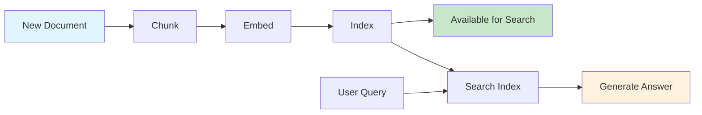
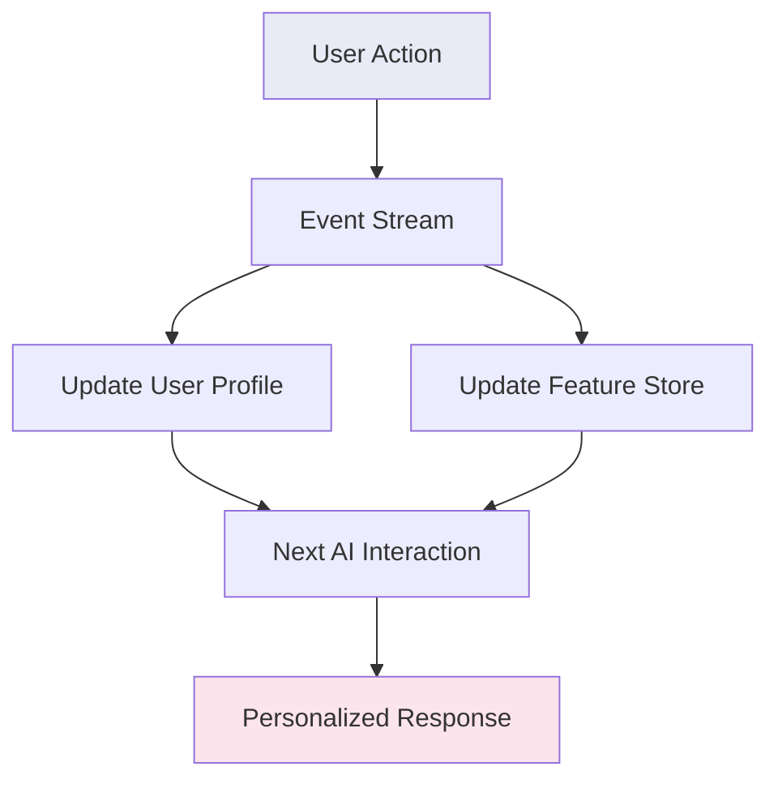
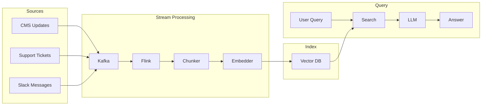
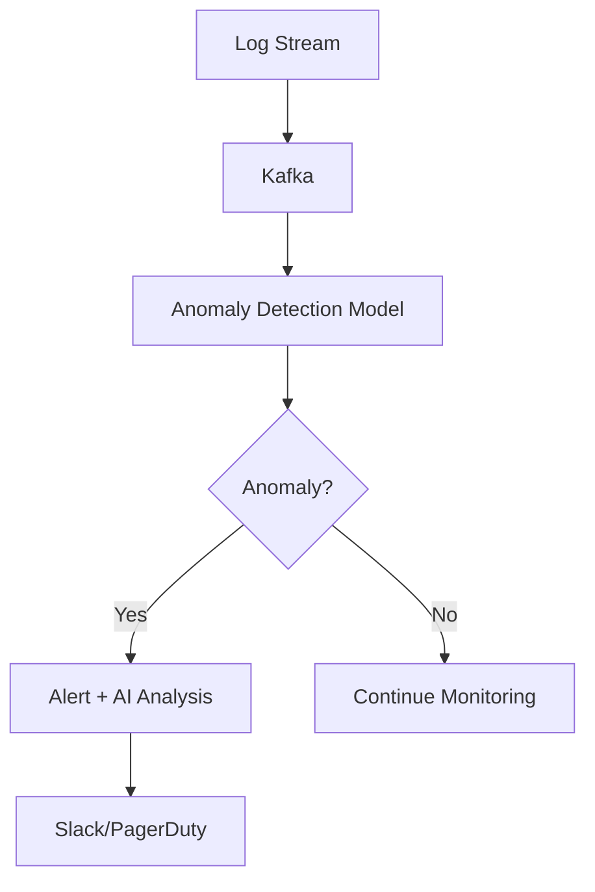
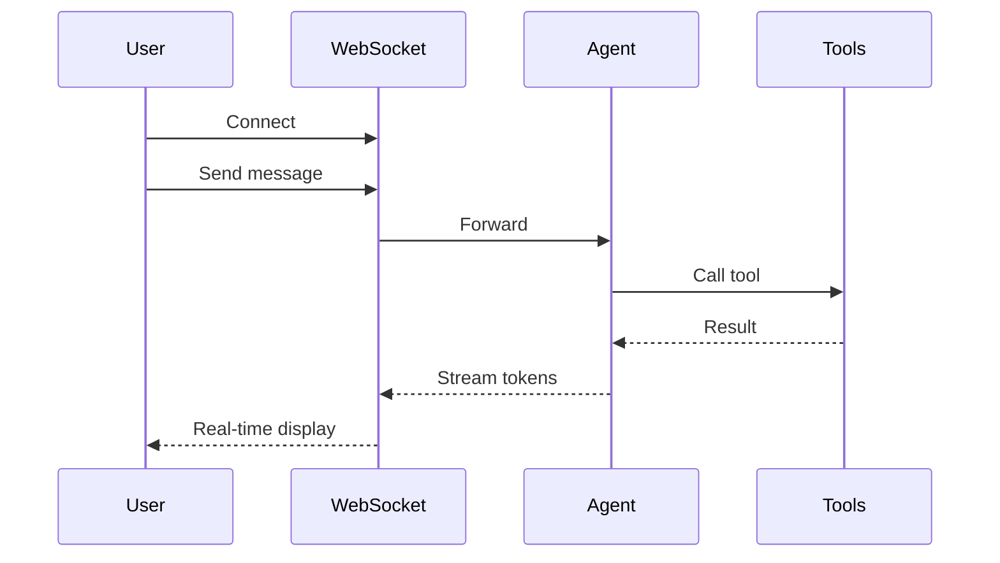
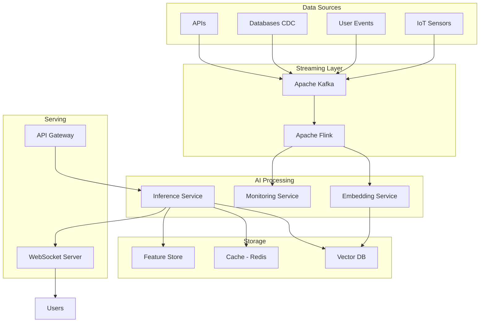

# Streaming and Real-Time AI

## The Speed Spectrum: From Batch to Real-Time

Think of AI systems like restaurants:

- **Batch AI** = A catering company. You place an order days ahead, they prepare everything, deliver it all at once. Great for large volumes, terrible for "I'm hungry now."
- **Real-time AI** = A sushi bar. The chef prepares each piece as you order, you eat immediately. Lower throughput, but instant gratification.

Most production AI systems live somewhere on this spectrum. The key question is: **how stale can your data be before it hurts the user?**

---

## Real-Time AI vs Batch AI

| Aspect | Batch AI | Real-Time AI |
|--------|----------|--------------|
| Data freshness | Hours to days old | Seconds old |
| Processing | Scheduled jobs | Continuous stream |
| Latency | Minutes to hours | Milliseconds to seconds |
| Cost | Lower (efficient batching) | Higher (always running) |
| Complexity | Simpler | More complex |
| Use case | Reports, bulk classification | Chat, voice, live recommendations |

**When you need real-time:**
- User is waiting for a response (chatbots, voice agents)
- Data changes constantly and stale answers are wrong (stock prices, live events)
- Personalization must reflect the last 5 seconds of behavior
- Safety/monitoring requires immediate action

---

## Streaming Architectures for AI

### 1. Event-Driven AI (Kafka/Flink + LLM)

Imagine a newsroom where every event (new article, user click, stock movement) is shouted into a room of specialists. Each specialist listens for events they care about and acts immediately.

```
Event Source → Message Broker → Stream Processor → AI Action
   (user click)    (Kafka)         (Flink)         (personalize)
```

**How it works:**
- Events flow into Kafka topics
- Stream processors (Flink/Spark Streaming) filter and transform
- AI models consume processed events for inference
- Results flow back into Kafka for downstream consumers

### 2. Real-Time RAG Over Live Data

Traditional RAG has a blind spot: if a document was added 5 minutes ago, it might not be searchable yet (batch indexing runs hourly). Real-time RAG fixes this.



**The pipeline:** Event → Process → Embed → Index → Available for RAG (< 1 minute)

### 3. Streaming Inference (Token-by-Token Output)

When ChatGPT shows words appearing one by one, that's streaming inference. Instead of waiting 10 seconds for a complete response, users see the first token in ~200ms.

```python
# Non-streaming: user waits 10 seconds, gets everything at once
response = client.chat.completions.create(messages=messages)

# Streaming: user sees tokens as they're generated
stream = client.chat.completions.create(messages=messages, stream=True)
for chunk in stream:
    print(chunk.choices[0].delta.content, end="")
```

**Why this matters:** Perceived latency drops dramatically. Users feel the system is "thinking" rather than "frozen."

### 4. Real-Time Personalization

Every user action updates their profile in real-time, changing what the AI recommends next:



---

## Architecture Patterns

### Pattern 1: Event-to-RAG Pipeline



**Latency target:** New content searchable in < 60 seconds.

### Pattern 2: Continuous AI Monitoring



### Pattern 3: WebSocket for Real-Time Agent Communication



---

## Latency Budgets for Real-Time AI

| Application | Total Budget | First Token | Processing | Network |
|-------------|-------------|-------------|------------|---------|
| **Chatbot** | < 2s | < 500ms | ~1s | ~200ms |
| **Voice Agent** | < 500ms | < 200ms | ~200ms | ~100ms |
| **Real-time Suggestions** | < 200ms | < 100ms | ~50ms | ~50ms |
| **Search Autocomplete** | < 100ms | < 50ms | ~30ms | ~20ms |
| **Batch Processing** | Minutes | N/A | Minutes | Seconds |

**Budget breakdown rule of thumb:**
- 40% for model inference
- 30% for retrieval/context gathering
- 20% for network
- 10% for pre/post processing

---

## Key Technologies

| Technology | Role | Best For |
|-----------|------|----------|
| **Apache Kafka** | Message broker | High-throughput event streaming |
| **Apache Flink** | Stream processing | Complex event processing, windowing |
| **Redis Streams** | Lightweight streaming | Simple pub/sub, caching layer |
| **WebSockets** | Bidirectional real-time | Chat, live updates |
| **Server-Sent Events (SSE)** | Server→Client streaming | Token streaming, notifications |
| **Apache Pulsar** | Message broker | Multi-tenancy, geo-replication |

### Choosing Between WebSocket and SSE

```
Need bidirectional communication? → WebSocket
Only server-to-client streaming? → SSE (simpler, HTTP-based)
```

---

## End-to-End Real-Time AI Architecture



---

## Key Takeaways

1. **Not everything needs real-time** — batch is cheaper and simpler when freshness isn't critical
2. **Streaming inference** (token-by-token) dramatically improves perceived latency
3. **Real-time RAG** requires an event-driven indexing pipeline
4. **Latency budgets** should be set per use case and decomposed into sub-budgets
5. **WebSocket/SSE** are essential for streaming AI responses to users
6. **Kafka + Flink** is the gold standard for high-throughput event-driven AI

---

## Next Steps

- Build the [Streaming Pipeline Program](./programs/streaming-pipeline/) to see real-time RAG in action
- Explore [Real-Time RAG Program](./programs/real-time-rag/) for immediate searchability

---

## Anti-Patterns

### 1. No Backpressure Implementation

**What goes wrong:** Producer sends tokens/events faster than consumer can process. Memory grows unbounded, system crashes or drops data silently.

**The pattern:**
```
Producer (1000 events/sec) → Consumer (100 events/sec) → OVERFLOW
```

**Fix:** Implement backpressure at every boundary:
- Consumer signals capacity to producer (reactive streams)
- Buffer with bounded size + overflow policy (drop oldest, reject new, or slow producer)
- Monitor buffer fill rate as early warning

### 2. Streaming Without Error Recovery

**What goes wrong:** Mid-stream failure (network blip, model timeout) kills the entire response. User sees partial output with no indication of failure and no way to resume.

**Fix:**
- Checkpoint streaming progress (last acknowledged token/chunk)
- On failure: reconnect and resume from last checkpoint
- Client-side: detect incomplete streams, show retry option
- Server-side: keep response buffer for replay window (30-60 seconds)

### 3. Buffering Entire Response Before Sending

**What goes wrong:** Defeats the purpose of streaming. System waits for complete response, then sends it all at once. User perceives high latency despite model already generating tokens.

**Common cause:** Middleware that collects the full response for logging, validation, or transformation before forwarding.

**Fix:** Use tee/passthrough patterns — forward tokens to user AND to logging/validation simultaneously. Validate incrementally where possible.

### 4. No Timeout on Streaming Connections

**What goes wrong:** Idle connections stay open forever. Resource exhaustion as thousands of zombie connections accumulate. Server runs out of file descriptors or memory.

**Fix:**
- Idle timeout: close if no data for 30 seconds
- Maximum connection duration: hard cap at 5 minutes
- Heartbeat/ping frames to detect dead connections
- Server-side connection tracking with cleanup sweeps

---

## Key Trade-offs

### SSE vs WebSocket

| Factor | SSE | WebSocket |
|--------|-----|-----------|
| Direction | Server → Client only | Bidirectional |
| Protocol | HTTP (works with proxies, CDNs) | Upgrade from HTTP (some proxies break) |
| Reconnection | Built-in auto-reconnect | Manual implementation needed |
| Complexity | Simple, text-based | More complex, binary capable |
| Best for | Token streaming, notifications | Chat with user interrupts, real-time collaboration |

**Decision:** Use SSE unless you need client-to-server streaming mid-response (e.g., user cancels generation, sends corrections while streaming).

### Token-by-Token vs Chunk Streaming

| Factor | Token-by-token | Chunk (sentence/paragraph) |
|--------|---------------|---------------------------|
| Perceived latency | Lowest (first token in ~200ms) | Higher (first chunk in ~1-2s) |
| Network overhead | High (many tiny packets) | Lower (fewer, larger packets) |
| Client complexity | Higher (need to handle partial words) | Lower (complete units) |
| Post-processing | Hard (can't validate partial output) | Easier (validate complete chunks) |

**Decision:** Token-by-token for chat UX (user sees "thinking"). Chunk for structured output (JSON, code) where partial tokens are meaningless.

### Streaming Complexity vs UX Benefit

**When streaming is worth the complexity:**
- User-facing chat (massive perceived latency improvement)
- Long-running generation (> 3 seconds)
- Real-time collaboration features

**When streaming is NOT worth it:**
- Backend-to-backend calls (no human waiting)
- Short responses (< 1 second total)
- Structured outputs that need validation before display
- Batch processing pipelines
