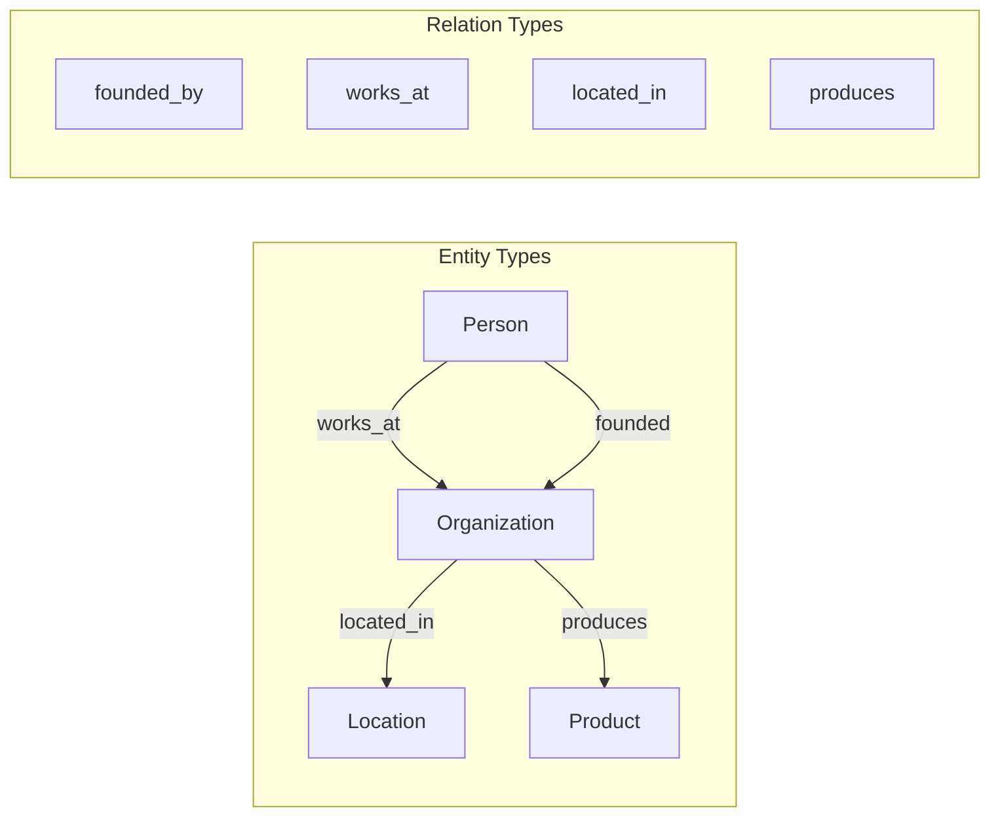
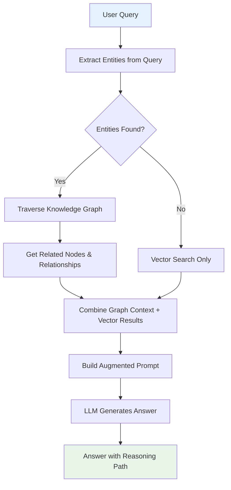
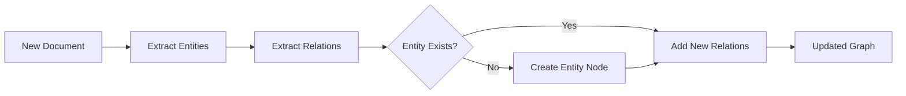
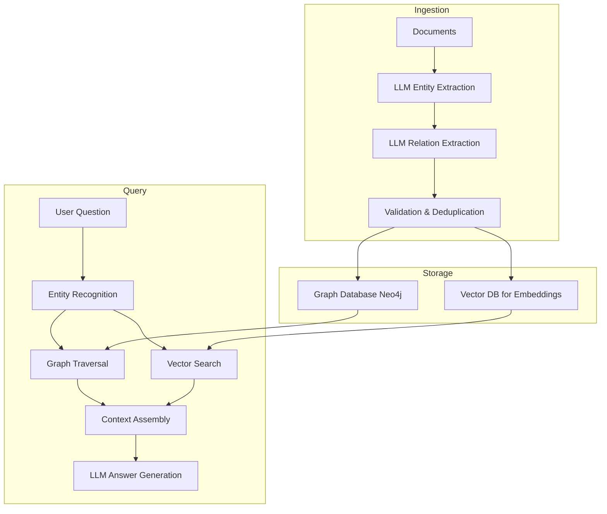

# Knowledge Graphs for AI

## The "Connected Facts" Analogy

Imagine you have a massive library of index cards. Each card has a fact:
- "Einstein was a physicist"
- "Einstein worked at Princeton"  
- "Princeton is in New Jersey"

A **vector database** is like dumping all these cards in a pile and finding the most "similar-sounding" cards to your question. Great for fuzzy matching, terrible for logical chains.

A **knowledge graph** is like connecting these cards with labeled strings:
- Einstein --[was_a]--> Physicist
- Einstein --[worked_at]--> Princeton
- Princeton --[located_in]--> New Jersey

Now you can ask: "Where did physicists work?" and follow the strings: Physicist ←[was_a]-- Einstein --[worked_at]--> Princeton. **Multi-hop reasoning** becomes trivial.

---

## Knowledge Graph vs Vector Database

| Aspect | Vector Database | Knowledge Graph |
|--------|----------------|-----------------|
| Data model | High-dimensional vectors | Nodes + Edges (triples) |
| Search type | Similarity (fuzzy) | Traversal (exact) |
| Strengths | Semantic similarity, fuzzy matching | Relationships, multi-hop reasoning |
| Weaknesses | Can't follow logical chains | Can't handle vague/semantic queries |
| Query language | ANN search | Cypher, SPARQL, Gremlin |
| Best for | "Find similar things" | "How are things connected?" |

**They're complementary, not competing.** The best systems use both:
- Vector search to find relevant starting points
- Graph traversal to explore relationships from those points

---

## Why Knowledge Graphs Matter for AI

### 1. Multi-Hop Reasoning

**Question:** "Which drugs interact with medications prescribed for diseases caused by the same gene as Huntington's?"

Vector search alone would struggle — this requires following a chain:
```
Huntington's --[caused_by]--> HTT gene --[also_causes]--> Other diseases 
--[treated_by]--> Medications --[interacts_with]--> Target drugs
```

### 2. Explainability

When an AI says "Drug X may interact with Drug Y," a knowledge graph can show WHY:
```
Drug X --[inhibits]--> Enzyme CYP3A4 --[metabolizes]--> Drug Y
```

This is critical in healthcare, finance, and legal applications.

### 3. Structured Relationships Vectors Can't Capture

Vectors encode meaning but lose structure. "Paris is the capital of France" and "France's capital is Paris" have the same embedding — but the **directionality** of the relationship matters when traversing.

---

## Building Knowledge Graphs

### Step 1: Entity Extraction (Find the Nouns)

```
Text: "Apple Inc., founded by Steve Jobs in 1976, is headquartered in Cupertino."

Entities:
- Apple Inc. (Organization)
- Steve Jobs (Person)
- 1976 (Date)
- Cupertino (Location)
```

### Step 2: Relation Extraction (Find the Connections)

```
Relations:
- (Apple Inc.) --[founded_by]--> (Steve Jobs)
- (Apple Inc.) --[founded_in]--> (1976)
- (Apple Inc.) --[headquartered_in]--> (Cupertino)
```

### Step 3: Graph Schema Design

Define what entity types and relation types exist in your domain:



### Step 4: Choose a Graph Database

| Database | Type | Best For |
|----------|------|----------|
| **Neo4j** | Property graph | General purpose, great tooling |
| **Amazon Neptune** | RDF + Property graph | AWS integration |
| **TigerGraph** | Distributed graph | Large-scale analytics |
| **ArangoDB** | Multi-model | Graph + document + key-value |
| **NetworkX** | In-memory (Python) | Prototyping, small graphs |

---

## Graph RAG: The Best of Both Worlds

Graph RAG combines knowledge graphs with vector search for more accurate, explainable answers.



### How Graph RAG Works

1. **Query:** "What products does the company that Steve Jobs founded produce?"
2. **Extract entities:** "Steve Jobs"
3. **Graph traversal:** Steve Jobs → founded → Apple Inc. → produces → [iPhone, Mac, iPad...]
4. **Context building:** "Steve Jobs founded Apple Inc. Apple produces iPhone, Mac, iPad..."
5. **LLM generates:** Complete answer with reasoning chain

### Graph RAG vs Pure Vector RAG

```
Pure Vector RAG:
  Query → Embed → Find similar chunks → Generate
  ❌ Might miss the connection between Jobs and products

Graph RAG:
  Query → Extract entities → Traverse graph → Get structured context → Generate
  ✅ Follows the logical chain precisely
```

---

## Knowledge Graph Maintenance

### Adding New Knowledge



### Updating Existing Facts

When facts change (CEO changes, company moves), you need to:
1. Mark old facts as historical (don't delete — history matters)
2. Add new facts with timestamps
3. Set the "current" pointer to the new fact

### Handling Contradictions

Two sources say different things:
- Source A: "Company X has 5000 employees"
- Source B: "Company X has 5200 employees"

Strategies:
- **Recency wins:** Use the most recent source
- **Authority wins:** Prefer official sources
- **Confidence scoring:** Store both with confidence scores
- **Flag for review:** Alert humans about contradictions

### Temporal Validity (Facts That Expire)

```
(Steve Jobs) --[CEO_of {from: 1997, to: 2011}]--> (Apple)
(Tim Cook) --[CEO_of {from: 2011, to: present}]--> (Apple)
```

Add temporal metadata to edges so queries can specify "as of date X."

---

## Building a Knowledge Graph with LLMs

Modern approach: use LLMs to extract entities and relations:

```python
prompt = """
Extract entities and relationships from this text.
Format: (Entity1) --[relationship]--> (Entity2)

Text: "Microsoft, led by CEO Satya Nadella, acquired GitHub in 2018 
for $7.5 billion. GitHub is headquartered in San Francisco."

Output:
"""

# LLM returns:
# (Microsoft) --[led_by]--> (Satya Nadella)
# (Satya Nadella) --[role: CEO_of]--> (Microsoft)
# (Microsoft) --[acquired]--> (GitHub)
# (GitHub) --[acquired_year]--> (2018)
# (GitHub) --[acquisition_price]--> ($7.5 billion)
# (GitHub) --[headquartered_in]--> (San Francisco)
```

---

## Knowledge Graph Architecture



---

## Key Takeaways

1. **Knowledge graphs capture structure** that vectors lose — directional relationships, hierarchies, logical chains
2. **Graph RAG** outperforms pure vector RAG for questions requiring multi-hop reasoning
3. **LLMs can build knowledge graphs** by extracting entities and relations from text
4. **Maintenance is the hard part** — facts change, contradict, and expire
5. **Use both:** Vector search for fuzzy discovery + graph traversal for precise reasoning
6. **Start simple:** NetworkX for prototyping, Neo4j for production

---

## Next Steps

- Build the [Knowledge Graph Builder Program](./programs/knowledge-graph-builder/) to see extraction and traversal in action

---

## Anti-Patterns

### 1. Building KG from Scratch When Existing Ontologies Exist

**What goes wrong:** Team spends 6 months defining entity types and relationships that already exist in public ontologies (Schema.org, FHIR for healthcare, Dublin Core for documents, SNOMED CT for medical).

**Fix:** Start with existing ontologies, extend only where domain-specific. Your custom entities should layer on top, not replace well-defined standards.

### 2. KG Without Maintenance Strategy (Goes Stale)

**What goes wrong:** Graph is built once, never updated. Within months, relationships are outdated (people changed roles, companies merged, products deprecated). Users lose trust, abandon the system.

**Reality check:** Building a KG is 20% of the work. Maintaining it is 80%.

**Fix:**
- Automated ingestion pipeline triggered by source changes
- Temporal validity on all edges (start_date, end_date)
- Staleness alerts: flag entities not refreshed in N days
- Regular reconciliation against authoritative sources

### 3. Over-Engineering KG for Simple Relationships

**What goes wrong:** Team builds a full Neo4j deployment with complex ontology for what is essentially a lookup table or simple hierarchy. Massive overhead for simple parent-child or tag relationships.

**Signs you're over-engineering:**
- Max relationship depth is 1-2 hops
- No multi-hop queries in your use cases
- Relationships are all the same type
- A SQL JOIN or simple JSON would work fine

**Fix:** Ask "Do I need multi-hop traversal?" If no, use simpler data structures.

### 4. Treating KG as Replacement for Vector Search

**What goes wrong:** Team assumes KG will handle all retrieval. But KG only works when you know the entities to start from. Vague or novel queries with no entity matches return nothing.

**Fix:** KG augments vector search, never replaces it. Vector search handles fuzzy/semantic discovery. KG handles structured traversal from known starting points.

---

## Key Trade-offs

### KG + Vector (Powerful, Complex) vs Vector-Only (Simple, Misses Relationships)

| Factor | KG + Vector (Graph RAG) | Vector-Only |
|--------|------------------------|-------------|
| Multi-hop reasoning | Excellent | Poor (hopes context is in one chunk) |
| Setup complexity | High (graph DB + vector DB + extraction pipeline) | Low (embed + index) |
| Maintenance cost | High (graph must stay current) | Low (re-embed on change) |
| Explainability | High (show reasoning path) | Low (similarity score only) |
| Cold start | Hard (need extraction before anything works) | Easy (embed docs immediately) |

**Decision:** Start vector-only. Add KG when you have specific multi-hop questions that vector search consistently fails on, AND you have the team to maintain the graph.

### Graph DB (Neo4j) vs Embedded Triples (RDF/JSON-LD)

| Factor | Graph DB (Neo4j) | Embedded Triples |
|--------|-----------------|------------------|
| Query power | Full Cypher, complex traversals | SPARQL or custom, limited |
| Operational cost | Separate service to manage | Stored alongside documents |
| Scale | Millions-billions of nodes | Thousands-millions |
| Tooling | Rich visualization, admin UI | Minimal |
| Best for | Production systems, complex queries | Prototyping, simple lookups, static KGs |

### When KGs Actually Help vs Over-Engineering

**KGs genuinely help when:**
- Questions require 3+ hop traversal ("Who reports to the manager of the person who wrote this doc?")
- Relationships have properties (temporal, weighted, typed)
- Explainability is a hard requirement (regulated industries)
- Data is naturally graph-shaped (org charts, supply chains, molecular structures)

**KGs are over-engineering when:**
- All questions are "find similar to X" (vector search wins)
- Relationships are implicit in text (let the LLM reason)
- Data changes faster than you can update the graph
- Team lacks graph DB operational expertise
- You have fewer than 10,000 entities
