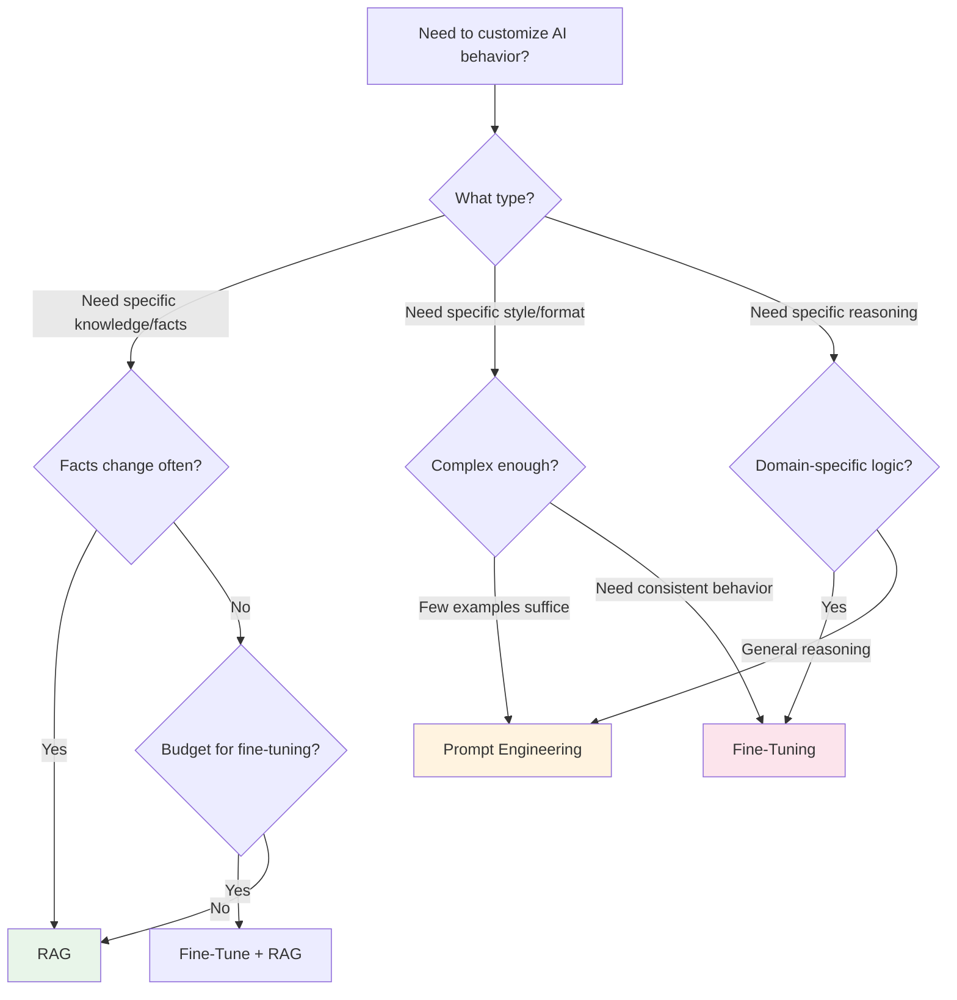
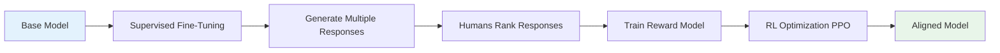
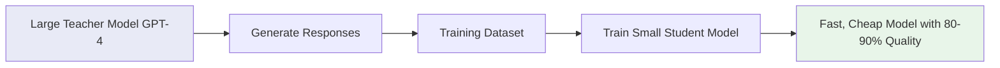
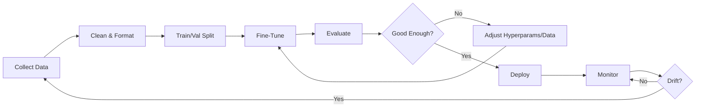

# Fine-Tuning and Training

## The Decision: RAG vs Fine-Tuning vs Prompt Engineering

Think of teaching an AI like teaching a person:

- **Prompt Engineering** = Giving someone detailed instructions before a task. "Here's exactly how to format the report." Quick, no permanent change.
- **RAG** = Giving someone a reference book. "Look things up as needed." Great for facts that change.
- **Fine-Tuning** = Sending someone to a training course. They internalize patterns, styles, behaviors. Permanent change, expensive.



### When to Use What

| Approach | Best For | Cost | Time | Risk |
|----------|----------|------|------|------|
| Prompt Engineering | Format, style, simple rules | Free | Minutes | Low |
| RAG | Dynamic knowledge, facts | Medium | Hours | Low |
| Fine-Tuning | Behavior, domain expertise, style | High | Days | Medium |
| Full Training | New capabilities, new languages | Very High | Weeks | High |

---

## Fine-Tuning Approaches

### 1. Full Fine-Tuning

Update ALL model parameters. Like rewriting every chapter of a textbook.

- **Pros:** Maximum customization, best performance
- **Cons:** Expensive (needs many GPUs), slow, risk of catastrophic forgetting
- **Cost:** $10K-$100K+ for large models
- **When:** You have massive data and budget (Google, Meta scale)

### 2. LoRA (Low-Rank Adaptation)

The breakthrough technique. Instead of updating all parameters, add small "adapter" matrices alongside existing weights.

**Analogy:** Instead of rewriting the textbook, you add sticky notes to relevant pages. The original knowledge is preserved, you just add annotations.

```
Original model: 7B parameters (frozen)
LoRA adapters: ~10M parameters (trained)
Result: 99% of full fine-tuning quality at 1% of the cost
```

**How LoRA works:**
```
Original weight matrix W (4096 x 4096) = 16M params
LoRA: W + A × B where A (4096 x 16) and B (16 x 4096) = 131K params
Rank 16 captures most of the adaptation needed
```

### 3. QLoRA (Quantized LoRA)

LoRA + 4-bit quantization of the base model. Run fine-tuning on a single consumer GPU.

- Base model loaded in 4-bit (NF4 quantization)
- LoRA adapters trained in 16-bit
- **Can fine-tune a 65B model on a single 48GB GPU**

### 4. Prefix Tuning

Add learnable "prefix" tokens to every layer's input. The model learns what virtual tokens to prepend.

- Even more parameter-efficient than LoRA
- Good for specific tasks (classification, extraction)
- Less flexible for open-ended generation

### 5. RLHF (Reinforcement Learning from Human Feedback)

How ChatGPT was made helpful and safe:



1. Fine-tune on demonstration data (SFT)
2. Generate multiple responses per prompt
3. Humans rank which response is better
4. Train a reward model on these rankings
5. Use PPO (reinforcement learning) to optimize the model against the reward model

### 6. DPO (Direct Preference Optimization)

A simpler alternative to RLHF. Skip the reward model entirely.

```
RLHF: SFT → Reward Model → PPO → Aligned Model (complex)
DPO:  SFT → Direct optimization on preference pairs → Aligned Model (simpler)
```

DPO directly optimizes the model using preference pairs (chosen vs rejected), treating the model itself as the reward model. Same quality, much simpler pipeline.

---

## Training Data Preparation

### Data Quality > Data Quantity

```
1,000 high-quality examples > 100,000 noisy examples
```

**What makes data high-quality:**
- Correct answers (no errors in the output)
- Diverse inputs (cover the full range of expected queries)
- Consistent format (same structure throughout)
- Representative of real usage (not synthetic edge cases only)

### Instruction Tuning Format

```json
{
  "messages": [
    {"role": "system", "content": "You are a medical coding assistant."},
    {"role": "user", "content": "What ICD-10 code for type 2 diabetes?"},
    {"role": "assistant", "content": "E11 - Type 2 diabetes mellitus..."}
  ]
}
```

### Data Collection Strategies

1. **From production logs:** Real user queries + expert-written answers
2. **From domain experts:** Have specialists write ideal responses
3. **Synthetic generation:** Use a larger model to generate training data for a smaller one
4. **Data augmentation:** Paraphrase, add noise, vary formats

### Synthetic Data Generation

```python
# Use GPT-4 to generate training data for a smaller model
prompt = """Generate 10 diverse customer support conversations 
about billing issues. Each should have a user question and 
an ideal agent response following our style guide:
- Empathetic opening
- Clear explanation
- Actionable next steps"""
```

---

## When Fine-Tuning Goes Wrong

### Catastrophic Forgetting

The model learns your task but forgets everything else. Like studying so hard for one exam that you forget all other subjects.

**Symptoms:** Model is great at your task, terrible at general tasks
**Prevention:** Mix general data into training, use LoRA (preserves base weights)

### Overfitting

The model memorizes your training data instead of learning patterns.

**Symptoms:** Perfect on training examples, poor on new inputs
**Prevention:** More diverse data, regularization, early stopping, validation set

### Losing Safety Alignment

Fine-tuning can accidentally remove safety guardrails.

**Symptoms:** Model outputs harmful content it wouldn't before
**Prevention:** Include safety examples in training data, evaluate safety post-training

---

## Knowledge Distillation

Training a small, fast model to mimic a large, expensive one.



**Why distill:**
- GPT-4 costs $30/1M tokens, a distilled model costs $0.10/1M tokens
- Latency drops from 2s to 50ms
- Can run on-device (edge deployment)

**Trade-offs:**
- Student never fully matches teacher quality
- Works best for narrow, well-defined tasks
- Requires significant teacher API budget for data generation

---

## The Fine-Tuning Pipeline



### Evaluation Metrics

| Task Type | Metrics |
|-----------|---------|
| Classification | Accuracy, F1, Precision, Recall |
| Generation | BLEU, ROUGE, human eval, LLM-as-judge |
| Instruction following | Win rate vs base model |
| Safety | Refusal rate on harmful prompts |

---

## Practical Fine-Tuning Costs (2024)

| Approach | Hardware | Time | Cost |
|----------|----------|------|------|
| Full fine-tune (7B) | 4x A100 80GB | 4-8 hours | $100-200 |
| LoRA (7B) | 1x A100 40GB | 2-4 hours | $20-50 |
| QLoRA (70B) | 1x A100 80GB | 8-16 hours | $50-150 |
| OpenAI fine-tune | API | 1-2 hours | $25-100 |
| Full fine-tune (70B) | 16x A100 80GB | Days | $5K-20K |

---

## Key Takeaways

1. **Start with prompt engineering**, then RAG, then fine-tuning — in that order
2. **LoRA/QLoRA** make fine-tuning accessible on modest hardware
3. **Data quality matters more than quantity** — 1K great examples beats 100K noisy ones
4. **DPO** is replacing RLHF for preference alignment (simpler, same quality)
5. **Knowledge distillation** lets you deploy cheap models with expensive-model quality
6. **Always evaluate safety** after fine-tuning — alignment can degrade
7. **Fine-tuning is not one-and-done** — monitor and retrain as needed

---

## Next Steps

- Fine-tuning is mostly about data preparation in practice
- Consider the [Edge Inference Program](./programs/edge-inference/) to see how fine-tuned models can be compressed for deployment

---

## Anti-Patterns

### 1. Fine-Tuning as First Approach

**What goes wrong:** Team spends weeks collecting data, training, and evaluating a fine-tuned model — only to discover that a well-crafted prompt with few-shot examples achieves 90% of the quality at 0% of the cost.

**The correct order:**
1. Prompt engineering (minutes, free) — try system prompts, few-shot examples, chain-of-thought
2. RAG (hours, low cost) — give the model relevant context
3. Fine-tuning (days-weeks, high cost) — only if 1 and 2 provably fail

**Rule of thumb:** If you haven't spent at least 20 hours on prompt engineering, you haven't earned the right to fine-tune.

### 2. Fine-Tuning on Bad Data

**What goes wrong:** "Garbage in, garbage out" but amplified. Model internalizes incorrect patterns, inconsistent formatting, or low-quality reasoning. Worse than the base model because it's confidently wrong.

**Signs of bad training data:**
- Contradictory examples (same input, different outputs)
- Errors in the "ideal" responses
- Single annotator with no review
- Generated by a weaker model without human verification

**Fix:** Spend 80% of fine-tuning effort on data curation. Have domain experts review every training example. 500 perfect examples > 50,000 noisy ones.

### 3. No Eval Before/After Comparison

**What goes wrong:** Team fine-tunes, declares success based on vibes ("it feels better"). Later discovers it's worse on half the use cases. No baseline to compare against, no way to quantify improvement.

**Fix:**
- Build eval set BEFORE starting fine-tuning (200+ diverse examples)
- Run base model on eval set → record baseline scores
- Run fine-tuned model on same eval set → compare
- Track per-category performance (may improve on some, regress on others)
- Only deploy if aggregate AND per-category metrics improve

### 4. Catastrophic Forgetting from Over-Training

**What goes wrong:** Model becomes excellent at your specific task but loses general capabilities. Can't handle edge cases, follow basic instructions, or maintain safety alignment.

**Signs:** Perfect on your training examples, terrible on anything slightly different. Loses ability to say "I don't know."

**Fix:**
- Use LoRA (preserves base weights by design)
- Mix 10-20% general instruction data into training
- Early stopping based on validation loss (not training loss)
- Evaluate on BOTH your task AND general benchmarks after training

---

## Key Trade-offs

### Fine-Tuning vs RAG vs Prompting (Decision Matrix)

| Signal | → Prompting | → RAG | → Fine-Tuning |
|--------|-------------|-------|---------------|
| Knowledge freshness needed | Static OK | Must be current | Static OK |
| Task complexity | Simple format/style | Complex knowledge | Complex behavior |
| Data available | Few examples | Many documents | 500-5000+ examples |
| Budget | $0 | $100s/month | $1000s + ongoing |
| Time to production | Hours | Days | Weeks |
| Maintenance burden | Low (update prompt) | Medium (update docs) | High (retrain) |

**Combined approaches that work well:**
- RAG + fine-tuned model: Best retrieval quality + domain-specific generation
- Prompting + RAG: 90% of use cases should stop here
- Fine-tuned small model: When you need cost efficiency at scale

### Full Fine-Tune vs LoRA

| Factor | Full Fine-Tune | LoRA |
|--------|---------------|------|
| Quality ceiling | Highest | ~95-99% of full |
| Cost | 10-100x more | Baseline |
| Risk of catastrophic forgetting | High | Low (base frozen) |
| Hardware | Multi-GPU required | Single GPU possible |
| Multiple tasks | One model per task | Stack multiple adapters |
| When to use | Google/Meta scale, new capabilities | Everyone else |

**Decision:** Use LoRA/QLoRA unless you have proven that it's insufficient AND you have the budget/expertise for full fine-tuning.

### Data Quality vs Quantity

```
Quality curve:
  100 perfect examples  → Noticeable improvement
  500 perfect examples  → Strong improvement  
  2000 perfect examples → Diminishing returns
  
Quantity curve:
  10,000 noisy examples → Marginal improvement
  50,000 noisy examples → May actually hurt (learns noise)
  100,000 noisy examples → Expensive and counterproductive
```

**Decision:** Invest in quality. Hire domain experts to write/review training data. Budget $10K for data curation before spending $10K on compute.
