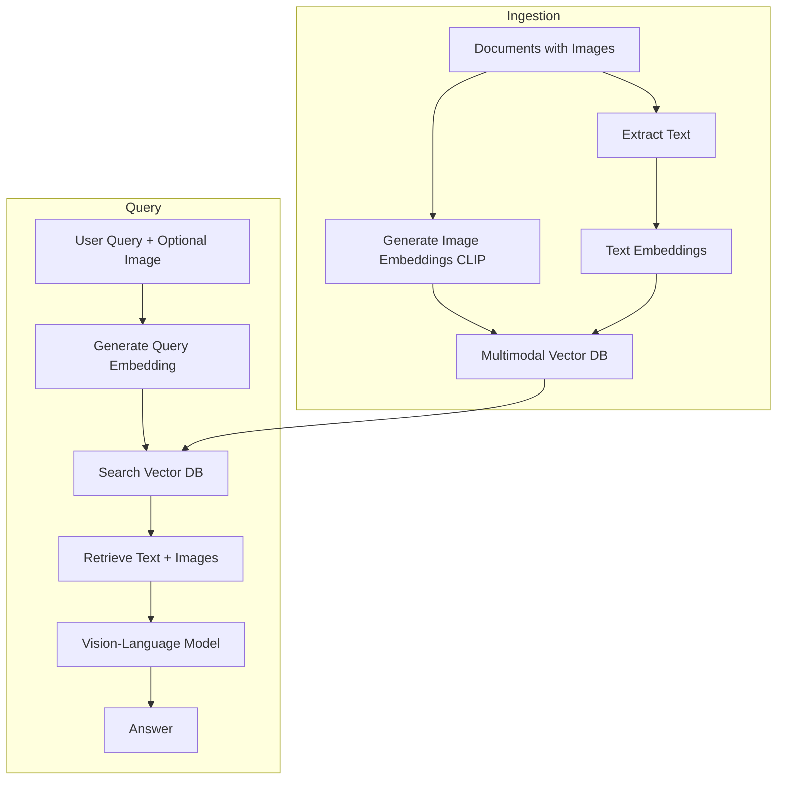
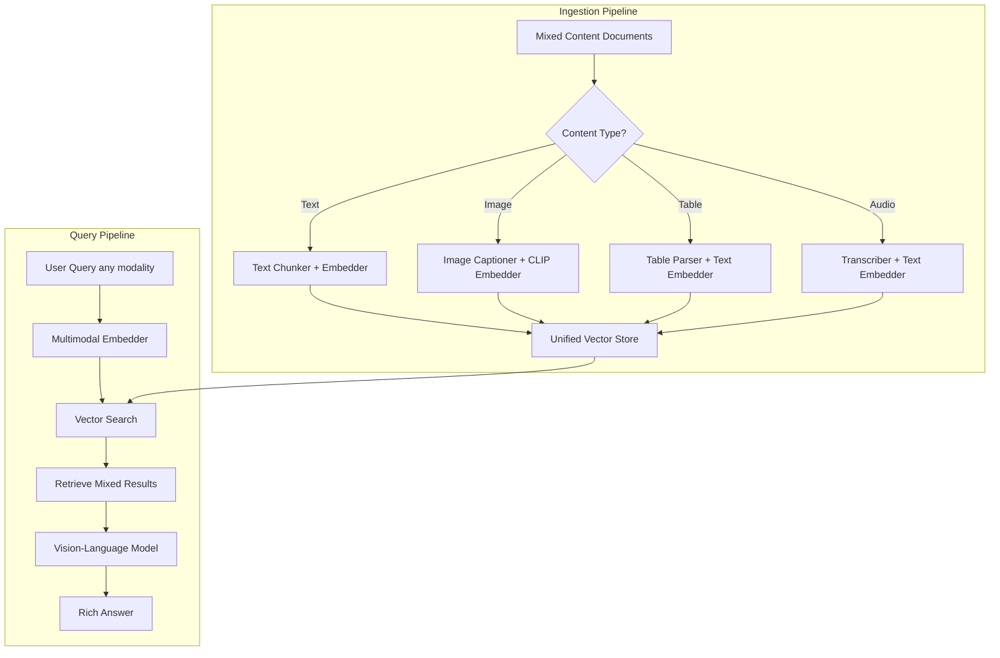

# Multimodal AI Architecture

## What is Multimodal AI?

Traditional AI models understand one "mode" — text. Multimodal AI understands multiple modes simultaneously: text, images, audio, video, and even structured data.

**Analogy:** A text-only AI is like communicating via telegram — words only. A multimodal AI is like a video call — you see expressions, hear tone, read body language, AND hear words. Much richer understanding.

**Examples:**
- Show a photo of a rash → AI diagnoses skin condition
- Upload a receipt → AI extracts all line items into a spreadsheet
- Describe a scene in audio → AI generates matching images
- Send a video → AI summarizes what happened

---

## Multimodal Capabilities

### 1. Vision-Language Models (Understanding Images)

Models like GPT-4V, Claude 3, Gemini can see and reason about images:

```
Input: [Image of a network diagram] + "What's the single point of failure?"
Output: "The load balancer at the top has no redundancy. If it fails,
         all three backend servers become unreachable."
```

### 2. Document Intelligence

Converting unstructured documents into structured data:

| Capability | What It Does |
|-----------|--------------|
| OCR | Reads text from images/scans |
| Table Extraction | Identifies rows/columns in tables |
| Form Parsing | Maps fields (Name, Address) to values |
| Layout Analysis | Understands document structure |
| Handwriting Recognition | Reads handwritten text |

### 3. Audio Understanding

| Capability | Technology |
|-----------|-----------|
| Speech-to-Text (ASR) | Whisper, Azure Speech |
| Speaker Diarization | Who said what |
| Emotion Detection | Sentiment from voice tone |
| Sound Classification | Music, noise, speech |

### 4. Video Understanding

- Frame-by-frame analysis
- Scene detection and transitions
- Action recognition
- Object tracking across frames
- Video summarization

---

## Architecture Patterns

### Pattern 1: Image + Text RAG

Search using images, answer with text:



### Pattern 2: Document AI Pipeline


**Real-world example — Invoice processing:**
```
Input: Scanned invoice PDF
Pipeline: OCR → Detect table → Extract line items → Identify totals → Validate math
Output: {vendor: "Acme", items: [...], total: 1234.56, tax: 98.76}
```

### Pattern 3: Voice Agents (ASR → LLM → TTS)


**Latency budget for voice (500ms total):**
- ASR: 100-200ms
- LLM (streaming first token): 200-300ms
- TTS (streaming first audio): 100-200ms

**Trick:** Stream everything. Start TTS while LLM is still generating.

### Pattern 4: Multimodal Embeddings (CLIP-like)

Images and text mapped to the same vector space:

```
"a photo of a cat" → [0.2, 0.8, -0.1, ...]  (text embedding)
[actual cat photo]  → [0.19, 0.81, -0.09, ...] (image embedding)
                       ↑ Very close in vector space!
```

**This enables:**
- Text-to-image search ("find photos of sunset")
- Image-to-text search (reverse image search with descriptions)
- Image-to-image search (find similar images)

---

## Multimodal RAG Architecture



---

## Challenges of Multimodal AI

### 1. Larger Context Windows Needed

| Modality | Typical Size | Token Equivalent |
|----------|-------------|-----------------|
| Text (1 page) | ~500 tokens | 500 tokens |
| Image (1 photo) | ~1000 tokens | 1000 tokens |
| Audio (1 minute) | ~150 words | ~200 tokens |
| Video (1 minute) | ~30 frames × 1000 | ~30,000 tokens |

Video is extremely expensive in tokens.

### 2. Higher Latency

Processing an image takes 2-5x longer than equivalent text. Video multiplies this by frame count.

### 3. More Expensive

| Input Type | Approximate Cost (GPT-4V) |
|-----------|--------------------------|
| Text (1K tokens) | $0.01 |
| Image (low detail) | $0.003 |
| Image (high detail) | $0.03 |
| Video (1 min, 1fps) | ~$1.80 |

### 4. Evaluation is Harder

How do you evaluate if an image description is "correct"? Much harder than checking a classification label.

---

## Use Cases

### Invoice Processing
```
Input: Scanned invoice
→ OCR + Layout Analysis + Entity Extraction
Output: Structured JSON with vendor, line items, amounts, dates
Accuracy: 95%+ with modern models
```

### Medical Imaging
```
Input: X-ray / MRI / CT scan + patient history
→ Vision model + medical knowledge
Output: Findings, anomaly detection, suggested diagnosis
Note: Requires heavy regulation, human-in-the-loop mandatory
```

### Video Search
```
Input: "Find the moment where the speaker discusses revenue growth"
→ Transcribe + Frame analysis + Semantic search
Output: Timestamp + clip + relevant frame
```

### Multimodal Customer Support
```
Input: "My screen looks like this [screenshot] and I can't find the settings"
→ Vision model understands UI + text understanding
Output: Step-by-step instructions based on what's visible
```

---

## Design Considerations

### When to Use Multimodal vs Converting to Text

```
Can you accurately describe the image in text? 
  → Yes: Convert to text, use text-only pipeline (cheaper)
  → No: Use multimodal model directly

Examples:
  - Receipt with numbers → OCR to text is fine
  - Medical X-ray → Needs direct vision model
  - Architecture diagram → Needs vision (spatial relationships)
```

### Storage Architecture

```
Document → Split into:
  ├── Text chunks → Text embeddings → Vector DB
  ├── Images → Image embeddings (CLIP) → Vector DB  
  ├── Tables → Structured extraction → Relational DB
  └── Metadata → Document store
  
All linked by document_id for reconstruction
```

---

## Key Takeaways

1. **Multimodal AI** processes text, images, audio, and video together — much richer understanding
2. **Document AI** (OCR + layout + extraction) is the most mature enterprise use case
3. **Voice agents** require aggressive streaming to meet 500ms latency budgets
4. **CLIP-like embeddings** enable cross-modal search (text finds images, images find text)
5. **Video is expensive** — 30x the cost of a single image per minute
6. **Start with text conversion** where possible; use native multimodal only when needed
7. **Evaluation is the hard part** — invest in human eval for multimodal outputs

---

## Next Steps

- Multimodal pipelines build on the RAG foundations from earlier chapters
- Consider combining with [Knowledge Graphs](./02-knowledge-graphs-for-ai.md) for structured multimodal reasoning
