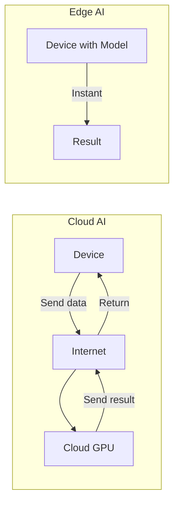
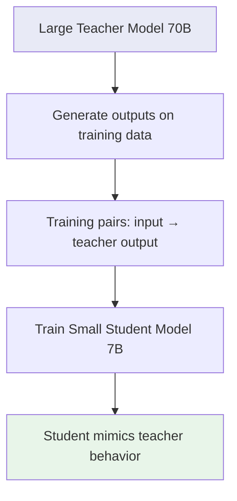
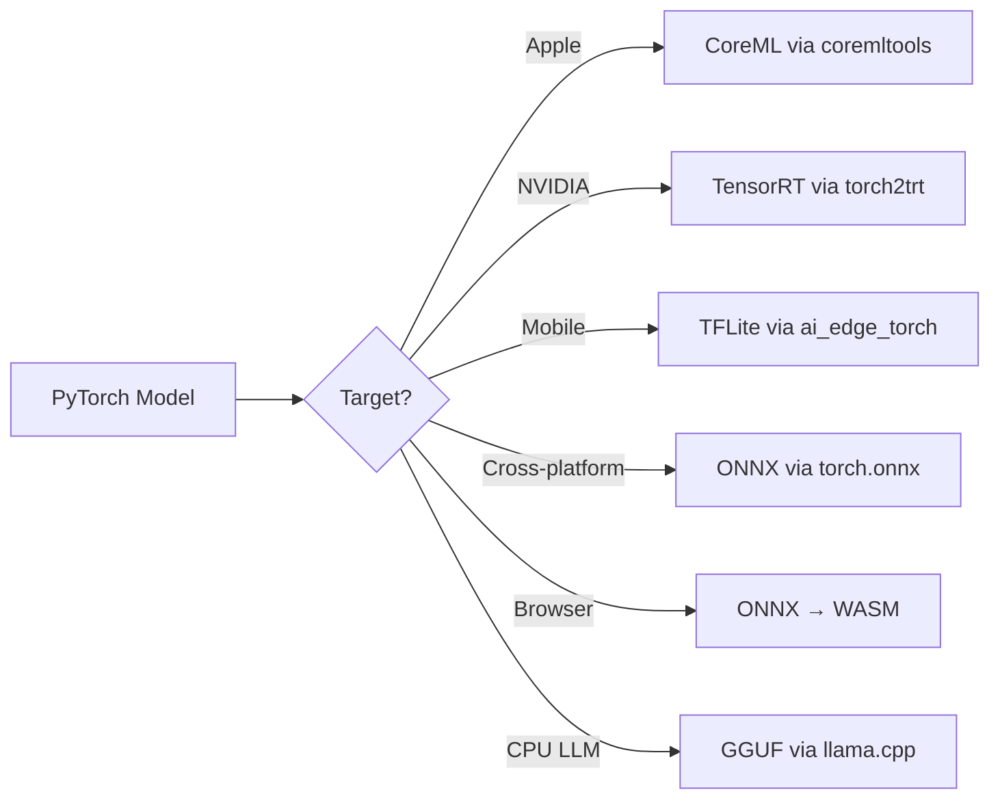
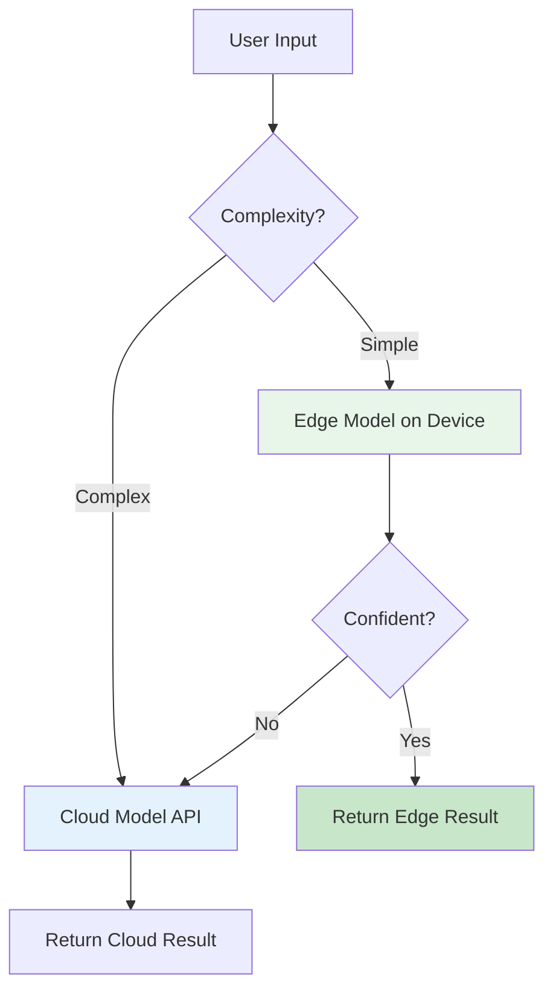
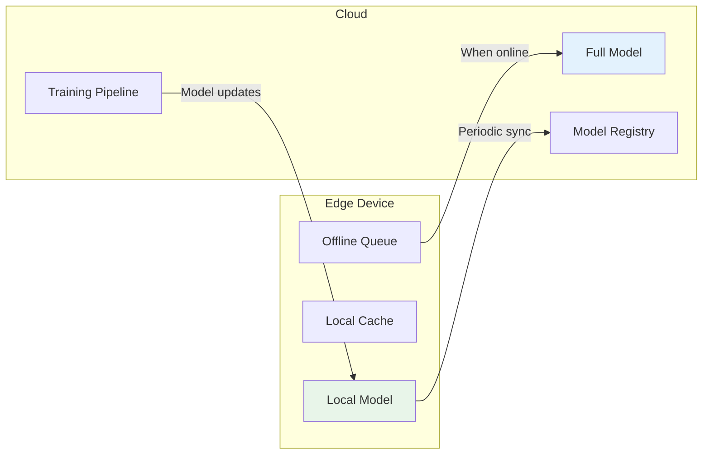

# Edge and On-Device AI

## What is Edge AI?

**Edge AI** means running AI models directly on devices (phones, laptops, IoT sensors, cars) instead of sending data to the cloud.

**Analogy:** Cloud AI is like mailing a letter to get advice — you send your question, wait for delivery, wait for a response, wait for return delivery. Edge AI is like having an advisor sitting next to you — instant answers, no mailing needed.



---

## Why Edge AI?

| Benefit | Explanation | Example |
|---------|-------------|---------|
| **Latency** | No round-trip to cloud | Voice assistant responds in 50ms vs 500ms |
| **Privacy** | Data never leaves device | Health data stays on phone |
| **Offline** | Works without internet | AI in airplane mode, rural areas |
| **Cost at scale** | No per-inference API costs | 1B users × 100 queries/day = $$$$ if cloud |
| **Bandwidth** | Don't send raw video/audio | Security camera processes locally |

**When cloud is still better:**
- Need the largest models (GPT-4 class)
- Need to process data from multiple devices together
- Device is too constrained (cheap IoT sensors)
- Model updates need to be immediate

---

## Model Compression Techniques

### 1. Quantization (Reduce Number Precision)

Like rounding numbers: instead of storing 3.14159265, store 3.14 or even just 3.

```
FP32 (32-bit float):  3.14159265358979...  → 4 bytes per parameter
FP16 (16-bit float):  3.14159...           → 2 bytes per parameter
INT8 (8-bit integer): 3                    → 1 byte per parameter
INT4 (4-bit integer): [0-15 range]         → 0.5 bytes per parameter
```

**Impact on a 7B parameter model:**

| Precision | Model Size | RAM Needed | Quality Loss |
|-----------|-----------|------------|--------------|
| FP32 | 28 GB | ~32 GB | None (baseline) |
| FP16 | 14 GB | ~16 GB | Negligible |
| INT8 | 7 GB | ~8 GB | Small (~1-2%) |
| INT4 | 3.5 GB | ~4 GB | Moderate (~3-5%) |

**Quantization types:**
- **Post-training quantization (PTQ):** Quantize after training. Simple, some quality loss.
- **Quantization-aware training (QAT):** Train with quantization in mind. Better quality, more effort.

### 2. Pruning (Remove Unnecessary Connections)

Like trimming a tree — remove branches that don't bear fruit.

```
Before pruning: All neurons connected (dense)
After pruning: 50-90% of connections removed (sparse)
Result: Faster inference, smaller model, minimal quality loss
```

**Types:**
- **Unstructured pruning:** Remove individual weights (flexible but hardware-unfriendly)
- **Structured pruning:** Remove entire neurons/layers (hardware-friendly)

### 3. Knowledge Distillation

Train a small "student" model to mimic a large "teacher" model.



### 4. Neural Architecture Search (NAS)

Automatically find the most efficient model architecture for a given constraint (e.g., "must run in 50ms on iPhone").

---

## Deployment Formats

| Format | Platform | Optimized For |
|--------|----------|--------------|
| **ONNX** | Cross-platform | Portability, CPU/GPU |
| **TensorRT** | NVIDIA GPUs | Maximum GPU throughput |
| **Core ML** | Apple (iOS/macOS) | Apple Neural Engine |
| **TensorFlow Lite** | Android/iOS/embedded | Mobile, microcontrollers |
| **WASM** | Browser | Web deployment, any OS |
| **GGUF** | CPU (llama.cpp) | LLMs on consumer hardware |

### Conversion Pipeline



---

## Hybrid Cloud-Edge Architectures

The best systems use BOTH edge and cloud intelligently:



### Pattern 1: Complexity-Based Routing

```
Simple queries (autocomplete, classification) → Edge (fast, free)
Complex queries (multi-step reasoning, generation) → Cloud (capable, costly)
```

### Pattern 2: Privacy-Based Routing

```
Sensitive data (health, finance, personal) → Edge (private)
Non-sensitive data (general questions) → Cloud (better quality)
```

### Pattern 3: Sync Between Edge and Cloud



---

## Edge Inference Frameworks

| Framework | Focus | Models |
|-----------|-------|--------|
| **Ollama** | Easy local LLMs | Llama, Mistral, Phi |
| **llama.cpp** | CPU-optimized LLMs | Any GGUF model |
| **ExecuTorch** | Mobile/edge PyTorch | Any PyTorch model |
| **MLX** | Apple Silicon optimized | LLMs, diffusion |
| **MLC LLM** | Universal LLM deployment | Multiple platforms |
| **ONNX Runtime** | Cross-platform inference | Any ONNX model |

---

## Hardware for Edge AI

| Hardware | Found In | AI Performance |
|----------|----------|----------------|
| **Apple Neural Engine** | iPhone, Mac | 15-35 TOPS |
| **Qualcomm Hexagon NPU** | Android phones | 10-45 TOPS |
| **NVIDIA Jetson** | Robots, drones | 100-275 TOPS |
| **Intel NPU** | Laptops | 10-40 TOPS |
| **Google Tensor (TPU)** | Pixel phones | ~10 TOPS |
| **CPU only** | Anything | 1-5 TOPS |

*TOPS = Trillion Operations Per Second*

---

## Real-World Edge AI Examples

### Smartphone Keyboard Prediction
- Model: Tiny transformer (~5MB)
- Latency: < 10ms
- Privacy: Keystrokes never leave device
- Approach: Federated learning (train across devices without sharing data)

### Smart Home Voice Assistant
- Wake word detection: Edge (always listening, tiny model)
- Full speech recognition: Cloud (more capable)
- Response: Cloud (LLM reasoning)
- TTS: Edge or cloud depending on quality needs

### Autonomous Vehicles
- Object detection: Edge (can't wait for cloud, lives at stake)
- Route planning: Hybrid (real-time local + cloud for traffic)
- Model updates: Downloaded overnight via WiFi

---

## Practical Considerations

### Memory Budget on Devices

```
iPhone 15 Pro: 8 GB total RAM, ~4 GB available for AI
  → Can run: 4-bit quantized 7B model (3.5 GB)
  → Cannot run: Anything larger without swapping

MacBook M3 Pro: 18-36 GB unified memory
  → Can run: 4-bit quantized 70B model (~35 GB on 36GB model)
  
Raspberry Pi 5: 8 GB RAM
  → Can run: Small models (< 3B parameters quantized)
```

### Battery Impact

AI inference drains battery. Design for:
- Batch processing when charging
- Lightweight models for continuous tasks
- NPU (more efficient) over GPU over CPU

---

## Key Takeaways

1. **Edge AI** trades model capability for latency, privacy, and cost savings
2. **Quantization** (INT4/INT8) is the most impactful compression technique
3. **Hybrid architectures** route simple/sensitive tasks to edge, complex tasks to cloud
4. **GGUF + llama.cpp** is the current standard for running LLMs on consumer hardware
5. **NPUs** are 10-100x more power-efficient than CPUs for AI workloads
6. **The trend is clear:** Models are getting smaller and more capable — edge AI will only grow

---

## Next Steps

- Build the [Edge Inference Program](./programs/edge-inference/) to benchmark quantization effects
- Consider hybrid architectures that combine edge with [Streaming Pipelines](./01-streaming-and-real-time-ai.md)
